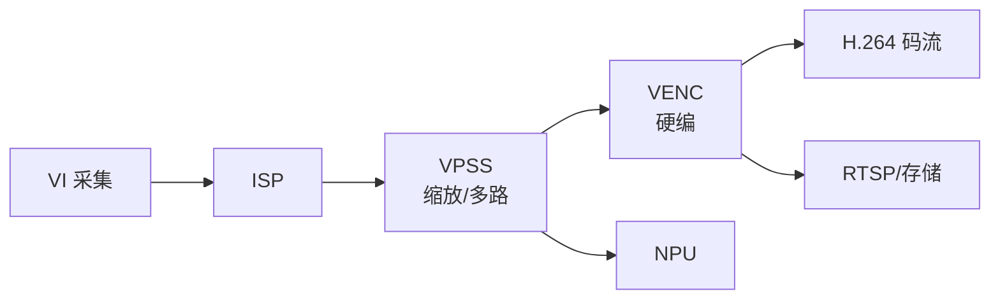

编码原理懂了，现在上真家伙：**VENC（Video Encoder）硬件编码单元**。RV1126 的 VENC 支持 H.264/H.265 硬件编码，4K30 都能扛，几乎不占 CPU。这一篇把 RKMedia VENC 接口讲透：**创建编码器、配置编码参数与码率控制、绑定 VPSS 送帧、回调拿码流、处理 SPS/PPS/IDR**，最后用 FFmpeg 验证板端码流可播放、与软编对比质量。

**双轨对照**：板端 VENC 出 H.264 裸流；PC 端 FFmpeg 转封装、查看流信息、同源软编对比。

## 一、硬件编码器：为什么快

**定义**：VENC 是 SoC 内的专用视频编码硬件单元，把 YUV 帧按 H.264/H.265 标准压成码流。编码最耗算力的运动估计、变换量化、熵编码全部由硬件完成。

**对比**：

| 方案 | CPU 占用 | 4K30 能力 | 延迟 | 典型场景 |
|:---|:---|:---|:---|:---|
| 软件编码（x264） | 高（多核满载） | 吃力 | 高 | PC 离线转码 |
| 硬件编码（VENC） | 低（几乎不占） | 轻松 | 低 | 嵌入式实时推流 |

**类比**：软件编码是"人工手写压缩"，硬件编码是"专用印刷机"——同样的活，专用设备又快又省力。

**回顾上一篇**：编码器内部做分块 → 帧内/帧间预测 → 变换量化 → 熵编码。**这些都在 VENC 硬件里完成**，应用层只需：送 YUV 进去、拿码流出来。**参数概念完全复用上一篇**（GOP/码率/I 帧间隔），这就是为什么先把原理讲透再碰硬件。

## 二、VENC 在 RKMedia 数据流中的位置



**VENC 的两种送帧方式**：
1. **绑定 VPSS 通道**（推荐）：`RK_MPI_SYS_Bind(VPSS_CHN, VENC_CHN)`——帧在硬件间直通，**零拷贝**，CPU 完全不碰像素；
2. **手动 SendFrame**：应用层自己填 `VIDEO_FRAME_INFO_S` 送帧——适合"帧从别处来"（如解码后再编码、算法处理后的帧）。

## 三、编码参数详解

### 3.1 VENC_CHN_ATTR：编码通道属性

```c
VENC_CHN_ATTR_S chn_attr;
chn_attr.stVencAttr.enType       = RK_VIDEO_ID_AVC;   /* H.264（或 HEVC=H.265） */
chn_attr.stVencAttr.u32Profile   = 100;               /* 100=High Profile（H.264） */
chn_attr.stVencAttr.u32PicWidth  = 1920;              /* 编码宽度 */
chn_attr.stVencAttr.u32PicHeight = 1080;              /* 编码高度 */
chn_attr.stVencAttr.u32FrameRate = 30;                /* 编码帧率 */
chn_attr.stVencAttr.u32Gop       = 60;                /* GOP：每 60 帧一个 I 帧（2 秒） */
```

**字段逐个解释**：

| 字段 | 含义 | 选型建议 |
|:---|:---|:---|
| enType | 编码类型 | AVC=H.264，HEVC=H.265 |
| u32Profile | 编码档次 | H.264 用 High（100）画质好；老设备兼容用 Main（77） |
| u32PicWidth/Height | 编码分辨率 | 必须与输入帧一致（或由 VPSS 通道决定） |
| u32FrameRate | 编码帧率 | 与输入一致；也可降帧 |
| u32Gop | I 帧间隔 | 2~4 秒（监控/推流），**必须整数秒** |

### 3.2 VENC_RC_ATTR：码率控制

```c
VENC_RC_ATTR_S rc_attr;
rc_attr.enRcMode      = VENC_RC_MODE_H264CBR;  /* CBR 固定码率 */
rc_attr.u32Gop        = 60;                     /* GOP 与通道一致 */
rc_attr.u32SrcFrameRate = 30;                   /* 输入帧率 */
rc_attr.u32DstFrameRate = 30;                   /* 输出帧率 */
rc_attr.u32BitRate    = 2000000;                /* 2 Mbps */
```

**CBR vs VBR 怎么选**（沿用上一篇概念，这里落到接口）：

| 场景 | 模式 | 说明 |
|:---|:---|:---|
| RTSP 推流 | CBR | 带宽恒定，网络稳定 |
| 本地存储 | VBR | 同平均码率画质更好 |
| 对讲（低延迟） | CBR + 小 GOP | 稳定低延迟 |

## 四、完整代码：VPSS 绑定 VENC 出 H.264

```c
// venc_from_vpss.c —— VPSS 通道0 → VENC 编码 → 写 H.264 文件
#include <stdio.h>
#include <string.h>
#include "rkmedia_api.h"
#include "rkmedia_venc.h"
#include "rkmedia_vpss.h"

#define VENC_CHN 0
#define VPSS_GRP 0

static FILE *g_fp = NULL;

/* ---------- VENC 码流回调：拿到编码数据写文件 ---------- */
static void venc_callback(void *handle, const VIDEO_FRAME_INFO_S *frame)
{
    /* frame 里是编码后的码流数据（可能含 SPS/PPS/IDR/P 帧） */
    /* 字段名以 SDK 头文件为准：码流指针 + 长度 + 帧类型 */
    const void *stream = frame->pUserData;      /* 示意：实际取码流指针 */
    size_t      len    = frame->u32Len;         /* 示意：实际取码流长度 */
    fwrite(stream, 1, len, g_fp);
}

int main(void)
{
    RK_MPI_SYS_Init();
    g_fp = fopen("/tmp/out.h264", "wb");
    if (!g_fp) return -1;

    /* ========== 1. 创建 VENC 通道 ========== */
    VENC_CHN_ATTR_S chn_attr;
    memset(&chn_attr, 0, sizeof(chn_attr));
    chn_attr.stVencAttr.enType = RK_VIDEO_ID_AVC;
    chn_attr.stVencAttr.u32Profile = 100;          /* High */
    chn_attr.stVencAttr.u32PicWidth = 1920;
    chn_attr.stVencAttr.u32PicHeight = 1080;
    chn_attr.stVencAttr.u32FrameRate = 30;
    chn_attr.stVencAttr.u32Gop = 60;
    RK_MPI_VENC_CreateChn(VENC_CHN, &chn_attr);

    /* ========== 2. 配置码率控制（CBR 2Mbps） ========== */
    VENC_RC_ATTR_S rc_attr;
    memset(&rc_attr, 0, sizeof(rc_attr));
    rc_attr.enRcMode = VENC_RC_MODE_H264CBR;
    rc_attr.u32Gop = 60;
    rc_attr.u32SrcFrameRate = 30;
    rc_attr.u32DstFrameRate = 30;
    rc_attr.u32BitRate = 2000000;
    RK_MPI_VENC_SetRcAttr(VENC_CHN, &rc_attr);

    /* ========== 3. 注册码流回调 ========== */
    RK_MPI_VENC_RegisterChnCallback(VENC_CHN, venc_callback, NULL);

    /* ========== 4. 绑定 VPSS 通道0 → VENC（零拷贝直通） ========== */
    /* 前提：VPSS 通道0 已配置 1920×1080 NV12 30fps（前一篇的配置） */
    MPP_CHN_S vpss_chn = {.enModId = RK_ID_VPSS, .s32DevId = VPSS_GRP, .s32ChnId = 0};
    MPP_CHN_S venc_chn = {.enModId = RK_ID_VENC, .s32DevId = 0,       .s32ChnId = VENC_CHN};
    RK_MPI_SYS_Bind(&vpss_chn, &venc_chn);

    /* ========== 5. 运行 10 秒（演示；产品里常驻） ========== */
    printf("encoding... press Ctrl+C to stop (demo: 10s)\n");
    sleep(10);

    /* ========== 6. 清理 ========== */
    RK_MPI_SYS_UnBind(&vpss_chn, &venc_chn);
    RK_MPI_VENC_UnRegisterChnCallback(VENC_CHN);
    RK_MPI_VENC_DestroyChn(VENC_CHN);
    fclose(g_fp);
    RK_MPI_SYS_Exit();
    return 0;
}
```

**手动送帧方式**（帧从别处来时用）：

```c
/* 从内存填一帧送给编码器 */
VIDEO_FRAME_INFO_S frame;
memset(&frame, 0, sizeof(frame));
frame.stVFrame.u32Width = 1920;
frame.stVFrame.u32Height = 1080;
frame.stVFrame.enPixelFormat = IMG_TYPE_NV12;
frame.stVFrame.pVirAddr[0] = my_yuv_data;    /* Y 平面 */
frame.stVFrame.pVirAddr[1] = my_yuv_data + 1920 * 1080; /* UV 平面 */
frame.stVFrame.u64PTS = pts_in_us;           /* 时间戳（微秒） */
RK_MPI_VENC_SendFrame(VENC_CHN, &frame, 0);
```

**要点**：
- **回调里别做重活**：回调在编码线程上下文，快速写文件/入队列，重活（网络发送）放到独立线程；
- **PTS 必须填**：码流的 PTS 是后续封装/同步的基础（不填会导致播放器时间轴错乱）；
- **裸流没有容器**：VENC 输出的是 H.264 **裸流（elementary stream）**，没有 MP4 的封装信息——要播放/推流需要封装（后面几篇处理）。

## 五、SPS / PPS / IDR：码流的"说明书"

**定义**：
- **SPS（Sequence Parameter Set）**：序列级参数——分辨率、profile、level、GOP 长度；
- **PPS（Picture Parameter Set）**：图像级参数——熵编码方式、分块配置；
- **IDR（Instantaneous Decoder Refresh）**：I 帧的即时刷新版本，解码器遇到 IDR 会**清空所有参考帧**——随机访问点、错误恢复点。

【图1：H.264 码流结构】


**为什么重要**：没有 SPS/PPS，播放器不知道画面多大、什么格式，**无法解码**。三个关键工程点：

1. **首帧码流通常包含 SPS+PPS+IDR**——保存/推流时先发 SPS/PPS，再发 IDR；
2. **RTSP 推流**：SDP 里要带上 SPS/PPS（base64 编码），播放器才能初始化；
3. **新客户端接入**：推流端在新客户端连接时，**必须重新发送 SPS/PPS**——很多播放器不接受"半路"加入的码流（没有参数集就解码失败）。

**帧类型怎么判断**：RKMedia 的码流结构里带帧类型字段（IDR/P 帧/仅参数集），回调里按类型处理：首帧（含 SPS/PPS）→ 缓存/转发；IDR → 关键帧处理；普通帧 → 直接转发。

## 六、PC 验证：板端码流能否播放

### 6.1 转封装 + 播放

```bash
# 从板端拷出 out.h264（裸流），转成 MP4（自动解析 SPS/PPS）
ffmpeg -f h264 -i out.h264 -c copy out.mp4
ffplay out.mp4

# 若报错 "could not find codec parameters"：
# 说明 SPS/PPS 缺失或码流不完整——检查首帧是否包含参数集
```

### 6.2 查看流信息

```bash
ffprobe out.mp4
# 期望输出：H.264 High Profile、1920x1080、30fps

# 帧类型分布
ffprobe -select_streams v -show_frames -show_entries frame=pict_type out.mp4 \
  | grep pict_type | sort | uniq -c
# 期望：I 帧数量 ≈ 时长/GOP（10 秒 / 2 秒 GOP = 5 个 I 帧）
```

### 6.3 提取裸流中的 SPS/PPS 确认

```bash
# 用 h264_metadata 或直接看码流十六进制（00 00 00 01 67 = SPS 起始）
xxd out.h264 | head -5
```

## 七、硬编 vs 软编：同源对比

**方法**：同一段 YUV，板端 VENC 硬编一份，PC x264 软编一份，同码率对比画质。

```bash
# 1) 板端硬编：out.h264（CBR 2Mbps）
# 2) PC 软编：同参数（同码率、同 GOP、同 profile）
ffmpeg -f rawvideo -pix_fmt nv12 -s 1920x1080 -r 30 -i input.yuv \
       -c:v libx264 -b:v 2M -g 60 -profile:v high -fps_mode passthrough soft.mp4

# 3) PSNR 对比
ffmpeg -i board.mp4 -i soft.mp4 -lavfi "psnr" -f null -
```

**预期**：同码率下硬编与软编 PSNR 差异 0.5~2dB（硬编略低，肉眼难辨）——**这就是"硬件编码换 CPU"的性价比**。若差异过大：检查码率控制参数是否一致（CBR 的 maxrate/bufsize、GOP、profile）。

**对比维度**：

| 维度 | 硬编 | 软编 |
|:---|:---|:---|
| PSNR（同码率） | 略低 0.5~2dB | 略高 |
| CPU | <5% | 满载 |
| 实时性 | 30fps 稳 | 抖动 |
| 适用 | 板端 | PC 转码 |

## 八、常见问题排查

| 现象 | 可能原因 | 排查 |
|:---|:---|:---|
| 创建通道失败 | 分辨率超规格/通道数超限 | 查规格表、换小分辨率 |
| 绑定失败 | VPSS 通道尺寸与 VENC 不匹配 | 核对宽高/格式 |
| 回调没数据 | 绑定失败/VPSS 没出帧 | 先单独验证 VPSS 出帧 |
| 播放器不能播 | SPS/PPS 缺失/首帧没发参数集 | 检查首帧处理逻辑 |
| 码率不对 | RC 属性没设/设置后未生效 | 确认 SetRcAttr 调用顺序 |
| 画面花屏 | 输入格式与编码器期望不符 | 核对 NV12 与分辨率 |
| 时间轴错乱 | PTS 未填/填错 | 确认 u64PTS 微秒单调递增 |

## 九、动手练习

1. 准备一段 1080p YUV 文件：`ffmpeg -f lavfi -i testsrc2=size=1920x1080:rate=30 -t 5 -pix_fmt nv12 -f rawvideo input.yuv`
2. 上板：手动送帧方式跑通 VENC，输出 out.h264，FFmpeg 转 MP4 并播放
3. 用 ffprobe 查看编码流的 profile/分辨率/帧率/GOP，确认与配置一致
4. 分别用 CBR 1M/2M/4M 编码同一 YUV，对比文件大小和画质，记录码率-质量曲线
5. 改 GOP（30/60/120），统计 I 帧与 P 帧数量变化，观察文件大小
6. 检查回调里首帧是否含 SPS/PPS（打印帧类型），理解参数集处理
7. 硬编与软编同源对比，记录 PSNR 差异
8. （进阶）把 VPSS 通道绑定 VENC，实现"采集→编码"零拷贝链路，去掉手动送帧

## 里程碑

- [ ] 能说出 VENC 是硬件编码单元，优势是低 CPU/低延迟/高吞吐
- [ ] 能解释 VENC 的两种送帧方式（绑定 VPSS 零拷贝 / 手动 SendFrame）及适用场景
- [ ] 能照抄代码创建 VENC 通道、配置 CBR/VBR、绑定 VPSS、回调收码流
- [ ] 能解释 SPS/PPS/IDR 的作用，并说明推流时必须先发 SPS/PPS、新客户端要重发
- [ ] 能正确填写 PTS，并说明不填的后果
- [ ] 能用 FFmpeg 验证板端裸流可播放，并查看流参数
- [ ] 能根据场景选择 CBR/VBR 和码率档位，完成码率-GOP 实验
- [ ] 能完成硬编 vs 软编同源对比，并解释差异来源

> 🏷️ 标签：VENC · 硬件编码 · H.264 · H.265 · 码流 · SPS · PPS · IDR · CBR · VBR · RKMedia · 零拷贝 · 硬编软编对比 · 音视频
