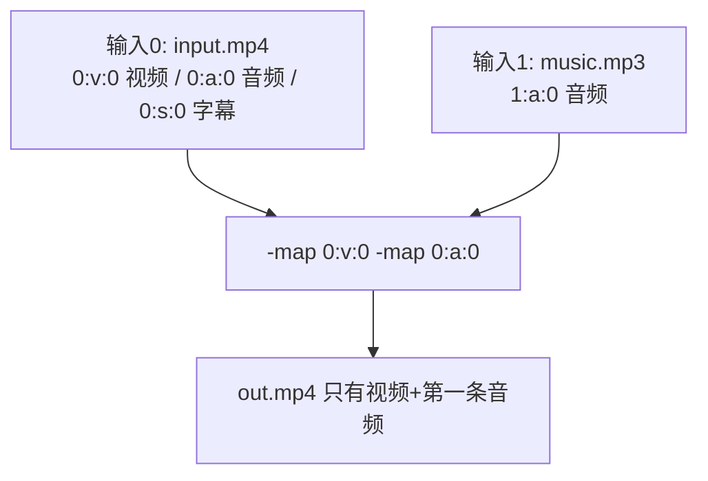
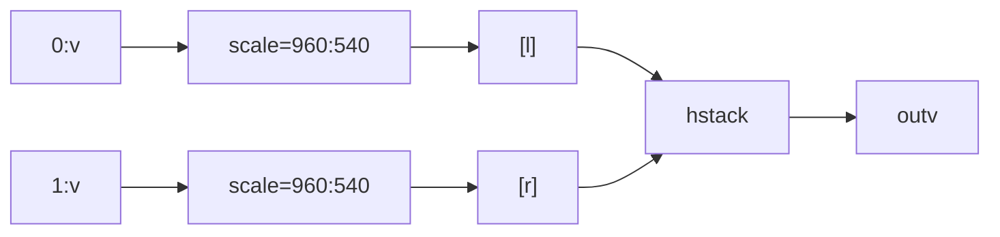
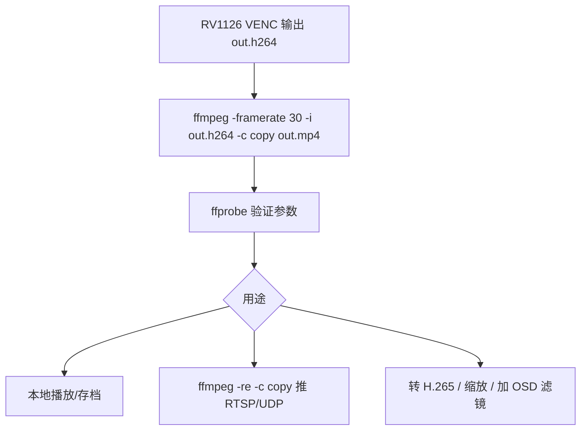

前几篇把视频编码和硬编链路走通了，但你手上拿到的往往是一堆裸流（.h264）、一段原始 YUV、或者一个想转成 mp4 的素材。处理这些"多媒体琐事"，FFmpeg 是行业标准工具：转码、裁剪、缩放、加滤镜、截图、推流，一条命令全搞定。这一篇把 FFmpeg 命令行的核心能力讲透：**命令结构、流选择、滤镜链、转码与流拷贝、截图与 GIF、推流、ffprobe/ffplay 分析**，每一个概念都给可照抄的命令并解释原理。

**双轨对照**：PC 端用 FFmpeg 命令做所有实验；板端 RV1126 硬编出来的 H.264 裸流，用 FFmpeg 封装成 mp4 并验证可播放——这是硬编上板后最常用的第一步。

## 一、FFmpeg 是什么：多媒体瑞士军刀

**定义**：FFmpeg 是一套开源的跨平台多媒体处理工具集，核心是 `ffmpeg`（转码/处理）、`ffprobe`（分析媒体信息）、`ffplay`（播放调试）三个命令行程序和一组 `libav*` 库。

**类比**：FFmpeg 就像一条自动化流水线车间。你从 A 口扔进原料（任意格式的视频），车间内部有传送带（解码）、加工台（滤镜）、打包机（编码）、装箱机（封装），最后从 B 口出来成品。你不用关心车间内部怎么运作，只需要告诉它"原料从哪进、要什么成品"——**命令就是给流水线下订单**。

```
ffmpeg [全局参数] [输入参数] -i 输入文件 [输出参数] 输出文件
```

先验证你的环境：

```bash
ffmpeg -version | head -n 3
ffprobe -version | head -n 1
```

**版本约定**：本系列写作时以 FFmpeg 6.x（如 6.1）为例，7.x 语法基本兼容；你的版本以 `ffmpeg -version` 为准。

## 二、命令结构：一条命令是怎么工作的

### 2.1 五大组成


**每个部分的职责**：

| 部分 | 例子 | 作用 |
|:---|:---|:---|
| 全局参数 | `-y` 覆盖输出、`-hide_banner` 隐藏版本信息 | 作用于整条命令 |
| 输入参数 | `-ss 00:01:00` 从第 1 分钟开始读、`-framerate 30` 指定原始帧率 | 只作用于后面的输入文件 |
| 输入文件 | `-i input.mp4` | 可以有多个输入 |
| 输出参数 | `-c:v libx264 -b:v 2M` | 只作用于后面的输出文件 |
| 输出文件 | `output.mp4` | 命令末尾 |

**关键原则**：**参数的位置决定作用对象**——写在 `-i` 之前的是输入参数，写在输出文件前的是输出参数。同样的 `-ss`，放在输入侧是"快速跳着读"（快但时间点不精确），放在输出侧是"先全部解码再丢掉前面的帧"（慢但精确）。

```bash
# 快速截取（输入侧 -ss：从源文件直接跳读，快）
ffmpeg -ss 00:01:00 -i input.mp4 -t 10 -c copy out.mp4
# 精确截取（输出侧 -ss：解码后丢帧，慢但每一帧都算）
ffmpeg -i input.mp4 -ss 00:01:00 -t 10 -c copy out.mp4
```

### 2.2 流选择：-map 才是王道

FFmpeg 默认"智能选择"输出哪些流，但**默认行为不等于你想要的**。`-map` 参数显式指定输出哪些流，格式是 `-map 输入序号:流类型:流序号`：

```bash
# 只输出第 1 个输入的第 0 路视频流
ffmpeg -i input.mp4 -map 0:v:0 -c copy out.mp4
# 只输出音频
ffmpeg -i input.mp4 -map 0:a:0 -c copy audio.aac
# 视频来自第 1 个输入，音频来自第 2 个输入
ffmpeg -i video.mp4 -i music.mp3 -map 0:v:0 -map 1:a:0 -c:v copy -c:a aac out.mp4
```

**流类型速记**：`v`=视频、`a`=音频、`s`=字幕、`d`=数据。



## 三、滤镜链：-vf 与 filter_complex

### 3.1 滤镜是什么

**定义**：滤镜（filter）是对视频帧或音频样本做处理的小模块，可以串联成链（filter chain）。FFmpeg 内置几百个滤镜：缩放、裁剪、旋转、加水印、去隔行、调节亮度、加文字等。

**类比**：滤镜链 = 工厂流水线上的加工工位。一帧画面从第一个工位进去，经过"裁边→缩放→加水印→转格式"多个工位，最后从最后一个工位出来。

**语法**：`-vf "滤镜1=参数,滤镜2=参数,滤镜3=参数"`——**逗号串联，从左到右依次执行**。

### 3.2 最常用的几个滤镜

```bash
# 缩放：-1 表示按宽高比自动计算另一边
ffmpeg -i in.mp4 -vf "scale=1280:-1" out.mp4
# 裁剪：从 (x=100, y=50) 开始裁 800×600
ffmpeg -i in.mp4 -vf "crop=800:600:100:50" out.mp4
# 加水印（overlay）：把 logo.png 放在右上角，距离右/上边缘 20px
ffmpeg -i in.mp4 -i logo.png -filter_complex "[0:v][1:v]overlay=W-w-20:20" out.mp4
# 加文字（drawtext 需要编译时带 libfreetype）
ffmpeg -i in.mp4 -vf "drawtext=text='HELLO':x=10:y=10:fontsize=48:fontcolor=white" out.mp4
# 转像素格式（NV12 常用于板端硬编输入）
ffmpeg -i in.mp4 -vf "format=nv12" out.mp4
# 抽帧：每 1 秒抽 1 帧存成 jpg（-vsync 或 -fps_mode 控制帧率）
ffmpeg -i in.mp4 -vf "fps=1" frame_%03d.jpg
```

**注意**：`scale=1280:-1` 里的 `-1` 是"自动计算"的约定写法，不是负尺寸。`overlay` 里的 `W`/`H` 是主视频的宽高，`w`/`h` 是 overlay 图片的宽高——用表达式可以算位置。

### 3.3 filter_complex：多输入多输出的滤镜图

`-vf` 只处理单一视频流；**多个输入、多个输出、音频处理、把滤镜结果重新喂回流水线**时要用 `-filter_complex`。滤镜图里用 `[0:v]`、`[1:v]` 这样的标签指代流，最后 `[outv]` 标出输出。

```bash
# 两路视频并排拼接成画中画/左右分屏
ffmpeg -i left.mp4 -i right.mp4 -filter_complex \
  "[0:v]scale=960:540[l];[1:v]scale=960:540[r];[l][r]hstack" out.mp4
# 视频加音频淡入
ffmpeg -i in.mp4 -i music.mp3 -filter_complex \
  "[1:a]afade=t=in:st=0:d=2[a]" -map 0:v -map "[a]" out.mp4
```



**常见坑**：滤镜链里忘了加 `format=yuv420p`，H.264 编码器会报"pixel format not supported"——因为很多解码器/播放器只支持 yuv420p。

## 四、转码与流拷贝

### 4.1 转码 vs 流拷贝

**定义**：转码（transcode）= 解码→重新编码，可以改变编码格式/码率/分辨率/帧率；流拷贝（stream copy）= 不解码，直接把已编码的流搬运到新容器，秒级完成但**不能改编码参数**。

**类比**：转码是把书重新翻译成另一种语言再排版；流拷贝是把已印好的书原样搬进新的书架（箱子），内容一个字不变。

```bash
# 转码：H.264 到 H.265（慢，质量可控）
ffmpeg -i in.mp4 -c:v libx265 -crf 28 -c:a copy out.mp4
# 流拷贝：mp4 容器换成 mkv（秒完成）
ffmpeg -i in.mp4 -c copy out.mkv
# 流拷贝：提取裸 H.264 流（板端硬编输入/输出常见）
ffmpeg -i in.mp4 -map 0:v:0 -c copy out.h264
# 流拷贝：把板端裸流封装成可播放 mp4（上板后最常用！）
ffmpeg -i board_out.h264 -c copy board_out.mp4
```

**裸流封装（重要）**：板端 VENC 输出的 `.h264` 是纯码流，没有容器信息。播放器不知道时长、时间基、帧率。用 `-c copy` 包一层 mp4 容器就能播了：

```bash
# -r 指定帧率，否则 FFmpeg 默认按 25fps 猜
ffmpeg -framerate 30 -i board_out.h264 -c copy board_out.mp4
ffprobe board_out.mp4   # 验证
```

### 4.2 常用转码参数

| 参数 | 含义 | 例子 |
|:---|:---|:---|
| `-c:v libx264` | 视频编码器 | x264 软编 |
| `-c:v h264_rkmpp` | 板端/带 MPP 的 FFmpeg 用硬件编码器 | 低 CPU |
| `-crf 23` | 恒定质量（x264: 0~51，越小质量越高） | 18 高质量，28 低质量 |
| `-b:v 2M` | 目标码率 | CBR/VBR 模式 |
| `-preset veryfast` | x264 速度-质量折中 | ultrafast~veryslow |
| `-r 30` | 输出帧率 | 改帧率 |
| `-s 1920x1080` | 输出分辨率（也可用 -vf scale） | 改分辨率 |
| `-c:a aac -b:a 128k` | 音频编码与码率 | 常见 AAC |
| `-c copy` | 流拷贝模式 | 不改编码 |

**CRF 原理**：CRF（Constant Rate Factor）让编码器在"质量一致"的前提下自动分配码率——画面复杂的地方多给码率，简单的地方少给。相比固定码率 CBR，CRF 更省空间且质量均匀。**码率控制的心法：优先用 CRF 做质量目标，用 -b:v 做带宽约束**（推流时必须有带宽约束）。

```bash
# 质量优先：CRF 22
ffmpeg -i in.mp4 -c:v libx264 -crf 22 -preset medium -c:a copy out.mp4
# 带宽优先：上限 2Mbps
ffmpeg -i in.mp4 -c:v libx264 -b:v 2M -maxrate 2.5M -bufsize 4M -c:a copy out.mp4
```

## 五、截图与 GIF

```bash
# 第 10 秒截一帧（输出侧 -ss 精确）
ffmpeg -ss 00:00:10 -i in.mp4 -frames:v 1 -q:v 2 frame.jpg
# 每 5 秒截一帧
ffmpeg -i in.mp4 -vf "fps=1/5" frame_%03d.jpg
# 转 GIF（先按 320 宽缩放 + 调色板，画质更好）
ffmpeg -i in.mp4 -vf "fps=10,scale=320:-1:flags=lanczos,split[s0][s1];[s0]palettegen[p];[s1][p]paletteuse" out.gif
# 视频前 3 秒转 GIF
ffmpeg -t 3 -i in.mp4 -vf "fps=10,scale=480:-1" out.gif
```

**GIF 调色板原理**：GIF 每帧最多 256 色。`palettegen` 先从视频里统计出"整段视频最常用的 256 色"生成调色板，`paletteuse` 再用这个调色板逐帧量化——比默认自动调色板质量高很多，这是"FFmpeg GIF 为什么比别人糊"的标准解法。

## 六、推流：把视频送上网络

**定义**：推流 = 把编码后的码流用流媒体协议（RTSP/RTMP/UDP）实时发送给接收端。FFmpeg 既能推也能拉，是调试流媒体链路的利器。

### 6.1 RTSP 推流（本地测试最常用）

```bash
# 把本地 mp4 循环推到本地 RTSP 服务（如 mediamtx / Live555）
ffmpeg -re -stream_loop -1 -i in.mp4 -c:v copy -c:a copy \
  -f rtsp rtsp://127.0.0.1:8554/live

# 用 FFmpeg 同时当服务端：SDP 文件方式（老牌简单方案）
ffmpeg -re -i in.mp4 -c:v libx264 -preset ultrafast -tune zerolatency \
  -f rtsp -rtsp_transport tcp rtsp://127.0.0.1:8554/live
```

**`-re` 是什么**：real-time 模式，**按原始时间基逐帧读取**，否则 FFmpeg 会以最快速度读完整个文件立刻推完。推流必须加 `-re`，否则 1 秒推完整部电影。

**`-tune zerolatency` 是什么**：让 x264 不要为了压缩率攒帧缓冲，帧到了立刻输出——延迟优先，适合实时推流。

### 6.2 UDP 推流（裸 H.264 最简单）

```bash
# 发送端：把裸流按 RTP over UDP 推到 192.168.1.100:5004
ffmpeg -re -i in.mp4 -c:v copy -f mpegts udp://192.168.1.100:5004
# 接收端：VLC 打开 udp://@:5004，或 FFplay
ffplay udp://@:5004
```

### 6.3 推流前的参数心法

| 场景 | 参数组合 |
|:---|:---|
| 局域网实时预览 | `-preset ultrafast -tune zerolatency -b:v 4M` |
| 公网带宽受限 | `-b:v 1M -maxrate 1.2M -bufsize 2M -g 30` |
| 低延迟 H.265 | `-c:v libx265 -x265-params log-level=error -tune zerolatency` |

**GOP 与推流的关系**：`-g 30` 表示每 30 帧一个关键帧。GOP 越小，客户端加入直播越快看到画面（等下一个 I 帧），但码率略升。实时推流通常用 `-g` 30~60（1~2 秒一个关键帧）。

## 七、ffprobe / ffplay：分析与调试

### 7.1 ffprobe：媒体文件的"体检报告"

```bash
# 总览
ffprobe in.mp4
# 只看流信息，简洁格式
ffprobe -v error -show_streams in.mp4
# 只看视频流关键字段
ffprobe -v error -select_streams v:0 -show_entries \
  stream=codec_name,width,height,r_frame_rate,pix_fmt,profile -of default=noprint_wrappers=1 in.mp4
# 看时长和封装信息
ffprobe -v error -show_entries format=duration,bit_rate,format_name -of default=noprint_wrappers=1 in.mp4
# JSON 输出（脚本处理）
ffprobe -v error -print_format json -show_streams in.mp4
```

**实际用途**：上板后第一件事就是 `ffprobe` 验证硬编流——分辨率、帧率、profile 是否与 VENC 配置一致，SPS/PPS 是否正常。这是排查"板端流为什么播不了"的第一工具。

### 7.2 ffplay：可视化调试播放器

```bash
ffplay in.mp4                      # 正常播放
ffplay -vf "scale=640:360" in.mp4  # 播放时实时缩放
ffplay -ss 30 in.mp4               # 从 30 秒开始播
ffplay -window_title "TEST" in.mp4
```

**常用键**：`q` 退出、空格暂停、`←/→` 快退快进、`s` 截图（存到当前目录）、`f` 全屏。ffplay 还能直接打开网络流：

```bash
ffplay rtsp://127.0.0.1:8554/live
ffplay udp://@:5004
```

## 八、常用参数速查表（贴墙版）

```bash
# 输入控制
-ss <pos>          # 跳转时间（输入侧=快，输出侧=精确）
-t <dur>           # 只处理多少时长
-ignore_editlist 1 # 忽略 MP4 编辑列表（时间轴异常时用）

# 视频编码
-c:v libx264 / libx265 / h264_rkmpp / copy
-crf <0-51>        # 质量因子
-b:v <rate>        # 目标码率
-maxrate / -bufsize
-preset <p>        # ultrafast~veryslow
-tune zerolatency  # 低延迟
-g <n>             # GOP 大小
-r <fps>           # 输出帧率
-s <WxH>           # 输出分辨率
-pix_fmt yuv420p   # 像素格式（兼容性之王）

# 音频
-c:a aac / copy / pcm_s16le
-b:a 128k
-ar 44100          # 采样率
-ac 2              # 声道数

# 滤镜
-vf "f1,p1:f2"     # 简单滤镜链
-filter_complex "..." # 复杂滤镜图
-frames:v N        # 输出 N 帧视频
-q:v 2             # jpg 质量（2~5 常用）

# 输出与协议
-f mp4 / mkv / rtsp / mpegts / rawvideo / h264
-map 0:v:0 -map 1:a:0
-c copy            # 流拷贝
-re                # 实时读取（推流必加）
```

## 九、板端联动：硬编裸流的一站式处理

RV1126 VENC 输出 `.h264` 后，FFmpeg 是"最后一公里"的标准工具。完整链路：



**板端文件先拷到 PC**（`adb pull` / `scp` / U 盘均可），然后：

```bash
# 1. 封装验证
ffmpeg -framerate 30 -i out.h264 -c copy out.mp4
ffprobe -v error -show_entries stream=codec_name,width,height,r_frame_rate -of default=noprint_wrappers=1 out.mp4
# 2. 若封装后播放器仍异常，检查 SPS/PPS 是否在码流头部
ffmpeg -v trace -i out.h264 -c copy /dev/null 2>&1 | grep -i "sps\|pps"
# 3. 转码成浏览器兼容的 H.264+mp4
ffmpeg -i out.h264 -c:v libx264 -crf 23 -pix_fmt yuv420p -c:a none web.mp4
```

**为什么 -framerate 必须显式指定**：裸流没有时间基信息，FFmpeg 默认猜 25fps；如果 VENC 实际是 30fps，封装后时长会算错（30fps 的流被当成 25fps → 时长变成 1.2 倍）。**裸流封装永远显式给 -framerate**。

## 十、动手练习

1. 生成测试素材：`ffmpeg -f lavfi -i testsrc2=size=1920x1080:rate=30 -t 10 -pix_fmt yuv420p test.mp4`（lavfi 是内置虚拟输入，testsrc2 是测试图）
2. 用 `-vf` 链式完成：缩放 1280x720 → 加 drawtext 水印 → 转 yuv420p，输出并播放
3. 用 `-filter_complex` 把 test.mp4 与自身叠加成左右分屏（`hstack`）
4. 用 `-c copy` 把 mp4 转 mkv、提取裸 h264、再把裸流封装回 mp4，用 ffprobe 对比三种文件的流信息
5. 分别用 `-crf 18/23/28` 编码同一素材，对比文件大小与画质（截图对比）
6. 截第 3 秒帧、生成 10fps 的 GIF（调色板版本 vs 默认版本对比画质）
7. 推流练习：启动 mediamtx（或使用系统 RTSP 服务），`ffmpeg -re -stream_loop -1 -i test.mp4 -c copy -f rtsp rtsp://127.0.0.1:8554/live`，用 VLC/ffplay 拉流观看
8. 把 VENC 生成的裸流（如果手上有板子）用上述流程封装并验证

## 里程碑

- [ ] 能说出 ffmpeg 命令的五大组成部分，并解释参数位置（输入侧/输出侧）的意义
- [ ] 能熟练使用 -map 显式选择流，而不是依赖默认行为
- [ ] 能写出 -vf 滤镜链并解释逗号串联的执行顺序
- [ ] 能在需要时切换 filter_complex 处理多输入
- [ ] 能区分转码与流拷贝，并说明裸流封装必须显式 -framerate 的原因
- [ ] 能用 CRF / 码率两种模式控制输出质量，理解二者适用场景
- [ ] 能用 ffmpeg 完成截图、GIF、推流（RTSP/UDP）三大常见任务
- [ ] 能用 ffprobe 快速定位"流参数不对"类问题

> 🏷️ 标签：FFmpeg · 命令行 · 滤镜 · filter_complex · 转码 · 流拷贝 · CRF · ffprobe · ffplay · RTSP · 推流 · 裸流封装 · H.264 · 音视频
