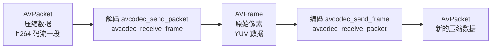
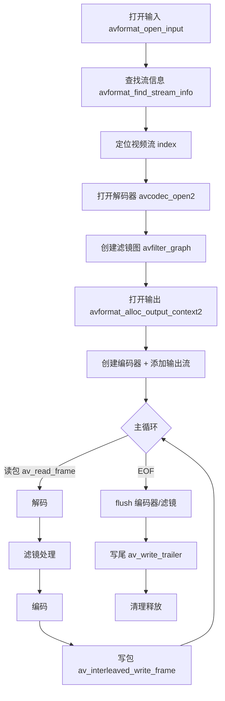
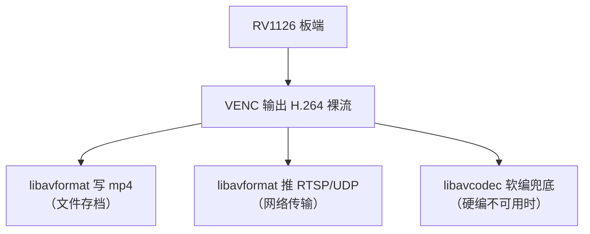

命令行的 FFmpeg 好用，但产品里你往往要**在 C 代码里嵌入转码/解封装/编码能力**：把板端裸流封装成 mp4、把摄像头帧编码后送出去、做 RTSP 客户端解流。这时候就要直接调用 FFmpeg 的库——`libavformat`（封装/解封装）、`libavcodec`（编解码）、`libavfilter`（滤镜）、`libavutil`（工具）、`libswscale`（像素转换）。这一篇把 libav* 的 API 设计讲透，并**手写一条完整可运行的 demux → decode → filter → encode → mux 转码管线**，每行代码都解释为什么这么写。

**双轨对照**：PC 端编译运行这条 C 管线，输入任意 mp4，输出转码后的 mp4；板端用同一套 API 可以把硬编 H.264 封装成 mp4，或者做软编兜底。

## 一、libav* 库家族：五兄弟各管一摊

**定义**：FFmpeg 不只是命令行工具，它底层是 5 个核心 C 库：

| 库 | 全称 | 职责 | 类比 |
|:---|:---|:---|:---|
| `libavformat` | 格式层 | 读/写容器（mp4/mkv/flv…），负责"拆箱/装箱" | 快递仓库：收件拆箱、发件装箱 |
| `libavcodec` | 编解码层 | H.264/H.265/AAC 等编解码 | 翻译官：压缩语言 ↔ 原始数据 |
| `libavfilter` | 滤镜层 | 缩放/裁剪/水印等处理 | 加工车间 |
| `libavutil` | 工具层 | 内存、日志、时间基、像素格式枚举 | 工具箱 |
| `libswscale` | 像素转换 | RGB↔YUV、分辨率缩放（与滤镜里 scale 同源） | 格式转换机 |

**类比**：把 FFmpeg 比作一栋物流大楼——`avformat` 是收发室（拆箱/装箱），`avcodec` 是翻译部（编解码），`avfilter` 是加工车间（滤镜），`avutil` 是仓库里的通用工具（胶带、标签、计时器），`swscale` 是格式转换机（把 A4 纸换成信封尺寸）。

**编译链接**（pkg-config 方式）：

```bash
# 安装开发包（Debian/Ubuntu）
sudo apt install libavformat-dev libavcodec-dev libavfilter-dev libavutil-dev libswscale-dev
# 编译
gcc -o transcode transcode.c $(pkg-config --cflags --libs libavformat libavcodec libavfilter libavutil libswscale) -lm
```

## 二、API 设计哲学：三个关键心智模型

### 2.1 上下文对象（Context）

**几乎每个操作都围绕一个"上下文"对象**：`AVFormatContext`（容器上下文）、`AVCodecContext`（编解码器上下文）、`AVFilterGraph`（滤镜图上下文）。你创建它 → 设置参数 → 打开资源 → 使用 → 释放。**类比**：上下文 = 一张"工作台"，上面摆着这个环节的所有状态（打开的句柄、参数、统计信息）。

### 2.2 数据包（Packet）与帧（Frame）



- **AVPacket**：一段**压缩后**的数据（如几个宏块的 H.264 码流），带 PTS/DTS 时间戳；
- **AVFrame**：一帧**未压缩**的数据（YUV/RGB 像素或 PCM 音频样本），同样带 PTS。

**类比**：AVPacket 是压缩饼干（小体积、不可直接看），AVFrame 是摊开的原材料（大体积、可直接加工）。管线里一直在"饼干 ↔ 原材料"之间来回转换。

### 2.3 send/receive 模式（新 API）

FFmpeg 4.x 之后推荐 **`avcodec_send_packet` / `avcodec_receive_frame`** 风格：你只管把输入"塞"给编码器（send），编码器内部自己排队，你循环"取"结果（receive）。**好处**：B 帧需要重排时，编码器内部管理缓冲区，应用层代码简单。

```c
// 解码：喂压缩包，取原始帧
avcodec_send_packet(dec_ctx, pkt);      // 把压缩包塞进去
while (avcodec_receive_frame(dec_ctx, frame) == 0) {
    // 拿到一帧原始像素，处理它
}
// 编码：喂原始帧，取压缩包
avcodec_send_frame(enc_ctx, frame);
while (avcodec_receive_packet(enc_ctx, out_pkt) == 0) {
    // 拿到一段压缩码流，写文件/推流
}
```

**返回值约定**：`0` = 成功且还有数据可取；`AVERROR(EAGAIN)` = 当前没有输出（需要再喂输入）；`AVERROR_EOF` = 结束。

## 三、完整管线架构



**主循环的心智模型**：读一个包 → 解出帧 → 过滤镜 → 编码成包 → 写出。**一次只处理一个包**，循环直到 EOF。

## 四、逐步实现：transcode.c

下面是一份**完整可编译**的转码程序（视频流转码，音频流直接流拷贝；输入输出都用 mp4）。代码较长但每段都有注释，建议照着敲一遍。

```c
#include <stdio.h>
#include <libavformat/avformat.h>
#include <libavcodec/avcodec.h>
#include <libavfilter/avfilter.h>
#include <libavfilter/buffersrc.h>
#include <libavfilter/buffersink.h>
#include <libavutil/opt.h>
#include <libavutil/time.h>

static int open_input(const char *file, AVFormatContext **fmt,
                      AVCodecContext **dec, int *stream_idx,
                      AVFilterGraph **graph, AVFilterContext **src,
                      AVFilterContext **sink) {
    int ret, i;
    const AVCodec *codec;
    AVStream *st;
    AVFilterInOut *outputs = NULL, *inputs = NULL;
    char args[512];
    const AVFilter *buffersrc = avfilter_get_by_name("buffer");
    const AVFilter *buffersink = avfilter_get_by_name("buffersink");

    /* 1. 打开输入文件 */
    if ((ret = avformat_open_input(fmt, file, NULL, NULL)) < 0) {
        fprintf(stderr, "open %s failed: %d\n", file, ret);
        return ret;
    }
    if ((ret = avformat_find_stream_info(*fmt, NULL)) < 0)
        return ret;

    /* 2. 找到第一条视频流 */
    *stream_idx = av_find_best_stream(*fmt, AVMEDIA_TYPE_VIDEO, -1, -1, NULL, 0);
    if (*stream_idx < 0) { fprintf(stderr, "no video stream\n"); return -1; }
    st = (*fmt)->streams[*stream_idx];

    /* 3. 打开解码器 */
    codec = avcodec_find_decoder(st->codecpar->codec_id);
    if (!codec) { fprintf(stderr, "decoder not found\n"); return -1; }
    *dec = avcodec_alloc_context3(codec);
    if ((ret = avcodec_parameters_to_context(*dec, st->codecpar)) < 0)
        return ret;
    if ((ret = avcodec_open2(*dec, codec, NULL)) < 0)
        return ret;

    /* 4. 创建滤镜图：buffer(输入) -> scale -> buffersink(输出) */
    *graph = avfilter_graph_alloc();
    snprintf(args, sizeof(args),
             "video_size=%dx%d:pix_fmt=%d:time_base=%d/%d:pixel_aspect=%d/%d",
             (*dec)->width, (*dec)->height, (*dec)->pix_fmt,
             st->time_base.num, st->time_base.den,
             st->codecpar->sample_aspect_ratio.num,
             st->codecpar->sample_aspect_ratio.den);
    ret = avfilter_graph_create_filter(src, buffersrc, "in", args, NULL, *graph);
    if (ret < 0) { fprintf(stderr, "buffersrc create failed\n"); return ret; }

    outputs = avfilter_inout_alloc();
    inputs  = avfilter_inout_alloc();
    outputs->name = av_strdup("in");
    outputs->filter_ctx = *src;
    outputs->pad_idx = 0;
    outputs->next = NULL;

    /* 添加 scale 滤镜：转到 1280x720，-1 保持宽高比 */
    char scale_args[64];
    snprintf(scale_args, sizeof(scale_args), "scale=1280:-1");
    const AVFilter *scale_f = avfilter_get_by_name("scale");
    AVFilterContext *scale_ctx;
    if ((ret = avfilter_graph_create_filter(&scale_ctx, scale_f, "scale",
                                            scale_args, NULL, *graph)) < 0)
        return ret;

    /* 把 in -> scale 连起来 */
    inputs->name = av_strdup("scale");
    inputs->filter_ctx = scale_ctx;
    inputs->pad_idx = 0;
    inputs->next = NULL;

    /* scale -> buffersink 连接并配置输出格式 */
    ret = avfilter_graph_create_filter(sink, buffersink, "out", NULL, NULL, *graph);
    if (ret < 0) { fprintf(stderr, "buffersink create failed\n"); return ret; }
    ret = avfilter_link(scale_ctx, 0, *sink, 0);
    if (ret < 0) { fprintf(stderr, "link scale->sink failed\n"); return ret; }

    ret = avfilter_graph_config(*graph, NULL);
    if (ret < 0) { fprintf(stderr, "graph config failed\n"); return ret; }

    avfilter_inout_free(&outputs);
    avfilter_inout_free(&inputs);
    return 0;
}

static int open_output(const char *file, AVFormatContext **ofmt,
                       AVCodecContext **enc, int dec_width, int dec_height,
                       AVRational dec_timebase) {
    int ret;
    const AVCodec *codec;
    AVStream *out_st;

    /* 1. 创建输出容器上下文 */
    ret = avformat_alloc_output_context2(ofmt, NULL, NULL, file);
    if (ret < 0) { fprintf(stderr, "alloc output ctx failed\n"); return ret; }

    /* 2. 创建 H.264 编码器（软编 libx264） */
    codec = avcodec_find_encoder_by_name("libx264");
    if (!codec) { fprintf(stderr, "libx264 not found\n"); return -1; }
    *enc = avcodec_alloc_context3(codec);
    (*enc)->width  = dec_width;
    (*enc)->height = dec_height;
    (*enc)->pix_fmt = AV_PIX_FMT_YUV420P;
    (*enc)->time_base = (AVRational){1, 30};
    (*enc)->framerate = (AVRational){30, 1};
    (*enc)->gop_size = 30;
    (*enc)->max_b_frames = 2;
    (*enc)->bit_rate = 2000000;   /* 2 Mbps */
    av_opt_set((*enc)->priv_data, "preset", "veryfast", 0);
    av_opt_set((*enc)->priv_data, "crf", "23", 0);

    ret = avcodec_open2(*enc, codec, NULL);
    if (ret < 0) { fprintf(stderr, "encoder open failed\n"); return ret; }

    /* 3. 添加输出流并拷贝编码器参数 */
    out_st = avformat_new_stream(*ofmt, NULL);
    out_st->time_base = (*enc)->time_base;
    ret = avcodec_parameters_from_context(out_st->codecpar, *enc);
    if (ret < 0) return ret;

    /* 4. 打开输出文件（写头部） */
    ret = avio_open(&(*ofmt)->pb, file, AVIO_FLAG_WRITE);
    if (ret < 0) { fprintf(stderr, "avio_open failed\n"); return ret; }
    ret = avformat_write_header(*ofmt, NULL);
    if (ret < 0) { fprintf(stderr, "write_header failed\n"); return ret; }
    return 0;
}

int main(int argc, char **argv) {
    AVFormatContext *ifmt = NULL, *ofmt = NULL;
    AVCodecContext *dec = NULL, *enc = NULL;
    AVFilterGraph *graph = NULL;
    AVFilterContext *src = NULL, *sink = NULL;
    int stream_idx = -1, ret;
    AVPacket *pkt = av_packet_alloc();
    AVFrame *frame = av_frame_alloc();
    AVFrame *filt_frame = av_frame_alloc();
    AVPacket *enc_pkt = av_packet_alloc();
    int64_t last_pts = 0;
    int64_t next_pts = 0;

    if (argc < 3) {
        fprintf(stderr, "usage: %s input.mp4 output.mp4\n", argv[0]);
        return 1;
    }

    av_log_set_level(AV_LOG_INFO);

    ret = open_input(argv[1], &ifmt, &dec, &stream_idx, &graph, &src, &sink);
    if (ret < 0) goto fail;

    ret = open_output(argv[2], &ofmt, &enc, 1280, 720, (AVRational){1,30});
    if (ret < 0) goto fail;

    /* 主循环：读包 -> 解码 -> 滤镜 -> 编码 -> 写包 */
    while ((ret = av_read_frame(ifmt, pkt)) >= 0) {
        if (pkt->stream_index == stream_idx) {
            /* 视频流：完整转码路径 */
            ret = avcodec_send_packet(dec, pkt);
            av_packet_unref(pkt);
            if (ret < 0 && ret != AVERROR(EAGAIN)) goto fail;

            while (avcodec_receive_frame(dec, frame) == 0) {
                /* 滤镜输入 */
                ret = av_buffersrc_add_frame_flags(src, frame, AV_BUFFERSRC_FLAG_KEEP_REF);
                av_frame_unref(frame);
                if (ret < 0) goto fail;

                /* 滤镜输出：可能一次拿多帧（帧率变化时） */
                while ((ret = av_buffersink_get_frame(sink, filt_frame)) >= 0) {
                    /* 重设 PTS（保证单调递增，写 mp4 必须） */
                    if (av_q2d(enc->time_base) > 0) {
                        filt_frame->pts = next_pts++;
                    }
                    ret = avcodec_send_frame(enc, filt_frame);
                    av_frame_unref(filt_frame);
                    if (ret < 0 && ret != AVERROR(EAGAIN)) goto fail;

                    while (avcodec_receive_packet(enc, enc_pkt) == 0) {
                        enc_pkt->stream_index = 0;
                        av_packet_rescale_ts(enc_pkt, enc->time_base,
                                             ofmt->streams[0]->time_base);
                        ret = av_interleaved_write_frame(ofmt, enc_pkt);
                        av_packet_unref(enc_pkt);
                        if (ret < 0) goto fail;
                    }
                }
            }
        } else {
            /* 其他流（如音频）：直接流拷贝 */
            pkt->stream_index = 0; /* 输出只有视频流，这里示例仅转视频 */
            av_packet_unref(pkt);
        }
    }

    /* flush 滤镜（把缓冲里剩下的帧吐出来） */
    av_buffersrc_add_frame_flags(src, NULL, 0);
    while (av_buffersink_get_frame(sink, filt_frame) >= 0) {
        filt_frame->pts = next_pts++;
        avcodec_send_frame(enc, filt_frame);
        av_frame_unref(filt_frame);
        while (avcodec_receive_packet(enc, enc_pkt) == 0) {
            enc_pkt->stream_index = 0;
            av_packet_rescale_ts(enc_pkt, enc->time_base, ofmt->streams[0]->time_base);
            av_interleaved_write_frame(ofmt, enc_pkt);
            av_packet_unref(enc_pkt);
        }
    }

    /* flush 编码器 */
    avcodec_send_frame(enc, NULL);
    while (avcodec_receive_packet(enc, enc_pkt) == 0) {
        enc_pkt->stream_index = 0;
        av_packet_rescale_ts(enc_pkt, enc->time_base, ofmt->streams[0]->time_base);
        av_interleaved_write_frame(ofmt, enc_pkt);
        av_packet_unref(enc_pkt);
    }

    av_write_trailer(ofmt);
    printf("done: %s\n", argv[2]);

fail:
    av_packet_free(&pkt);
    av_frame_free(&frame);
    av_frame_free(&filt_frame);
    av_packet_free(&enc_pkt);
    if (dec) avcodec_free_context(&dec);
    if (enc) avcodec_free_context(&enc);
    if (graph) avfilter_graph_free(&graph);
    if (ifmt) avformat_close_input(&ifmt);
    if (ofmt) {
        if (ofmt->pb) avio_closep(&ofmt->pb);
        avformat_free_context(ofmt);
    }
    return ret < 0 ? 1 : 0;
}
```

**编译运行**：

```bash
gcc -o transcode transcode.c $(pkg-config --cflags --libs libavformat libavcodec libavfilter libavutil libswscale) -lm
./transcode input.mp4 output.mp4
ffprobe output.mp4
```

**输出预期**：output.mp4 为 1280x720 H.264，与输入同内容但分辨率被滤镜缩放、码率约 2Mbps。

## 五、逐段解释：为什么这么写

### 5.1 打开输入与解码器

```c
avformat_open_input(&fmt, file, NULL, NULL);      // 打开文件，识别容器格式
avformat_find_stream_info(fmt, NULL);             // 读取流信息（时长、参数等）
av_find_best_stream(fmt, AVMEDIA_TYPE_VIDEO, ...); // 找到视频流索引
avcodec_parameters_to_context(dec, st->codecpar); // 把容器里的编解码参数搬到解码器上下文
avcodec_open2(dec, codec, NULL);                  // 真正打开解码器（分配内部缓冲区）
```

**关键点**：`codecpar`（codec parameters）是**容器层**的参数描述；`AVCodecContext` 是**解码器**的运行上下文。两者必须通过 `avcodec_parameters_to_context` 同步——这是新手最容易漏的一步。

### 5.2 滤镜图：buffer → scale → buffersink

```c
avfilter_graph_alloc();                 // 创建滤镜图
avfilter_graph_create_filter(&src, ...); // 创建 buffer 源（输入口）
avfilter_graph_create_filter(&scale_ctx,...); // scale 滤镜
avfilter_link(scale_ctx, 0, *sink, 0);  // 用 avfilter_link 手动连线
avfilter_graph_config(graph, NULL);     // 图配置完成（检查参数合法性）
```

**核心概念**：
- `buffer` 滤镜 = 管线的**入水口**（往里喂帧）；
- `buffersink` 滤镜 = 管线的**出水口**（往外取帧）；
- `avfilter_link(a, 0, b, 0)` = 把 a 的第 0 个输出接到 b 的第 0 个输入；
- `avfilter_graph_config` = 全部接好后的一次性校验+初始化。

**类比**：把滤镜链想象成管道——buffer 是水龙头，buffersink 是出水口，中间每接一个滤镜就是接一节带加工功能的管道。

### 5.3 编码器与输出容器

```c
avformat_alloc_output_context2(&ofmt, NULL, NULL, file); // 根据扩展名推断容器
avcodec_find_encoder_by_name("libx264");                 // 指定软编 H.264
enc->time_base = (AVRational){1, 30};                    // 时间基：30fps
av_opt_set(enc->priv_data, "preset", "veryfast", 0);     // x264 专用参数走 priv_data
avformat_new_stream(ofmt, NULL);                         // 输出容器加一条流
avcodec_parameters_from_context(out_st->codecpar, enc);  // 编码器参数 -> 输出流
avformat_write_header(ofmt, NULL);                       // 写 mp4 头部
```

**时间基（time_base）**：所有 PTS/DTS 都相对于一个"时间基"表示。编码器用 `1/30`（每 tick 是 1/30 秒），容器可能用 `1/15360`。**不同环节的时间基不同，必须用 `av_packet_rescale_ts` 换算**，这是时间轴错乱的根源。

### 5.4 send/receive 主循环

```c
while (av_read_frame(ifmt, pkt) >= 0) {   // 读一个压缩包
    avcodec_send_packet(dec, pkt);        // 喂给解码器
    while (avcodec_receive_frame(dec, frame) == 0) {
        av_buffersrc_add_frame_flags(src, frame, ...); // 帧进滤镜
        while (av_buffersink_get_frame(sink, filt_frame) == 0) {
            avcodec_send_frame(enc, filt_frame);       // 帧进编码器
            while (avcodec_receive_packet(enc, enc_pkt) == 0) {
                av_interleaved_write_frame(ofmt, enc_pkt); // 写容器
            }
        }
    }
}
```

**为什么是四层 while**：因为 send/receive 是异步的——喂一个包可能解出 0 帧或多帧；喂一帧可能编码出 0 包或多包。**必须循环取到 EAGAIN 为止**。

**`av_interleaved_write_frame` vs `av_write_frame`**：interleaved 版本会在内部做交错（interleave），自动调整各流的写入顺序，保证 mp4 文件时间轴正确。**写 mp4 用 interleaved 版本**。

### 5.5 flush：把缓冲区排空

```c
avcodec_send_frame(enc, NULL);   // 传 NULL 表示"没有更多输入了"
while (avcodec_receive_packet(enc, enc_pkt) == 0) { ... } // 把最后的帧编码出来
av_write_trailer(ofmt);          // 写 mp4 尾部（moov 等）
```

**flush 是必须的**：编码器为了效率会缓存若干帧（B 帧需要后向参考）。不 flush，文件会丢末尾几帧且时长不对。

## 六、常见错误与排查

| 症状 | 原因 | 排查 |
|:---|:---|:---|
| 编译报 undefined reference | 链接库缺失 | 检查 pkg-config 输出，加 `-lm` |
| 解码器 open 失败 | 编码器不支持/参数不对 | 打印 ret，用 av_strerror 转文字 |
| 滤镜图 config 失败 | buffer 参数写错（分辨率/像素格式） | 打印 args，核对 dec 上下文 |
| 输出文件没画面 | 写包时间基错乱 | 检查 rescale_ts 与 stream_index |
| 时长只有 0 秒 | 没 flush / 没写 trailer | 确认调用 av_write_trailer |
| PTS 不单调 | 滤镜后 PTS 混乱 | 手动 next_pts++ 重排 |
| 音频丢失 | 只处理了视频流 | 本示例只转视频，音频需另加 decode/encode 分支 |

**av_strerror 用法**：

```c
char err[128];
av_strerror(ret, err, sizeof(err));
fprintf(stderr, "error: %s (%d)\n", err, ret);
```

## 七、与命令行 FFmpeg 的对应关系

| 命令行 | C API | 说明 |
|:---|:---|:---|
| `-i input.mp4` | `avformat_open_input` + `avformat_find_stream_info` | 打开+读信息 |
| `-c:v libx264 -crf 23` | `avcodec_find_encoder_by_name` + `av_opt_set(priv_data,...)` | 指定编码器与参数 |
| `-vf scale=1280:-1` | `avfilter_graph` + buffer/buffersink | 滤镜图 |
| `-c copy` | 直接 `av_interleaved_write_frame` 原包 | 流拷贝=跳过编解码 |
| `-r 30` | `enc->time_base` + `framerate` | 帧率设置 |
| `-map 0:v:0` | `av_find_best_stream` + `stream_index` 判断 | 流选择 |

**学 API 的捷径**：任何命令行功能，都能在 FFmpeg 源码的 `ffmpeg.c`（tools/ 目录）里找到对应实现——那是世界上最好的 FFmpeg API 教科书。

## 八、板端联动：三种典型用法



1. **封装**：`avformat_write_header` + 循环写包 + `av_write_trailer`，把 VENC 回调里的 AVPacket 直接写进 mp4——**不用解码，性能开销极小**；
2. **推流**：把 `avformat_alloc_output_context2` 的 URL 换成 `rtsp://...`，其余代码不变——**容器抽象让"写文件"和"推流"用同一套 API**；
3. **软编兜底**：libx264 软编在 RV1126 的 A7 上性能有限，但作为调试兜底足够；产品场景用 MPP 硬编（RKMPP 的 ffmpeg 补丁提供 `h264_rkmpp` 编码器）。

**注意**：板端 FFmpeg 需要交叉编译，且要看 SDK 是否带 `h264_rkmpp`。没有就先用 `libx264` 或纯 `libavformat` 封装裸流。

## 九、动手练习

1. 编译并运行上面的 transcode.c，输入一个测试视频，验证输出可播放
2. 修改滤镜参数：改为 `scale=640:360`、加 `drawtext` 水印，重新编译验证
3. 给程序加 `-fps_mode` 等价逻辑：把输出帧率改为 15fps（改 enc->time_base 与 framerate）
4. 加音频转码分支：第二条流用 `AV_CODEC_ID_AAC` 软编，实现"视频+音频双流转码"
5. 把输出 URL 改成 `udp://127.0.0.1:5004`（`-f mpegts` 等价），用 ffplay 拉流验证
6. 打印每个环节的 PTS，理解时间基换算（rescale_ts 前后对比）
7. 故意不 flush，观察输出文件时长变化，加深理解

## 里程碑

- [ ] 能说出 libavformat / libavcodec / libavfilter / avutil / swscale 各自职责
- [ ] 能解释 AVPacket 与 AVFrame 的区别及管线中的流转
- [ ] 能理解 send/receive 模式与四层 while 循环的含义
- [ ] 能独立搭建 buffer→滤镜→buffersink 滤镜图
- [ ] 能解释 time_base 与 av_packet_rescale_ts 的必要性
- [ ] 能完成一条"读→解→滤→编→写"的完整转码管线并跑通
- [ ] 能解释 flush 与 av_write_trailer 的作用
- [ ] 能把同一套 API 用于封装裸流 / 推流 / 软编兜底三种板端场景

> 🏷️ 标签：FFmpeg · libavcodec · libavformat · libavfilter · libavutil · C API · 转码管线 · AVPacket · AVFrame · send_receive · time_base · 滤镜图 · H.264 · 音视频
