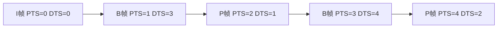
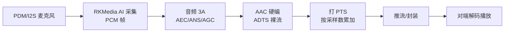

前几篇把视频的编码与封装讲透了，但一套完整的 IPC/对讲产品里，**音频和视频必须同步**：画面里的人开口说话，声音不能慢半拍。这一篇把音频的压缩编码（AAC/Opus）、容器封装（ADTS/MP4）、以及**音视频同步的核心机制 PTS/DTS/时间基**讲透，并给出可照抄的 FFmpeg 双轨实验（命令 + C API 片段），让你真正理解"声画同步"是怎么实现的。

**双轨对照**：PC 端用 FFmpeg 命令和 C API 做音频编码/封装/同步实验；板端 RKMedia 的音频采集→AAC 编码链路复用同一套时间戳思想。

## 一、为什么要编码音频：PCM 数据量也不小

**定义**：PCM（Pulse-Code Modulation，脉冲编码调制）= 把模拟声音按固定间隔采样、量化成数字信号的原始格式。**PCM 就是音频的"RAW"**——未经压缩，音质最好但体积最大。

**先算账**：

```
CD 音质：44.1kHz × 16bit × 2 声道 = 1411.2 kbps ≈ 176 KB/s
一小时 ≈ 635 MB
电话音质（8kHz × 16bit × 1 声道）= 128 kbps
```

**类比**：PCM 像"逐字抄写的会议记录"，一字不差但太占地方；编码器像"会议纪要员"——保留所有关键信息，去掉废话和冗余，体积能缩小 10~20 倍。

**三大音频冗余**：

| 冗余 | 说明 | 编码手段 |
|:---|:---|:---|
| 时域冗余 | 相邻采样高度相关（声音是连续波） | 预测编码（DPCM 类） |
| 频域冗余 | 人耳不敏感的频率成分 | 心理声学模型（掩蔽效应） |
| 声道冗余 | 左右声道内容相似 | 联合立体声（M/S、强度编码） |

**人耳掩蔽效应（关键概念）**：一个响的声音会"遮住"旁边弱的声音——编码器把被掩蔽的弱信号直接丢弃，人耳完全听不出来。**这就是 AAC/MP3 能压到 1/10 而无损感知的根本原因**。

## 二、AAC 与 Opus：两大主流编码器

### 2.1 AAC（Advanced Audio Coding）

**定义**：AAC 是 MPEG 家族的有损音频编码标准，是 H.264 视频的"官方搭档"，也是 mp4 容器里最通用的音频格式。

**特性**：
- 采样率支持广（8kHz~96kHz），声道 1~48；
- 码率效率好：128kbps 双声道已接近"人耳难辨"级别；
- **ADTS 封装**（裸流传输用）：每帧带 7 字节头部，含采样率/声道/帧长——**流式传输不需要容器也能解析**；
- **LATM/LOAS**：另一种裸流封装（广电/部分播放器用）。

**常用档位**：

| Profile | 用途 | 码率参考 |
|:---|:---|:---|
| AAC-LC | 最通用，兼容性最好 | 128kbps（双声道） |
| HE-AAC（AAC+） | 低码率流媒体 | 32~64kbps |
| HE-AAC v2 | 极低码率 | 16~32kbps |

### 2.2 Opus

**定义**：Opus 是 IETF 标准化的开源有损音频编码，**语音+音乐通吃**，延迟极低（5~65ms），是 WebRTC/实时通话的事实标准。

**特性**：
- 码率范围 6kbps~510kbps，**6kbps 还能听清说话**（语音编码极限）；
- 低延迟：算法延迟最低 5ms（AAC 通常 20~50ms）；
- 内置语音/音乐模式自动切换；
- 容器：Ogg/WebM/MP4（mp4 支持有限），裸流用 `-f opus`。

**AAC vs Opus 怎么选**：

| 场景 | 推荐 | 原因 |
|:---|:---|:---|
| mp4 存档/平台兼容 | AAC | 播放器生态最广 |
| 实时通话/对讲 | Opus | 低延迟 + 抗丢包 |
| 低码率语音 | Opus | 6~16kbps 可用 |
| 板端硬编音频 | AAC（RKMedia 常见） | 硬件编码器支持 |

## 三、ADTS 封装：裸 AAC 流的"帧头"

**定义**：ADTS（Audio Data Transport Stream）是 AAC 裸流的封装格式——每个 AAC 帧前面加 **7 字节（或 9 字节）ADTS 头**，说明采样率、声道、帧长等，让解码器不用知道容器信息也能逐帧解析。

**类比**：ADTS 头 = 快递单。没有快递单（裸 AAC 帧）你也能拆包看内容，但不知道包裹大小、从哪里来；贴了快递单（ADTS 头），接收端看一眼就能处理。

**ADTS 头关键字段**（7 字节）：

| 位 | 字段 | 说明 |
|:---|:---|:---|
| 12 bit | syncword | 固定 0xFFF（帧同步标志） |
| 1 bit | ID | MPEG 版本（0=MPEG-4） |
| 2 bit | layer | 固定 00 |
| 1 bit | protection_absent | 1=无 CRC |
| 2 bit | profile | AAC-LC=01 |
| 4 bit | sampling_frequency_index | 采样率索引（4=44.1kHz） |
| 1 bit | private_bit | 0 |
| 3 bit | channel_configuration | 声道数（2=立体声） |
| 13 bit | frame_length | 本帧总长度（含头） |
| 11 bit | buffer_fullness | 0x7FF（VBR） |
| 2 bit | number_of_raw_data_blocks | 0 |

**用 FFmpeg 看 ADTS 流**：

```bash
# 生成 AAC ADTS 裸流
ffmpeg -f lavfi -i "sine=frequency=440:duration=5" -c:a aac -b:a 128k out.aac
# 查看前几字节的 ADTS 头
xxd out.aac | head -n 2
# 用 ffprobe 确认是 ADTS 容器
ffprobe -v error -show_entries format=format_name out.aac
# 输出: format_name=aac (ADTS)
```

**为什么 ADTS 重要**：RKMedia 硬编 AAC 输出就是 ADTS 裸流（或 RAW），推流时**必须保证每帧带 ADTS 头**，否则客户端解码器无法定位帧边界。这是对讲产品最常见的坑之一。

## 四、PTS/DTS：音视频同步的根基

### 4.1 三个时间概念

**定义**：
- **PTS（Presentation Time Stamp，显示时间戳）**：这一帧**什么时候该被显示/播放**；
- **DTS（Decoding Time Stamp，解码时间戳）**：这一帧**什么时候该被解码**；
- **time_base（时间基）**：时间戳的"刻度单位"，如 1/90000 秒（MPEG 标准）、1/1000 秒。

**类比**：DTS 是"厨房出菜顺序"，PTS 是"上桌顺序"。厨师（解码器）可能先做好第 3 道菜（因为第 3 道菜的原料要先处理），但服务员（播放器）必须按 1、2、3 的顺序端上桌——**B 帧的存在让解码顺序 ≠ 显示顺序**。



### 4.2 为什么要有 DTS

视频编码里有 **B 帧（双向预测帧）**：它同时参考前面和后面的帧，所以**解码时必须等后一帧到达**。于是解码顺序被打乱：

```
码流顺序（DTS）：0, 1, 2, 3, 4
显示顺序（PTS）：0, 2, 1, 4, 3   ← B 帧插到中间
```

**没有 PTS 会怎样**：播放器只能按码流顺序播放，B 帧会乱序显示——画面"跳帧、回放"。

**没有 DTS 会怎样**：解码器不知道先解哪一帧，缓冲管理失效。

**容器的作用**：mp4 等容器在**每个 sample（帧）上记录 PTS/DTS**（mp4 的 stts/stss/stsc 表），解码器拿到就能正确排列。

### 4.3 时间基与换算

**为什么需要 time_base**：不同环节用不同刻度。FFmpeg 里：
- 解码器输出帧的 `pts` 单位 = 解码器的 `time_base`（如 1/15360）；
- 编码器输入帧的 `pts` 单位 = 编码器的 `time_base`（如 1/30 秒）；
- 容器里存的 pts 单位 = 流自己的 `time_base`。

**换算必须用 `av_rescale_q`**（不能直接乘除，避免溢出）：

```c
int64_t new_pts = av_rescale_q(old_pts, src_tb, dst_tb);
```

**FFmpeg 命令里也一样**：

```bash
# 音频转 44.1kHz、视频 30fps，自动处理时间基
ffmpeg -i in.mp4 -c:v libx264 -r 30 -c:a aac -ar 44100 -ac 2 out.mp4
# 查看每帧 PTS/DTS
ffprobe -v error -select_streams v:0 -show_entries frame=pts_time,dts_time,pict_type out.mp4 | head -n 20
```

**输出样例**：

```
frame: pts_time=0.000000  dts_time=0.000000  pict_type=I
frame: pts_time=0.066667  dts_time=0.066667  pict_type=P   ← 0.0667s = 2/30
frame: pts_time=0.033333  dts_time=0.133333  pict_type=B   ← PTS < DTS，B 帧特征！
```

## 五、完整音频封装实验（命令双轨）

### 5.1 生成并检查音频

```bash
# 生成 5 秒 440Hz 正弦波测试音频
ffmpeg -f lavfi -i "sine=frequency=440:duration=5" -c:a pcm_s16le test.wav
ffprobe test.wav
# 输出关键信息：sample_rate=44100, channels=1, sample_fmt=s16
```

### 5.2 编码成 AAC（两种容器）

```bash
# 封装进 mp4（带 moov，适合文件）
ffmpeg -i test.wav -c:a aac -b:a 128k test_aac.mp4
# 输出裸 ADTS 流（适合流式传输）
ffmpeg -i test.wav -c:a aac -b:a 128k -f adts test_aac.aac
# 对比两者大小与结构
ls -la test_aac.mp4 test_aac.aac
ffprobe -v error -show_entries format=format_name test_aac.aac
```

### 5.3 音视频合成与同步

```bash
# 生成 10 秒测试视频 + 混入音频
ffmpeg -f lavfi -i "testsrc2=size=640x360:rate=30:duration=10" \
       -f lavfi -i "sine=frequency=880:duration=10" \
       -c:v libx264 -preset ultrafast -c:a aac -b:a 96k \
       -shortest av_sync.mp4
# 验证声画时间轴
ffprobe -v error -show_entries stream=codec_type,duration,time_base av_sync.mp4
```

**注意 `-shortest`**：当视频和音频时长不一致时，`-shortest` 让输出在**最短的流结束时就停止**——否则长的流会"拖尾"。

### 5.4 偏移实验：理解 A/V 偏移

```bash
# 音频延迟 1 秒（itsoffset 输入侧偏移）
ffmpeg -i video.mp4 -itsoffset 1 -i audio.wav \
       -map 0:v -map 1:a -c:v copy -c:a aac -shortest offset.mp4
# 用 ffprobe 对比音视频起始 pts_time，验证偏移
ffprobe -v error -select_streams a:0 -show_entries frame=pts_time offset.mp4 | head -n 3
ffprobe -v error -select_streams v:0 -show_entries frame=pts_time offset.mp4 | head -n 3
```

**结论**：如果音频第一帧 pts_time ≈ 1.0s 而视频从 0 开始，就是"音频晚 1 秒"。**这就是声画不同步的直接观察法**。

## 六、C API 片段：音频编码 + 封装（可照抄）

下面片段演示：**从 WAV 读 PCM → AAC 编码 → 写 ADTS 文件**。核心是时间基与帧长度计算。

```c
#include <stdio.h>
#include <libavformat/avformat.h>
#include <libavcodec/avcodec.h>
#include <libavutil/opt.h>

int main(int argc, char **argv) {
    AVFormatContext *ifmt = NULL, *ofmt = NULL;
    AVCodecContext *dec = NULL, *enc = NULL;
    const AVCodec *codec;
    AVStream *in_st, *out_st;
    AVPacket *pkt = av_packet_alloc();
    AVFrame *frame = av_frame_alloc();
    int ret, stream_idx;
    int64_t next_pts = 0;

    if (argc < 3) { fprintf(stderr, "usage: %s in.wav out.aac\n", argv[0]); return 1; }

    /* 1. 打开输入 */
    avformat_open_input(&ifmt, argv[1], NULL, NULL);
    avformat_find_stream_info(ifmt, NULL);
    stream_idx = av_find_best_stream(ifmt, AVMEDIA_TYPE_AUDIO, -1, -1, NULL, 0);
    in_st = ifmt->streams[stream_idx];

    /* 2. 打开 PCM 解码器（WAV 一般是 pcm_s16le，解码=直接读） */
    codec = avcodec_find_decoder(in_st->codecpar->codec_id);
    dec = avcodec_alloc_context3(codec);
    avcodec_parameters_to_context(dec, in_st->codecpar);
    avcodec_open2(dec, codec, NULL);

    /* 3. 创建 AAC 编码器 */
    codec = avcodec_find_encoder(AV_CODEC_ID_AAC);
    enc = avcodec_alloc_context3(codec);
    enc->sample_fmt = AV_SAMPLE_FMT_FLTP;      /* AAC 需要浮点 planar */
    enc->sample_rate = 44100;
    enc->channel_layout = AV_CH_LAYOUT_STEREO;
    enc->channels = 2;
    enc->bit_rate = 128000;
    av_opt_set(enc->priv_data, "profile", "aac_low", 0);
    ret = avcodec_open2(enc, codec, NULL);
    if (ret < 0) { char e[128]; av_strerror(ret, e, sizeof(e)); fprintf(stderr, "enc open: %s\n", e); return 1; }

    /* 4. 创建输出文件（ADTS 裸流） */
    avformat_alloc_output_context2(&ofmt, NULL, "aac", argv[2]);
    out_st = avformat_new_stream(ofmt, NULL);
    avcodec_parameters_from_context(out_st->codecpar, enc);
    out_st->time_base = (AVRational){1, enc->sample_rate};
    avio_open(&ofmt->pb, argv[2], AVIO_FLAG_WRITE);

    /* 5. 主循环：读 PCM 包 → 解码 → 编码 → 写 ADTS */
    while (av_read_frame(ifmt, pkt) >= 0) {
        if (pkt->stream_index == stream_idx) {
            avcodec_send_packet(dec, pkt);
            av_packet_unref(pkt);
            while (avcodec_receive_frame(dec, frame) == 0) {
                /* 重设 PTS（PCM 采样数 / 采样率） */
                frame->pts = next_pts;
                next_pts += frame->nb_samples;

                avcodec_send_frame(enc, frame);
                av_frame_unref(frame);
                while (avcodec_receive_packet(enc, pkt) == 0) {
                    /* ADTS 裸流：时间基直接用 1/采样率 */
                    pkt->pts = pkt->dts = next_pts - 1024; /* AAC 一帧 1024 采样 */
                    av_packet_rescale_ts(pkt, (AVRational){1, enc->sample_rate},
                                         out_st->time_base);
                    av_interleaved_write_frame(ofmt, pkt);
                    av_packet_unref(pkt);
                }
            }
        }
    }
    /* flush */
    avcodec_send_frame(enc, NULL);
    while (avcodec_receive_packet(enc, pkt) == 0) {
        av_interleaved_write_frame(ofmt, pkt);
        av_packet_unref(pkt);
    }
    av_write_trailer(ofmt);

    printf("done: %s\n", argv[2]);
    av_packet_free(&pkt);
    av_frame_free(&frame);
    avcodec_free_context(&dec);
    avcodec_free_context(&enc);
    avformat_close_input(&ifmt);
    if (ofmt->pb) avio_closep(&ofmt->pb);
    avformat_free_context(ofmt);
    return 0;
}
```

**关键点**：
- **AAC 编码器要 FLTP（浮点 planar）**，WAV 通常是 S16（整数交错）——所以要先 `avcodec_open2` 解码器转格式（FFmpeg 内部自动 swr 转换，或你手动 `swr_convert`）；
- **AAC 一帧固定 1024 个采样**：44.1kHz 下每帧 23.2ms，PTS 步进 = 1024/44100 ≈ 0.0232s；
- **ADTS 裸流没有容器头**，所以输出文件用 `-f adts` 等价（`avformat_alloc_output_context2` 指定 `"aac"`）。

**编译运行**：

```bash
gcc -o wav2aac wav2aac.c $(pkg-config --cflags --libs libavformat libavcodec libavutil) -lm
ffmpeg -f lavfi -i "sine=frequency=440:duration=5" -c:a pcm_s16le test.wav
./wav2aac test.wav out.aac
ffplay out.aac   # 应该听到 440Hz 蜂鸣
```

## 七、板端联动：RKMedia 音频采集→编码链路



**板端 PTS 规则（重要）**：音频 PTS 不按帧序号算，而是按**累计采样数 / 采样率**算——采集了 44100 个采样就是过了 1 秒：

```
pts_us = (累计采样数) * 1e6 / sample_rate
```

**为什么音频 PTS 必须精确**：视频编码器的 PTS 由帧率决定（每 1/30 秒一帧），音频的 PTS 由采样计数决定（每 1024 采样一帧）。**两者用同一个时钟（通常是系统单调时钟）打点，播放端才能对齐**。常见问题：

| 症状 | 原因 | 对策 |
|:---|:---|:---|
| 声画不同步，越到后面越明显 | 音频 PTS 用帧号而非采样数累加 | 改用采样累计计数 |
| 声音开头发闷/丢字 | ADTS 头缺失，解码器错位 | 每帧补 7 字节 ADTS 头 |
| 播放器不出声 | 采样率/声道与容器不一致 | ffprobe 核对 stream 参数 |
| 对讲回声 | AEC 未开或参考信号错误 | 检查音频 3A 配置（前一篇内容） |
| 音画差几百 ms | 缓冲策略不同 | 播放端按 PTS 对齐，不按到达顺序 |

## 八、动手练习

1. 用 `sine` 生成 5 秒测试音频，分别编码成 mp4 和 ADTS 裸流，对比文件结构与大小
2. 用 `xxd` 查看 ADTS 头，对照字段表手工解析 syncword/采样率/帧长
3. 用 `-itsoffset` 制造音频延迟 1 秒，再用 ffprobe 验证两个流起始 pts_time 的差值
4. 编译运行 wav2aac.c，用 ffplay 验证输出可播放
5. 修改 wav2aac.c：把输出改成 mp4 容器（`avformat_alloc_output_context2` 用 "mp4"），对比时间基差异
6. 用 Opus 编码同一 WAV（`-c:a libopus`，需安装 libopus），对比码率与音质（6kbps 极限测试）
7. 录制一段真实语音（麦克风），跑完整音频编码链路，检查 ADTS 流可播放

## 里程碑

- [ ] 能解释 AAC 与 Opus 的适用场景与选择依据
- [ ] 能说出 ADTS 头的作用与关键字段
- [ ] 能解释 PTS/DTS 的区别，以及 B 帧为什么需要 DTS
- [ ] 能解释 time_base 与 av_rescale_q 的必要性
- [ ] 能理解音频 PTS 应按累计采样数计算，而非帧序号
- [ ] 能独立完成 PCM → AAC → ADTS/MP4 的编码封装管线
- [ ] 能用 ffprobe 检查声画同步状态并定位偏移
- [ ] 能排查板端"不出声/声画不同步/回声"三类常见问题

> 🏷️ 标签：音频编码 · AAC · Opus · ADTS · PTS · DTS · 时间基 · 音视频同步 · PCM · 心理声学 · 掩蔽效应 · FFmpeg · RKMedia · 对讲 · 音视频
