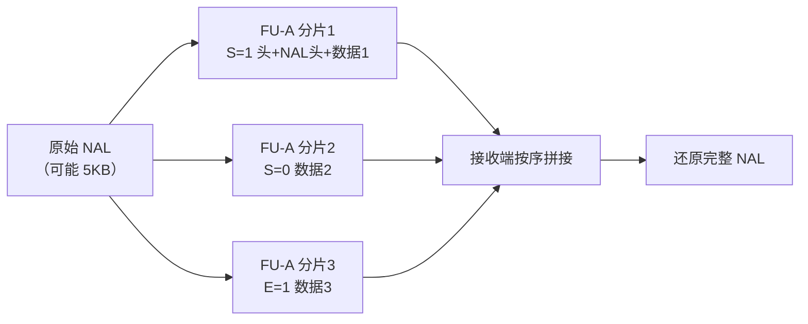
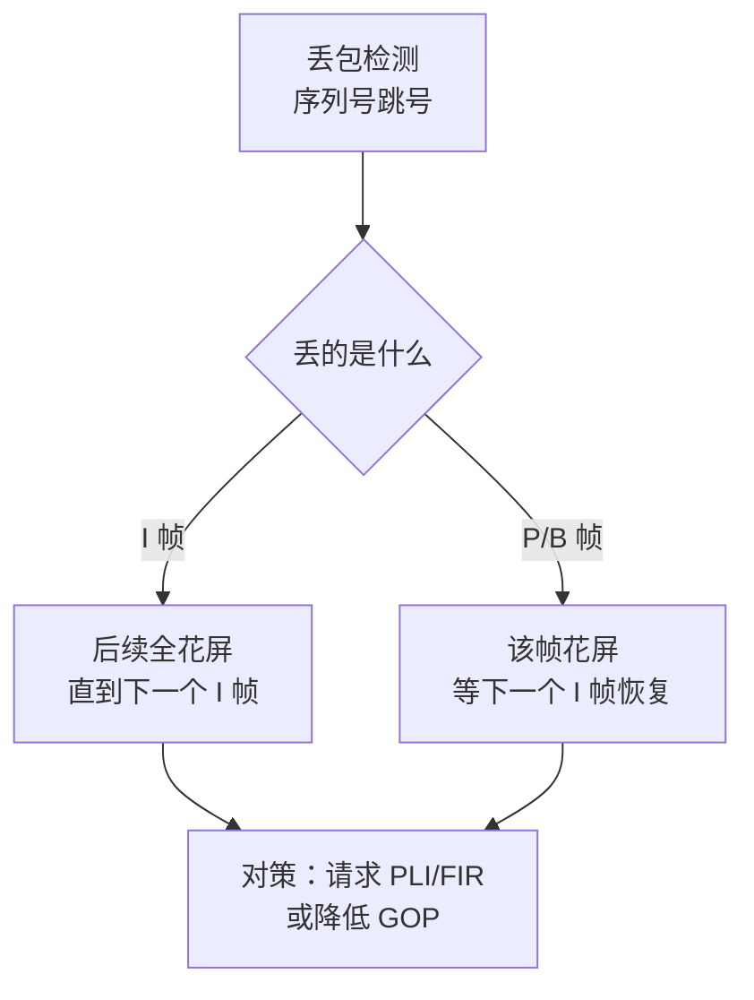
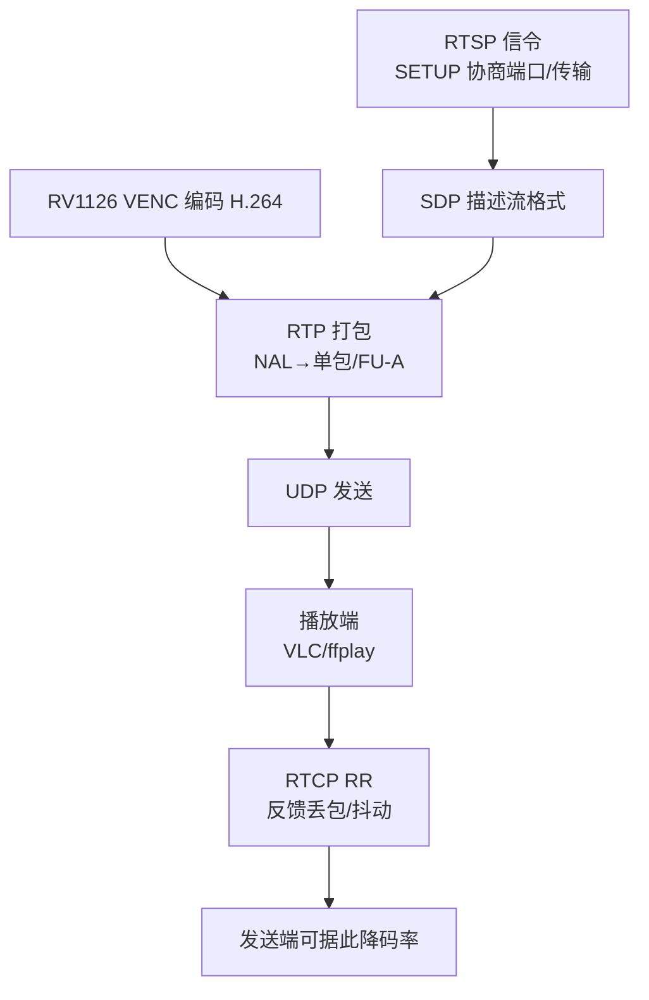

视频编好码、封装成流，下一步就是把它送到网络上。局域网内直接 UDP 裸推也能看，但**跨网络、有抖动、有丢包**时，裸 UDP 很快会花屏、卡顿。真正的流媒体系统用 **RTP（实时传输协议）** 承载媒体数据，用 **RTCP** 反馈质量。这一篇把 RTP/RTCP 讲透：**RTP 头结构、负载格式、时间戳、序列号、RTCP 反馈、抖动与丢包、Wireshark 抓包分析**，每个概念配可复现实验。

**双轨对照**：PC 端用 FFmpeg + Wireshark 抓包观察 RTP 流；板端 RTSP 推流时，理解这些字段是排查"为什么卡/为什么花屏"的基础。

## 一、RTP 是什么：媒体数据的"实时快递"

**定义**：RTP（Real-time Transport Protocol，实时传输协议）是 IETF 定义的承载音视频数据的传输协议（RFC 3550），运行在 UDP 之上，**只负责"运数据"**，不保证可靠（丢包靠上层处理），但保证**数据有序、带时间戳**。

**类比**：RTP 像快递物流里的"时效件专线"。普通 UDP 是"扔包裹"（丢了就丢了、到了就拆），RTP 在包裹上贴了**编号（序列号）**和**发货时间（时间戳）**——即使包裹乱序到达，收件人也能按编号重排、按时间戳按时播放。但 RTP 不负责"包裹丢了补发"（那是 TCP/重传的事）。

**关键认知：RTP ≠ TCP/UDP 的替代品**。RTP 运行在 UDP 之上，只做"实时数据搬运 + 排序/时间信息"：

```
应用层：H.264 码流 → RTP 打包 → UDP 封装 → IP → 网卡
                                    ↑
                    RTP 和 UDP 都在这一层合作
```

**为什么不用 TCP**：TCP 有重传和拥塞控制，丢包就停下来重传，实时性无法保证（视频会议里 100ms 延迟 vs 重传等待）。RTP/UDP 牺牲可靠性换实时性——**丢了就丢了，下一帧补上**。

## 二、RTP 包结构：读懂 12 字节头

**定义**：RTP 固定头 12 字节（无扩展时），后面是负载（媒体数据）。

```
 0                   1                   2                   3
 0 1 2 3 4 5 6 7 8 9 0 1 2 3 4 5 6 7 8 9 0 1 2 3 4 5 6 7 8 9 0 1
+-+-+-+-+-+-+-+-+-+-+-+-+-+-+-+-+-+-+-+-+-+-+-+-+-+-+-+-+-+-+-+-+
|V=2|P|X|  CC   |M|     PT      |       sequence number         |
+-+-+-+-+-+-+-+-+-+-+-+-+-+-+-+-+-+-+-+-+-+-+-+-+-+-+-+-+-+-+-+-+
|                           timestamp                           |
+-+-+-+-+-+-+-+-+-+-+-+-+-+-+-+-+-+-+-+-+-+-+-+-+-+-+-+-+-+-+-+-+
|           synchronization source (SSRC) identifier            |
+=+=+=+=+=+=+=+=+=+=+=+=+=+=+=+=+=+=+=+=+=+=+=+=+=+=+=+=+=+=+=+=+
|            contributing source (CSRC) identifiers             |
|                             ....                              |
+-+-+-+-+-+-+-+-+-+-+-+-+-+-+-+-+-+-+-+-+-+-+-+-+-+-+-+-+-+-+-+-+
```

**字段速查**：

| 字段 | 位数 | 含义 | 类比 |
|:---|:---:|:---|:---|
| V | 2 | 版本号，固定 2 | 快递单版本 |
| P | 1 | 填充标志（尾部有填充字节） | 加塞保护 |
| X | 1 | 扩展头标志 | 是否附带增值服务 |
| CC | 4 | CSRC 个数（混音用） | 参与方数量 |
| M | 1 | 标记位（视频常用作"帧边界"，音频常用作"讲话开始"） | "这一包是某帧的最后一包" |
| PT | 7 | 负载类型（96=动态 H.264，8=PCMU 音频） | 包裹类型 |
| sequence number | 16 | 包序号，每发一包 +1 | 包裹编号 |
| timestamp | 32 | 采样时间戳，单位由采样率决定 | 发货时间 |
| SSRC | 32 | 同步源标识（同一流的唯一 ID） | 寄件人 ID |

**三个最关键的字段**：
1. **sequence number（序列号）**：每发一个 RTP 包 +1。接收端用它**检测丢包**（发现跳号 = 丢包）、**重排序**（乱序到达按序号排好）。
2. **timestamp（时间戳）**：这一包数据**第一个采样的时刻**。单位不是秒，而是**采样周期**——视频常用 90kHz 时钟（1 秒 = 90000 个 tick），音频用采样率（8kHz 语音 = 1 秒 8000 tick）。播放端靠时间戳**恢复播放节奏**。
3. **SSRC**：同一媒体流所有包的固定 ID。多路流（视频/音频/多摄像头）靠 SSRC 区分。

**为什么视频时间戳用 90kHz**：这是 MPEG 时代定下的行业惯例——90kHz 是 30fps、25fps、24fps 的最小公倍数，各种帧率都能用整数 tick 表示。**一帧 30fps 视频的时间戳步进 = 90000/30 = 3000 tick**。

## 三、H.264 的 RTP 封装：NAL 单元怎么打包

**定义**：H.264 码流由 NAL 单元（Network Abstraction Layer Unit，网络抽象层单元）组成。每个 NAL 单元有 1 字节头（含 type），RTP 按 NAL 单元打包，有三种模式：

| 模式 | 适用 | 说明 |
|:---|:---|:---|
| **单 NAL 单元包（STAP-A 单包）** | NAL 较小 | 一个 NAL 装一个 RTP 包 |
| **分片单元（FU-A）** | NAL 较大 | 一个 NAL 拆成多个 RTP 包 |
| **聚合包（STAP-A 聚合）** | 多个小 NAL（如 SPS/PPS） | 多个 NAL 合并一个 RTP 包 |

**H.264 NAL 头**（1 字节）：

```
+---------------+
|0|1|2|3|4|5|6|7|
+-+-+-+-+-+-+-+-+
|F|NRI|  Type   |
+---------------+
F    = forbidden_zero_bit（0）
NRI  = nal_ref_idc（重要性，越高越关键）
Type = 负载类型（7=SPS，8=PPS，5=IDR，1=非 IDR 片）
```

**FU-A 分片**：当 NAL 单元太大（超过 MTU 1500 字节）时拆包：

```
FU indicator (1B): F NRI Type=28(FU-A)
FU header    (1B): S(起始) E(结束) R  Type(原 NAL 类型)
负载：原始 NAL 数据的分片
```

- **S=1 的包**：分片开始；
- **E=1 的包**：分片结束；
- 中间包 S=0 E=0；
- **接收端拼接**：把 S 到 E 之间的负载按序拼回原始 NAL。



**为什么关键**：调试"画面花屏但声音正常"时，最常见原因就是**分片单元不完整**——接收端拼接失败丢了一帧。看到 FU-A 的 S/E 位不连续，就知道网络丢包了。

## 四、RTCP：传输质量的心跳反馈

**定义**：RTCP（RTP Control Protocol，RTP 控制协议）与 RTP 配套，周期性发送控制报文，**报告收发统计**（丢包率、抖动、往返时间），让发送端知道网络质量，从而调整码率/帧率。

**类比**：RTP 是"发货"，RTCP 是"签收回执"。快递公司每隔一段时间收到回执："最近 100 件包裹丢了 3 件、平均延迟 50ms"——据此决定要不要降速、加车。

**RTCP 五种报文类型**：

| 类型 | 名称 | 作用 |
|:---|:---|:---|
| SR | Sender Report | 发送端报告（含发送统计+时钟关系） |
| RR | Receiver Report | 接收端报告（丢包率、抖动、往返时间） |
| SDES | Source Description | 源描述（CNAME 等） |
| BYE | Goodbye | 结束会话 |
| APP | Application | 应用自定义 |

**接收端报告（RR）关键字段**：
- **fraction lost（丢包率）**：自上次报告以来的丢包比例（0~1/256）；
- **cumulative lost（累计丢包数）**；
- **interarrival jitter（到达间隔抖动）**：包间隔的变化程度（毫秒/采样单位）；
- **LSR/DLSR**：用于计算 RTT（往返时间）。

**RTCP 发送周期**：默认**带宽的 5%** 用于 RTCP（通常每 1~5 秒发一次），发送端 SR 和接收端 RR 交替。

**在流媒体里的实际作用**：
- 发送端根据 RR 的丢包率**动态降码率**（智能码率控制）；
- 播放端根据 RTCP 估算**网络 RTT**，用于缓冲决策；
- 调试时看 RTCP 报告 = 直接看网络质量数字。

## 五、抖动与丢包：实时传输的两大天敌

### 5.1 抖动（Jitter）

**定义**：抖动 = 数据包**到达间隔**的波动。发送端每 33ms 发一包，网络拥塞时可能变成 10ms、80ms、20ms……接收端看到的"忽快忽慢"就是抖动。

**类比**：公交车时刻表说 10 分钟一班，但实际有时候 3 分钟来一趟、有时候 20 分钟——乘客（播放器）不能按固定节奏安排行程，需要"提前出门"（缓冲）。

**计算**（RFC 3550 的抖动公式，指数平滑）：

```
J(i) = J(i-1) + ( |D(i-1,i)| - J(i-1) ) / 16
D(i-1,i) = (RTP时间戳差) - (到达时间差)
```

**工程上直接看**：用 Wireshark 的 `rtp.jitter` 字段，或 ffplay 的统计输出。

### 5.2 丢包（Packet Loss）

**定义**：丢包 = 某些 RTP 包在网络上丢失。检测方法：**序列号跳号**——收到 100、101、103，说明 102 丢了。

**丢包对视频的影响**：
- 丢一个非关键帧（P/B 帧）→ 该帧花屏，下一关键帧（I 帧）恢复；
- 丢一个关键帧（I 帧）→ 后续所有帧都花屏，直到下一个 I 帧（GOP 越长影响越久）；
- 丢音频包 → 短暂杂音/中断。

**对策**：
- **前向纠错（FEC）**：发送冗余包，接收端用冗余恢复丢失包；
- **重传（NACK/RTX）**：接收端请求重传丢失包（WebRTC 用）；
- **关键帧请求（PLI/FIR）**：花屏严重时请求发送端立刻发一个 I 帧（RTSP/RTP 扩展常用）；
- **降低 GOP**：减小关键帧间隔，缩短花屏恢复时间。



### 5.3 抖动缓冲（Jitter Buffer）

**定义**：接收端在播放前先缓存一小段时间的数据，把"忽快忽慢"的到达平滑成均匀输出。

**类比**：瀑布的水流忽大忽小，但瀑布下的水潭（缓冲）让下游水流稳定——播放器从水潭取水（按时间戳播放），而不是直接从瀑布接水。

**参数**：
- **缓冲时长**：通常 50~200ms。太长 → 延迟大；太短 → 网络抖动时"断流"；
- **自适应抖动缓冲**：根据实时抖动动态调整缓冲深度（WebRTC 的 NetEQ 是典范）。

**权衡核心**：抖动缓冲 = **延迟 vs 流畅度的天平**。对讲/会议要低延迟（缓冲小），直播可接受稍高延迟（缓冲大）。

## 六、Wireshark 抓包分析：眼见为实

### 6.1 抓包实验

```bash
# 1. 用 FFmpeg 推一路 RTP（本地回环方便抓包）
ffmpeg -f lavfi -i "testsrc2=size=640x360:rate=30" -t 10 \
       -c:v libx264 -preset ultrafast -b:v 1M \
       -f rtp rtp://127.0.0.1:5004

# 2. 同时开 Wireshark，过滤 rtp
#    或者命令行 tshark 方式：
tshark -i lo -f "udp port 5004" -Y "rtp" -T fields \
       -e rtp.ssrc -e rtp.seq -e rtp.timestamp -e rtp.marker \
       -e rtp.payload_type | head -n 30
```

**预期输出**：

```
0x12345678  1    3000  0  96
0x12345678  2    3000  0  96
0x12345678  3    6000  1  96   ← marker=1，说明这一帧结束
0x12345678  4    6000  0  96
```

**观察点**：
- **SSRC 全部相同**：同一路流；
- **sequence 连续递增**：没有丢包；
- **timestamp 步进**：30fps 视频每帧 3000 tick（90000/30）——同一帧的多个分片共享相同 timestamp；
- **marker=1**：一帧的最后一个分片；
- **PT=96**：动态负载类型（H.264）。

### 6.2 制造丢包观察

```bash
# 用 tc 模拟 5% 丢包（Linux）
sudo tc qdisc add dev lo root netem loss 5%
# 再抓一次，观察 sequence 跳号
tshark -i lo -f "udp port 5004" -Y "rtp" -e rtp.seq | head -n 50
# 恢复
sudo tc qdisc del dev lo root netem loss 5%
```

**跳号观察**：`... 100, 101, 103, 104 ...`——102 丢了。**这就是丢包的直接证据**。

### 6.3 RTCP 观察

```bash
# 抓 RTCP（端口一般为 RTP 端口+1，或同端口）
tshark -i lo -f "udp port 5005" -Y "rtcp" -T fields \
       -e rtcp.ssrc -e rtcp.fraction_lost -e rtcp.cumulative_lost \
       -e rtcp.interarrival_jitter
```

**预期**：模拟丢包后，fraction_lost 变为非 0，jitter 值上升。

## 七、FFmpeg 里的 RTP 实践

```bash
# 推 RTP（裸 RTP，无 RTSP 信令）
ffmpeg -re -i input.mp4 -c:v copy -f rtp rtp://192.168.1.100:5004
# 同时输出 SDP 文件（接收端用它描述流）
ffmpeg -re -i input.mp4 -c:v copy -f rtp -sdp_file live.sdp rtp://127.0.0.1:5004
# 用 SDP 播放
ffplay -protocol_whitelist "file,udp,rtp" live.sdp
```

**SDP（Session Description Protocol）**：描述媒体会话的文本协议——包含媒体类型、编码、RTP 负载类型、端口、时钟等。**RTSP 的 DESCRIBE 响应、WebRTC 的 offer/answer 都基于 SDP**。

```sdp
v=0
o=- 0 0 IN IP4 127.0.0.1
s=No Name
c=IN IP4 127.0.0.1
t=0 0
m=video 5004 RTP/AVP 96
a=rtpmap:96 H264/90000
a=fmtp:96 packetization-mode=1;profile-level-id=64001f
```

**读 SDP 关键行**：
- `m=video 5004 RTP/AVP 96`：视频流，端口 5004，负载类型 96；
- `a=rtpmap:96 H264/90000`：96 = H.264，时钟 90000Hz；
- `a=fmtp:96 packetization-mode=1`：允许 FU-A 分片。

**没有 SDP，裸 RTP 无法解析**——接收端不知道负载类型和时钟。这就是为什么"裸 RTP 必须带 SDP"。

## 八、板端联动：RTSP 里 RTP 的角色



**板端常见问题排查（RTP 视角）**：

| 症状 | 可能原因 | 排查 |
|:---|:---|:---|
| VLC 能连但黑屏 | SDP 负载类型与 RTP 头 PT 不一致 | 抓包核对 PT 与 rtpmap |
| 画面间歇花屏 | 丢包（FU-A 分片丢失） | 抓包看 sequence 跳号 |
| 画面花屏不恢复 | I 帧丢失且 GOP 太长 | 降低 GOP/请求 PLI |
| 延迟越来越大 | 播放端缓冲过大 | 调小 jitter buffer |
| 声音正常画面卡 | 视频码率超带宽 | 降码率/帧率 |
| 连不上 RTSP | 端口/传输模式不匹配 | 核对 TCP/UDP 与端口 |

## 九、动手练习

1. 用 FFmpeg 推 RTP 到本地回环，Wireshark/tshark 抓包，对照本文字段表逐字段分析
2. 用 `tc` 模拟 5% 丢包，观察 sequence 跳号与 RTCP fraction_lost 变化
3. 用 `tc` 模拟抖动（`netem delay 100ms 20ms distribution normal`），观察 jitter 值
4. 解析 SDP 文件，说出流类型/端口/负载类型/时钟
5. 用 `-sdp_file` 生成 SDP 并用 ffplay 播放，验证裸 RTP 必须 SDP 才能播
6. 录制一段大分辨率视频（1080p 高码率），观察 FU-A 分片（同一 timestamp 多个 sequence）
7. 实验 GOP 对花屏恢复的影响：`-g 15` vs `-g 250`，模拟丢包观察恢复速度

## 里程碑

- [ ] 能说出 RTP 的定位（UDP 之上的实时搬运）与不用 TCP 的原因
- [ ] 能画出 RTP 固定头并解释 sequence/timestamp/SSRC/M/PT 五个关键字段
- [ ] 能解释 H.264 的 NAL 单元、STAP-A/FU-A 打包方式
- [ ] 能解释 RTCP 的作用与 SR/RR 报告的关键统计量
- [ ] 能解释抖动与丢包的区别、检测方法与对策
- [ ] 能理解抖动缓冲 = 延迟 vs 流畅度的权衡
- [ ] 能用 Wireshark 抓包验证序列号/时间戳/丢包/RTCP 统计
- [ ] 能读懂 SDP 的关键行，并解释裸 RTP 为什么必须带 SDP

> 🏷️ 标签：RTP · RTCP · UDP · 实时传输 · 序列号 · 时间戳 · SSRC · NAL · FU-A · SDP · 抖动 · 丢包 · Wireshark · 抓包 · 流媒体 · 音视频
