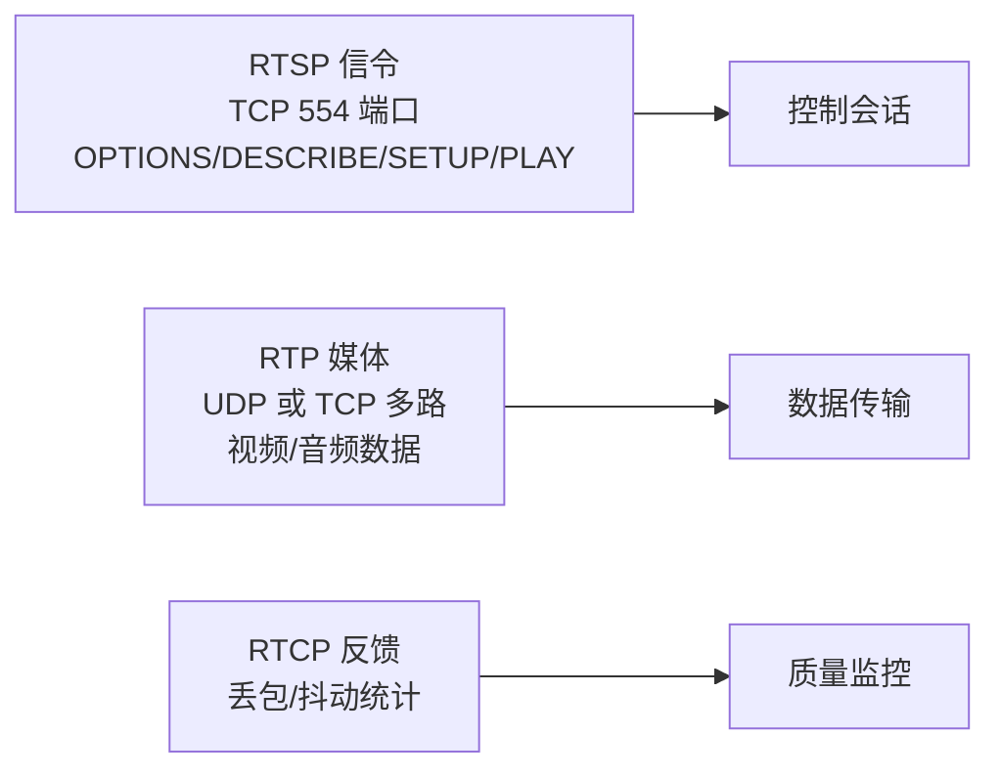
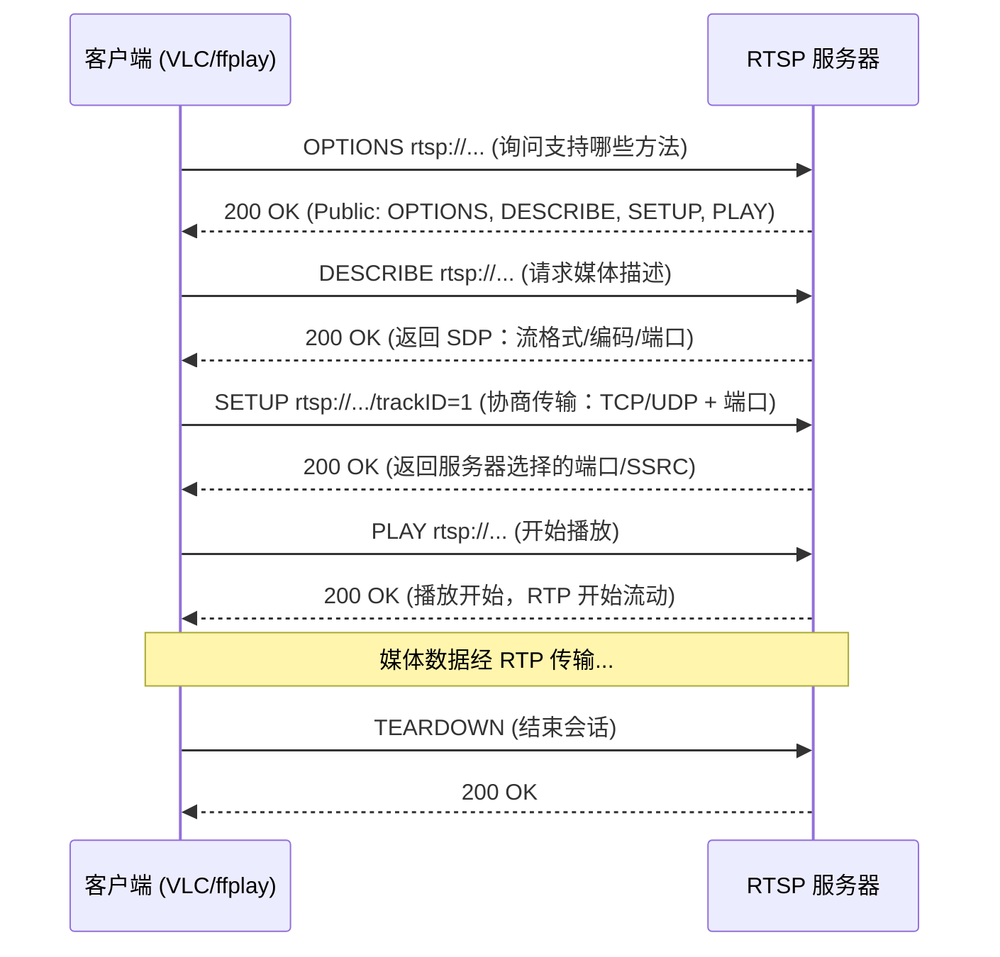
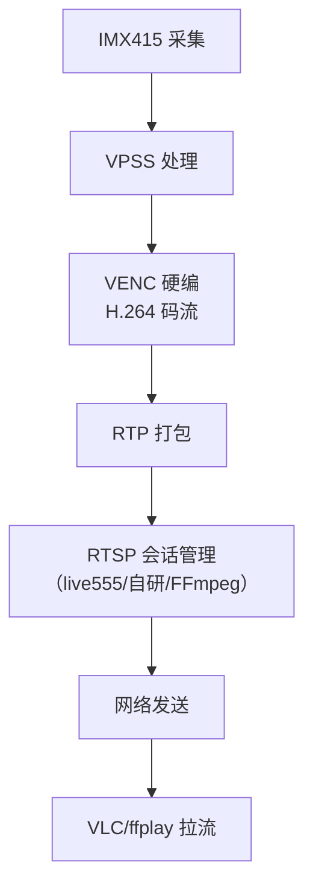

RTP 解决了"媒体数据怎么运"，但还差一个"怎么开始、怎么结束、怎么协商"的问题——播放器怎么知道看哪路流、用什么编码、走 TCP 还是 UDP？这就是 **RTSP（Real Time Streaming Protocol，实时流协议）** 的职责：**控制信令**。这一篇把 RTSP 讲透：**会话流程（OPTIONS/DESCRIBE/SETUP/PLAY）、与 RTP 的分工、TCP/UDP 传输模式、推流全链路、VLC/FFplay 拉流验证、常见问题排查**。

**双轨对照**：PC 端用 mediamtx + FFmpeg 搭一套 RTSP 服务并验证；板端 RV1126 把硬编流推到同一套服务，手机/PC 实时观看。

## 一、RTSP 是什么：流媒体的"遥控器"

**定义**：RTSP（RFC 7826，原 RFC 2326）是**应用层控制协议**，负责建立、控制、结束媒体会话：告诉服务器"我要看哪路流、用什么传输方式、开始播放/暂停/快进"。它**不传媒体数据**——媒体数据走 RTP。

**类比**：RTSP 是电视遥控器，RTP 是电视信号。遥控器只管"开机、换台、调音量"（控制信令），画面声音靠信号传输（RTP）。两者配合才有完整体验。

**关键认知：RTSP 与 HTTP 相似但不同**：
- 相似：都是文本协议，用请求/响应，有状态码（200 OK、404 等）；
- 不同：RTSP **有状态**（服务器记住你处于哪个阶段：INIT → READY → PLAYING）；HTTP 无状态。

**RTSP 典型端口**：554（默认）、8554（常见测试用）。

**RTSP 与 RTP/RTCP 的关系**：



## 二、RTSP 会话流程：四步握手

**标准流程**（客户端发起）：



### 2.1 OPTIONS：打个招呼

```
C->S: OPTIONS rtsp://127.0.0.1:8554/live RTSP/1.0
      CSeq: 1
      User-Agent: FFplay

S->C: RTSP/1.0 200 OK
      CSeq: 1
      Public: OPTIONS, DESCRIBE, SETUP, PLAY, TEARDOWN, PAUSE
```

**CSeq 是什么**：命令序号（CSequence）。客户端每次请求 +1，服务器响应里必须回同样的序号——**用于请求与响应配对**。调试时 CSeq 对不上 = 实现 bug。

### 2.2 DESCRIBE：要菜单

```
C->S: DESCRIBE rtsp://127.0.0.1:8554/live RTSP/1.0
      CSeq: 2
      Accept: application/sdp

S->C: RTSP/1.0 200 OK
      CSeq: 2
      Content-Type: application/sdp
      Content-Length: 132

      v=0
      o=- 0 0 IN IP4 127.0.0.1
      s=live
      c=IN IP4 0.0.0.0
      t=0 0
      m=video 0 RTP/AVP 96
      a=rtpmap:96 H264/90000
      a=fmtp:96 packetization-mode=1;profile-level-id=64001f
```

**关键**：DESCRIBE 返回 **SDP**——告诉客户端"这路流是 H.264 视频、负载类型 96、时钟 90000、允许分片"。客户端靠这个才知道怎么解析 RTP 负载。

### 2.3 SETUP：协商运输方式

```
C->S: SETUP rtsp://127.0.0.1:8554/live/trackID=1 RTSP/1.0
      CSeq: 3
      Transport: RTP/AVP/TCP;unicast;interleaved=0-1
      # 或 UDP 方式：
      # Transport: RTP/AVP/UDP;unicast;client_port=5004-5005

S->C: RTSP/1.0 200 OK
      CSeq: 3
      Session: 12345678
      Transport: RTP/AVP/TCP;unicast;interleaved=0-1
```

**Transport 头是核心协商内容**：
- **RTP/AVP/UDP**：RTP 走 UDP，客户端指定端口 `client_port=5004-5005`（5004=RTP，5005=RTCP）；
- **RTP/AVP/TCP**：RTP 走 TCP（**interleaved=0-1** 表示视频 RTP 数据交织在 RTSP TCP 连接的 0 通道，RTCP 走 1 通道）——穿越防火墙友好；
- **Session 头**：服务器分配会话 ID，后续请求都要带。

**TCP vs UDP 怎么选**：
- UDP：延迟低，适合局域网；
- TCP：能穿越 NAT/防火墙，互联网推流常用；但 TCP 重传会引入延迟。

### 2.4 PLAY：开播

```
C->S: PLAY rtsp://127.0.0.1:8554/live RTSP/1.0
      CSeq: 4
      Session: 12345678

S->C: RTSP/1.0 200 OK
      CSeq: 4
      Session: 12345678
      RTP-Info: url=rtsp://127.0.0.1:8554/live/trackID=1;seq=12345;rtptime=900000
```

**RTP-Info 里的 seq/rtptime 是播放起点**——客户端从这里开始收 RTP，seq 用于检测起始丢包，rtptime 是起始时间戳。

### 2.5 TEARDOWN：结束

```
C->S: TEARDOWN rtsp://127.0.0.1:8554/live RTSP/1.0
      CSeq: 5
      Session: 12345678
S->C: RTSP/1.0 200 OK
```

## 三、搭建 RTSP 服务：mediamtx（原 rtsp-simple-server）

**mediamtx** 是目前最流行的开源 RTSP/RTMP/WebRTC 媒体服务器，单二进制、配置简单，适合本地调试。

```bash
# 下载（Linux arm64 / amd64 均可）
wget https://github.com/bluenviron/mediamtx/releases/latest/download/mediamtx_v1.x.x_linux_arm64.tar.gz
tar xzf mediamtx_*.tar.gz
# 运行（默认端口 8554）
./mediamtx
# 验证
ss -lntp | grep 8554
```

**推流测试**：

```bash
# 推本地文件循环播放
ffmpeg -re -stream_loop -1 -i test.mp4 -c copy -f rtsp rtsp://127.0.0.1:8554/live
# 推测试视频源
ffmpeg -re -f lavfi -i "testsrc2=size=640x360:rate=30" -c:v libx264 -preset ultrafast \
       -tune zerolatency -b:v 1M -f rtsp rtsp://127.0.0.1:8554/live
```

**拉流验证**：

```bash
# FFplay 拉流
ffplay rtsp://127.0.0.1:8554/live
# FFmpeg 拉流存文件（同时验证可解）
ffmpeg -rtsp_transport tcp -i rtsp://127.0.0.1:8554/live -c copy pull.mp4
# VLC：打开网络串流，输入 rtsp://127.0.0.1:8554/live
```

**mediamtx 配置要点**（mediamtx.yml）：

```yaml
rtspAddress: :8554
# 鉴权（可选）
authMethods: [internal]
# 路径权限
paths:
  all:
    source: publisher   # 允许推流
    publishUser: admin
    publishPass: secret
```

## 四、完整推流全链路：FFmpeg 推 → 拉流分析

### 4.1 推流端常见参数

```bash
ffmpeg -re -i input.mp4 \
  -c:v libx264 -preset veryfast -tune zerolatency \
  -b:v 2M -maxrate 2.5M -bufsize 4M -g 30 \
  -c:a aac -b:a 128k -ar 44100 -ac 2 \
  -f rtsp -rtsp_transport tcp rtsp://127.0.0.1:8554/live
```

**参数解析**：
- `-re`：按真实时间读取（否则瞬间推完）；
- `-tune zerolatency`：低延迟编码；
- `-g 30`：每 30 帧一个关键帧（1 秒），客户端快速起播；
- `-rtsp_transport tcp`：RTP 走 TCP（mediamtx 默认支持）。

### 4.2 抓包观察 RTSP 信令

```bash
# 推流同时抓包（8554 是 RTSP，TCP 交织的 RTP 也在同端口）
tshark -i lo -f "tcp port 8554" -Y "rtsp" -e rtsp.method -e rtsp.code -e rtsp.cseq
```

**预期输出**（服务器收到推流端的请求）：

```
OPTIONS  200  1
DESCRIBE 200  2
SETUP    200  3
PLAY     200  4
```

**注意**：**推流端也走同样的 RTSP 握手**——推流器（FFmpeg）作为"客户端"向服务器发起 SETUP/PLAY，只是方向是"上传"。

### 4.3 拉流端观察

```bash
# 同时抓拉流端的包
tshark -i lo -f "tcp port 8554" -Y "rtsp" -e rtsp.method -e rtsp.code -e rtsp.cseq
```

**对比**：拉流端（VLC/ffplay）也是 OPTIONS→DESCRIBE→SETUP→PLAY，但**多了 TEARDOWN**（退出播放时）。

## 五、板端联动：RV1126 硬编流 → RTSP 推流



**三种板端实现路径**：

| 方案 | 优点 | 缺点 | 适合 |
|:---|:---|:---|:---|
| **live555**（开源 RTSP 库） | 成熟、资源占用小 | 学习曲线、C++ | 产品化 |
| **FFmpeg libavformat** | 代码少、与现有管线契合 | 灵活性低 | 快速实现 |
| **自研 RTSP** | 完全可控 | 工作量巨大 | 学习/定制 |

**live555 思路**：live555 的 `OnDemandServerMediaSubsession` 框架——你把 VENC 回调的 H.264 帧喂给它，它负责 RTP 打包和 RTSP 信令。典型代码骨架：

```cpp
// 伪代码：继承 MediaSubsession 提供帧
class H264FramedSource : public FramedSource {
    // 在 doGetNextFrame() 里从 VENC 回调队列取一帧
    // 填充 fTo/fMaxSize/fFrameSize，设置 fPresentationTime
};
// 创建 RTSP 服务器
RTSPServer::createNew(env, 8554);
// 把 H264FramedSource 注册为 "live" 路径
```

**FFmpeg 推流思路（板端）**：VENC 回调把码流写成文件/内存，然后 FFmpeg 读出来推 RTSP——开发快但多一次拷贝。

**板端推流的关键注意点**：
1. **SPS/PPS 必须随流发送**：RTSP 的 SDP 里用 `sprop-parameter-sets` 携带，或码流里周期发送。客户端没有 SPS/PPS 无法解码——**这是"VLC 能连上但黑屏"的第一原因**；
2. **时间戳必须单调**：VENC 回调的帧要打上正确的 PTS（前面讲过的 90kHz 时钟）；
3. **关键帧间隔**：`-g` 等价物——VENC 配置 GOP，建议 30~60 帧；
4. **带宽匹配**：码率超过网络带宽 → 卡顿花屏。

## 六、常见问题排查清单

| 症状 | 可能原因 | 排查手段 |
|:---|:---|:---|
| VLC 连接失败 | 服务器未启动/端口错 | `ss -lntp` 检查 8554 |
| 能连接但黑屏 | SPS/PPS 缺失 | 抓包看 SDP 的 sprop-parameter-sets |
| 能连接但不出声 | 音频流未加入/编码不支持 | 检查 SDP 是否有 m=audio |
| 画面卡顿 | 码率超带宽/网络差 | 降码率/帧率，抓包看丢包 |
| 延迟越来越大 | 播放端缓冲/编码缓冲 | 调 jitter buffer / zerolatency |
| 播放花屏 | 丢包或关键帧缺失 | 降低 GOP，检查网络 |
| 无法 TCP 拉流 | 服务器不支持 TCP 交织 | 配置 mediamtx 允许 tcp |
| 推流被拒 | 鉴权失败 | 检查 publishUser/pass |
| 播放几秒后断开 | 会话超时/服务器崩溃 | 看 mediamtx 日志 |

## 七、动手练习

1. 搭建 mediamtx，用 FFmpeg 推测试视频流，VLC/ffplay 拉流验证
2. 用 `-sdp_file` 输出 SDP，用 ffplay 播放裸 RTP，对比 RTSP 拉流的差异
3. 抓包分析一次完整 RTSP 会话（推流+拉流），对照本文字段表标出每一步
4. 分别用 `-rtsp_transport tcp` 和 udp 推流，对比延迟与抓包差异
5. 给 mediamtx 配置鉴权，验证推流/拉流都需要密码
6. 模拟丢包（`tc netem loss 10%`），观察拉流画面花屏与恢复时间
7. 如果有板子：VENC 硬编流 → live555/FFmpeg 推 RTSP，手机 VLC 观看，排查 SPS/PPS 问题
8. 修改 GOP（`-g 15` vs `-g 250`），对比加入直播的速度（黑屏时间）

## 里程碑

- [ ] 能画出 RTSP 四步握手流程并解释每步作用
- [ ] 能解释 RTSP 与 RTP/RTCP 的分工
- [ ] 能解释 Transport 头里 TCP/UDP 两种模式及选择依据
- [ ] 能解释 CSeq、Session、RTP-Info 等关键头字段
- [ ] 能搭建 mediamtx 并完成推流/拉流闭环
- [ ] 能读懂 SDP，并解释 SPS/PPS 对解码起播的重要性
- [ ] 能抓包分析 RTSP 信令，定位连接/黑屏/卡顿问题
- [ ] 能说清板端硬编流推 RTSP 的完整链路与关键注意点

> 🏷️ 标签：RTSP · RTP · 信令 · OPTIONS · DESCRIBE · SETUP · PLAY · TEARDOWN · SDP · mediamtx · 推流 · 拉流 · live555 · VLC · FFplay · 流媒体 · 音视频
