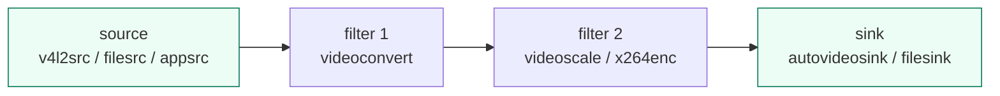

FFmpeg 是"一条命令/一套库解决一切"的瑞士军刀，但在**需要灵活组合、实时交互、长期运行**的多媒体系统里，GStreamer 是另一条主流路线：它是**基于插件的多媒体框架**，把功能拆成一个个 element（元素），用 pipeline（管道）像积木一样拼起来。这一篇把 GStreamer 核心概念讲透：**element/pad/pipeline/bin、caps 协商、常用插件、gst-launch 实战、从 v4l2src 到 RTSP 的完整链路**。

**双轨对照**：PC 端用 gst-launch 命令行搭各种 pipeline；板端 RV1126 用 GStreamer 接摄像头/硬编/推流（RK MPP 插件），同一套概念直接迁移。

## 一、GStreamer 是什么：多媒体的"乐高框架"

**定义**：GStreamer 是一个基于插件的开源多媒体框架（核心 C 语言 + 自动绑定多语言），把媒体处理抽象成**图（graph）**：数据从 source（源）流经多个 element（处理单元），到达 sink（出口）。每个 element 是一个**可复用插件**。

**类比**：GStreamer 是乐高积木。FFmpeg 是"买一个成品模型"（功能全但整体）；GStreamer 给你标准积木块（element），你可以任意拼装出**自定义流水线**——加一块、换一块、拆一块，都不影响其他部分。适合需要"运行时动态调整"的复杂系统。

**为什么嵌入式音视频系统爱用 GStreamer**：
- 模块化：加新格式/新硬件支持 = 加新插件，不用重编译整个应用；
- 零拷贝：支持 DMA-BUF 等内存共享，板端硬编硬解性能好；
- 动态可调：运行时改参数、改拓扑（热插拔摄像头、切换码率）；
- 生态：Rockchip/全志/海思都有官方 GStreamer 插件。

**GStreamer 数据流总览**：

【图1：GStreamer pipeline 数据流示意】



**安装**：

```bash
# Debian/Ubuntu
sudo apt install gstreamer1.0-tools gstreamer1.0-plugins-base \
                 gstreamer1.0-plugins-good gstreamer1.0-plugins-bad \
                 gstreamer1.0-plugins-ugly libgstreamer1.0-dev
# 验证
gst-launch-1.0 --version
gst-inspect-1.0 --version
```

**版本约定**：本系列以 GStreamer 1.24.x 为例（写作时较新稳定版），API 与 1.20/1.22 兼容。

## 二、核心概念：element / pad / bin / pipeline

### 2.1 Element（元素）：最小处理单元

**定义**：element 是 GStreamer 的基本积木，完成一件事：读取（source）、处理（filter）、输出（sink）。

**三类 element**：

| 类型 | 例子 | 作用 |
|:---|:---|:---|
| Source（源） | `v4l2src`、`filesrc`、`audiotestsrc` | 产生数据 |
| Filter（处理） | `videoconvert`、`videoscale`、`x264enc`、`capsfilter` | 转换/处理数据 |
| Sink（出口） | `autovideosink`、`filesink`、`rtmpsink` | 消费数据（显示/保存/发送） |

```bash
# 查看所有已安装的 element
gst-inspect-1.0 | head -n 30
# 查看单个 element 的详细能力（参数、支持的格式）
gst-inspect-1.0 x264enc
```

### 2.2 Pad（垫片）：连接点

**定义**：pad 是 element 的输入/输出接口。每个 element 至少一个 sink pad（输入）或 source pad（输出）。

**类比**：pad = 乐高积木的凸点/凹槽。积木之间靠凸凹配对连接，element 之间靠 pad 配对。

```bash
# 查看 element 的 pads
gst-inspect-1.0 videoconvert | grep -A 5 "Pad Templates"
```

### 2.3 Bin 与 Pipeline

**定义**：
- **bin**：装 element 的容器（盒子），可以嵌套；
- **pipeline**：顶级 bin，是整个图的根，提供播放/暂停/停止等控制。

**类比**：pipeline 是一整条生产线，bin 是生产线上的"车间"（把几个工位打包成一个模块），element 是单个工位。车间可以整体搬动、整体管理。

### 2.4 状态机：NULL → READY → PAUSED → PLAYING

每个 element 有 4 个状态，pipeline 控制整个图的状态：

| 状态 | 含义 | 类比 |
|:---|:---|:---|
| NULL | 未初始化 | 关机 |
| READY | 资源已打开（文件/设备句柄） | 通电待机 |
| PAUSED | 数据流已建立，但暂停流动 | 生产线空转 |
| PLAYING | 数据流动 | 开工生产 |

```bash
# 命令行控制状态
gst-launch-1.0 -v ...  # 运行时按 s 暂停、p 播放、q 退出
```

## 三、Caps（能力）：数据格式的"接洽规则"

**定义**：caps（capabilities）描述 pad 上流动的数据格式——媒体类型、分辨率、帧率、像素格式等。两个 pad 能否连接，取决于**双方 caps 是否有交集**。

**类比**：caps = 插头的规格。USB-C 插头必须配 USB-C 口——GStreamer 自动检查格式匹配，不匹配就**协商失败（not-negotiated）**。

**caps 例子**：

```
video/x-raw, format=(string)NV12, width=(int)1920, height=(int)1080, framerate=(fraction)30/1
audio/x-raw, format=(string)S16LE, rate=(int)48000, channels=(int)2
video/x-h264, stream-format=(string)avc, alignment=(string)au
```

**capsfilter 的用途**：强制某个 pad 的格式——让下游明确知道自己会收到什么：

```bash
gst-launch-1.0 videotestsrc ! "video/x-raw,width=640,height=360,framerate=30/1" ! autovideosink
```

**协商过程**：下游 element 提出"我能处理什么"，上游 element 选择交集。**GStreamer 会尝试自动插转换插件**（如 videoconvert），让格式匹配。

## 四、第一个 pipeline：gst-launch 语法

**gst-launch 语法**：用 `!` 连接 element，构成从左到右的数据流：

```
source ! element1 ! element2 ! sink
```

### 4.1 视频测试

```bash
# 测试视频源 → 显示（最简单的 pipeline）
gst-launch-1.0 videotestsrc ! autovideosink
# 加分辨率/帧率限制 + 转格式
gst-launch-1.0 videotestsrc ! "video/x-raw,width=640,height=360,framerate=30/1" ! videoconvert ! autovideosink
# 加一个"马赛克"滤镜（效果演示）
gst-launch-1.0 videotestsrc ! "video/x-raw,width=640,height=360" ! censor ! autovideosink
```

### 4.2 音频测试

```bash
gst-launch-1.0 audiotestsrc ! autoaudiosink
# 指定频率/波形
gst-launch-1.0 audiotestsrc freq=440 wave=sine ! autoaudiosink
```

### 4.3 播放文件

```bash
# 自动识别并播放
gst-launch-1.0 playbin uri=file:///home/user/video.mp4
# 手动管道：文件 → 解封装 → 解码 → 显示
gst-launch-1.0 filesrc location=video.mp4 ! qtdemux ! h264parse ! avdec_h264 ! videoconvert ! autovideosink
```

**`playbin` 是什么**：一个"自动拼装"的超级 element——给定 URI，它自动选 demuxer/decoder/sink。调试用 `gst-launch playbin` 最快；产品里理解底层管道才可控。

## 五、常用插件速查

```bash
# 源
videotestsrc     # 测试视频（内置图案）
audiotestsrc     # 测试音频（正弦波等）
v4l2src          # V4L2 摄像头（板端 IMX415 走这里）
filesrc          # 文件读取
rtspclientsink   # RTSP 推流（bad 插件）
rtmpsink         # RTMP 推流

# 处理
videoconvert     # 像素格式转换（NV12↔I420↔RGB 等）
videoscale       # 分辨率缩放
capsfilter       # 强制 caps
videorate        # 帧率调整
videocrop        # 裁剪
x264enc          # H.264 软编
avenc_h264_omx / mpph264enc  # 板端硬编（RK MPP）
avdec_h264       # H.264 软解
h264parse        # H.264 码流解析（对齐 AU）
audioresample    # 采样率转换
audioconvert     # 声道/格式转换
volume           # 音量
aec3 / webrtcechoprobe  # 回声消除（bad 插件）

# 出口
autovideosink    # 自动选择视频显示
autoaudiosink    # 自动选择音频输出
filesink         # 写文件
fakesink         # 丢弃（测试用，速度最快）
```

**`fakesink` 的用途**：验证 pipeline 能跑但不想消费数据（比如性能测试）——数据进来直接扔。

## 六、编码与推流实战

### 6.0 三类 pipeline 的拓扑

【图2：采集→编码→封装/推流/拉流 三种典型 pipeline】


### 6.1 采集 → 编码 → 封装 → 保存

```bash
# 摄像头（或测试源）→ H.264 → mp4
gst-launch-1.0 v4l2src device=/dev/video0 ! \
  "video/x-raw,width=1280,height=720,framerate=30/1" ! \
  videoconvert ! \
  x264enc tune=zerolatency bitrate=2000 speed-preset=veryfast ! \
  h264parse ! \
  mp4mux ! \
  filesink location=out.mp4
```

**参数说明**：
- `x264enc`：软编 H.264；
- `tune=zerolatency`：低延迟模式（同 FFmpeg 的 `-tune zerolatency`）；
- `h264parse`：把码流切成 AU（访问单元，一帧一个），下游 muxer 需要；
- `mp4mux`：封装成 mp4。

### 6.2 推 RTSP（用 mediamtx + rtspclientsink）

```bash
# 测试源 → RTSP 推流（mediamtx 接收）
gst-launch-1.0 videotestsrc ! \
  "video/x-raw,width=640,height=360,framerate=30/1" ! \
  videoconvert ! \
  x264enc tune=zerolatency bitrate=1000 ! \
  "video/x-h264,stream-format=avc,alignment=au" ! \
  rtspclientsink location=rtsp://127.0.0.1:8554/live
```

**拉流验证**：`ffplay rtsp://127.0.0.1:8554/live`

### 6.3 拉流播放 RTSP

```bash
gst-launch-1.0 rtspsrc location=rtsp://127.0.0.1:8554/live latency=0 ! \
  rtph264depay ! h264parse ! avdec_h264 ! videoconvert ! autovideosink
```

**`rtspsrc`**：RTSP 客户端（自动协商/拉流），**它会自动创建动态 pad**——下游用 `parsebin`/`decodebin` 或显式接 `rtph264depay`。

**`latency=0`**：关闭缓冲延迟，实时性优先（局域网调试常用）。

## 七、动态 pad：GStreamer 的"惊喜箱"

**定义**：有些 element 在运行时才知道有多少输出（如 `rtspsrc` 拉流后才知道是视频+音频两路、`decodebin` 解码后才知道流的类型）。这些 element 通过**动态 pad（sometimes pad）**在运行时出现，你需要监听 `pad-added` 信号并手动连接。

**类比**：快递柜的柜门数量不固定——得等快递员（上游）放进去才知道开几个门。

```c
// 伪代码：监听 pad-added
g_signal_connect(rtspsrc, "pad-added", G_CALLBACK(on_pad_added), data);

static void on_pad_added(GstElement *src, GstPad *new_pad, gpointer data) {
    // 检查新 pad 的 caps 是视频还是音频
    // 创建匹配的 sink element，用 gst_element_link_pads 连接
}
```

**命令行自动处理**：用 `decodebin` 自动解码任意流：

```bash
gst-launch-1.0 rtspsrc location=rtsp://... ! decodebin ! videoconvert ! autovideosink
```

## 八、用 C 语言搭建 pipeline（最小可运行）

```c
#include <gst/gst.h>

int main(int argc, char *argv[]) {
    GstElement *pipeline, *source, *convert, *sink;
    GstBus *bus;
    GstMessage *msg;
    GError *error = NULL;

    gst_init(&argc, &argv);

    /* 创建 pipeline 和 element */
    pipeline = gst_pipeline_new("test-pipeline");
    source   = gst_element_factory_make("videotestsrc", "source");
    convert  = gst_element_factory_make("videoconvert", "convert");
    sink     = gst_element_factory_make("autovideosink", "sink");

    if (!pipeline || !source || !convert || !sink) {
        g_printerr("element create failed\n");
        return -1;
    }

    /* 组装 */
    gst_bin_add_many(GST_BIN(pipeline), source, convert, sink, NULL);
    if (!gst_element_link_many(source, convert, sink, NULL)) {
        g_printerr("link failed\n");
        gst_object_unref(pipeline);
        return -1;
    }

    /* 开始播放 */
    gst_element_set_state(pipeline, GST_STATE_PLAYING);

    /* 等待错误/EOF 消息（简化：等 EOS 或 5 秒） */
    bus = gst_element_get_bus(pipeline);
    msg = gst_bus_timed_pop_filtered(bus, 5 * GST_SECOND,
          GST_MESSAGE_ERROR | GST_MESSAGE_EOS);
    if (msg != NULL) {
        GError *err = NULL;
        gchar *dbg = NULL;
        switch (GST_MESSAGE_TYPE(msg)) {
            case GST_MESSAGE_ERROR:
                gst_message_parse_error(msg, &err, &dbg);
                g_printerr("Error: %s\n", err->message);
                g_error_free(err);
                g_free(dbg);
                break;
            case GST_MESSAGE_EOS:
                g_print("End of stream\n");
                break;
        }
        gst_message_unref(msg);
    }
    gst_object_unref(bus);

    /* 清理 */
    gst_element_set_state(pipeline, GST_STATE_NULL);
    gst_object_unref(pipeline);
    return 0;
}
```

**编译运行**：

```bash
gcc -o gst_demo gst_demo.c $(pkg-config --cflags --libs gstreamer-1.0)
./gst_demo
```

**代码要点**：
- `gst_element_factory_make("名字", "实例名")`：创建 element；
- `gst_bin_add_many`：把 element 加进 pipeline 容器；
- `gst_element_link_many(a, b, c, NULL)`：串联连接；
- `gst_element_set_state(pipeline, GST_STATE_PLAYING)`：启动；
- `gst_bus_timed_pop_filtered`：等总线消息（错误/EOS）。

**Bus 是什么**：GStreamer 的"消息总线"——element 把错误、状态变化、EOS 发到 bus，应用轮询/监听。**类比**：工厂的广播喇叭，工位有问题就喊一嗓子，中控室（bus 监听）收到处理。

## 九、板端联动：RK MPP 插件

Rockchip SDK 提供 GStreamer 插件（`gst-rockchip`），让板端用硬编硬解：

```bash
# 板端列出 RK 插件
gst-inspect-1.0 | grep -i rk
# 预期有 mpph264enc / mpph264dec / mppjpegdec 等
gst-inspect-1.0 mpph264enc
```

**板端采集 → 硬编 → RTSP 推流（理想 pipeline）**：

```bash
gst-launch-1.0 v4l2src device=/dev/video0 ! \
  "video/x-raw,width=1920,height=1080,framerate=30/1" ! \
  videoconvert ! \
  mpph264enc bitrate=4000000 ! \
  "video/x-h264,stream-format=avc,alignment=au" ! \
  rtspclientsink location=rtsp://192.168.1.100:8554/live
```

**注意**：板端 v4l2src 拿到的可能是 NV12（来自 ISP），`videoconvert` 转成 MPP 需要的格式，或直接用 `video/x-raw(memory:DMABuf)` 走零拷贝。

**常见问题**：

| 症状 | 原因 | 排查 |
|:---|:---|:---|
| not-negotiated | caps 不匹配 | gst-inspect 查插件支持格式，加 capsfilter |
| 摄像头不出图 | v4l2 格式/分辨率不对 | v4l2-ctl --list-formats-ext |
| 编码器开不起来 | 硬编不支持该格式/分辨率 | 换 videoconvert，查 mpph264enc caps |
| 推流黑屏 | SPS/PPS 缺失 | 检查 stream-format=avc |
| 卡顿 | 码率过高/网络差 | 降 bitrate，调 latency |

## 十、动手练习

1. 运行 videotestsrc → autovideosink，按 s/p/q 观察状态切换
2. 用 gst-inspect-1.0 查看 x264enc / v4l2src / videoconvert 的 pads 和参数
3. 用 capsfilter 强制 640x360@30，再强制错误格式观察 not-negotiated 报错
4. 搭 pipeline：videotestsrc → 缩放 → x264enc → mp4mux → filesink，播放验证
5. 搭 RTSP 推流 pipeline（mediamtx 接收），ffplay 拉流
6. 搭 RTSP 拉流 pipeline（rtspsrc → rtph264depay → avdec_h264 → 显示）
7. 编译运行 gst_demo.c，改造成"摄像头 → 编码 → 保存"（v4l2src + x264enc + filesink）
8. 加 audio：pipeline 里加 audiotestsrc → audioconvert → 推 RTSP（音视频双路）

## 里程碑

- [ ] 能说出 element/pad/bin/pipeline 四个核心概念并给出类比
- [ ] 能解释 caps 协商机制，遇到 not-negotiated 会排查
- [ ] 能用 gst-launch 搭视频/音频/编码/推流 pipeline
- [ ] 能解释动态 pad 场景并知道用 pad-added 处理
- [ ] 能用 C API 创建 pipeline 并处理 bus 消息
- [ ] 能理解 playbin/decodebin 的自动拼装作用
- [ ] 能搭建板端"采集→硬编→RTSP 推流" pipeline 并排查黑屏/卡顿
- [ ] 能解释 GStreamer 与 FFmpeg 的定位差异与各自优势

> 🏷️ 标签：GStreamer · pipeline · element · pad · bin · caps · gst-launch · x264enc · v4l2src · rtspsrc · MPP · 硬编 · 推流 · 多媒体框架 · 音视频
