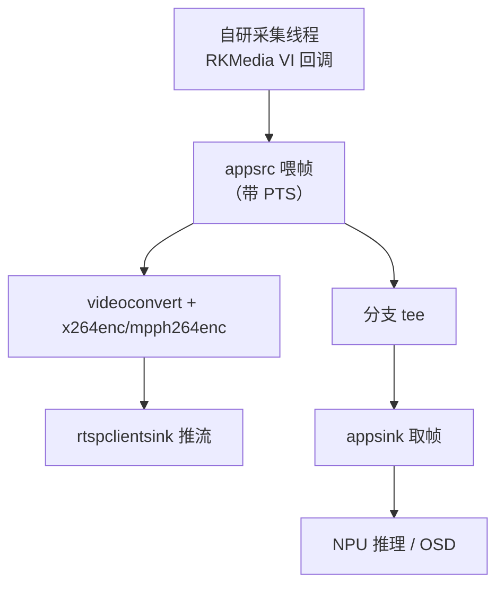
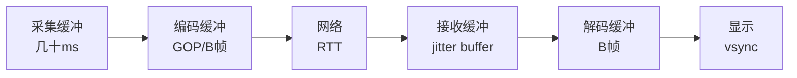

命令行 pipeline 只是 GStreamer 的门面。真实产品里，**GStreamer 必须和你的自研代码对接**：摄像头帧是 RKMedia VI 回调拿到的、NPU 推理结果要叠加到画面、播放端要拿到解码后的帧做 OSD——这些"外部数据进出 GStreamer"的接口就是 **appsrc（应用当数据源）** 和 **appsink（应用当数据出口）**。这一篇把这两个核心接口讲透，并覆盖 **RK MPP 硬件插件、零拷贝 DMA-BUF、推拉流低延迟调优**。

**双轨对照**：PC 端用 C 代码演示 appsrc 喂帧 + appsink 收帧；板端把 RKMedia 采集帧喂进 pipeline、把解码帧接出来做业务处理。

## 一、为什么需要 appsrc/appsink

**定义**：
- **appsrc**：一个"应用控制的 source element"——你的 C 代码把数据（帧/样本/码流）主动推给它，它再喂给下游；
- **appsink**：一个"应用控制的 sink element"——下游的数据流到这里，你的 C 代码用 pull/sample 方式取走。

**类比**：appsrc 是"你亲手往传送带上放料"的工位；appsink 是"你亲手从传送带上取成品"的工位。标准 pipeline 是自动流水线，appsrc/appsink 是**给应用留的人工接口**——让自研代码能塞数据进去、能取数据出来。

**典型场景**：


**vs 文件/设备源**：`filesrc`/`v4l2src` 是 GStreamer 自己管理数据来源；appsrc 让**你的代码控制数据节奏和内容**——帧从哪来、什么时候来、带什么时间戳，全部由应用决定。

## 二、appsrc 基础：把帧喂进管线

### 2.1 命令行为例（appsrc 用在 launch 里较少，主要 C 代码）

```bash
# 演示：videotestsrc 生成的数据通过 appsink 取走（概念）
gst-launch-1.0 videotestsrc num-buffers=30 ! appsink
```

### 2.2 C 代码：appsrc 喂帧最小示例

```c
#include <gst/gst.h>
#include <gst/app/gstappsrc.h>

int main(int argc, char *argv[]) {
    GstElement *pipeline, *appsrc, *convert, *encoder, *sink;
    GstBuffer *buffer;
    GstFlowReturn ret;
    int i;

    gst_init(&argc, &argv);

    pipeline = gst_pipeline_new("appsrc-pipe");
    appsrc   = gst_element_factory_make("appsrc", "src");
    convert  = gst_element_factory_make("videoconvert", "convert");
    encoder  = gst_element_factory_make("x264enc", "enc");
    sink     = gst_element_factory_make("fakesink", "sink");

    gst_bin_add_many(GST_BIN(pipeline), appsrc, convert, encoder, sink, NULL);
    gst_element_link_many(appsrc, convert, encoder, sink, NULL);

    /* 配置 appsrc caps：告诉下游你喂的格式 */
    GstCaps *caps = gst_caps_from_string(
        "video/x-raw,format=NV12,width=640,height=360,framerate=30/1");
    g_object_set(appsrc, "caps", caps, "format", GST_FORMAT_TIME, NULL);
    gst_caps_unref(caps);

    /* 让 pipeline 跑起来 */
    gst_element_set_state(pipeline, GST_STATE_PLAYING);

    /* 循环喂 30 帧 */
    for (i = 0; i < 30; i++) {
        /* 分配一个 buffer（640*360*1.5 = 345600 字节 NV12） */
        guint size = 640 * 360 * 3 / 2;
        buffer = gst_buffer_new_allocate(NULL, size, NULL);

        /* 填 PTS（第 i 帧：i * 1/30 秒） */
        GST_BUFFER_PTS(buffer) = gst_util_uint64_scale(i, GST_SECOND, 30);
        GST_BUFFER_DURATION(buffer) = gst_util_uint64_scale(1, GST_SECOND, 30);

        /* 把数据推给 appsrc（这里是假数据，真实场景从采集回调拿） */
        GstMapInfo map;
        gst_buffer_map(buffer, &map, GST_MAP_WRITE);
        memset(map.data, 0x80, map.size);   /* 灰色画面占位 */
        gst_buffer_unmap(buffer, &map);

        ret = gst_app_src_push_buffer(GST_APP_SRC(appsrc), buffer);
        if (ret != GST_FLOW_OK) {
            g_printerr("push buffer failed: %s\n", gst_flow_get_name(ret));
            break;
        }
        g_usleep(1000 * 1000 / 30);  /* 按 30fps 节奏喂 */
    }

    /* 通知结束 */
    gst_app_src_end_of_stream(GST_APP_SRC(appsrc));

    /* 等 EOS */
    GstBus *bus = gst_element_get_bus(pipeline);
    GstMessage *msg = gst_bus_timed_pop_filtered(bus, 5 * GST_SECOND,
                         GST_MESSAGE_EOS | GST_MESSAGE_ERROR);
    if (msg) { gst_message_unref(msg); }
    gst_object_unref(bus);

    gst_element_set_state(pipeline, GST_STATE_NULL);
    gst_object_unref(pipeline);
    return 0;
}
```

**编译**（需要 gstreamer-app 开发包）：

```bash
sudo apt install libgstreamer-plugins-base1.0-dev
gcc -o appsrc_demo appsrc_demo.c $(pkg-config --cflags --libs gstreamer-1.0 gstreamer-app-1.0)
./appsrc_demo
```

**代码要点**：
- `g_object_set(appsrc, "caps", caps, ...)`：**必须设置 caps**，否则下游不知道格式；
- `gst_app_src_push_buffer`：推 buffer（**拿走所有权**，用完别释放）；
- `gst_app_src_end_of_stream`：告诉下游"没数据了"；
- PTS 用 `gst_util_uint64_scale(i, GST_SECOND, 30)`——**GStreamer 时间单位是纳秒**。

**GStreamer 时间单位（重要）**：所有时间戳（PTS/DTS/时长）都是**纳秒**（int64）。`GST_SECOND = 1e9`。i 帧在 30fps 下的 PTS = i * 1e9 / 30 纳秒。

## 三、appsink 基础：从管线取帧

### 3.1 C 代码：appsink 取帧最小示例

```c
#include <gst/gst.h>
#include <gst/app/gstappsink.h>

int main(int argc, char *argv[]) {
    GstElement *pipeline, *src, *sink;
    int i;

    gst_init(&argc, &argv);

    pipeline = gst_pipeline_new("appsink-pipe");
    src  = gst_element_factory_make("videotestsrc", "src");
    sink = gst_element_factory_make("appsink", "sink");

    gst_bin_add_many(GST_BIN(pipeline), src, sink, NULL);
    gst_element_link(src, sink);

    /* 配置 appsink：拉模式 + 不自动 drop */
    g_object_set(sink,
                 "emit-signals", FALSE,
                 "max-buffers", 5,
                 "drop", FALSE,
                 "sync", FALSE,
                 NULL);

    gst_element_set_state(pipeline, GST_STATE_PLAYING);

    /* 用 pull-sample 主动取 10 帧 */
    for (i = 0; i < 10; i++) {
        GstSample *sample = gst_app_sink_try_pull_sample(GST_APP_SINK(sink), 2 * GST_SECOND);
        if (!sample) {
            g_printerr("pull sample timeout\n");
            break;
        }
        GstBuffer *buf = gst_sample_get_buffer(sample);
        GstCaps *caps = gst_sample_get_caps(sample);
        g_print("frame %d: size=%" G_GSIZE_FORMAT " caps=%s\n",
                i, gst_buffer_get_size(buf), gst_caps_to_string(caps));

        /* 在这里做业务处理：NPU 推理 / 存图 / OSD */
        gst_sample_unref(sample);
    }

    gst_element_set_state(pipeline, GST_STATE_NULL);
    gst_object_unref(pipeline);
    return 0;
}
```

**编译运行**：

```bash
gcc -o appsink_demo appsink_demo.c $(pkg-config --cflags --libs gstreamer-1.0 gstreamer-app-1.0)
./appsink_demo
```

**代码要点**：
- `gst_app_sink_try_pull_sample`：阻塞拉取一帧（带超时）；
- `GstSample` = buffer + caps + 时间戳的"套餐"；
- `max-buffers`：内部缓冲上限；`drop`：满了是否丢旧帧（实时场景设 TRUE 丢旧保新）；
- `sync=FALSE`：不按时钟同步（你要立即取走，而不是等播放时钟）。

**关键：pull 模式 vs push 模式**：
- **pull（拉模式）**：应用主动 `try_pull_sample` 取帧——节奏由应用控制；
- **push（推模式）**：设置 `emit-signals=TRUE` + `new-sample` 信号回调，帧到了自动通知。

```c
/* push 模式：信号回调 */
static GstFlowReturn on_new_sample(GstElement *sink, gpointer data) {
    GstSample *sample = gst_app_sink_pull_sample(GST_APP_SINK(sink));
    /* 处理帧 */
    gst_sample_unref(sample);
    return GST_FLOW_OK;
}
// 连接信号
g_signal_connect(sink, "new-sample", G_CALLBACK(on_new_sample), NULL);
```

## 四、appsrc/appsink 完整对接：采集 → 编码 → 推流 → 取帧



**tee 是什么**：把一个数据流复制成多份的 element——**一路推流、一路本地分析**，两条路互不阻塞。这是"摄像头同时推流 + 本地 AI 检测"的标准拓扑。

```bash
# 命令行 tee 演示（一半显示，一半丢弃）
gst-launch-1.0 videotestsrc ! tee name=t \
  t. ! queue ! autovideosink \
  t. ! queue ! fakesink
```

**queue 为什么必要**：GStreamer 的 element 默认同步执行——不加 queue，慢的下游会拖慢快的上游。**queue 是缓冲/解耦**，让各分支独立节奏。**类比**：传送带之间的暂存区。

## 五、RK MPP 硬件插件：板端硬编硬解

### 5.1 MPP 是什么

**定义**：MPP（Media Process Platform）是 Rockchip 的媒体处理库，封装 VPU（Video Processing Unit）的硬件编解码能力。GStreamer 插件 `gst-rockchip`（mpph264enc/mpph264dec 等）让 GStreamer 直接调硬件。

**硬编 vs 软编（板端关键决策）**：

| 维度 | x264enc（软编） | mpph264enc（硬编） |
|:---|:---|:---|
| CPU 占用 | 高（A7 上 1080p 吃力） | 极低（VPU 干活） |
| 延迟 | 较高 | 低 |
| 码率控制 | 灵活（crf 等） | 支持 CBR/VBR |
| 分辨率支持 | 任意 | 受 VPU 限制（需查 caps） |
| 场景 | 调试/兜底 | 产品主力 |

### 5.2 板端硬编 pipeline（RV1126）

```bash
# 假设 v4l2src 从 ISP 出 NV12（板端常见）
gst-launch-1.0 v4l2src device=/dev/video0 ! \
  "video/x-raw,format=NV12,width=1920,height=1080,framerate=30/1" ! \
  mpph264enc bitrate=4000000 ! \
  "video/x-h264,stream-format=avc,alignment=au" ! \
  rtspclientsink location=rtsp://127.0.0.1:8554/live
```

**关键**：
- **caps 必须写对**：MPP 编码器对输入格式/分辨率有硬约束（NV12 常见、尺寸对齐），不匹配就 not-negotiated；
- **stream-format=avc**：RTSP/MP4 需要 avc（带长度前缀）格式，`alignment=au` 一帧一 AU；
- **bitrate 单位是 bps**（4000000 = 4Mbps）。

### 5.3 硬解 pipeline

```bash
gst-launch-1.0 rtspsrc location=rtsp://127.0.0.1:8554/live ! \
  rtph264depay ! h264parse ! mpph264dec ! \
  "video/x-raw(memory:DMABuf),format=NV12" ! \
  videoconvert ! autovideosink
```

**`video/x-raw(memory:DMABuf)` 是什么**：告诉下游"我要 DMA-BUF 内存"——**零拷贝**：VPU 解出来的帧直接在 GPU/ISP 共享内存里，不经过 CPU 拷贝。板端性能关键。

## 六、零拷贝 DMA-BUF：性能的最后一块拼图

**定义**：DMA-BUF 是 Linux 内核的**跨设备共享内存**机制——同一块物理内存可以被 VPU、ISP、GPU、NPU 等多个硬件访问，**避免 CPU 搬运**。

**类比**：传统方式是"文件从 A 部门复印一份送到 B 部门"（CPU 拷贝）；DMA-BUF 是"A 部门和 B 部门直接共用一个文件柜"（共享内存）——省掉复印和送件的功夫。

**GStreamer 里的体现**：

```bash
# 用 memory:DMABuf 的 caps 走零拷贝
gst-launch-1.0 v4l2src ! "video/x-raw(memory:DMABuf),format=NV12" ! mpph264enc ! ...
```

**检查是否零拷贝**：

```bash
# 运行时查看 buffer 的 memory 类型（DMABuf / SystemMemory）
gst-launch-1.0 ... 2>&1 | grep -i "memory:DMABuf"
# 或代码里检查
gst_buffer_n_memory(buf)  // 多个 memory 说明可能用了 meta
```

**注意**：不是所有 element 支持 DMABuf。链路中任何一环不支持，GStreamer 会自动回退到系统内存拷贝——**性能分析时要确认整条链都是 DMABuf**。

## 七、低延迟调优：让画面"即拍即显"

**延迟从哪来**：采集缓冲 → 编码缓冲 → 网络传输 → 接收缓冲 → 解码缓冲 → 显示。每一环都有缓冲。



**调优清单**：

| 手段 | 效果 | 副作用 |
|:---|:---|:---|
| 编码器 zerolatency / 去 B 帧 | 减编码缓冲 | 码率略升 |
| GOP 短（1~2 秒） | 快起播 | 码率升 |
| 接收端 latency=0 | 减接收缓冲 | 抗抖动差 |
| 去掉多余的 queue 或调小 | 减排队延迟 | 易卡顿 |
| 硬编硬解 | 减 CPU 等待 | 依赖 VPU |
| 用 UDP 不用 TCP | 减重传延迟 | 丢包花屏 |
| 显示端 vsync 关闭 | 减显示等待 | 撕裂 |

```bash
# 低延迟推流 pipeline 示例
gst-launch-1.0 v4l2src ! \
  "video/x-raw,format=NV12,width=1280,height=720,framerate=30/1" ! \
  mpph264enc bitrate=3000000 rc-mode=cbr ! \
  "video/x-h264,stream-format=avc,alignment=au" ! \
  rtspclientsink location=rtsp://127.0.0.1:8554/live latency=0

# 低延迟拉流
gst-launch-1.0 rtspsrc location=rtsp://127.0.0.1:8554/live latency=0 ! \
  rtph264depay ! h264parse ! mpph264dec ! \
  videoconvert ! autovideosink sync=false
```

**端到端延迟测量**：手机拍屏幕上的计时器 → 推流 → 拉流显示，对比时间差。局域网目标 **<200ms**（编码+网络+解码+显示）。

## 八、常见问题排查

| 症状 | 原因 | 排查 |
|:---|:---|:---|
| appsrc 推帧失败（not-negotiated） | caps 没设/设错 | 打印 caps，核对格式 |
| appsink 取不到帧 | sync=TRUE 阻塞/没跑起来 | 设 sync=FALSE，检查 pipeline |
| 板端硬编不支持 | 分辨率/格式超 VPU 范围 | gst-inspect-1.0 mpph264enc |
| 推流花屏 | SPS/PPS 缺失或丢包 | 检查 stream-format，看网络 |
| 延迟高 | 缓冲太多 | 逐段测延迟，去 queue |
| 内存拷贝严重 | 链路有非 DMABuf 环节 | 检查 memory 类型 |
| 画面撕裂 | 显示端同步问题 | autovideosink sync=false 对比 |
| appsrc 喂太快 | 下游跟不上 | 加 queue 或限速 |

## 九、动手练习

1. 编译运行 appsrc_demo.c，把假数据换成真实帧（读一张 NV12 文件循环喂）
2. 编译运行 appsink_demo.c，改成 pull 模式取 30 帧并打印每帧 PTS
3. 把 appsink 改成 push 模式（new-sample 信号），对比两种模式
4. 用 tee 搭"一路推流一路本地取帧"的 pipeline，验证互不阻塞
5. 板端：v4l2src + mpph264enc + rtspclientsink 推流，手机拉流
6. 拉流端用 appsink 取帧，把帧存成 NV12 文件，用 FFmpeg 转 PNG 验证内容
7. 测量端到端延迟：计时器画面 → 推流 → 拉流 → 截图对比
8. 调优实验：改 rc-mode、latency、去 B 帧，记录延迟变化

## 里程碑

- [ ] 能解释 appsrc/appsink 的定位与典型使用场景
- [ ] 能用 C 代码喂帧进 appsrc、取帧出 appsink
- [ ] 能理解 GStreamer 纳秒时间戳与 PTS 计算
- [ ] 能区分 pull/push 两种 appsink 模式并选择
- [ ] 能解释 tee/queue 的作用并搭多分支 pipeline
- [ ] 能用 MPP 插件搭板端硬编硬解 pipeline
- [ ] 能理解 DMA-BUF 零拷贝并检查链路是否走 DMABuf
- [ ] 能按清单调优端到端延迟并测量验证

> 🏷️ 标签：GStreamer · appsrc · appsink · tee · queue · RK MPP · 硬件编码 · 硬件解码 · DMA-BUF · 零拷贝 · 低延迟 · v4l2src · RTSP · 板端 · 音视频
