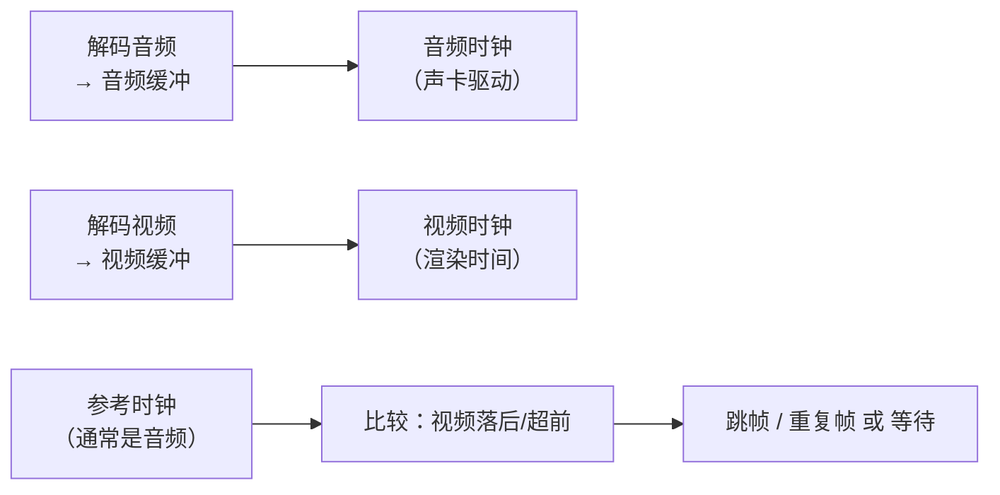
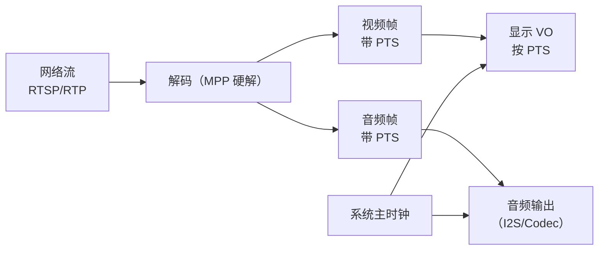

前面我们学会了编码、封装、传输——但播放端才是最终考验：**为什么有的视频越看越不同步？为什么画面卡顿但声音正常？** 这一篇把音视频同步（A/V Sync）的原理讲透：**时钟模型、音频主时钟、视频追帧策略、延迟测量与补偿**，并手写一个**最小播放器**（FFmpeg + SDL），让"声画同步"从概念变成能跑的代码。

**双轨对照**：PC 端编译运行最小播放器播放本地视频；板端 RKMedia/MPP 播放链路复用同一套"音频主时钟 + 视频追帧"思想。

## 一、为什么需要同步：解码出来的画面和声音本来就不是一路

**定义**：音视频同步 = 播放器按 PTS（显示时间戳）让音频和视频在**同一参考时钟**上对齐播放——音频该响的时候画面正好对应。

**类比**：合唱团唱歌。每个人（音频/视频流）都有自己的节奏，如果没有一个指挥（参考时钟），歌手唱到第 3 小节时乐队可能才到第 2 小节——乱套了。播放器里的"指挥"就是**主时钟**。

**为什么默认不同步**：
- 音频和视频是**两条独立解码链路**，各自缓冲、各自延迟；
- 网络/文件读取的到达时间不均匀（抖动）；
- 解码时间不确定（硬解 vs 软解差异大）；
- 显示设备刷新率与帧率不匹配。



## 二、三种同步策略：谁当主时钟？

| 策略 | 主时钟 | 做法 | 适用 |
|:---|:---|:---|:---|
| **音频主时钟** | 音频播放进度 | 视频帧按音频时钟对齐（标准做法） | 大多数视频 |
| **视频主时钟** | 视频渲染进度 | 音频拉伸/丢弃对齐视频 | 无音频/字幕为主 |
| **外部主时钟** | 系统时钟 | 都按墙上时钟对齐 | 直播/多端同步 |

**为什么默认用音频做主时钟**：人耳对声音中断/变调极度敏感，但对画面轻微跳动不敏感——**音频必须连续，视频可以跳**。所以标准策略是：音频自然播放（由声卡节奏驱动），视频主动去"追"音频。

**类比**：开车时副驾看导航（视频），司机（音频）按自己的节奏开——导航跟不上就刷新一下，不会让司机停车等导航。

## 三、同步核心算法：视频追音频

### 3.1 播放时钟模型

```c
// 每个流维护自己的"当前播放时间"
double audio_clock = 0.0;  // 音频当前播到哪一秒（由声卡写入位置推算）
double video_clock = 0.0;  // 视频当前显示到哪一秒

// 关键：视频显示时刻 = 参考时钟 + 偏移
double get_master_clock() {
    if (master == AUDIO) return audio_clock;
    if (master == VIDEO) return video_clock;
    return av_gettime_relative() / 1000000.0;  // 系统时钟
}
```

### 3.2 视频追帧逻辑（核心 while 循环）

```c
// 拿到一帧视频后：
double pts = frame->pts * av_q2d(time_base);      // 该帧应该显示的时刻
double delay = pts - video_clock;                 // 距上一帧的间隔
double diff = pts - get_master_clock();           // 与主时钟的偏差

if (diff > 0) {
    // 视频快了：等待 diff 秒再显示
    av_usleep(diff * 1000000);
} else if (diff < -0.1) {
    // 视频慢了超过 100ms：跳过该帧（不显示）
    // （阈值 -0.1 可调，太小跳帧频繁，太大容忍不同步）
    continue;  // 丢弃这一帧
}
// 显示该帧
```

**阈值的作用**：`diff < -0.1` 才跳帧——**容忍 ±100ms 的偏差**，因为人眼对 100ms 内的 A/V 偏差基本无感。跳帧阈值太小会频繁跳帧（画面闪），太大则不同步明显。

**实践标准**：
- |diff| < 50ms：人耳/人眼无感；
- 50~100ms：轻微，多数场景可接受；
- > 100ms：明显不同步，需要跳帧/等待纠偏。

### 3.3 音频时钟推算

```c
// 音频时钟 = 音频流开始时间 + 已播放的采样数 / 采样率
// 用 SDL/ALSA 的回调，每次喂数据时累计已写采样数
static void audio_callback(void *udata, Uint8 *stream, int len) {
    // stream 是声卡要播放的数据，len 是字节数
    // 已写字节 / (采样率 * 声道 * 位深) = 已播放秒数
    audio_clock = bytes_written / (double)(sample_rate * channels * bytes_per_sample);
}
```

**关键**：音频时钟**必须由声卡实际播放进度驱动**（而不是"我们解码到哪了"）——因为声卡有自己的缓冲，解码快不代表播放快。

## 四、最小播放器：代码实战

下面是一个**可编译运行的完整最小播放器**：FFmpeg 解码 + SDL2 显示/播放 + 音频主时钟同步。核心约 200 行，去掉注释后更短——这是理解"播放器怎么工作"的最佳教材。

### 4.1 依赖与编译

```bash
sudo apt install libsdl2-dev
gcc -o player player.c $(pkg-config --cflags --libs libavformat libavcodec libavutil libswscale sdl2) -lm
./player video.mp4
```

### 4.2 完整代码

```c
#include <stdio.h>
#include <stdint.h>
#include <SDL2/SDL.h>
#include <libavformat/avformat.h>
#include <libavcodec/avcodec.h>
#include <libavutil/imgutils.h>
#include <libswscale/swscale.h>

/* 全局状态 */
static double audio_clock = 0.0;          /* 音频主时钟（秒） */
static AVFormatContext *fmt = NULL;
static AVCodecContext *dec_v = NULL, *dec_a = NULL;
static int v_idx = -1, a_idx = -1;
static SDL_Texture *tex = NULL;
static SDL_Renderer *renderer = NULL;
static SDL_Window *window = NULL;
static struct SwsContext *sws = NULL;

/* ---------- 音频回调：SDL 请求数据时喂 PCM，同时更新音频时钟 ---------- */
typedef struct {
    AVCodecContext *dec;
    AVPacket *pkt;
    AVFrame *frame;
    int eof;
    uint8_t *buf;      /* 转换后的 S16 交错缓冲 */
    int buf_size;
    int buf_pos;
} AudioState;

static void audio_cb(void *udata, Uint8 *stream, int len) {
    AudioState *as = (AudioState *)udata;
    int produced = 0;
    while (produced < len) {
        if (as->buf_pos >= as->buf_size) {
            /* 需要解码下一帧音频 */
            if (as->eof) break;
            int ret;
            /* 取音频包（简化：线性搜索） */
            while ((ret = av_read_frame(fmt, as->pkt)) >= 0) {
                if (as->pkt->stream_index == a_idx) break;
                av_packet_unref(as->pkt);
            }
            if (ret < 0) { as->eof = 1; break; }
            avcodec_send_packet(as->dec, as->pkt);
            av_packet_unref(as->pkt);
            if (avcodec_receive_frame(as->dec, as->frame) != 0) continue;

            /* 帧转成 S16 交错（这里假设已是 S16；真实场景用 swr_convert） */
            int bytes = av_samples_get_buffer_size(NULL, as->frame->ch_layout.nb_channels,
                                                   as->frame->nb_samples,
                                                   as->frame->format, 1);
            if (bytes > as->buf_size) {
                av_free(as->buf);
                as->buf = av_malloc(bytes);
                as->buf_size = bytes;
            }
            /* 简化：单声道 S16 直接拷贝；立体声需交错处理 */
            memcpy(as->buf, as->frame->extended_data[0], bytes);
            as->buf_pos = 0;

            /* 更新音频时钟：播放了 nb_samples 个采样 */
            audio_clock += (double)as->frame->nb_samples / as->frame->sample_rate;
        }
        /* 拷贝到 SDL 输出 */
        int copy = as->buf_size - as->buf_pos;
        if (copy > len - produced) copy = len - produced;
        memcpy(stream + produced, as->buf + as->buf_pos, copy);
        as->buf_pos += copy;
        produced += copy;
    }
    if (produced < len) memset(stream + produced, 0, len - produced); /* 静音填充 */
}

/* ---------- 主时钟 ---------- */
static double get_master_clock(void) {
    return audio_clock;   /* 音频主时钟策略 */
}

/* ---------- 视频渲染 ---------- */
static void video_display(AVFrame *frame) {
    uint8_t *dst_data[4];
    int dst_linesize[4];
    av_image_alloc(dst_data, dst_linesize, frame->width, frame->height,
                   AV_PIX_FMT_RGB24, 1);
    sws_scale(sws, (const uint8_t *const *)frame->data, frame->linesize,
              0, frame->height, dst_data, dst_linesize);
    SDL_UpdateTexture(tex, NULL, dst_data[0], dst_linesize[0]);
    SDL_RenderClear(renderer);
    SDL_RenderCopy(renderer, tex, NULL, NULL);
    SDL_RenderPresent(renderer);
    av_freep(&dst_data[0]);
}

int main(int argc, char **argv) {
    if (argc < 2) { fprintf(stderr, "usage: %s file\n", argv[0]); return 1; }
    const AVCodec *codec;
    AVStream *st;
    int ret;

    avformat_open_input(&fmt, argv[1], NULL, NULL);
    avformat_find_stream_info(fmt, NULL);
    v_idx = av_find_best_stream(fmt, AVMEDIA_TYPE_VIDEO, -1, -1, NULL, 0);
    a_idx = av_find_best_stream(fmt, AVMEDIA_TYPE_AUDIO, -1, -1, NULL, 0);

    /* 打开视频解码器 */
    st = fmt->streams[v_idx];
    codec = avcodec_find_decoder(st->codecpar->codec_id);
    dec_v = avcodec_alloc_context3(codec);
    avcodec_parameters_to_context(dec_v, st->codecpar);
    avcodec_open2(dec_v, codec, NULL);

    /* 初始化 SDL */
    SDL_Init(SDL_INIT_VIDEO | SDL_INIT_AUDIO);
    SDL_CreateWindowAndRenderer(dec_v->width, dec_v->height, 0, &window, &renderer);
    tex = SDL_CreateTexture(renderer, SDL_PIXELFORMAT_RGB24,
                            SDL_TEXTUREACCESS_STREAMING,
                            dec_v->width, dec_v->height);
    sws = sws_getContext(dec_v->width, dec_v->height, dec_v->pix_fmt,
                         dec_v->width, dec_v->height, AV_PIX_FMT_RGB24,
                         SWS_BILINEAR, NULL, NULL, NULL);

    /* 打开音频并启动 SDL 音频（音频主时钟） */
    AudioState as = {0};
    if (a_idx >= 0) {
        st = fmt->streams[a_idx];
        codec = avcodec_find_decoder(st->codecpar->codec_id);
        dec_a = avcodec_alloc_context3(codec);
        avcodec_parameters_to_context(dec_a, st->codecpar);
        avcodec_open2(dec_a, codec, NULL);
        as.dec = dec_a;
        as.pkt = av_packet_alloc();
        as.frame = av_frame_alloc();

        SDL_AudioSpec want, have;
        SDL_zero(want);
        want.freq = dec_a->sample_rate;
        want.format = AUDIO_S16SYS;
        want.channels = dec_a->ch_layout.nb_channels;
        want.samples = 1024;
        want.callback = audio_cb;
        want.userdata = &as;
        if (SDL_OpenAudio(&want, &have) < 0) {
            fprintf(stderr, "audio open failed: %s\n", SDL_GetError());
        }
        SDL_PauseAudio(0);
    } else {
        fprintf(stderr, "no audio stream, using video clock\n");
    }

    /* 解码主循环：视频按音频时钟追帧 */
    AVPacket *pkt = av_packet_alloc();
    AVFrame *frame = av_frame_alloc();
    double video_clock = 0.0;
    AVRational v_tb = fmt->streams[v_idx]->time_base;

    SDL_Event ev;
    int running = 1;
    while (running) {
        /* 处理退出事件 */
        while (SDL_PollEvent(&ev)) {
            if (ev.type == SDL_QUIT) running = 0;
        }
        if (!running) break;

        ret = av_read_frame(fmt, pkt);
        if (ret < 0) break;   /* EOF */

        if (pkt->stream_index == v_idx) {
            avcodec_send_packet(dec_v, pkt);
            av_packet_unref(pkt);
            while (avcodec_receive_frame(dec_v, frame) == 0) {
                double pts = frame->pts * av_q2d(v_tb);
                double diff = pts - get_master_clock();
                if (diff > 0) {
                    /* 视频快了：等一等 */
                    SDL_Delay((Uint32)(diff * 1000));
                } else if (diff < -0.1) {
                    /* 视频慢了超 100ms：跳帧 */
                    av_frame_unref(frame);
                    continue;
                }
                video_display(frame);
                av_frame_unref(frame);
            }
        } else if (pkt->stream_index == a_idx) {
            /* 音频包已在音频回调里取（此处在主循环里跳过） */
            av_packet_unref(pkt);
        } else {
            av_packet_unref(pkt);
        }
    }

    /* 清理 */
    SDL_CloseAudio();
    SDL_DestroyTexture(tex);
    SDL_DestroyRenderer(renderer);
    SDL_DestroyWindow(window);
    SDL_Quit();
    return 0;
}
```

**代码核心逻辑回顾**：
1. 音频回调里解码 PCM → 喂 SDL 声卡 → **用采样数更新 audio_clock**；
2. 视频主循环：解码视频帧 → 算 PTS → 与 audio_clock 比较 → **快则等、慢则跳**；
3. 画面用 swscale 转 RGB24 → SDL 纹理显示。

**注意**：这是教学最小版——真实播放器（如 ffplay）还处理：双缓冲、seek、字幕、多音频流、硬件加速、音频重采样（swr）等。**但同步核心就是"主时钟 + 偏差纠偏"这十几行**。

## 五、延迟测量与补偿

### 5.1 延迟从哪来（播放端视角）

| 环节 | 典型延迟 | 可优化 |
|:---|:---|:---|
| 解封装缓冲 | 10~50ms | 流式输入时控制 |
| 解码缓冲（B 帧） | 0~100ms | 去 B 帧 |
| 视频渲染等待（vsync） | 0~16ms | 关闭 vsync |
| 音频缓冲（SDL/ALSA） | 20~200ms | 减小 period |
| 网络抖动缓冲 | 0~300ms | 调 jitter buffer |

### 5.2 测量方法

```bash
# 方法1：ffplay 自带的统计（ffplay 有 debug 输出）
ffplay -stats -loglevel debug video.mp4 2>&1 | grep -i "a-v"
# 方法2：生成"计时器"视频，肉眼对比
ffmpeg -f lavfi -i "testsrc2=size=320x180:rate=30" -f lavfi -i "sine=frequency=1000:duration=10" \
       -c:v libx264 -c:a aac sync_test.mp4
# 播放时盯着画面和声音，判断偏差
```

**ffplay 的 `a-v` 字段**：显示 audio-video 偏差（秒），正数 = 音频落后，负数 = 视频落后。这是测量 A/V 同步最直接的工具。

### 5.3 补偿策略

```c
/* 偏差过大时的处理选项 */
if (diff > SYNC_THRESHOLD) {
    /* 视频超前：等待（不能加速音频） */
    delay_to_wait(diff);
} else if (diff < -SYNC_THRESHOLD) {
    /* 视频落后：跳帧或加速 */
    drop_frame();               /* 直接丢帧（最常用） */
    /* 或：缩短下一帧等待时间（追赶） */
    next_delay -= correction;
}
```

**进阶：音频拉伸（time-stretch）**：当偏差持续存在，除了跳视频帧，还可以对音频做**变速不变调**（如 ±10% 的 tempo 调整）——音高不变但速度微调，实现平滑同步。WebRTC/专业播放器会用，实现复杂（WSOLA/相位声码器），本系列只提概念。

## 六、板端联动：RKMedia 播放/对讲链路的同步



**板端对讲/播放的同步要点**：
1. **一个时钟源**：板端所有 PTS 基于系统单调时钟（`clock_gettime(CLOCK_MONOTONIC)`）打点——音频采集和视频采集用同一个时钟；
2. **音频主时钟**：对讲机场景也是音频优先（人耳对语音连续性敏感），视频（对方画面）落后就跳帧；
3. **缓冲上限**：播放端 jitter buffer 设上限（如 200ms），满了丢旧帧保实时——**实时场景宁丢不堵**；
4. **硬件 PTS**：RKMedia 的 VI/VENC/VO 都支持硬件时间戳，用硬件 PTS 比软件打点更准。

**双向语音（对讲）的同步挑战**：AEC 需要参考信号与采集信号**严格同源同时**——延迟抖动会导致回声消除失效（之前音频 3A 篇提过）。所以对讲链路的 A/V 同步优先级：**音频（AEC 可用）> 视频（画面可跳）**。

## 七、常见问题排查

| 症状 | 原因 | 对策 |
|:---|:---|:---|
| 越看越不同步 | 音频时钟计算错误 | 用采样累计更新，不用帧号 |
| 开始不同步后面正常 | 起始缓冲未对齐 | 从第一个 PTS 校准 |
| 画面卡顿声音正常 | 视频解码慢/跳帧阈值小 | 硬解、调大跳帧阈值 |
| 声音断续画面正常 | 音频缓冲下溢 | 加大音频缓冲/减少网络抖动 |
| 直播延迟持续增长 | 播放端追不上 | 跳帧策略加强、减小缓冲 |
| AEC 效果变差 | 参考/采集不同源 | 用同一时钟打点 |

## 八、动手练习

1. 编译运行最小播放器，播放一段音视频文件，观察声画是否同步
2. 修改跳帧阈值（-0.1 → -0.5 / -0.02），观察不同步容忍度变化
3. 用 ffplay 播放同一文件，看 `a-v` 字段，与自己的播放器对比
4. 制造偏差：`ffmpeg -itsoffset 1 -i video.mp4 ... ` 生成音频延迟 1 秒的视频，播放观察
5. 注释掉视频追帧逻辑（只等不跳），播放看"卡死"效果——理解追帧的必要性
6. 给播放器加暂停/seek（进阶）
7. 板端：MPP 硬解 + VO 显示，验证 PTS 驱动播放
8. 测量自己播放器的端到端延迟（计时器法）

## 里程碑

- [ ] 能解释为什么默认用音频做主时钟
- [ ] 能说出三种同步策略及适用场景
- [ ] 能实现"音频时钟 + 视频追帧"核心逻辑
- [ ] 能解释跳帧阈值的作用与选择依据
- [ ] 能读懂 ffplay 的 a-v 字段并定位不同步
- [ ] 能理解延迟的来源与补偿手段
- [ ] 能说出板端对讲/播放同步的关键点（同源时钟、音频优先）
- [ ] 能独立编译运行一个带同步的最小播放器

> 🏷️ 标签：音视频同步 · A/V Sync · 主时钟 · PTS · 播放器 · SDL · FFmpeg · 跳帧 · 追帧 · 延迟补偿 · 对讲 · 音视频
