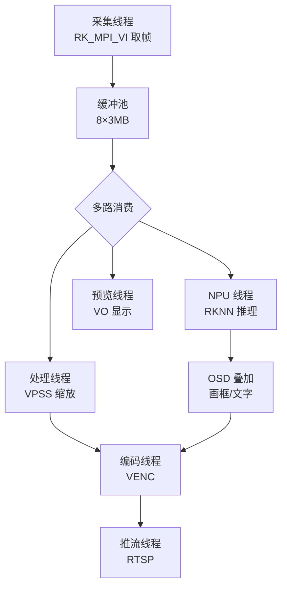

前面每一篇都在讲"某个环节怎么做"——采集、编码、推流、播放。但真实产品把这些环节串成一条**长期运行、多线程、高性能**的管线时，工程问题就来了：线程怎么划分？内存怎么不爆？延迟怎么控？CPU 怎么省？这一篇把多媒体管线的工程化讲透：**生产者-消费者线程模型、缓冲池、零拷贝（DMA-BUF/共享内存）、背压与丢帧策略、性能剖析方法**，并给出可照抄的板端管线骨架。

**双轨对照**：PC 端用 C 代码演示线程模型与缓冲池；板端 RV1126 的"采集→处理→编码→推流"全链路按同一套工程模式组织。

## 一、多媒体管线是什么：一条多级流水线

**定义**：多媒体管线 = 把采集、处理、编码、传输等多个环节串成一条**数据流处理链**，每个环节独立工作（线程），数据以"帧"为单位在环节间流动。

**类比**：汽车工厂流水线——冲压（采集）、焊接（处理）、喷漆（编码）、总装（推流），每个工位有自己节奏和缓冲区，工位之间用传送带（队列）连接。**一个工位慢了，不能让整条线停下来**——要么缓冲，要么丢弃。


**为什么必须多线程**：
- **单线程串行**：采集 30fps 每帧 33ms，如果编码一帧要 20ms，串行处理就到不了 30fps（33+20=53ms/帧）；
- **并行流水**：采集第 N+3 帧时，编码器在编第 N 帧——**每帧的平均耗时 ≈ 最慢环节耗时，而不是总和**；
- **解耦**：网络卡顿不影响采集（队列缓冲或丢帧），编码器故障可重启不影响驱动。

## 二、线程模型：生产者-消费者

### 2.1 核心模式

**定义**：生产者-消费者模式 = 一个线程（生产者）产生数据放入队列，另一个线程（消费者）从队列取数据消费。中间用**有界队列**解耦。

**核心组件**：

```c
typedef struct {
    void **items;          /* 环形缓冲 */
    int size;              /* 容量 */
    int head, tail, count;
    pthread_mutex_t lock;
    pthread_cond_t not_full;   /* 生产者等待：队列满 */
    pthread_cond_t not_empty;  /* 消费者等待：队列空 */
    int drop_old;              /* 满时丢旧帧策略 */
} FrameQueue;

void queue_init(FrameQueue *q, int size, int drop_old);
int  queue_push(FrameQueue *q, void *frame);   /* 生产者调用 */
void *queue_pop(FrameQueue *q);                /* 消费者调用（阻塞） */
```

**关键操作**：

```c
int queue_push(FrameQueue *q, void *frame) {
    pthread_mutex_lock(&q->lock);
    while (q->count == q->size && !q->drop_old) {
        pthread_cond_wait(&q->not_full, &q->lock);   /* 满则等 */
    }
    if (q->count == q->size && q->drop_old) {
        /* 满且丢旧：丢弃最旧的一帧，腾位置 */
        free(q->items[q->head]);                     /* 释放旧帧 */
        q->head = (q->head + 1) % q->size;
        q->count--;
    }
    q->items[q->tail] = frame;
    q->tail = (q->tail + 1) % q->size;
    q->count++;
    pthread_cond_signal(&q->not_empty);
    pthread_mutex_unlock(&q->lock);
    return 0;
}

void *queue_pop(FrameQueue *q) {
    pthread_mutex_lock(&q->lock);
    while (q->count == 0) {
        pthread_cond_wait(&q->not_empty, &q->lock);  /* 空则等 */
    }
    void *frame = q->items[q->head];
    q->head = (q->head + 1) % q->size;
    q->count--;
    pthread_cond_signal(&q->not_full);
    pthread_mutex_unlock(&q->lock);
    return frame;
}
```

**为什么要条件变量而不是忙等**：`pthread_cond_wait` 让消费者在没有数据时**休眠**，不占 CPU——多媒体系统 CPU 宝贵，不能空转轮询。

### 2.2 丢帧策略（背压控制）

**定义**：背压（backpressure）= 下游处理不过来时，上游采取的措施。多媒体实时系统常用**丢帧**（drop frame）而不是阻塞等待——因为等会让延迟无限增长。

**三种策略**：

| 策略 | 做法 | 适用 |
|:---|:---|:---|
| 阻塞（等） | 队列满则生产者等待 | 离线处理、必须全保留 |
| 丢新（丢当前帧） | 队列满则本次帧丢弃 | 实时采集（宁丢勿堵） |
| 丢旧（丢最旧帧） | 队列满则覆盖最旧帧 | 实时预览（永远最新） |

**实时摄像头推荐"丢旧"**：队列里永远是最新帧——延迟稳定（始终≈队列深度），画面轻微跳帧但实时性最好。**NPU 检测场景推荐"丢新"**：不能丢旧帧因为检测要处理每一帧，丢新只是跳过一次检测。

```c
/* 采集线程：丢了就丢了，不要阻塞 */
void *capture_thread(void *arg) {
    while (running) {
        Frame *f = capture_frame();       /* VI 回调/取帧 */
        if (!queue_push_nb(&q, f)) {       /* 非阻塞推入 */
            release_frame(f);              /* 满则丢帧 */
            drop_count++;
        }
    }
}
```

## 三、缓冲池：告别反复 malloc/free

### 3.1 为什么需要缓冲池

**问题**：每帧 1080p NV12 = 3MB。30fps 每秒 30 次 `malloc(3MB) + free`——碎片化、慢、还容易触发内存抖动。嵌入式内存紧张，不能每帧现分配。

**定义**：缓冲池 = 预分配 N 个帧缓冲（如 8 个 3MB = 24MB），循环使用。拿缓冲 = 从池里取一个；用完 = 还回池里。**零分配、零释放**。

**类比**：食堂的餐盘回收。不是每顿饭都买新餐盘（malloc），而是吃完饭把餐盘还回去（归还池），下个人继续用——餐盘总数固定。

### 3.2 实现骨架

```c
typedef struct {
    uint8_t **bufs;        /* 预分配的缓冲数组 */
    int *used;             /* 使用标记 */
    int num;               /* 数量 */
    int buf_size;          /* 每个缓冲大小 */
    pthread_mutex_t lock;
    pthread_cond_t avail;
} FramePool;

void pool_init(FramePool *p, int num, int buf_size) {
    p->bufs = calloc(num, sizeof(uint8_t *));
    p->used = calloc(num, sizeof(int));
    p->num = num;
    p->buf_size = buf_size;
    for (int i = 0; i < num; i++) {
        /* 对齐分配（DMA 需要） */
        posix_memalign((void **)&p->bufs[i], 4096, buf_size);
    }
}

uint8_t *pool_get(FramePool *p) {   /* 取一个空闲缓冲 */
    pthread_mutex_lock(&p->lock);
    for (int i = 0; i < p->num; i++) {
        if (!p->used[i]) {
            p->used[i] = 1;
            pthread_mutex_unlock(&p->lock);
            return p->bufs[i];
        }
    }
    pthread_mutex_unlock(&p->lock);
    return NULL;   /* 池满（应该不会发生，配合丢帧策略） */
}

void pool_put(FramePool *p, uint8_t *buf) {  /* 还回池 */
    pthread_mutex_lock(&p->lock);
    for (int i = 0; i < p->num; i++) {
        if (p->bufs[i] == buf) { p->used[i] = 0; break; }
    }
    pthread_mutex_unlock(&p->lock);
}
```

**关键点**：
- `posix_memalign(4096)`：**4KB 对齐**——DMA 硬件要求内存对齐；
- 池大小 = 队列深度 + 正在处理帧数（如队列 4 + 采集/处理/编码各 1 = 7~8 个）；
- 池满不该发生（配合丢帧）；真满了就是**内存规划错误**。

### 3.3 引用计数（零拷贝的前提）

**问题**：一帧数据可能同时被多个环节使用（编码 + NPU + 预览）。如果每个环节拷贝一份，3MB × 3 = 9MB 拷贝，CPU 烧穿。

**定义**：引用计数 = 缓冲带一个"正在被几个人用"的计数。借用时 +1，用完 -1，归零才真正归还池。

```c
typedef struct {
    uint8_t *data;
    int ref_count;
    pthread_mutex_t lock;
} RefFrame;

RefFrame *ref_get(RefFrame *f) {   /* 借用：计数+1 */
    pthread_mutex_lock(&f->lock);
    f->ref_count++;
    pthread_mutex_unlock(&f->lock);
    return f;
}

void ref_put(RefFrame *f) {        /* 用完：计数-1，归零归还池 */
    pthread_mutex_lock(&f->lock);
    if (--f->ref_count == 0) {
        pthread_mutex_unlock(&f->lock);
        pool_put(&g_pool, f->data);
    } else {
        pthread_mutex_unlock(&f->lock);
    }
}
```

**这就是零拷贝的用户态实现**：多个消费者共享同一块内存，各自引用计数，**数据只产生一次、只移动指针**。

## 四、零拷贝进阶：DMA-BUF 与硬件共享

### 4.1 用户态共享 vs 内核 DMA-BUF

| 层面 | 机制 | 说明 |
|:---|:---|:---|
| 用户态线程间 | 指针 + 引用计数 | 前文实现 |
| 硬件设备间 | **DMA-BUF** | 内核共享，VPU/ISP/GPU 直接访问 |
| 进程间 | 共享内存（shm）/ dmabuf 导入 | 多进程架构 |

**DMA-BUF 在板端多媒体里的核心价值**：VI（采集）→ VPSS（处理）→ VENC（编码）全程**不经过 CPU**——采集硬件直接写进 DMA-BUF，编码硬件直接从同一块内存读。用户态代码只是"传 fd + 传指针"。

**RKMedia 里的体现**：
- `RK_MPI_VI_GetChnFrame` 返回的帧带 `MB`（内存块）句柄；
- 绑定模式（VPSS→VENC）内部就是 DMA-BUF 流转；
- GStreamer 的 `video/x-raw(memory:DMABuf)` 把 DMA-BUF 暴露给应用。

**DMA-BUF 的 Linux 用户态使用**（概念骨架）：

```c
/* 导入 DMA-BUF fd → 映射到用户态 */
int dma_buf_fd = /* 从 VI/编码器回调拿到 */;
int len = lseek(dma_buf_fd, 0, SEEK_END);       /* 获取长度 */
uint8_t *map = mmap(NULL, len, PROT_READ | PROT_WRITE,
                    MAP_SHARED, dma_buf_fd, 0);  /* 映射 */
/* 直接读写 map —— 硬件也在读写同一块内存 */
munmap(map, len);
```

**性能对比**（1080p 30fps 为例）：

| 方式 | 每帧 CPU 拷贝 | 30fps CPU 开销 | 说明 |
|:---|:---|:---|:---|
| 每环节拷贝 | 3MB × N | 90MB/s × N | N=3 时 270MB/s，A7 扛不住 |
| 用户态引用计数 | 0（只传指针） | ~0 | 适合单进程多线程 |
| DMA-BUF | 0（硬件直连） | ~0 | 硬件间共享 |

## 五、完整管线骨架：RV1126 智能摄像头

把前面所有工程组件组合成一条完整管线（采集 → 处理 → AI → 编码 → 推流）：



**线程职责划分**：

| 线程 | 频率 | 职责 | 关键资源 |
|:---|:---|:---|:---|
| 采集 | 30fps | VI 取帧 → 缓冲池 | VI 通道、DMA-BUF |
| 处理 | 30fps | VPSS 缩放/格式转 | VPSS 组、缓冲池 |
| NPU | 10~30fps | 推理检测 | RKNN、NPU 内存 |
| 编码 | 30fps | VENC 硬编 | VENC、SPS/PPS |
| 推流 | 实时 | RTP/RTSP 发送 | 网络、RTP 打包 |
| 主控 | 事件 | 参数配置、状态管理 | 命令队列 |

**调度优先级建议**（实时性）：

```c
/* 采集线程：最高优先级（丢帧源头） */
struct sched_param sp = {.sched_priority = 50};
pthread_setschedparam(tid, SCHED_FIFO, &sp);
/* 编码/推流：次高 */
/* NPU：普通 */
/* 主控：最低 */
```

**锁粒度建议**：**每帧级的大锁要避免**——尽量用无锁环形队列（单生产者单消费者时）或短临界区。3MB 帧拷贝不能发生在持锁区间。

## 六、性能剖析：别猜，测

### 6.1 三个指标

| 指标 | 含义 | 测量 |
|:---|:---|:---|
| FPS | 实际帧率 | 统计一小时内帧数 |
| 延迟 | 端到端（采集→显示） | 计时器画面法 |
| CPU/内存 | 占用 | top / /proc |

### 6.2 工具

```bash
# 板端 CPU 占用（按线程）
top -H -p $(pidof app)
# 线程实时性检查
ps -eLo pid,tid,pri,comm | grep app
# 内存
cat /proc/$(pidof app)/status | grep -E "VmRSS|VmSize"
# 简单帧率统计（代码里）
# 每收 100 帧打印耗时
```

**代码内计时（最常用）**：

```c
/* 统计各环节耗时 */
static void perf_start(void) { g_t0 = clock_gettime_ns(); }
static void perf_end(const char *name) {
    int64_t dt = clock_gettime_ns() - g_t0;
    /* 记录到环形统计：平均/最大/最小 */
    update_stats(name, dt);
}
/* 使用：在采集/处理/编码回调里包一层 */
```

**剖析思路**：
1. **先量整条管线的 FPS 和延迟**——确认问题是否存在；
2. **再逐环节计时**（采集/处理/编码/推流各花多少）——找到瓶颈；
3. **看 CPU 占用分配**——哪个线程吃 CPU（可能是非零拷贝）；
4. **看队列深度**——哪个队列长期满/空（生产者消费者失衡）。

### 6.3 常见性能问题

| 症状 | 可能原因 | 对策 |
|:---|:---|:---|
| FPS 上不去 | 某环节串行耗时 > 帧间隔 | 分解并行/硬编硬解 |
| CPU 高 | 像素拷贝/软编 | 零拷贝/MPP |
| 延迟高 | 队列太长/缓冲太大 | 减小队列/丢旧策略 |
| 内存涨 | 缓冲池泄漏/引用计数错 | 检查 ref_put 配对 |
| 偶发卡顿 | 锁竞争/GC（如果有） | 无锁队列/检查锁 |
| 采集丢帧 | VI 回调处理太慢 | 回调只入队，处理放线程 |

## 七、动手练习

1. 实现 FrameQueue（环形队列 + 条件变量），写两个线程：生产者推 1000 帧、消费者取，验证无丢失
2. 给队列加"丢旧"策略，生产者推 1000 帧但消费者很慢，观察丢帧数——理解背压
3. 实现 FramePool（预分配 + 归还），用 `posix_memalign` 4KB 对齐，测试分配 10000 次的耗时（vs malloc）
4. 给帧加引用计数，模拟"一帧被编码 + NPU + 预览三个消费者借用"，验证归零才归还
5. 把"采集→编码"改成流水线（两个队列三个线程），测量 FPS 对比单线程
6. 用代码内计时统计各环节耗时，画出耗时饼图找瓶颈
7. 板端：把之前所有实验串成完整管线骨架，跑 1 小时观察内存/CPU/丢帧
8. （进阶）对比 DMA-BUF 零拷贝与 memcpy 拷贝的 CPU 差异

## 里程碑

- [ ] 能解释多线程管线的价值（并行流水 vs 串行）
- [ ] 能实现生产者-消费者队列（条件变量，非忙等）
- [ ] 能理解三种背压策略（阻塞/丢新/丢旧）并选择
- [ ] 能实现缓冲池（预分配、对齐、零分配）
- [ ] 能理解引用计数与用户态零拷贝
- [ ] 能解释 DMA-BUF 与硬件共享内存的价值
- [ ] 能按线程模型组织"采集→处理→编码→推流"管线
- [ ] 能用逐环节计时定位性能瓶颈

> 🏷️ 标签：多媒体管线 · 多线程 · 生产者消费者 · 环形队列 · 缓冲池 · 引用计数 · 零拷贝 · DMA-BUF · 背压 · 丢帧 · 性能剖析 · 线程优先级 · RKMedia · 音视频
