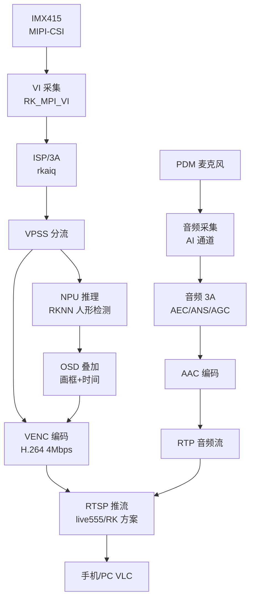
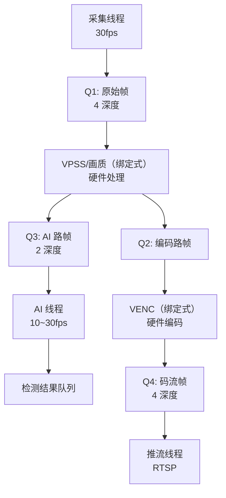

这是本系列最后一篇。前面 23 篇分别打通了采集、ISP/3A、像素处理、编码、封装、传输、同步、工程化——现在把它们**全部串起来**，做一个真正可产品化的综合项目：**智能摄像头**。IMX415 采集 → ISP/3A 出画质 → NPU 推理（复用 RKNN 系列能力）→ OSD 叠加 → VENC 编码 → RTSP 推流 + 双向语音（音频 3A）。这一篇给出**完整架构、模块划分、线程模型、关键代码骨架、调试清单与作品集收尾**，是你面试 IPC/视觉/流媒体岗位的"压轴作品"。

**双轨对照**：PC 端用 FFmpeg/GStreamer 模拟每一环；板端 RV1126 按模块逐步点亮，最终合成一条全链路。

## 一、项目目标与验收标准

**项目名**：智能摄像头（AI IPC 雏形）

**功能清单**：
1. IMX415 摄像头实时采集 1080p30；
2. ISP/3A 输出干净画质（AE/AWB 自动，暗光/逆光可用）；
3. NPU 做人形检测（复用 RKNN 系列能力），检测框叠加到画面；
4. H.264 硬编（4Mbps CBR）；
5. RTSP 推流，手机/PC VLC 实时观看；
6. 双向语音：麦克风采集 → AEC/ANS/AGC → 编码 → 网络 → 对端解码播放；
7. 7×24 小时稳定运行（内存不涨、不丢帧、不重启）。

**验收标准（面试可量化）**：

| 指标 | 目标 | 说明 |
|:---|:---|:---|
| 分辨率/帧率 | 1080p @ 30fps | VI/VPSS/VENC 全链路 |
| 端到端延迟 | < 200ms（局域网） | 采集→推流→拉流显示 |
| CPU 占用 | < 40%（四核 A7） | 硬编硬解 + 零拷贝 |
| 内存占用 | 稳定（无增长） | 缓冲池 + 引用计数 |
| 码率 | 4Mbps ±10% | CBR 稳定 |
| 检测帧率 | ≥ 10fps | NPU 人形检测 |
| 稳定性 | 7×24 小时 | 无泄漏/无崩溃 |

## 二、系统架构总览



**模块划分**：

| 模块 | 职责 | 关键技术 | 对应前文 |
|:---|:---|:---|:---|
| 采集模块 | VI 取帧、上电时序 | RK_MPI_VI、sensor 驱动 | 点亮与采集篇 |
| 画质模块 | ISP 管线、3A 参数 | rkaiq、IQ 调优 | ISP/3A 篇 |
| 处理模块 | VPSS 缩放/分流 | RK_MPI_VPSS | VPSS 篇 |
| AI 模块 | 人形检测、结果输出 | RKNN、后处理 NMS | RKNN 系列 |
| OSD 模块 | 画框、叠加时间戳 | RK_MPI_OSD / RGA | 像素处理篇 |
| 编码模块 | H.264 硬编 | RK_MPI_VENC | 硬编篇 |
| 推流模块 | RTSP/RTP 发送 | live555/RK 方案 | 传输篇 |
| 音频模块 | 采集 + 3A + 编码 | RK AI/AENC | 音频系列篇 |
| 工程模块 | 线程、缓冲池、监控 | pthread、队列 | 管线工程篇 |

## 三、模块详解与代码骨架

### 3.1 采集模块（VI）

```c
/* 初始化 VI 通道（1080p NV12 30fps） */
VI_CHN_ATTR_S vi_chn_attr;
memset(&vi_chn_attr, 0, sizeof(vi_chn_attr));
vi_chn_attr.pixFmt = IMG_TYPE_NV12;
vi_chn_attr.width  = 1920;
vi_chn_attr.height = 1080;
vi_chn_attr.bufType = VI_CHN_BUF_TYPE_MMAP;   /* DMA 内存 */
vi_chn_attr.nrBufs  = 4;
RK_MPI_VI_SetChnAttr(0, 0, &vi_chn_attr);
RK_MPI_VI_EnableChn(0, 0);

/* 采集线程：取帧 → 缓冲池 */
void *capture_thread(void *arg) {
    VIDEO_FRAME_INFO_S frame;
    while (running) {
        if (RK_MPI_VI_GetChnFrame(0, 0, &frame, 1000) == 0) {
            /* 帧数据在 frame.stVFrame.virAddr / fd（DMA-BUF） */
            process_frame(&frame);
            RK_MPI_VI_ReleaseChnFrame(0, 0, &frame);  /* 用完必须释放！ */
        }
    }
}
```

**关键点**：
- `RK_MPI_VI_GetChnFrame` 拿到的帧是 **DMA 内存**——处理完必须 `ReleaseChnFrame`，否则缓冲区耗尽；
- 回调/取帧后只做**入队**，不要在这里做像素处理（耗时）。

### 3.2 画质模块（ISP/3A）

```c
/* 3A 初始化（rkaiq）：加载 IQ 参数 */
rk_aiq_sys_ctx_t *aiq_ctx = rk_aiq_uapi_sysctl_init(
    &sensor_info, "rkaiq_imx415.json", NULL);

/* 运行时查询/调整曝光（暗光场景自动增益） */
rk_aiq_ae_results_t ae;
rk_aiq_uapi_getAE(aiq_ctx, &ae);
printf("exp_time=%d gain=%.2f\n", ae.exp_time, ae.again);

/* 场景切换：夜景模式（提高增益上限 + 降噪） */
rk_aiq_uapi_setAeLuma(aiq_ctx, 60);          /* 目标亮度 */
rk_aiq_uapi_setAeGainRange(aiq_ctx, 1, 64);  /* 增益范围 */
```

**画质调试优先级**（前文 3A 调优篇的落地清单）：
1. 白天正常：目标亮度 55~65，AWB 自动；
2. 暗光：增益上限放开 + 降噪强度调高；
3. 逆光：开 HDR 或背光补偿；
4. 运动场景：曝光时间限制（防拖影）。

### 3.3 处理模块（VPSS 分流）

```c
/* 一路输入，两路输出：编码路 1080p + AI 路 640x480 */
VPSS_GRP_ATTR_S grp_attr = {0};
grp_attr.u32MaxW = 1920;
grp_attr.u32MaxH = 1080;
grp_attr.enPixelFormat = IMG_TYPE_NV12;
RK_MPI_VPSS_CreateGrp(0, &grp_attr);
RK_MPI_VPSS_StartGrp(0);

/* 通道0：编码用（1080p，绑 VENC） */
VPSS_CHN_ATTR_S ch0 = {0};
ch0.u32Width = 1920; ch0.u32Height = 1080;
ch0.enPixelFormat = IMG_TYPE_NV12;
RK_MPI_VPSS_SetChnAttr(0, 0, &ch0);
RK_MPI_VPSS_EnableChn(0, 0);

/* 通道1：NPU 用（640x480） */
VPSS_CHN_ATTR_S ch1 = {0};
ch1.u32Width = 640; ch1.u32Height = 480;
ch1.enPixelFormat = IMG_TYPE_NV12;
RK_MPI_VPSS_SetChnAttr(0, 1, &ch1);
RK_MPI_VPSS_EnableChn(0, 1);

/* 绑定：VI → VPSS（组0） */
MPP_CHN_S vi = {RK_ID_VI, 0, 0}, vpss = {RK_ID_VPSS, 0, 0};
RK_MPI_SYS_Bind(&vi, &vpss);
```

### 3.4 AI 模块（RKNN 人形检测）

```c
/* 初始化 RKNN（复用 RKNN 系列） */
rknn_context ctx;
rknn_init(&ctx, model_data, model_size, 0);

/* 推理线程：从 VPSS 通道1 取小图 → 推理 → 输出检测框 */
void *ai_thread(void *arg) {
    VIDEO_FRAME_INFO_S frame;
    while (running) {
        if (RK_MPI_VPSS_GetChnFrame(0, 1, &frame, 100) == 0) {
            /* 输入 RKNN（零拷贝：用 DMA-BUF 或拷贝） */
            rknn_input inputs[1];
            inputs[0].buf = frame.stVFrame.virAddr;
            inputs[0].size = 640 * 480 * 3 / 2;
            rknn_inputs_set(&ctx, 1, inputs);
            rknn_run(&ctx, NULL);
            rknn_output outputs[1];
            rknn_outputs_get(&ctx, 1, outputs, NULL);
            /* 后处理：解码 + NMS → 得到人形框列表 */
            detect_boxes = postprocess(outputs[0].buf);
            rknn_outputs_release(&ctx, 1, outputs);
            RK_MPI_VPSS_ReleaseChnFrame(0, 1, &frame);
        }
    }
}
```

**检测结果 → OSD 画框**：把 `detect_boxes`（归一化坐标）换算到 1080p，交给 OSD 模块。

### 3.5 OSD 模块

```c
/* 方式1：RK_MPI_OSD 硬件叠加（低 CPU，推荐） */
OSD_ATTR_S osd_attr;
osd_attr.type = OSD_TYPE_RECT;
osd_attr.rect.x = (int)(box.x * 1920);
osd_attr.rect.y = (int)(box.y * 1080);
osd_attr.rect.w = (int)(box.w * 1920);
osd_attr.rect.h = (int)(box.h * 1080);
osd_attr.color = COLOR_RED;
RK_MPI_OSD_SetAttr(0, &osd_attr);

/* 方式2：RGA 软件叠加（灵活，可加文字/时间戳） */
/* RGA2 硬件 2D 加速：把检测框/文字位图拷到帧缓冲 */
rga_ops_blend(bitmap, frame_addr, rect);
```

**OSD 性能注意**：OSD 叠加也是每帧操作——**用硬件（RK OSD / RGA）**，不要在 A7 CPU 上逐像素画框。

### 3.6 编码模块（VENC）

```c
/* VENC 通道：1080p H.264 4Mbps CBR */
VENC_CHN_ATTR_S venc_attr = {0};
venc_attr.stVencAttr.enType = RK_VIDEO_ID_AVC;   /* H.264 */
venc_attr.stVencAttr.u32Width = 1920;
venc_attr.stVencAttr.u32Height = 1080;
venc_attr.stVencAttr.enPixelFormat = IMG_TYPE_NV12;
venc_attr.stRcAttr.enRcMode = VENC_RC_MODE_H264CBR;
venc_attr.stRcAttr.stH264Cbr.u32Gop = 30;
venc_attr.stRcAttr.stH264Cbr.u32BitRate = 4 * 1000 * 1000;
RK_MPI_VENC_CreateChn(0, &venc_attr);

/* 绑定：VPSS 通道0 → VENC（零拷贝） */
MPP_CHN_S vpss_ch = {RK_ID_VPSS, 0, 0}, venc_ch = {RK_ID_VENC, 0, 0};
RK_MPI_SYS_Bind(&vpss_ch, &venc_ch);

/* 码流回调线程：拿 H.264 帧 → 喂给推流模块 */
void *venc_thread(void *arg) {
    VENC_CHN_STATUS_S status;
    VIDEO_FRAME_INFO_S stream;
    while (running) {
        if (RK_MPI_VENC_QueryStatus(0, &status) == 0 && status.u32CurFrmNum > 0) {
            if (RK_MPI_VENC_GetStream(0, &stream, 1000) == 0) {
                /* stream.stVFrame.virAddr = H.264 码流（含 SPS/PPS/IDR） */
                rtsp_send_h264(stream.stVFrame.virAddr, stream.stVFrame.u32Len,
                               is_key_frame(stream));
                RK_MPI_VENC_ReleaseStream(0, &stream);
            }
        }
    }
}
```

### 3.7 推流模块（RTSP）

**方案选择**：live555 或自研。核心逻辑（live555 风格）：

```cpp
/* 注册 H.264 帧源：推流模块从 VENC 队列取帧 → 分包 RTP */
class H264FramedSource : public FramedSource {
protected:
    void doGetNextFrame() override {
        /* 从 VENC 队列取一帧 H.264 */
        H264Frame *f = queue_pop(&venc_queue);
        if (f->key_frame) {
            /* 关键帧前先发 SPS/PPS（新客户端起播必需） */
            send_sps_pps();
        }
        /* 拷贝到 RTP 缓冲区（或引用计数零拷贝） */
        memcpy(fTo, f->data, f->size);
        fFrameSize = f->size;
        fPresentationTime = timestamp_now();
        afterGetting(this);
    }
};
```

**音频推流**：AAC 音频帧（ADTS）走独立 RTP 流（PT=97），与视频流共享 RTSP 会话，各自 SSRC。

### 3.8 音频模块（双向语音）

```c
/* 音频采集：PDM 麦克风 16k/16bit/单声道（对讲常用） */
AI_CHN_ATTR_S ai_attr = {0};
ai_attr.pcmFmt = RK_SAMPLE_FMT_S16;
ai_attr.u32ChnCnt = 1;
ai_attr.u32SampleRate = 16000;
RK_MPI_AI_SetChnAttr(0, &ai_attr);
RK_MPI_AI_EnableChn(0);

/* 音频 3A（AEC/ANS/AGC）——双向语音核心 */
/* 初始化 Rockchip 音频 3A，绑定 AI 通道 */
rk_3a_init(&aec_cfg);   /* AEC 需要参考信号 = 播放出去的喇叭信号 */

/* 音频编码：AAC 16kbps（对讲低带宽） */
RK_MPI_AENC_CreateChn(0, &aenc_attr);  /* PT_AAC */
/* 绑定：AI → AEC/3A → AENC → 网络 */
```

**双向语音的注意点**：
- **AEC 必须**：否则对端说话会从本地喇叭传回麦克风形成啸叫/回声；
- 音频 PTS 用采样数累加（前文讲过）；
- 音频 RTP 包小且密（16k 采样 = 每 20ms 一包），网络线程要优先保障。

## 四、线程模型与工程骨架



**主线程职责**：
- 初始化各模块（按依赖顺序：VI → ISP → VPSS → VENC/OSD/AI → RTSP/音频）；
- 启动各工作线程；
- 循环监控：帧率/丢帧数/内存/队列深度；
- 响应配置命令（改码率/切场景/重启模块）。

```c
int main(void) {
    /* 1. 初始化系统 */
    RK_MPI_SYS_Init();
    /* 2. 按顺序初始化模块 */
    sensor_init();        /* 传感器驱动篇 */
    vi_init();            /* 采集篇 */
    isp_3a_init();        /* ISP/3A 篇 */
    vpss_init();          /* VPSS 篇 */
    ai_init();            /* RKNN 系列 */
    osd_init();
    venc_init();          /* 硬编篇 */
    rtsp_init();          /* 传输篇 */
    audio_init();         /* 音频系列篇 */
    /* 3. 启动线程 */
    start_threads();
    /* 4. 监控循环 */
    while (running) {
        print_stats();    /* FPS/丢帧/内存 */
        handle_commands();
        sleep(1);
    }
    /* 5. 逆序清理 */
}
```

## 五、分步点亮策略（调试顺序）

**不要一次全启动**——每步验证再进下一步：

| 步骤 | 验证内容 | 通过标准 |
|:---|:---|:---|
| 1 | 摄像头点亮 | dmesg 无错、i2cdetect 有 sensor |
| 2 | VI 出图 | 抓一帧 NV12 → 转 PNG 有画面 |
| 3 | ISP/3A 出干净画质 | 画面亮度/颜色正常 |
| 4 | VPSS 分流 | 两路都能取到帧 |
| 5 | VENC 编码 | 裸流 → FFmpeg 封装可播放 |
| 6 | RTSP 推流 | 手机 VLC 实时观看 |
| 7 | NPU 检测 | 检测框正确画在画面 |
| 8 | 音频链路 | 对端听到声音、无回声 |
| 9 | 全链路联调 | 延迟/CPU/内存达标 |
| 10 | 7×24 稳定性 | 无崩溃/无泄漏 |

**每步的验证工具**（复用前文）：
- 步骤 2：`ffmpeg -f rawvideo -pix_fmt nv12 -s 1920x1080 -i frame.nv12 frame.png`
- 步骤 5：`ffmpeg -framerate 30 -i out.h264 -c copy out.mp4`
- 步骤 6：`ffplay rtsp://<板IP>:8554/live`

## 六、性能优化清单（结合管线工程篇）

| 优化项 | 收益 | 做法 |
|:---|:---|:---|
| 绑定式传输（VI→VPSS→VENC） | 零拷贝 | `RK_MPI_SYS_Bind` 不用 Get/Release |
| 缓冲池预分配 | 内存稳定 | 8×3MB 预分配，运行期零 malloc |
| 引用计数共享 | 少拷贝 | OSD/AI 共享同一帧 |
| 硬件 OSD/RGA | 省 CPU | 不用 CPU 画框 |
| 队列"丢旧"策略 | 延迟稳定 | 采集/码流队列满丢旧 |
| 线程优先级 | 实时性 | 采集/推流 SCHED_FIFO |
| 码率/场景动态调整 | 带宽适配 | 主线程下发命令 |
| 音频优先 | 对讲体验 | 音频队列独立高优先级 |

## 七、常见问题排查清单（全链路）

| 症状 | 定位方法 | 修复 |
|:---|:---|:---|
| 黑屏 | 检查 VI→VPSS→VENC 每级取帧 | 从后往前逐级验证 |
| 画质差（偏色/过曝） | 看 IQ 参数 | 调 3A 目标亮度/白平衡 |
| 花屏 | 看 VENC 码流 | 检查 NV12 格式/尺寸对齐 |
| 延迟大 | 逐段测时间戳 | 减队列深度/去 B 帧 |
| CPU 高 | top -H 看线程 | 检查是否零拷贝 |
| 内存涨 | 长时间监控 | 检查 ReleaseChnFrame/ref_put |
| 对讲回声 | 开 AEC 对比 | 检查参考信号 |
| 检测慢 | AI 线程帧率 | 降 AI 输入分辨率 |
| 断流 | 看网络/码率 | 降码率/检查 RTSP 心跳 |

## 八、作品集收尾（面试呈现）

**作品集三件套**（建议）：

1. **README**：架构图（mermaid）、功能清单、验收数据表（延迟/CPU/内存）、运行效果截图/视频链接；
2. **源码仓库**：模块化目录（`capture/`、`isp/`、`ai/`、`venc/`、`rtsp/`、`audio/`、`common/`），每个模块有头文件说明接口；
3. **技术博客/复盘**：把本系列的知识点浓缩成"智能摄像头从零到一"长文（可投稿公众号）。

**面试必答三问**：
- "你的摄像头为什么用 VPSS 分流？" → 编码要 1080p、AI 要 640×480，一路输入两路输出，硬件缩放省 CPU；
- "怎么保证低延迟？" → 绑定式零拷贝 + 队列丢旧 + 硬编硬解 + jitter buffer 调优（<200ms 数据）；
- "遇到最难的问题？" → 画质/同步/稳定性任一，讲排查过程（数据 → 定位 → 修复 → 验证）。

## 九、动手练习（最终验收）

1. 按"分步点亮"表把每一步跑通，记录每步的验证输出
2. 完成全链路联调，测量端到端延迟并截图证明
3. 用 top 监控 1 小时，记录 CPU/内存曲线，确认稳定
4. 模拟网络恶化（tc netem），观察花屏/卡顿并优化码率策略
5. 加一个业务功能：移动侦测（检测到人形才推流，省带宽）——进阶
6. 加一个业务功能：抓拍（检测到人形自动存一张 JPEG）——进阶
7. 写 README + 录演示视频，完成作品集
8. 复述本系列 24 篇的知识地图，能用一句话串起"像素→推流"全链路

## 里程碑（系列终章）

- [ ] 能画出智能摄像头完整架构图并解释每个模块
- [ ] 能独立完成 VI→ISP→VPSS→VENC→RTSP 全链路点亮
- [ ] 能接入 NPU 检测并把结果 OSD 叠加到画面
- [ ] 能实现双向语音（音频 3A 可用）
- [ ] 能测量并优化端到端延迟（<200ms）
- [ ] 能保证 7×24 稳定运行（内存不涨）
- [ ] 能回答面试官关于架构/延迟/稳定性的三连问
- [ ] 能用自己的话串起整个音视频开发知识体系

---

**系列结语**：从 sensor 驱动点亮一颗摄像头，到手机屏幕上看到实时画面，中间隔着 ISP 的像素魔法、编码器的压缩数学、网络的时序工程、播放端的同步艺术——这就是嵌入式音视频开发的全部魅力。本系列 24 篇，你从"会 Linux 的嵌入式工程师"升级成了"能独立设计音视频产品管线"的人。**作品已在手上，剩下的就是把链路跑通、把数据测出来、把故事讲好。**

> 🏷️ 标签：综合项目 · 智能摄像头 · IPC · 全链路 · VI · ISP · VPSS · VENC · RKNN · OSD · RTSP · 双向语音 · 音频3A · 零拷贝 · 作品集 · 音视频 · 嵌入式
