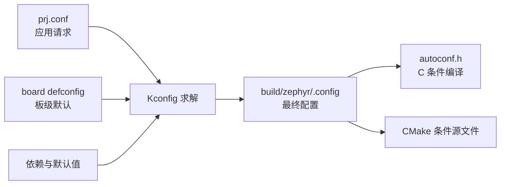
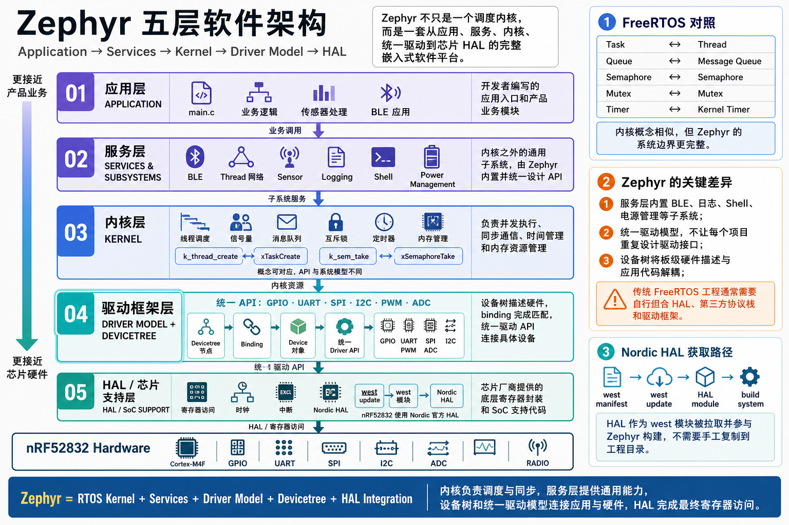
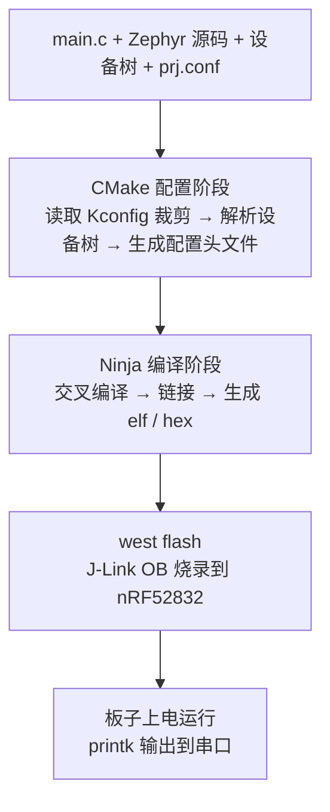
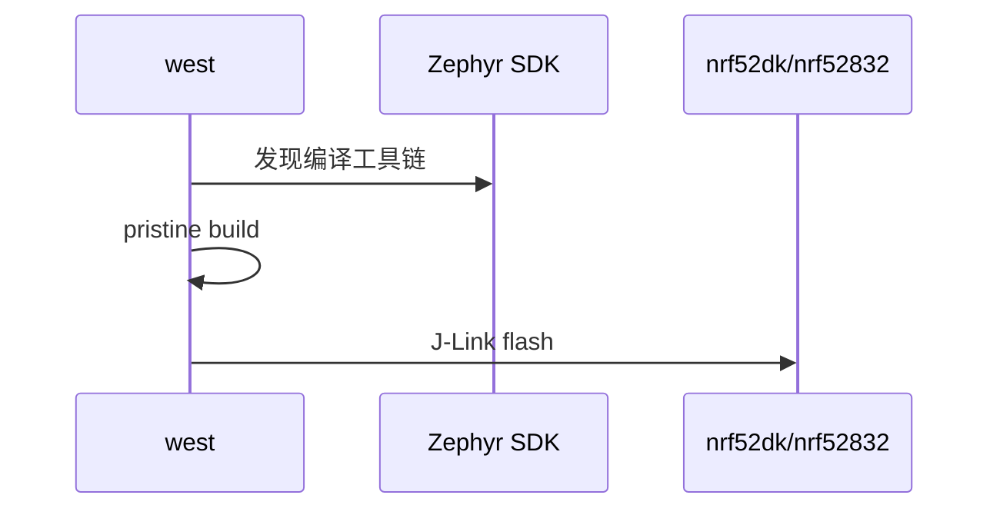

## 从 FreeRTOS 到 Zephyr：一次思维跃迁

如果你已经用 FreeRTOS 做过几个项目，手里的板子是 STM32 或者 ESP32，工程里是 `Makefile` 或 Keil 工程，任务用 `xTaskCreate` 创建、队列用 `xQueueSend` 收发——那么欢迎来到 Zephyr 的世界。

先说结论：**Zephyr 不是一个“把 FreeRTOS API 换个名字”的内核，而是一套把内核、驱动、配置、构建和协议栈放进同一工程模型的嵌入式操作系统。**

FreeRTOS 本质上是一个**内核库**：它提供任务、队列、信号量这些调度原语，但外设驱动、协议栈、构建系统都要你自己去找、自己去拼。跑 BLE 要集成第三方的协议栈，换个芯片要移植 HAL，工程结构千人千面。

Zephyr 则把这些部分放进同一个版本化系统：内核决定线程如何运行，Kconfig 决定哪些能力被编译，Devicetree 描述这块板上的硬件连接，驱动模型把硬件节点变成可调用的设备对象，CMake/Ninja 完成编译，west 管理工作区并把构建、烧录等命令组织起来。

先把几个经常混淆的名词分开：

| 名词 | 它解决什么 | 它不是什么 |
| --- | --- | --- |
| Zephyr kernel | 调度、同步、超时、内存等运行时机制 | 不是完整 Zephyr 的全部 |
| Zephyr OS | 内核、驱动、子系统、构建描述和工具约定 | 不是一个需要动态安装的桌面操作系统 |
| Zephyr SDK | 交叉编译器、调试器和主机工具集合 | 不包含你的应用源码，也不负责依赖版本 |
| west workspace | 由 manifest 管理的一组 Git 仓库与应用 | 不是编译器，也不取代 CMake |
| board target | 一组 SoC、板级 DTS、默认配置和 runner 选择 | 不只是一个预定义宏 |

这个区分很重要：遇到“找不到板”“Kconfig 依赖不满足”“编译器不存在”时，它们分别属于板级描述、配置图和 SDK 工具链问题，不能都归结为“Zephyr 环境坏了”。

对 FreeRTOS 老兵来说，学 Zephyr 最大的障碍不是线程和信号量，而是**从“手工拼工程”转向“由声明驱动构建和设备生成”**。本篇先建立这套心智模型，再安装工具；Hello World 只是验证模型闭环的最小实验。

## 一、Zephyr 是什么：三个关键词

**关键词一：west + CMake + Kconfig（构建系统）**

这三个名字经常被统称为“Zephyr 构建系统”，但职责不同：

- **west 管工作区和命令入口**：它读取 manifest 同步仓库，也把 build、flash、debug 等扩展命令统一暴露出来。west 不解析 C 文件，也不是编译器。
- **CMake 生成构建图**：它决定应用、内核、驱动和库的哪些源文件进入 Ninja 构建，并传递 include、编译选项和链接规则。
- **Kconfig 求解配置图**：它处理布尔值、整数、字符串、默认值、依赖和 select/imply 关系，最终得到一份自洽配置。

FreeRTOS 工程常用头文件宏直接裁剪功能。Zephyr 则把“用户意图”和“最终结果”分开：应用在 `prj.conf` 写请求，Kconfig 合并板级默认值和依赖后生成 `build/zephyr/.config`，再生成 C 可见的 `autoconf.h`。因此 `prj.conf` 不是简单复制成头文件，写了 `CONFIG_X=y` 也不代表依赖一定满足。

例如：

```ini
# 请求启用日志子系统。
CONFIG_LOG=y

# 请求启用 Bluetooth Host；实际还会触发其依赖检查。
CONFIG_BT=y
```

这两行表达的是“应用需要什么”，不是“编译器立刻定义两个宏”。配置过程可以概括为：



【图 1：Kconfig 从多个输入求出最终配置，而不是复制 prj.conf】

相比 `#define configUSE_TIMERS 1`，Kconfig 的价值不是“换一种宏语法”，而是把配置变成可搜索、可校验、可复现的依赖图。排查问题时应查看最终 `.config`，不能只看 `prj.conf`。

**关键词二：Devicetree（设备树）**

Devicetree 是**构建期硬件描述**。它用树形文本描述 SoC 外设、板级连接、总线层级、中断、引脚和外接器件。与 Linux 常见的运行时 DTB 不同，Zephyr 通常在构建时解析 DTS，把结果生成 C 宏和设备初始化数据；固件启动后不是再读取一遍文本文件。

一个节点能否变成可用设备，要经过三层关系：

1. **节点描述实例**：地址、IRQ、GPIO、总线父节点等“这块板上有什么”。
2. **binding 解释属性**：`compatible` 对应的 YAML 规定属性类型、必选项和语义。
3. **驱动实例化设备对象**：匹配驱动读取生成宏，创建 `struct device`；应用再通过统一 API 使用它。

```dts
&uart0 {
    /* status 决定该节点是否参与当前固件构建。 */
    status = "okay";

    /* 属性值由 UART binding 定义，不是任意字符串。 */
    current-speed = <115200>;
};
```

这段 overlay 只覆盖已有 `uart0` 节点：把状态改为可用，并设置默认波特率。`&uart0` 是节点标签引用；`status = "okay"` 不等于硬件已经初始化成功，它只让满足依赖的驱动实例进入构建。运行时仍要用 `device_is_ready()` 检查驱动初始化结果。

应用通过 `DEVICE_DT_GET(DT_NODELABEL(uart0))` 获得编译期确定的设备对象地址。它不执行字符串查找，也不会“动态发现”UART。寄存器基址、IRQ 等底层信息由 SoC DTS 和驱动消费，应用只面向 UART API。

设备树提高的是**硬件连接与驱动逻辑的分离程度**，不是保证 C 代码在任意板上原样运行。真正可移植还要求目标板提供相同 alias/chosen、兼容驱动和相近能力。例如应用使用 `DT_ALIAS(led0)` 时，换板只需新板也定义 `led0`；若应用硬编码 `DT_NODELABEL(uart0)` 或依赖 Nordic 专有属性，移植仍要改代码。

**关键词三：生态（协议栈 + 驱动 + 工具链一体）**

“生态”不等于仓库里文件很多，而是各部分遵守同一组契约：

- 驱动按设备类别提供统一 API，例如 GPIO 和 sensor API；应用不直接调用某家芯片 HAL。
- 网络、Bluetooth、USB、文件系统、日志等子系统都由 Kconfig 管理依赖，并接入同一构建和初始化模型。
- CMSIS、厂商 HAL、加密库等外部代码由 west manifest 固定版本，不靠开发者手工复制目录。
- board、shield、sample 和 test 使用相同的目标命名和构建入口，CI 能复用本地命令。

这带来的是**有条件的可移植性**。如果两个目标板都提供相同设备类别、alias 和配置能力，应用层通常不需要改业务逻辑；如果硬件能力不同，Kconfig、overlay 甚至业务策略仍要调整。统一 API 降低了移植成本，但不能消除硬件差异。

nRF52 DK 是官方维护目标，SoC、板级 DTS、默认配置和 J-Link runner 已经接入这套契约，所以最小应用只需选择 `nrf52dk/nrf52832`，无需从启动文件和链接脚本开始搭建。

## 二、Zephyr 架构全景



这张分层图表达的是职责依赖，不代表一次函数调用一定逐层穿过。应用调用 `gpio_pin_set_dt()` 时会进入 GPIO 驱动 API；Bluetooth Host 处理协议时则主要使用内核同步、控制器和网络缓冲区。

还要区分**构建期**和**运行期**：

| 阶段 | 发生什么 | 典型产物或状态 |
| --- | --- | --- |
| CMake 配置期 | 选择 board，合并 Kconfig，展开 Devicetree，收集源文件 | `.config`、`autoconf.h`、`devicetree_generated.h`、Ninja 构建图 |
| 编译链接期 | 编译应用/内核/驱动，链接 iterable sections 和设备对象 | `zephyr.elf`、`zephyr.map`、`zephyr.hex` |
| 内核启动期 | 初始化内核对象，按 init level 初始化设备与子系统 | 设备 ready 或初始化失败 |
| 应用运行期 | `main` 线程与静态线程进入调度，业务通过统一 API 使用设备 | 日志、事件、协议状态与硬件 I/O |

Zephyr 中的 `main()` 不是复位后直接跳转的裸机入口，而是内核创建的 main 线程入口。很多设备会在 main 之前按初始化级别完成 probe；这解释了为什么应用拿到 `struct device` 后仍要检查 `device_is_ready()`，也解释了设备依赖顺序为什么是系统设计的一部分。

一句话总结：**内核只负责运行时基础机制，Zephyr 的主要工程价值来自构建期声明、标准设备模型和版本化子系统共同形成的闭环。**

## 三、硬件与工具链准备

本系列固定使用 **nRF52832 DK**（官方型号 PCA10040）：

- 主控：**nRF52832-QFAA**，Cortex-M4F @ 64MHz
- 存储：**512KB Flash / 64KB RAM**
- 无线：BLE 5、2.4GHz 私有协议、ANT
- 板载：J-Link OB 调试器（USB 供电 + 烧录 + 串口）、4 个 LED、4 个按键、SMA 天线

选它的理由很实在：**64KB RAM 是"紧"的**。跑 Zephyr 内核 + BLE 协议栈 + 应用，RAM 必须精打细算——这种资源约束下的工程取舍，正是 Zephyr 实战最有价值的部分。而且 nRF52 是蓝牙物联网岗位的高频芯片，和 BLE 应用篇天然契合。

开发工具链采用 **VSCode + 官方插件**，与 Zephyr 官方推荐的 IDE 工作流一致。整体工具链结构：

```
VSCode（编辑器/插件）
  ├── C/C++ Extension Pack（代码导航/补全/调试）
  ├── nRF Kconfig / nRF DeviceTree 扩展（配置与设备树支持）
  └── 终端：west / cmake / ninja（构建命令）
         ├── west（Zephyr 元工具：仓库管理 + 构建 + 烧录）
         ├── Zephyr SDK（交叉编译器 + 烧录/调试工具）
         └── J-Link（板载调试器驱动）
```

## 四、环境搭建（Windows 为例）

以下步骤以 Windows 10/11 原生环境为例。这样 J-Link、虚拟串口和 USB 驱动直接由 Windows 使用，构建与烧录处于同一环境。WSL 可以承担部分构建工作，但 USB 转发、路径和宿主工具会增加额外变量，不作为本系列主线。

**第一步：用 winget 安装系统依赖**

Windows 10/11 自带 winget 包管理器。打开 cmd 或 PowerShell，执行：

```powershell
winget install Kitware.CMake Ninja-build.Ninja oss-winget.gperf Python.Python.3.12 Git.Git oss-winget.dtc wget 7zip.7zip
```

装完后**关闭并重新打开终端**（让 PATH 生效）。如提示找不到 7-Zip，把 7-Zip 安装目录加入 PATH。

验证最低版本要求（Zephyr 4.4 官方要求 CMake ≥ 3.20.5、Python ≥ 3.12、dtc ≥ 1.4.6）：

```powershell
cmake --version
python --version
dtc --version
```

> ⚠️ Windows 下命令是 `python`（不是 `python3`）。若提示找不到 `python`，重装 Python 3.12 时勾选 **Add Python to PATH**。

**第二步：创建 Python 虚拟环境并安装 west**

Zephyr 的工具链（west 及一堆 Python 依赖）装在独立 venv 里，避免污染系统 Python：

```powershell
cd $Env:HOMEPATH
python -m venv zephyrproject\.venv
```

激活虚拟环境。PowerShell 首次需放开脚本执行权限，然后执行激活脚本：

```powershell
Set-ExecutionPolicy -ExecutionPolicy RemoteSigned -Scope CurrentUser
zephyrproject\.venv\Scripts\Activate.ps1
```

（cmd 用户用 `zephyrproject\.venv\Scripts\activate.bat` 激活）

激活后提示符前缀出现 `(.venv)`，然后安装 west：

```powershell
pip install west
```

> ⚠️ 每次打开新终端都要先重新激活 venv（执行 `Activate.ps1`），否则找不到 west。这是新手最常踩的坑。

**第三步：拉取 Zephyr 源码**

```powershell
# 创建固定在 Zephyr v4.4.0 manifest 的工作区。
west init -m https://github.com/zephyrproject-rtos/zephyr `
  --mr v4.4.0 zephyrproject

cd zephyrproject

# 按 manifest 记录的 revision 同步 HAL、CMSIS 等模块。
west update
```

`west init` 创建的不是普通单仓库项目，而是一个 workspace。根目录的 `.west/config` 记录 manifest 仓库位置；`zephyr/west.yml` 再记录模块 URL、路径和 revision。`west update` 按这些 revision 检出 Nordic HAL、CMSIS、MCUboot 等依赖，因此同一 manifest 能复现一组相互兼容的源码版本。

```text
zephyrproject/
├── .west/          # workspace 元数据，不是源代码
├── zephyr/         # manifest 仓库和 Zephyr 主源码
├── modules/        # HAL、库和第三方模块
├── bootloader/     # 例如 MCUboot
└── tools/          # 部分主机工具
```

`west topdir` 用来确认当前命令属于哪个 workspace。不要手工把模块目录复制到应用旁边，否则 manifest 将无法保证版本一致。

**第四步：导出 CMake 包并安装 Python 依赖**

```powershell
west zephyr-export
cmd /c zephyr\scripts\utils\west-packages-pip-install.cmd
```

第一条把 Zephyr 注册到 CMake 的用户包注册表，让应用构建时能自动 `find_package(Zephyr)`；第二条安装 Zephyr 运行所需的 Python 包（与拉取的版本严格匹配）。

**第五步：安装 Zephyr SDK**

SDK 包含所有架构的交叉编译器（arm-none-eabi-gcc 等）和烧录/调试工具，Windows 版官方直接支持：

```powershell
cd $Env:HOMEPATH\zephyrproject\zephyr
west sdk install
```

安装完成后验证工具链可用：

```powershell
where west
west --version
```

看到版本号输出即表示命令行环境就绪。

## 五、VSCode + 插件集成

命令行能编译了，接下来把 VSCode 配成"开箱即用"的 Zephyr 开发环境。

**第一步：安装 VSCode 扩展**

在扩展市场搜索并安装：

| 扩展 | 发布者 | 用途 |
|------|--------|------|
| **C/C++ Extension Pack** | Microsoft | 代码补全、跳转、lint、调试（必需） |
| **nRF Kconfig** | Nordic Semiconductor | Kconfig 文件语法高亮与跳转（强烈推荐） |
| **nRF DeviceTree** | Nordic Semiconductor | 设备树 .dts/.overlay 语法支持（强烈推荐） |
| **Linker Map Viewer** | 任选可信扩展 | 辅助浏览 map；也可以直接用文本搜索 |

其中 **C/C++ Extension Pack 是官方指南要求的核心**，后两个 Nordic 扩展让 Kconfig 和设备树文件的阅读体验大幅提升。

**第二步：打开工作区**

在 VSCode 中选择 `文件 → 打开文件夹`，打开 `C:\Users\<你的用户名>\zephyrproject`（Zephyr workspace 根目录，即刚才 `west init` 创建的目录）。如果提示信任工作区，选择信任。

**第三步：生成 compile_commands.json**

C/C++ 扩展要做代码导航和智能提示，必须知道"每个源文件用什么参数编译"。这个信息由构建系统生成：在 VSCode 内置终端（`` Ctrl+` ``）中执行一次构建：

```powershell
cd $Env:HOMEPATH\zephyrproject\zephyr
west build -p always -b nrf52dk/nrf52832 samples/hello_world
```

构建成功后，`zephyr\build\compile_commands.json`（相对 workspace 根目录）就生成了。这个文件记录了所有编译命令，是 VSCode 智能提示的"地图"。

**第四步：配置 C/C++ 扩展读取编译数据库**

进入 `文件 → 首选项 → 设置`，搜索 `C_Cpp > Default: Compile Commands`，把值设为：

```
zephyr/build/compile_commands.json
```

保存后打开 `samples/hello_world/src/main.c`，你会发现：`#include <zephyr/kernel.h>` 不再报红色波浪线，`k_msleep`、`printk` 这些函数可以 `Ctrl+点击` 直接跳转到 Zephyr 源码定义——Zephyr 的代码导航就这样打通了。

> 💡 原理：compile_commands.json 相当于"全工程索引"，C/C++ 扩展据此知道每个文件的 include 路径和编译选项，这也是 Linux 内核开发者常用的做法。

**进阶选项：nRF Connect for VS Code**

如果你后续要做 Nordic 深度开发（BLE、DFU、低功耗全流程），Nordic 官方还有一个一体化插件 **nRF Connect for VS Code**（扩展市场搜 "nRF Connect"）。它把 SDK 管理、构建配置、烧录、调试、串口监视整合到侧边栏，Windows 用户用它几乎可以"零命令行"完成开发。本系列主线仍以标准 Zephyr 工作流为准，遇到 Nordic 特有内容时会单独说明。

## 六、Hello World 实战：跑通第一块板

**第一步：确认板名**

Zephyr 4.x 中 nRF52 DK 是支持多 SoC 的板卡（52832 / 52810 / 52805），构建时用斜杠指定目标芯片：

```powershell
west boards | Select-String nrf52dk
```

输出里应能看到 `nrf52dk/nrf52832`。注意：旧版 Zephyr 的板名是 `nrf52dk_nrf52832`（下划线），4.x 起统一为 `nrf52dk/nrf52832` 这种"板卡/芯片"格式，网上老教程的板名如果报错，先查这一条。

**第二步：构建 hello_world**

Hello World 的作用是验证 console、链接、内核启动和 main 线程，而不是展示复杂 API。一个等价的最小应用只有这些内容：

```c
#include <zephyr/kernel.h>
#include <zephyr/sys/printk.h>

/**
 * @brief 验证 main 线程和默认 console 已经可用。
 *
 * @return 0，表示 main 线程正常结束。
 */
int main(void)
{
    /* printk 直接写默认 console，适合最早期 bring-up。 */
    printk("Hello World from Zephyr\n");
    return 0;
}
```

代码里没有 nRF52832 寄存器、UART 初始化或 J-Link 配置，因为这些由 board target、Devicetree、console 配置和驱动初始化共同提供。`main` 返回只会结束 main 线程；内核和其他系统线程仍可以继续运行。正式应用通常使用 logging 子系统获得级别、模块名和后端缓冲，而不是把 `printk` 当成完整日志框架。

```powershell
cd $Env:HOMEPATH\zephyrproject\zephyr
west build -p always -b nrf52dk/nrf52832 samples/hello_world
```

`-p always` 表示每次强制全量重编（pristine build），避免残留配置干扰。第一次编译要几分钟，之后增量编译很快。

构建成功后会出现目标完成信息和内存区域统计。下面的数字只是格式示意，实际值会随 Zephyr patch、工具链和配置变化：

```
[100%] Built target zephyr_final
Memory region         Used Size  Region Size  %age Used
           FLASH:       40968 B       512 KB      7.82%
             RAM:        12336 B        64 KB     18.83%
```

重点不是记住示例数字，而是理解统计边界：FLASH 通常反映最终链接进镜像的只读段，RAM 包含静态数据、内核对象和已链接栈等静态区域，但不能证明运行期堆、最深调用栈和协议峰值一定安全。后续每次增加 BLE 缓冲区或线程，都要比较 map、Kconfig 和运行时高水位。

构建产物都在 `build/` 目录里，常用几个：

```
build/zephyr/zephyr.elf         # 带调试信息的 ELF
build/zephyr/zephyr.hex         # 烧录文件
build/zephyr/zephyr.map         # 链接映射（查内存占用神器）
build/compile_commands.json     # VSCode 索引
```



**第三步：烧录**

nRF52 DK 用 USB 线连接电脑（板载 J-Link OB 同时负责供电、烧录和串口）：

```bash
west flash
```

`west flash` 默认使用板载 J-Link runner。Windows 下只需从 SEGGER 官网安装 **J-Link Software Pack**（安装后会自动注册驱动），`west flash` 即可直接识别板载调试器。

烧录成功后，板子自动复位运行。

**第四步：看串口输出**

hello_world 的输出通过板载 J-Link 虚拟串口（VCOM）发出。Windows 下打开 **设备管理器 → 端口（COM 和 LPT）**，能看到一个 `JLink CDC UART Port (COMx)`，记下这个 COM 口号，波特率 **115200**：

```powershell
# 方式一：MobaXterm / PuTTY / 串口助手，选择 COMx，波特率 115200
# 方式二：VSCode 安装 Serial Monitor 扩展，选择 COMx + 115200
```

按下板子上的复位键（RESET），串口应该打印：

```
*** Booting Zephyr OS build zephyr-v4.4.0 ***
Hello World! nrf52dk/nrf52832
```

第一行是 Zephyr 引导横幅（含版本号），第二行就是你的第一个 Zephyr 应用输出。到这一步，**开发环境闭环已经打通**：写代码 → 构建 → 烧录 → 看输出。

如果想看到 LED 闪烁（更有"硬件动起来"的感觉），可以把示例换成 blinky：

```bash
west build -p always -b nrf52dk/nrf52832 samples/basic/blinky
west flash
```

板上 LED0 会按样例定义的周期翻转；具体周期以该版本样例源码中的 `SLEEP_TIME_MS` 为准。

### Zephyr 4.4.x 命令核对

本文所有命令以 **Zephyr 4.4.x** 和 `nrf52dk/nrf52832` 为准。Windows 上按官方 [Getting Started](https://docs.zephyrproject.org/4.4.0/develop/getting_started/index.html) 安装 Python、CMake、Ninja、west 与 Zephyr SDK；不要在应用 CMake 中硬编码 SDK 路径。

```powershell
west --version
west sdk list
west boards | Select-String nrf52dk
west build -p always -b nrf52dk/nrf52832 samples/hello_world
west flash
```

预期生成 `build/zephyr/zephyr.elf` 并在串口出现 Hello World banner（具体文本随样例 patch 变化）；这是预期步骤，不是本地硬件成功声明。`-p always` 清除旧 board/Kconfig/DTS 缓存。`west` 找不到时检查 Python Scripts PATH；SDK/compiler 找不到时以 `west sdk list` 和官方安装步骤修复；烧录找不到 probe 时检查 USB 数据线、J-Link 驱动与板载调试器。



## 七、里程碑自检

完成本讲后，你应该能确认以下几点：

- [ ] 能区分 Zephyr kernel、Zephyr OS、SDK、west workspace 和 board target。
- [ ] 能解释 `prj.conf → .config → autoconf.h` 的配置流，而不是把 Kconfig 当成普通宏文件。
- [ ] 能解释 Devicetree 如何通过 binding 和生成宏形成设备对象，知道它不是运行时硬件扫描。
- [ ] `west --version` 能正常输出，激活 venv（`Activate.ps1`）成为肌肉记忆
- [ ] 知道 `west init / west update / west zephyr-export / west sdk install` 各自干什么
- [ ] VSCode 中打开 Zephyr 源码能跳转、无红波浪线
- [ ] `west build -p always -b nrf52dk/nrf52832 samples/hello_world` 一次成功
- [ ] `west flash` 烧录后串口看到 `Hello World! nrf52dk/nrf52832`
- [ ] 知道静态 FLASH/RAM 报告不能替代运行期堆和栈峰值测量。

## 动手练习

1. 把 hello_world 的 `printk` 字符串改成你自己的内容，重新构建烧录，确认串口输出变化。
2. 运行 `west build -t menuconfig`（或 `-t guiconfig`），在 Kconfig 界面里浏览一下有哪些配置项，感受 Zephyr 的配置体系（只浏览，不修改）。
3. 在 VSCode 中打开 `build/zephyr/zephyr.map`，搜索 `main`，看看你的应用函数链接在哪个 Flash 地址——为后面链接脚本的专题埋个伏笔。
4. 用 `west flash --runner jlink` 和 `west flash --runner nrfjprog` 各试一次（如果安装了对应工具），体会 Zephyr "runner 抽象"：同一套烧录命令可以适配不同调试器。

> 🏷️ 标签：Zephyr · RTOS · west · CMake · Kconfig · Devicetree · nRF52832 · Nordic · 环境搭建 · VSCode · 嵌入式开发
