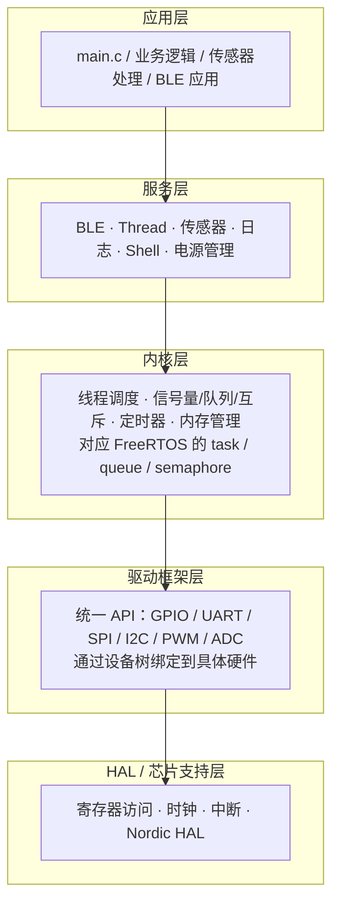
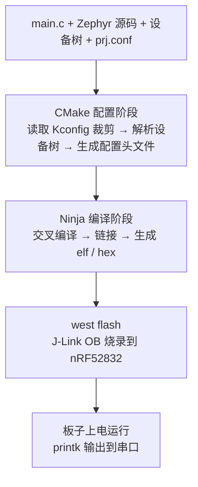

## 从 FreeRTOS 到 Zephyr：一次思维跃迁

如果你已经用 FreeRTOS 做过几个项目，手里的板子是 STM32 或者 ESP32，工程里是 `Makefile` 或 Keil 工程，任务用 `xTaskCreate` 创建、队列用 `xQueueSend` 收发——那么欢迎来到 Zephyr 的世界。

先说结论：**Zephyr 不是一个"FreeRTOS 的替代品"，而是一整套嵌入式操作系统生态**。

FreeRTOS 本质上是一个**内核库**：它提供任务、队列、信号量这些调度原语，但外设驱动、协议栈、构建系统都要你自己去找、自己去拼。跑 BLE 要集成第三方的协议栈，换个芯片要移植 HAL，工程结构千人千面。

Zephyr 则像嵌入式世界里的"Linux 体验"：它由 Linux 基金会托管，内置了**构建系统（Kconfig + CMake + west）**、**设备树（Devicetree）硬件描述**、**统一的驱动框架**，以及 BLE / Thread / Zigbee / WiFi 等一整套协议栈。你拿到一块官方支持的板子，`west build` + `west flash` 两步就能跑起来——这种体验和 FreeRTOS 时代"配环境两小时"是完全不同的。

对 FreeRTOS 老兵来说，学 Zephyr 最大的障碍不是内核概念（线程、队列、信号量你全会），而是**它的工程范式**。本系列默认你已经懂 RTOS 基础，只讲差异：Kconfig 怎么裁剪、设备树怎么描述硬件、驱动怎么注册、BLE 怎么写。第一讲，先把环境搭起来，让 nRF52832 DK 跑通 Hello World。

## 一、Zephyr 是什么：三个关键词

**关键词一：west + CMake + Kconfig（构建系统）**

FreeRTOS 的工程：一堆 `.c/.h` 文件 + 一个 Makefile 或 IDE 工程，用宏定义裁剪功能。Zephyr 的工程：`west` 管理代码仓库和依赖，`CMake` 组织编译，`Kconfig` 负责配置裁剪。

Kconfig 你可能在 Linux 内核里见过——`menuconfig` 那个界面。Zephyr 完全复用了这套机制：每个模块都有 Kconfig 选项，应用通过 `prj.conf` 文件集中配置，比如：

```ini
CONFIG_LOG=y
CONFIG_BT=y
```

一行配置开启日志，一行配置开启蓝牙协议栈。相比 FreeRTOS 的 `#define configUSE_TIMERS 1`，Kconfig 的优势是**全量可搜索、依赖自动解析、配置与代码分离**。后面专门有一讲深入 Kconfig。

**关键词二：Devicetree（设备树）**

设备树（DT）是从 Linux 继承下来的硬件描述语言：用一个 `.dts` 文本文件描述板子上有什么外设、挂在哪条总线上、引脚怎么接。代码不直接写寄存器地址，而是通过设备树节点获取硬件信息。

```dts
&uart0 {
    status = "okay";
    current-speed = <115200>;
};
```

这段的意思是：启用 UART0，波特率 115200。驱动代码里用 `DEVICE_DT_GET(DT_NODELABEL(uart0))` 拿到这个设备，完全不用关心 UART0 的寄存器基地址是多少——地址在设备树里已经描述了。

这解决了 FreeRTOS 生态里最头疼的问题：**同一个驱动代码，换一块板子，改设备树就行，不用改 C 代码**。对应关系可以这么记：FreeRTOS 时代改引脚要改 `GPIO_InitTypeDef` 初始化代码，Zephyr 时代改引脚只改 `.overlay` 设备树文件。

**关键词三：生态（协议栈 + 驱动 + 工具链一体）**

Zephyr 内置了驱动框架（GPIO / UART / SPI / I2C / PWM / ADC 全都有统一 API）和协议栈（BLE / 802.15.4 / WiFi / Ethernet / USB）。官方支持 800+ 开发板，你的 nRF52832 DK 就是官方维护的板级之一。这意味着：**你写的应用代码，理论上可以原样编译到任何一块官方支持的板子上**。这在 FreeRTOS 世界几乎不可想象。

## 二、Zephyr 架构全景

理解了三个关键词，再看整体架构就清楚了。Zephyr 从上到下分五层：



- **应用层**：你写的 `main.c` 和业务模块。
- **服务层**：BLE、日志、Shell 等"内核之外"的子系统。FreeRTOS 里这些要自己找第三方库，Zephyr 内置且经过统一 API 设计。
- **内核层**：调度、同步、内存管理。概念与 FreeRTOS 一一对应，但 API 不同（`k_thread_create` 对应 `xTaskCreate`，`k_sem_take` 对应 `xSemaphoreTake`）。
- **驱动层**：统一驱动模型 + 设备树绑定，这是和 FreeRTOS 差异最大的地方，后续专门展开。
- **HAL 层**：芯片厂商提供的寄存器封装。nRF52832 用的是 Nordic 官方 HAL，Zephyr 以 west 模块方式引入，随 `west update` 一起拉取。

一句话总结这张图：**内核只占很小一部分，Zephyr 的价值在"内核之上的生态"和"内核之下的标准化"**。

## 三、硬件与工具链准备

本系列固定使用 **nRF52832 DK**（官方型号 PCA10040）：

- 主控：**nRF52832-QFAA**，Cortex-M4F @ 64MHz
- 存储：**512KB Flash / 64KB RAM**
- 无线：BLE 5、2.4GHz 私有协议、ANT
- 板载：J-Link OB 调试器（USB 供电 + 烧录 + 串口）、4 个 LED、4 个按键、SMA 天线

选它的理由很实在：**64KB RAM 是"紧"的**。跑 Zephyr 内核 + BLE 协议栈 + 应用，RAM 必须精打细算——这种资源约束下的工程取舍，正是 Zephyr 实战最有价值的部分。而且 nRF52 是蓝牙物联网岗位的高频芯片，和 BLE 应用篇天然契合。

开发工具链采用 **VSCode + 官方插件**，与 Zephyr 官方推荐的 IDE 工作流一致。整体工具链结构：

```
VSCode（编辑器/插件）
  ├── C/C++ Extension Pack（代码导航/补全/调试）
  ├── nRF Kconfig / nRF DeviceTree 扩展（配置与设备树支持）
  └── 终端：west / cmake / ninja（构建命令）
         ├── west（Zephyr 元工具：仓库管理 + 构建 + 烧录）
         ├── Zephyr SDK（交叉编译器 + 烧录/调试工具）
         └── J-Link（板载调试器驱动）
```

## 四、环境搭建（Windows 为例）

以下步骤以 Windows 10/11 为例，与 Zephyr 官方 Getting Started 一致。官方推荐的命令行工具是 **Windows Terminal**（Microsoft Store 可安装）。**不建议使用 WSL**：Zephyr 官方目前不支持在 WSL 中烧录调试（会找不到 USB 设备），直接在 Windows 原生环境开发。

**第一步：用 winget 安装系统依赖**

Windows 10/11 自带 winget 包管理器。打开 cmd 或 PowerShell，执行：

```powershell
winget install Kitware.CMake Ninja-build.Ninja oss-winget.gperf Python.Python.3.12 Git.Git oss-winget.dtc wget 7zip.7zip
```

装完后**关闭并重新打开终端**（让 PATH 生效）。如提示找不到 7-Zip，把 7-Zip 安装目录加入 PATH。

验证最低版本要求（Zephyr 4.4 官方要求 CMake ≥ 3.20.5、Python ≥ 3.12、dtc ≥ 1.4.6）：

```powershell
cmake --version
python --version
dtc --version
```

> ⚠️ Windows 下命令是 `python`（不是 `python3`）。若提示找不到 `python`，重装 Python 3.12 时勾选 **Add Python to PATH**。

**第二步：创建 Python 虚拟环境并安装 west**

Zephyr 的工具链（west 及一堆 Python 依赖）装在独立 venv 里，避免污染系统 Python：

```powershell
cd $Env:HOMEPATH
python -m venv zephyrproject\.venv
```

激活虚拟环境。PowerShell 首次需放开脚本执行权限，然后执行激活脚本：

```powershell
Set-ExecutionPolicy -ExecutionPolicy RemoteSigned -Scope CurrentUser
zephyrproject\.venv\Scripts\Activate.ps1
```

（cmd 用户用 `zephyrproject\.venv\Scripts\activate.bat` 激活）

激活后提示符前缀出现 `(.venv)`，然后安装 west：

```powershell
pip install west
```

> ⚠️ 每次打开新终端都要先重新激活 venv（执行 `Activate.ps1`），否则找不到 west。这是新手最常踩的坑。

**第三步：拉取 Zephyr 源码**

```powershell
west init zephyrproject
cd zephyrproject
west update
```

`west init` 创建 workspace 并克隆 Zephyr 主仓库，`west update` 按 manifest 拉取所有依赖模块（Nordic HAL、CMSIS、工具脚本等，约 1~2GB，耐心等待）。

**第四步：导出 CMake 包并安装 Python 依赖**

```powershell
west zephyr-export
cmd /c zephyr\scripts\utils\west-packages-pip-install.cmd
```

第一条把 Zephyr 注册到 CMake 的用户包注册表，让应用构建时能自动 `find_package(Zephyr)`；第二条安装 Zephyr 运行所需的 Python 包（与拉取的版本严格匹配）。

**第五步：安装 Zephyr SDK**

SDK 包含所有架构的交叉编译器（arm-none-eabi-gcc 等）和烧录/调试工具，Windows 版官方直接支持：

```powershell
cd $Env:HOMEPATH\zephyrproject\zephyr
west sdk install
```

安装完成后验证工具链可用：

```powershell
where west
west --version
```

看到版本号输出即表示命令行环境就绪。

## 五、VSCode + 插件集成

命令行能编译了，接下来把 VSCode 配成"开箱即用"的 Zephyr 开发环境。

**第一步：安装 VSCode 扩展**

在扩展市场搜索并安装：

| 扩展 | 发布者 | 用途 |
|------|--------|------|
| **C/C++ Extension Pack** | Microsoft | 代码补全、跳转、lint、调试（必需） |
| **nRF Kconfig** | Nordic Semiconductor | Kconfig 文件语法高亮与跳转（强烈推荐） |
| **nRF DeviceTree** | Nordic Semiconductor | 设备树 .dts/.overlay 语法支持（强烈推荐） |
| **GNU Linker Map files** | ... | 链接脚本/内存映射可视化（可选） |

其中 **C/C++ Extension Pack 是官方指南要求的核心**，后两个 Nordic 扩展让 Kconfig 和设备树文件的阅读体验大幅提升。

**第二步：打开工作区**

在 VSCode 中选择 `文件 → 打开文件夹`，打开 `C:\Users\<你的用户名>\zephyrproject`（Zephyr workspace 根目录，即刚才 `west init` 创建的目录）。如果提示信任工作区，选择信任。

**第三步：生成 compile_commands.json**

C/C++ 扩展要做代码导航和智能提示，必须知道"每个源文件用什么参数编译"。这个信息由构建系统生成：在 VSCode 内置终端（`` Ctrl+` ``）中执行一次构建：

```powershell
cd $Env:HOMEPATH\zephyrproject\zephyr
west build -p always -b nrf52dk/nrf52832 samples/hello_world
```

构建成功后，`zephyr\build\compile_commands.json`（相对 workspace 根目录）就生成了。这个文件记录了所有编译命令，是 VSCode 智能提示的"地图"。

**第四步：配置 C/C++ 扩展读取编译数据库**

进入 `文件 → 首选项 → 设置`，搜索 `C_Cpp > Default: Compile Commands`，把值设为：

```
zephyr/build/compile_commands.json
```

保存后打开 `samples/hello_world/src/main.c`，你会发现：`#include <zephyr/kernel.h>` 不再报红色波浪线，`k_msleep`、`printk` 这些函数可以 `Ctrl+点击` 直接跳转到 Zephyr 源码定义——Zephyr 的代码导航就这样打通了。

> 💡 原理：compile_commands.json 相当于"全工程索引"，C/C++ 扩展据此知道每个文件的 include 路径和编译选项，这也是 Linux 内核开发者常用的做法。

**进阶选项：nRF Connect for VS Code**

如果你后续要做 Nordic 深度开发（BLE、DFU、低功耗全流程），Nordic 官方还有一个一体化插件 **nRF Connect for VS Code**（扩展市场搜 "nRF Connect"）。它把 SDK 管理、构建配置、烧录、调试、串口监视整合到侧边栏，Windows 用户用它几乎可以"零命令行"完成开发。本系列主线仍以标准 Zephyr 工作流为准，遇到 Nordic 特有内容时会单独说明。

## 六、Hello World 实战：跑通第一块板

**第一步：确认板名**

Zephyr 4.x 中 nRF52 DK 是支持多 SoC 的板卡（52832 / 52810 / 52805），构建时用斜杠指定目标芯片：

```powershell
west boards | Select-String nrf52dk
```

输出里应能看到 `nrf52dk/nrf52832`。注意：旧版 Zephyr 的板名是 `nrf52dk_nrf52832`（下划线），4.x 起统一为 `nrf52dk/nrf52832` 这种"板卡/芯片"格式，网上老教程的板名如果报错，先查这一条。

**第二步：构建 hello_world**

```powershell
cd $Env:HOMEPATH\zephyrproject\zephyr
west build -p always -b nrf52dk/nrf52832 samples/hello_world
```

`-p always` 表示每次强制全量重编（pristine build），避免残留配置干扰。第一次编译要几分钟，之后增量编译很快。

构建成功的关键输出：

```
[100%] Built target zephyr_final
Memory region         Used Size  Region Size  %age Used
           FLASH:       40968 B       512 KB      7.82%
             RAM:        12336 B        64 KB     18.83%
```

注意看这两行——**这是 Zephyr 每次构建都给你打印的资源占用报告**。hello_world 只用了 4% Flash 和 19% RAM，心里就有底了：后面加 BLE、加传感器，RAM 的预算要开始算账了。

构建产物都在 `build/` 目录里，常用几个：

```
build/zephyr/zephyr.elf         # 带调试信息的 ELF
build/zephyr/zephyr.hex         # 烧录文件
build/zephyr/zephyr.map         # 链接映射（查内存占用神器）
build/compile_commands.json     # VSCode 索引
```



**第三步：烧录**

nRF52 DK 用 USB 线连接电脑（板载 J-Link OB 同时负责供电、烧录和串口）：

```bash
west flash
```

`west flash` 默认使用板载 J-Link runner。Windows 下只需从 SEGGER 官网安装 **J-Link Software Pack**（安装后会自动注册驱动），`west flash` 即可直接识别板载调试器。

烧录成功后，板子自动复位运行。

**第四步：看串口输出**

hello_world 的输出通过板载 J-Link 虚拟串口（VCOM）发出。Windows 下打开 **设备管理器 → 端口（COM 和 LPT）**，能看到一个 `JLink CDC UART Port (COMx)`，记下这个 COM 口号，波特率 **115200**：

```powershell
# 方式一：MobaXterm / PuTTY / 串口助手，选择 COMx，波特率 115200
# 方式二：VSCode 安装 Serial Monitor 扩展，选择 COMx + 115200
```

按下板子上的复位键（RESET），串口应该打印：

```
*** Booting Zephyr OS build zephyr-v4.4.0 ***
Hello World! nrf52dk/nrf52832
```

第一行是 Zephyr 引导横幅（含版本号），第二行就是你的第一个 Zephyr 应用输出。到这一步，**开发环境闭环已经打通**：写代码 → 构建 → 烧录 → 看输出。

如果想看到 LED 闪烁（更有"硬件动起来"的感觉），可以把示例换成 blinky：

```bash
west build -p always -b nrf52dk/nrf52832 samples/basic/blinky
west flash
```

板上 LED0 会以 100ms 间隔闪烁。

## 七、里程碑自检

完成本讲后，你应该能确认以下几点：

- [ ] `west --version` 能正常输出，激活 venv（`Activate.ps1`）成为肌肉记忆
- [ ] 知道 `west init / west update / west zephyr-export / west sdk install` 各自干什么
- [ ] VSCode 中打开 Zephyr 源码能跳转、无红波浪线
- [ ] `west build -p always -b nrf52dk/nrf52832 samples/hello_world` 一次成功
- [ ] `west flash` 烧录后串口看到 `Hello World! nrf52dk/nrf52832`
- [ ] 能看懂构建输出的 FLASH / RAM 占用报告

## 动手练习

1. 把 hello_world 的 `printk` 字符串改成你自己的内容，重新构建烧录，确认串口输出变化。
2. 运行 `west build -t menuconfig`（或 `-t guiconfig`），在 Kconfig 界面里浏览一下有哪些配置项，感受 Zephyr 的配置体系（只浏览，不修改）。
3. 在 VSCode 中打开 `build/zephyr/zephyr.map`，搜索 `main`，看看你的应用函数链接在哪个 Flash 地址——为后面链接脚本的专题埋个伏笔。
4. 用 `west flash --runner jlink` 和 `west flash --runner nrfjprog` 各试一次（如果安装了对应工具），体会 Zephyr "runner 抽象"：同一套烧录命令可以适配不同调试器。

> 🏷️ 标签：Zephyr · RTOS · west · CMake · Kconfig · Devicetree · nRF52832 · Nordic · 环境搭建 · VSCode · 嵌入式开发
