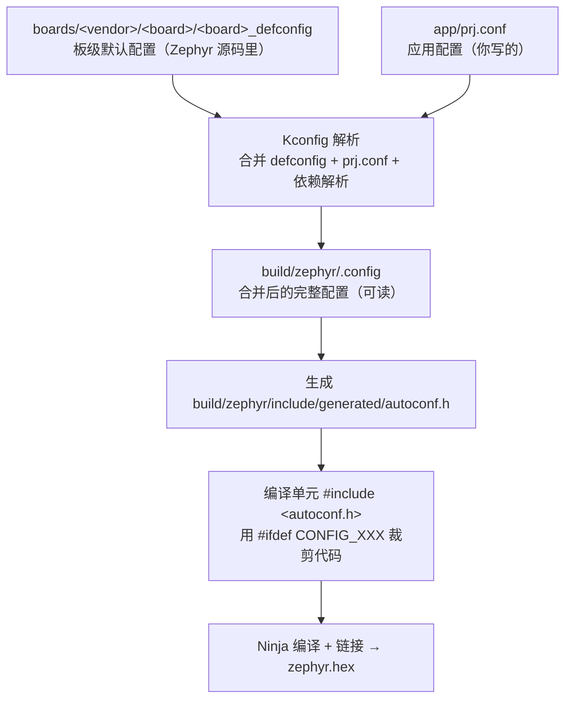
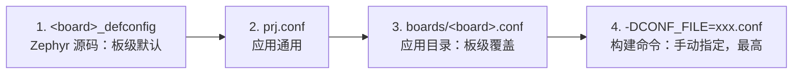

上一篇我们搭好了 Windows 开发环境，跑通了第一个 hello_world。编译能过只是起点——Zephyr 工程里真正决定"编译什么"的，是配置系统 **Kconfig**。这一讲把它和构建系统讲透：`prj.conf` 怎么生效、menuconfig 怎么用、多配置怎么管理。

## 一、从宏开关到配置系统

用过 FreeRTOS 的人，都经历过这种配置方式：打开 `FreeRTOSConfig.h`，手动改宏。

```c
#define configUSE_PREEMPTION     1
#define configUSE_TIMERS         1
#define configTOTAL_HEAP_SIZE    ( 8 * 1024 )
#define configMAX_PRIORITIES     5
```

这套方案能用，但三个痛点伴随整个项目周期：

- **不可搜索**：配置散落在头文件里，想确认某个功能开没开，只能翻文件；
- **依赖不自动**：开了定时器却不小心关掉队列支持，编译报错才被发现；
- **换板子要改代码**：不同芯片、不同应用，宏定义互相覆盖，维护靠自觉。

Zephyr 的答案是 **Kconfig**——Linux 内核同款配置系统。先给一个定义：

> **Kconfig 是构建期的配置系统**：配置项（符号）定义在 Kconfig 文件里，符号之间可以声明依赖关系，最终生成一个 C 头文件 `autoconf.h`，里面的宏在编译期生效。

对照记忆：

| FreeRTOS 世界 | Zephyr 世界 |
|:---|:---|
| `#define configUSE_TIMERS 1` | `CONFIG_TIMER=y`（写进 prj.conf） |
| 手动维护宏的开关关系 | Kconfig 的 `depends on` / `select` 自动解析依赖 |
| 配置就在头文件里 | 配置生成 `autoconf.h`，**不手写** |
| 每换一块板子复制一份配置 | 板级配置（defconfig）与应用配置（prj.conf）分层合并 |

Kconfig 最关键的能力是**依赖自动解析**：你只需要声明"我要 BLE"，Kconfig 会自动把 BLE 依赖的底层符号（控制器、随机数、定时器等）一并开启，不需要你逐个去找。

## 二、一次构建，配置怎么流转

Kconfig 不是独立运行的，它嵌在 CMake 构建流程里。一次 `west build` 的配置阶段做这些事：



两条结论值得刻进脑子：

1. **你写的 prj.conf 只是"增量"**。完整的配置是板级 defconfig 加上你的应用配置合并出来的，最终结果在 `build/zephyr/.config`。所以不用在 prj.conf 里写满所有选项——板级默认值已经替你填好了。
2. **配置是编译期的，不是运行期的**。`CONFIG_LOG=y` 翻译成 `#define CONFIG_LOG 1`，被裁掉的代码根本不参与编译，这就是"零运行时开销"的裁剪。

## 三、prj.conf 实战

在应用目录下建一个 `prj.conf`，写配置。语法很简单，`CONFIG_<符号名>=<值>`，等号两边不能有空格：

```ini
# 布尔型：y 开启，n 关闭
CONFIG_LOG=y

# 整型
CONFIG_SYSTEM_WORKQUEUE_STACK_SIZE=2048

# 字符串型（带引号）
CONFIG_BOOT_BANNER_STRING="Zephyr on nRF52832"

# 注释用 #
```

写一个真实例子。在 nRF52832 DK 上跑 hello_world，默认 `prj.conf` 几乎是空的（板级默认已够跑通）。加两行试试：

```ini
# prj.conf
CONFIG_LOG=y
CONFIG_BT=y
```

第一行开启日志子系统，第二行开启 BLE 协议栈。构建后打开 `build/zephyr/.config`，搜索 `CONFIG_BT`，会看到一长串被自动拉起的相关符号——这就是 Kconfig 的依赖解析在起作用。

**一个常见误区**：在 `.config` 里能看到 `# CONFIG_XXX is not set` 这种注释形式的 n。这是 Kconfig 保存"显式关闭"的格式，**只在生成的文件里出现，不要手动写进 prj.conf**——prj.conf 里关闭一个布尔符号直接写 `CONFIG_XXX=n` 即可。

> ⚠️ 如果某个符号写进 prj.conf 却不生效，先查它的依赖。用菜单界面跳到该符号，看"Depends on"一栏——依赖不满足时，赋值会被忽略并打印警告。

## 四、menuconfig：图形化配置

命令行的 prj.conf 适合"知道改什么"的场景；想探索"都有什么能改"，用交互界面：

```powershell
cd $Env:HOMEPATH\zephyrproject\zephyr
west build -p always -b nrf52dk/nrf52832 samples/hello_world -t menuconfig
```

menuconfig 是基于终端字符界面的配置工具：

- **方向键**导航，**回车**进入子菜单；
- **`/` 搜索**：输入符号名（如 `SYSTEM_WORKQUEUE_STACK_SIZE`），回车直达；
- **空格**切换布尔值，**数字**输入整型/字符串值；
- 修改后选 **Save**，配置写入 `build/zephyr/.config`，退出后重新 `west build` 生效。

想体验更好的图形界面，用 `-t guiconfig`（Windows 上 Python 自带 tkinter 即可运行），窗口化操作更直观。

**重要提醒**：menuconfig 改的是 build 目录里的 `.config`，**一旦执行 `west build -p`（pristine build）清空 build 目录，修改就丢了**。正确的姿势是：在菜单里试出想要的值 → 把关键项写回 `prj.conf` → 以后用文件维护。

## 五、多配置管理：不同场景不同配置

真实项目里，调试版和发布版要不同的配置：调试版开日志、开 shell、开断言；发布版全关、开优化、加安全选项。Zephyr 提供了干净的层次化方案。

**1. 板级覆盖：`boards/<board>.conf`**

在应用目录下建 `boards/` 子目录，放一个与板名同名的配置文件：

```
my_app/
├── CMakeLists.txt
├── prj.conf                 # 通用配置
├── boards/
│   └── nrf52dk_nrf52832.conf   # 仅该板生效的覆盖
└── src/
    └── main.c
```

构建时，如果 `boards/nrf52dk_nrf52832.conf` 存在，Zephyr 会自动把它与 `prj.conf` 合并，且覆盖优先级更高。适合放"只有这块板子需要的"配置。

**2. 指定配置文件：`CONF_FILE`**

不同构建场景用不同文件，通过构建参数指定：

```powershell
# 默认用 prj.conf
west build -p always -b nrf52dk/nrf52832 my_app

# 调试版：用 prj_debug.conf 覆盖
west build -p always -b nrf52dk/nrf52832 my_app -- -DCONF_FILE=prj_debug.conf
```

**3. 配置优先级**

最终生效值按以下顺序决定，后者覆盖前者：



> 💡 工程实践建议：`prj.conf` 放所有板子通用的选项（日志、子系统开关）；`boards/<board>.conf` 放该板特有参数（Flash 分区、引脚相关、外设选择）；`prj_debug.conf` / `prj_release.conf` 放调试与发布差异。这样换板子时只加一个 boards 文件，不用复制整个配置。

## 六、CMake 集成：一个最小应用的工程结构

配置系统只是构建的一部分。一个 Zephyr 应用的最小工程长这样：

```
my_app/
├── CMakeLists.txt
├── prj.conf
└── src/
    └── main.c
```

`CMakeLists.txt` 只有四行骨架：

```cmake
cmake_minimum_required(VERSION 3.20.0)

find_package(Zephyr REQUIRED HINTS $ENV{ZEPHYR_BASE})
project(my_app)

target_sources(app PRIVATE src/main.c)
```

逐个解释：

- `find_package(Zephyr)`：加载 Zephyr 构建系统。`ZEPHYR_BASE` 指向 Zephyr 源码根目录（`west zephyr-export` 把它注册进 CMake 包路径，所以前面那一步不能省）；
- `project(my_app)`：CMake 工程名；
- `target_sources(app PRIVATE src/main.c)`：把源文件加进 Zephyr 预置的 `app` 目标。加新文件就在这里加一行，不需要手动管 include 路径——Zephyr 的构建系统会自动注入所有内核头文件路径。

构建产物里有三个文件值得认识（都在 build 目录下）：

```
build/zephyr/.config                        # 合并后的完整 Kconfig 配置
build/zephyr/include/generated/autoconf.h   # 生成的 C 宏头文件
build/zephyr/zephyr.dts                     # 合并后的完整设备树（构建时生成）
```

动手验证一下 autoconf.h：在工程里 `#include <autoconf.h>`（实际通常不用显式包含，编译单元默认可见），然后：

```c
#ifdef CONFIG_BT
printk("BLE enabled\n");
#endif
```

这就是 Kconfig 裁剪代码的真相——`CONFIG_BT` 是编译期宏，条件不满足时这段代码根本不存在。

## 七、动手练习

1. 给 hello_world 的 `prj.conf` 加 `CONFIG_LOG=y`，构建后打开 `build/zephyr/include/generated/autoconf.h`，grep `CONFIG_LOG`，看它变成了什么宏。
2. 运行 `west build -t menuconfig`，用 `/` 搜索 `SYSTEM_WORKQUEUE_STACK_SIZE`，把值从 1024 改成 2048，重新编译，对比构建输出的 RAM 占用变化——直观感受"配置影响资源占用"。
3. 在应用目录建 `boards/nrf52dk_nrf52832.conf`，写入一个与 prj.conf 冲突的选项，构建后查看 `build/zephyr/.config` 里最终生效的是哪个值，验证优先级。
4. 新建 `prj_debug.conf` 和 `prj_release.conf`，用 `-DCONF_FILE=` 分别构建，对比两份 `.config` 的差异。

## 八、里程碑自检

- [ ] 能说出 Kconfig 的三个来源如何合并，最终产物是什么
- [ ] 会用 `prj.conf` 开启/关闭一个符号，知道依赖不满足时会发生什么
- [ ] 会用 `west build -t menuconfig` 搜索并修改配置
- [ ] 知道 `boards/<board>.conf` 和 `-DCONF_FILE=` 的优先级
- [ ] 能独立写出一个最小应用的四行 `CMakeLists.txt`
- [ ] 能从 `build/zephyr/.config` 和 `autoconf.h` 里验证一个配置是否生效

> 🏷️ 标签：Zephyr · Kconfig · prj.conf · menuconfig · CMake · west · 构建系统 · 配置管理
