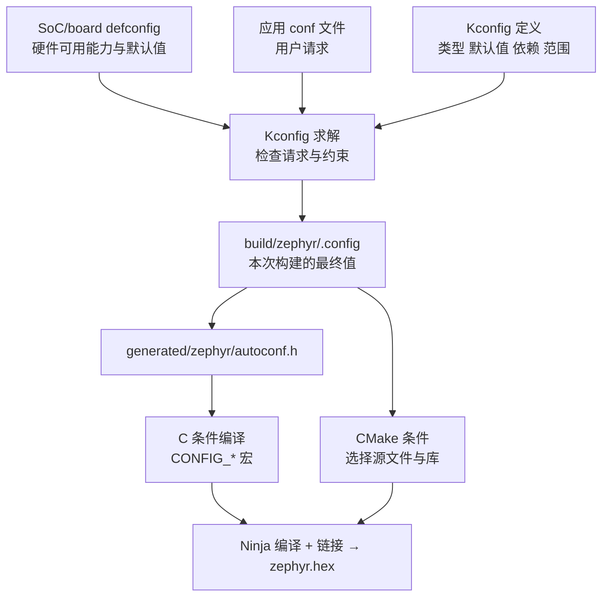
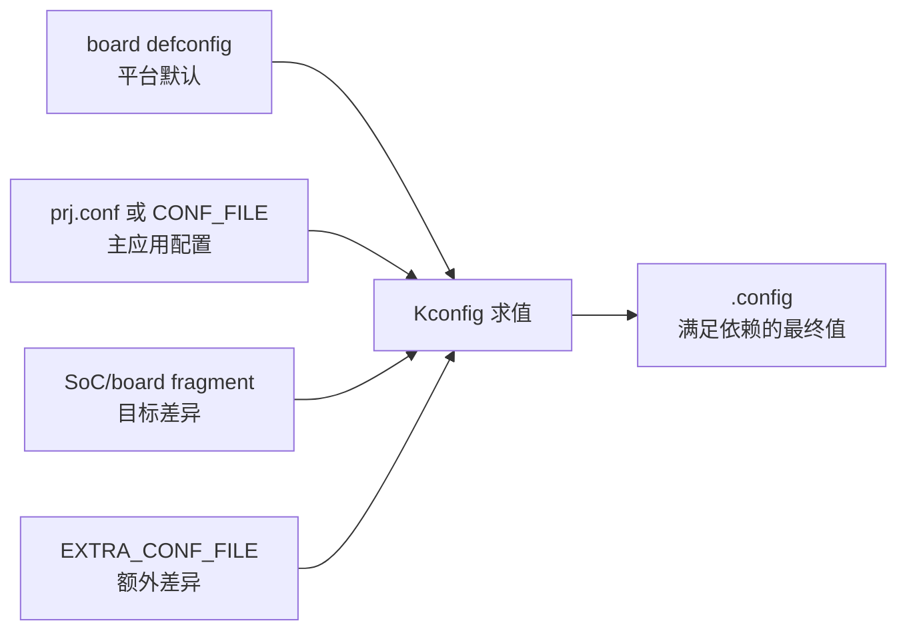
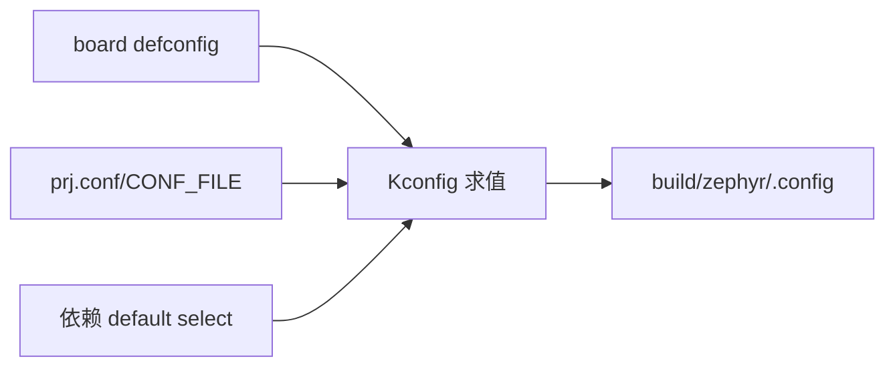

Zephyr 构建不是“CMake 读取几个宏然后调用编译器”。它同时求解三张图：Kconfig 的软件能力图、Devicetree 的硬件实例图、CMake 的源文件和链接图。本篇只聚焦第一张图，并解释它如何影响后两者。

**Kconfig 决定软件能力及参数，CMake 决定哪些文件参与构建。** `prj.conf` 只是 Kconfig 的一个输入，`build/zephyr/.config` 才是本次构建的最终事实。

## 一、从宏开关到配置系统

用过 FreeRTOS 的人，都经历过这种配置方式：打开 `FreeRTOSConfig.h`，手动改宏。

```c
#define configUSE_PREEMPTION     1
#define configUSE_TIMERS         1
#define configTOTAL_HEAP_SIZE    ( 8 * 1024 )
#define configMAX_PRIORITIES     5
```

这套方案本身不是错误，问题在于约束通常只存在于文档和人的记忆里：宏可以搜索，却很难统一回答“允许哪些值”“何时可见”“依赖不满足怎么办”“默认值由谁提供”。多个板级头文件互相 include 后，值的来源也不容易追踪。

Zephyr 的答案是 **Kconfig**——Linux 内核同款配置系统。先给一个定义：

> **Kconfig 是构建期的符号声明与约束求解系统。** Kconfig 文件定义符号的类型、默认值、可见条件和依赖；配置输入给出用户请求；求解结果写入 `.config`，再生成 CMake 和 C 代码可使用的配置。

对照记忆：

| FreeRTOS 世界 | Zephyr 世界 |
|:---|:---|
| `#define configUSE_TIMERS 1` | 在 `prj.conf` 请求一个实际存在的 `CONFIG_*` 符号 |
| 依赖关系主要靠头文件和文档 | `depends on`、`select`、`imply` 表达不同强度的关系 |
| 配置就在头文件里 | 配置生成 `autoconf.h`，**不手写** |
| 每换一块板子复制一份配置 | 板级配置（defconfig）与应用配置（prj.conf）分层合并 |

Kconfig 最重要的不是“自动把依赖全打开”，而是**让不满足约束的配置无法悄悄成为最终状态**。三个关系不能混为一谈：

- `depends on X`：只有 X 满足时当前符号才可见、可取有效值；它不会替你打开 X。
- `select X`：当前符号启用时强制 X 为 y，通常只用于没有额外依赖的底层符号；滥用可能绕过 X 自己的依赖。
- `imply X`：给 X 一个较弱的启用建议，用户或其他约束仍可覆盖。

一个符号的定义比一个宏更丰富：

```kconfig
config APP_SAMPLE_PERIOD_MS
    int "Sample period in milliseconds"
    default 1000
    range 100 60000
    depends on SENSOR
    help
      Application sampling interval. It is visible only when
      the sensor subsystem is available.
```

这里的 `int` 决定值类型，`default` 只在没有更高优先级输入时生效，`range` 限制合法范围，`depends on` 控制可见性和有效性，prompt 文本只负责菜单显示。配置系统因此能在编译前拒绝无意义的采样周期，而不是等业务代码运行后才发现。

## 二、一次构建，配置怎么流转

Kconfig 不是独立运行的，它嵌在 CMake 构建流程里。一次 `west build` 的配置阶段做这些事：



这条链路里要区分“定义、请求、结果”：

1. **Kconfig 文件定义符号**，但不代表符号最终开启。一个符号可以被多个 Kconfig 文件补充默认值和依赖。
2. **conf 文件请求取值**。`prj.conf` 通常只写应用关心的差异，不需要枚举所有默认值；依赖不满足时，请求可能被拒绝并产生 warning。
3. **`.config` 记录结果**。调试“为什么没生效”时先看它，再沿 Kconfig 定义追踪依赖和默认来源。它属于构建产物，不应作为手写配置提交。
4. **结果同时影响 CMake 和 C**。某些符号决定一个驱动源文件是否编译，另一些只改变常量或条件代码；“关闭功能”不只是运行时 if，而可能让整组对象不进入镜像。

布尔符号为 y 时通常生成 `#define CONFIG_X 1`；为 n 时该宏通常不存在，因此应用应使用 Zephyr 提供的 `IS_ENABLED(CONFIG_X)` 或 `#if defined(CONFIG_X)` 模式，不能假设所有关闭项都会定义成 0。

## 三、prj.conf 实战

在应用目录下建一个 `prj.conf`，写配置。语法很简单，`CONFIG_<符号名>=<值>`，等号两边不能有空格：

```ini
# 布尔型：y 开启，n 关闭
CONFIG_LOG=y

# 整型
CONFIG_SYSTEM_WORKQUEUE_STACK_SIZE=2048

# 字符串型（带引号）
CONFIG_BOOT_BANNER_STRING="Zephyr on nRF52832"

# 注释用 #
```

写一个真实例子。在 nRF52832 DK 上跑 hello_world，默认 `prj.conf` 几乎是空的（板级默认已够跑通）。加两行试试：

```ini
# prj.conf
CONFIG_LOG=y
CONFIG_BT=y
```

第一行开启日志子系统，第二行开启 BLE 协议栈。构建后打开 `build/zephyr/.config`，搜索 `CONFIG_BT`，会看到一长串被自动拉起的相关符号——这就是 Kconfig 的依赖解析在起作用。

这里要避免把 `CONFIG_BT=y` 理解成“应用已经能广播”。它只请求 Bluetooth Host 基础能力；外围角色、设备名、连接数、缓冲区和具体 GATT 服务仍有独立符号。nRF52 DK 的板级/SoC 配置能提供控制器所需能力，换到没有 Bluetooth 控制器的目标时，同一请求可能因依赖不满足而失败。Kconfig 负责让这个差异显式化，不负责替产品决定角色和资源预算。

**一个常见误区**：在 `.config` 里能看到 `# CONFIG_XXX is not set` 这种注释形式的 n。这是 Kconfig 保存"显式关闭"的格式，**只在生成的文件里出现，不要手动写进 prj.conf**——prj.conf 里关闭一个布尔符号直接写 `CONFIG_XXX=n` 即可。

> ⚠️ 如果某个符号写进 prj.conf 却不生效，先查它的依赖。用菜单界面跳到该符号，看"Depends on"一栏——依赖不满足时，赋值会被忽略并打印警告。

## 四、menuconfig：图形化配置

命令行的 prj.conf 适合"知道改什么"的场景；想探索"都有什么能改"，用交互界面：

```powershell
cd $Env:HOMEPATH\zephyrproject\zephyr
west build -p always -b nrf52dk/nrf52832 samples/hello_world -t menuconfig
```

menuconfig 是基于终端字符界面的配置工具：

- **方向键**导航，**回车**进入子菜单；
- **`/` 搜索**：输入符号名（如 `SYSTEM_WORKQUEUE_STACK_SIZE`），回车直达；
- **空格**切换布尔值，**数字**输入整型/字符串值；
- 修改后选 **Save**，配置写入 `build/zephyr/.config`，退出后重新 `west build` 生效。

想体验更好的图形界面，用 `-t guiconfig`（Windows 上 Python 自带 tkinter 即可运行），窗口化操作更直观。

**重要提醒**：menuconfig 改的是 build 目录里的 `.config`，**一旦执行 `west build -p`（pristine build）清空 build 目录，修改就丢了**。正确的姿势是：在菜单里试出想要的值 → 把关键项写回 `prj.conf` → 以后用文件维护。

## 五、多配置管理：不同场景不同配置

真实项目里，调试版和发布版要不同的配置：调试版开日志、开 shell、开断言；发布版全关、开优化、加安全选项。Zephyr 提供了干净的层次化方案。

先理解四个不同目的的入口。

**1. 默认应用配置：`prj.conf` 与 board fragment**

在应用目录下建 `boards/` 子目录，放一个与板名同名的配置文件：

```
my_app/
├── CMakeLists.txt
├── prj.conf                 # 通用配置
├── boards/
│   └── nrf52dk_nrf52832.conf   # 仅该板生效的覆盖
└── src/
    └── main.c
```

没有显式设置 `CONF_FILE` 时，`prj.conf` 是主应用配置。若 `boards/nrf52dk_nrf52832.conf` 存在，构建系统会把它作为该 target 的应用 fragment 一起合并。应用配置对 board defconfig 中同一可配置符号的赋值具有覆盖作用，但最终仍受符号依赖、range 和 choice 约束。

**2. 选择另一组主配置：`CONF_FILE`**

`CONF_FILE` 指定一个或多个主配置文件。它不是在默认 `prj.conf` 之后自动追加一层；一旦显式指定，就以列出的文件作为应用配置。因此调试构建若仍需要通用配置，应把两个文件都列出来：

```powershell
# 默认用 prj.conf
west build -p always -b nrf52dk/nrf52832 my_app

# 明确合并通用配置和调试差异。
west build -p always -b nrf52dk/nrf52832 my_app -- -DCONF_FILE="prj.conf;prj_debug.conf"
```

**3. 在默认主配置后追加：`EXTRA_CONF_FILE`**

如果只是临时叠加少量诊断项，保留默认 `prj.conf` 和自动 board fragment，使用：

```powershell
west build -p always -b nrf52dk/nrf52832 my_app -- -DEXTRA_CONF_FILE=prj_debug.conf
```

这比误用 `CONF_FILE` 更能表达“在默认配置上追加”的意图。

**4. 成套产品变体：`FILE_SUFFIX`**

`FILE_SUFFIX=debug` 会优先寻找 `prj_debug.conf`，并对 board overlay 等支持 suffix 的文件应用同一命名规则；若带 suffix 的文件不存在，则按规则回退到无 suffix 文件。它适合让一组 Kconfig 和 Devicetree 文件共同描述 debug、release 或不同产品型号。

**5. 配置来源与求值**

配置流不是简单的“最后一个文件永远赢”。先选择主配置来源，再合并目标 fragment 和 extra fragment，最后由 Kconfig 约束求值：



工程实践上，`prj.conf` 放软件通用能力，`boards/<board>.conf` 放该 target 的软件差异，debug fragment 放日志和断言等临时差异。GPIO 引脚、总线地址和固定硬件连接属于 Devicetree，不应因为“板级差异”就塞进 Kconfig。

## 六、CMake 集成：一个最小应用的工程结构

配置系统只是构建的一部分。一个 Zephyr 应用的最小工程长这样：

```
my_app/
├── CMakeLists.txt
├── prj.conf
└── src/
    └── main.c
```

`CMakeLists.txt` 只有四行骨架：

```cmake
cmake_minimum_required(VERSION 3.20.0)

find_package(Zephyr REQUIRED HINTS $ENV{ZEPHYR_BASE})
project(my_app)

target_sources(app PRIVATE src/main.c)
```

逐个解释：

- `find_package(Zephyr)`：在 CMake 配置阶段加载 Zephyr 包，建立 `app`、内核、驱动和生成步骤。`west build` 会在 workspace 语境下调用它；`west zephyr-export` 则让 workspace 外的 CMake 更容易发现 Zephyr，并非每次构建都重新执行的编译步骤；
- `project(my_app)`：CMake 工程名；
- `target_sources(app PRIVATE src/main.c)`：把源文件加进 Zephyr 预置的 `app` 目标。加新文件就在这里加一行，不需要手动管 include 路径——Zephyr 的构建系统会自动注入所有内核头文件路径。

`west build` 是前端，不是新的编译器。第一次构建时，它创建 build 目录并调用 CMake 配置；CMake 运行 Kconfig、Devicetree 和源文件收集，生成 Ninja 图；随后 Ninja 才执行编译和链接。普通 C 文件变化通常只触发增量编译，Kconfig/DTS/CMake 输入变化会触发重新配置。

build 目录还保存 `CMakeCache.txt`，其中包含 board、`CONF_FILE`、overlay 路径和工具链选择。复用同一 build 目录切换 board 或配置来源时，旧 cache 可能与新请求冲突，这就是 pristine build 存在的原因；它不是为了“让编译更干净”而每次机械执行。

构建产物里有三个文件值得认识（都在 build 目录下）：

```
build/zephyr/.config                        # 合并后的完整 Kconfig 配置
build/zephyr/include/generated/zephyr/autoconf.h # 生成的 C 宏头文件
build/zephyr/zephyr.dts                     # 合并后的完整设备树（构建时生成）
```

不要直接 include 构建目录里的 `autoconf.h`。Zephyr 公共头文件会以受支持的方式暴露配置宏。下面的片段只演示编译期裁剪：

```c
#include <zephyr/kernel.h>
#include <zephyr/sys/printk.h>

/**
 * @brief 显示本次构建是否包含 Bluetooth 基础能力。
 *
 * @return 0，表示 main 线程正常结束。
 */
int main(void)
{
#if defined(CONFIG_BT)
    /* CONFIG_BT 为 y 时，这条分支才进入目标文件。 */
    printk("Bluetooth support is compiled in\n");
#else
    /* 关闭 Bluetooth 后，上一条字符串和代码不会进入镜像。 */
    printk("Bluetooth support is not compiled in\n");
#endif
    return 0;
}
```

这就是 Kconfig 裁剪的直接结果：`CONFIG_BT` 是求值后生成的编译期宏，条件不满足时对应分支不会进入目标文件。但一个子系统是否编译还可能由 CMake 在更高层直接排除整个源文件，因此不能只靠搜索 C 中的 `#ifdef` 理解完整构建图。

### 完整最小工程与最终配置

固定 Zephyr 4.4.x、`nrf52dk/nrf52832`，以下三个文件构成可构建应用；`prj.conf` 是请求，`build/zephyr/.config` 才是 Kconfig 依赖、默认值和覆盖合并后的事实。

```cmake
cmake_minimum_required(VERSION 3.20.0)
find_package(Zephyr REQUIRED HINTS $ENV{ZEPHYR_BASE})
project(kconfig_minimum)
target_sources(app PRIVATE src/main.c)
```

```ini
CONFIG_LOG=y
CONFIG_LOG_DEFAULT_LEVEL=3
CONFIG_MAIN_STACK_SIZE=1024
```

```c
#include <zephyr/logging/log.h>

LOG_MODULE_REGISTER(kconfig_minimum, LOG_LEVEL_INF);

/**
 * @brief 验证日志配置已经进入最终构建。
 *
 * @return 0，表示 main 线程正常结束。
 */
int main(void)
{
    LOG_INF("Kconfig resolved, main stack = %d",
            CONFIG_MAIN_STACK_SIZE);
    return 0;
}
```

```powershell
west build -p always -b nrf52dk/nrf52832 app
Select-String build/zephyr/.config -Pattern "CONFIG_(LOG|MAIN_STACK_SIZE)"
west build -t menuconfig
```

切换 board、工具链、`CONF_FILE` 或 overlay 集合时应使用 pristine build；普通 `prj.conf` 值变化通常会被构建系统检测并重新配置。`attempt to assign` 警告表示符号名、可见性或依赖存在问题，应在 menuconfig 查定义，不能在 C 中自行定义 `CONFIG_*` 绕过求值。



## 七、动手练习

1. 给 hello_world 的 `prj.conf` 加 `CONFIG_LOG=y`，构建后打开 `build/zephyr/include/generated/autoconf.h`，grep `CONFIG_LOG`，看它变成了什么宏。
2. 运行 `west build -t menuconfig`，用 `/` 搜索 `SYSTEM_WORKQUEUE_STACK_SIZE`，把值从 1024 改成 2048，重新编译，对比构建输出的 RAM 占用变化——直观感受"配置影响资源占用"。
3. 在应用目录建 `boards/nrf52dk_nrf52832.conf`，写入一个与 prj.conf 冲突的选项，构建后查看 `build/zephyr/.config` 里最终生效的是哪个值，验证优先级。
4. 新建 `prj_debug.conf` 和 `prj_release.conf`，用 `-DCONF_FILE=` 分别构建，对比两份 `.config` 的差异。

## 八、里程碑自检

- [ ] 能说出 Kconfig 的三个来源如何合并，最终产物是什么
- [ ] 能区分符号定义、conf 文件请求和 `.config` 最终结果
- [ ] 能解释 `depends on`、`select` 与 `imply` 的差异，不会说“依赖会自动全部开启”
- [ ] 会用 `prj.conf` 开启/关闭一个符号，知道依赖不满足时会发生什么
- [ ] 会用 `west build -t menuconfig` 搜索并修改配置
- [ ] 知道 `CONF_FILE` 选择主配置，`EXTRA_CONF_FILE` 追加 fragment，`FILE_SUFFIX` 组织成套变体
- [ ] 能独立写出一个最小应用的四行 `CMakeLists.txt`
- [ ] 能从 `build/zephyr/.config` 和 `autoconf.h` 里验证一个配置是否生效
- [ ] 能解释 CMake 配置、Ninja 编译和 pristine build 分别解决什么

> 🏷️ 标签：Zephyr · Kconfig · prj.conf · menuconfig · CMake · west · 构建系统 · 配置管理
