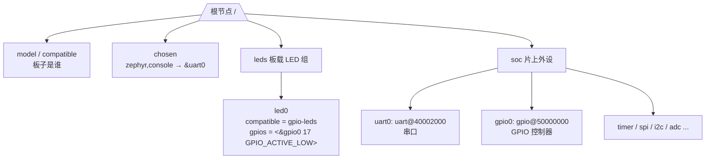
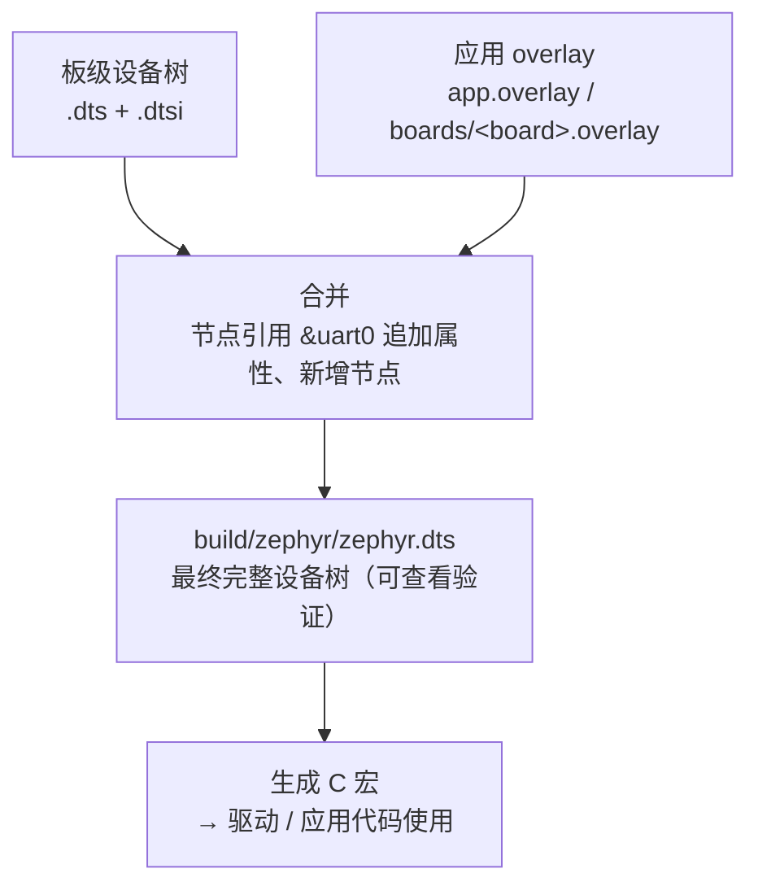
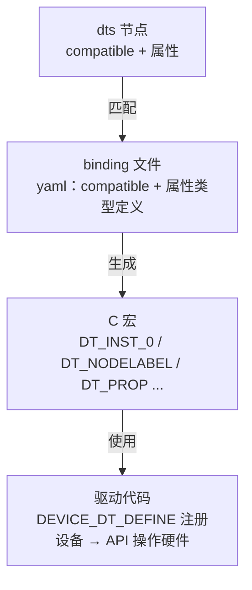

上一篇讲了 Kconfig——它回答"编译什么功能"。这一讲解决另一个问题："代码怎么知道硬件长什么样"。答案是 **Devicetree（设备树）**。这是 Zephyr 工程师要跨过的第一道思维门槛：不再在 C 代码里写寄存器地址和引脚号。

## 一、为什么需要设备树

先回忆裸机开发（或 FreeRTOS 工程）里，硬件信息是怎么进代码的：

```c
// 寄存器地址：宏定义
#define UART0_BASE      0x40002000
#define GPIO0_BASE      0x50000000

// 引脚号：初始化代码
GPIO_InitTypeDef gpio = {
    .Pin = GPIO_PIN_17,
    .Mode = GPIO_MODE_OUTPUT_PP,
};
```

这套写法的本质是**把硬件信息硬编码进 C 代码**。问题在换板子时爆发：换一颗 MCU，寄存器地址全变；换一块板子，引脚分配全变。你要在代码里翻找、修改、重新编译，而且改完之后，代码和"这块板子的硬件描述"再也分不开。

Zephyr 的解法是把硬件信息抽出来，单独用数据描述：

> **Devicetree 是描述硬件（CPU、外设、引脚、内存）的树形数据**，编译期被转换成 C 宏，供驱动和应用代码使用。硬件描述与代码分离，换板子只改描述文件。

它和 Linux 设备树同源，理念一致：**"硬件长什么样"和"代码怎么干活"解耦**。在 Zephyr 里，驱动不写 `UART0_BASE`，而是问设备树"我的串口在哪、基地址多少"。

对照记忆：

| 裸机 / FreeRTOS 习惯 | Zephyr 方式 |
|:---|:---|
| `#define UART0_BASE 0x40002000` | 设备树节点 `uart0`，驱动用宏获取地址 |
| 初始化结构体写死引脚号 | `.overlay` 文件里写 `gpios = <&gpio0 17 ...>` |
| 换板子改 C 代码 | 换板子换 dts 描述（或 overlay） |
| 硬件信息散落各处 | 一份描述，集中管理，编译期检查 |

## 二、一棵树长什么样

Devicetree 的源文件是 `.dts` 文本，语法类似 JSON 和 C 结构体的结合。看一个 nRF52832 的简化片段：

```dts
/ {
    model = "Nordic Semiconductor NRF52 DK";
    compatible = "nordic,nrf52-dk";

    chosen {
        zephyr,console = &uart0;
    };

    leds {
        compatible = "gpio-leds";
        led0: led_0 {
            gpios = <&gpio0 17 GPIO_ACTIVE_LOW>;
            label = "Green LED 0";
        };
    };

    soc {
        uart0: uart@40002000 {
            compatible = "nordic,nrf-uarte";
            reg = <0x40002000 0x1000>;
            current-speed = <115200>;
        };

        gpio0: gpio@50000000 {
            compatible = "nordic,nrf-gpio";
            reg = <0x50000000 0x1000>;
            gpio-controller;
        };
    };
};
```

三个基本概念：

- **节点（node）**：`uart0`、`gpio0`、`led0` 都是节点，代表一个硬件单元。`uart@40002000` 中 `@` 后面是寄存器地址，用来区分同名节点；
- **属性（property）**：`compatible`、`reg`、`status`、`label` 等，描述节点的特征；
- **树形结构**：根节点 `/` 下面是 `soc`、`leds` 等子节点，子节点可以无限嵌套。

最重要的属性是 `compatible`——它相当于"这个设备是谁"。驱动靠它找到自己的设备，格式是 `"厂商,型号"`。比如 `"nordic,nrf-uarte"` 表示 Nordic 的 UART 增强型外设。

`reg` 属性描述寄存器地址和长度：`reg = <0x40002000 0x1000>` 表示基地址 0x40002000、长度 0x1000（4KB）。

**`.dtsi` 和 `.dts` 的区别**：`.dtsi` 是公共描述（被 include 的片段），`.dts` 是最终板级文件。Zephyr 里 SoC 级通用内容（CPU、内存、外设模板）放 `.dtsi`，板级差异（引脚复用、外设启用、LED 定义）放 `.dts`，`#include` 组合。



## 三、从设备树到 C 代码：DT_* 宏

设备树是数据，C 代码怎么用？答案是一套编译期宏：**devicetree 生成器在编译前把每个节点展开成 C 宏，`#include <zephyr/devicetree.h>` 后即可使用**。这些宏在编译期就求值成常量，**零运行时开销**。

最常用的几个：

```c
#include <zephyr/devicetree.h>

// 1. 用节点标签（label）引用节点
//    uart0: uart@40002000 里的 uart0 就是节点标签
DT_NODELABEL(uart0)          // 引用 uart0 节点

// 2. 拿寄存器地址
DT_REG_ADDR(DT_NODELABEL(uart0))          // 0x40002000
DT_REG_SIZE(DT_NODELABEL(uart0))          // 0x1000

// 3. 读属性值
DT_PROP(DT_NODELABEL(uart0), current_speed)  // 115200

// 4. 通过 aliases 引用（板级文件里定义的别名）
DT_ALIAS(led0)               // 引用 led0 别名指向的节点
```

注意两点：

- 设备树属性名里的短横线（`current-speed`）在宏里要写成下划线（`current_speed`）；
- `DT_NODELABEL(uart0)` 的返回值不是"地址数值"，而是一个**节点标识符**（编译期句柄），要用在 `DT_REG_ADDR`、`DT_PROP` 这类宏里才有意义。这是新手最容易困惑的地方——把它当"指向节点的编译期指针"理解。

实际用起来，驱动通常不直接碰 `DT_REG_ADDR`，而是用更上层的 API。比如点灯，设备树 + 驱动 API 组合：

```c
#include <zephyr/kernel.h>
#include <zephyr/device.h>
#include <zephyr/drivers/gpio.h>

#define LED0_NODE DT_ALIAS(led0)          // 板载 LED0 节点

static const struct gpio_dt_spec led = GPIO_DT_SPEC_GET(LED0_NODE, gpios);

int main(void)
{
    gpio_pin_configure_dt(&led, GPIO_OUTPUT_ACTIVE);

    while (1) {
        gpio_pin_toggle_dt(&led);         // 翻转电平
        k_msleep(500);
    }
    return 0;
}
```

`GPIO_DT_SPEC_GET(LED0_NODE, gpios)` 从设备树里把"GPIO 控制器指针 + 引脚号 + 极性"一次性取出来，封装成 `struct gpio_dt_spec`。**代码里没有任何引脚号、没有 GPIO 基地址**——全部来自设备树。换个板子，只要板级文件里 `led0` 指向的引脚不同，这份代码原样编译就能点对板子。

## 四、overlay：应用层改硬件描述

问题来了：板级 `.dts` 在 Zephyr 源码里，应用不想（也不应该）去改它。如果我的应用想在某个自定义引脚上接一个外设，怎么办？

答案是 **overlay（覆盖文件）**：在**应用目录**下放一个 `.overlay` 文件，构建时自动和板级设备树合并，追加或修改节点。

```
my_app/
├── CMakeLists.txt
├── prj.conf
├── boards/
│   └── nrf52dk_nrf52832.overlay   ← 该板专用的 overlay（也可以直接叫 app.overlay）
└── src/
    └── main.c
```

Zephyr 会自动加载应用目录下的 overlay：`app.overlay` 全局生效，`boards/<board>.overlay` 仅对应板生效（与 Kconfig 的 boards 目录机制一致）。

overlay 里写什么？比如：启用板级文件里没启用的串口，并设置波特率：

```dts
&uart0 {
    status = "okay";
    current-speed = <115200>;
};
```

`&uart0` 是引用语法——"找到 uart0 节点，往里面追加/覆盖这些属性"。`status = "okay"` 表示启用（默认可能是 `"disabled"`，驱动不初始化）。

再加一个自定义 LED：

```dts
/ {
    my_leds {
        compatible = "gpio-leds";
        blue_led: led_blue {
            gpios = <&gpio0 20 GPIO_ACTIVE_LOW>;
            label = "Blue LED";
        };
    };
};
```

合并后，`DT_NODELABEL(led_blue)` 就能用了。



> 💡 调试技巧：构建完成后，打开 `build/zephyr/zephyr.dts`，这是**合并后的最终设备树**。overlay 是否生效、属性值是否正确，都在这里一目了然——这是排查设备树问题最重要的文件。

## 五、binding：设备树属性 ↔ 驱动 API 的字典

设备树里写了 `gpios = <&gpio0 17 GPIO_ACTIVE_LOW>`，生成器怎么知道 `gpios` 是什么类型、怎么解析？这就是 **binding（绑定文件）** 的职责：

> **binding 是一个 YAML 文件，描述某类设备节点的属性含义**（类型、是否必填、单位）。devicetree 生成器靠它把节点翻译成正确的 C 宏。

比如 `"gpio-leds"` 的 binding（Zephyr 源码 `dts/bindings/gpio/gpio-leds.yaml`，简化）：

```yaml
# gpio-leds.yaml
description: Generic LEDs connected to GPIO pins
compatible: "gpio-leds"

child-binding:
  description: LED child node
  properties:
    gpios:
      type: phandle-array     # 类型：引用控制器 + 引脚号 + 标志
      required: true
    label:
      type: string
```

binding 声明了 `gpios` 是 `phandle-array` 类型——于是生成器知道 `<&gpio0 17 GPIO_ACTIVE_LOW>` 是"引用 gpio0 节点、引脚 17、低电平有效"，据此生成 `GPIO_DT_SPEC_GET` 需要的展开数据。

完整链路串起来：



`compatible` 是这条链路的**钥匙**：设备树节点用它找 binding，驱动也用 `DT_COMPAT_GET_ANY_STATUS_OKAY(兼容串)` 找设备。三者（dts 节点、binding、驱动）的 compatible 对不上，设备就"找不到"。

## 六、实战：探索 nRF52832 DK 的设备树

动手环节。假设已经构建过 hello_world（build 目录存在）：

**1. 看最终设备树**

```powershell
cd $Env:HOMEPATH\zephyrproject\zephyr
west build -p always -b nrf52dk/nrf52832 samples/hello_world
```

打开 `build/zephyr/zephyr.dts`，搜索 `uart0`，找到类似：

```dts
uart0: uart@40002000 {
    compatible = "nordic,nrf-uarte";
    reg = <0x40002000 0x1000>;
    interrupts = <0 NRF_DEFAULT_IRQ_PRIORITY>;
    status = "okay";
    current-speed = <115200>;
    ...
};
```

对照数据手册：nRF52832 的 UARTE0 基地址确实是 0x40002000——设备树和硬件规格对上了。

**2. 用代码读设备树**

新建一个应用，`main.c` 里打印 uart0 的地址和波特率：

```c
#include <zephyr/kernel.h>
#include <zephyr/devicetree.h>

#define UART0_NODE DT_NODELABEL(uart0)

void main(void)
{
    printk("uart0 base: 0x%x\n", DT_REG_ADDR(UART0_NODE));
    printk("uart0 size: 0x%x\n", DT_REG_SIZE(UART0_NODE));
    printk("baud: %d\n", DT_PROP(UART0_NODE, current_speed));
}
```

预期输出：

```
uart0 base: 0x40002000
uart0 size: 0x1000
baud: 115200
```

**3. 常见问题排查**

- **找不到节点**：`DT_NODELABEL(uart0)` 编译报 undefined——先确认 `zephyr.dts` 里节点名是不是 `uart0`（有些 SoC 叫 `uart1`），或节点是 `disabled` 状态；
- **compatible 不匹配**：构建时提示 missing binding——检查 dts 节点的 compatible 是否在 `dts/bindings/` 里有对应 yaml；
- **overlay 没生效**：确认文件命名（`app.overlay` 或 `boards/<board>.overlay`），并在 `zephyr.dts` 里验证合并结果。

## 七、动手练习

1. 构建后打开 `build/zephyr/zephyr.dts`，找出板载 4 个 LED 的节点和引脚号（搜索 `led`），对照 nRF52 DK 原理图核对。
2. 写一个 `app.overlay`，给自定义引脚上的 LED 起别名 `my_led`，在代码里用 `DT_ALIAS(my_led)` 点亮它。
3. 用 `printk` 打印 uart0 的寄存器地址和 `current-speed` 属性，烧录验证输出。
4. 故意把 overlay 里某个节点的 `compatible` 写错，重新构建，观察报错信息，体会 binding 匹配机制。

## 八、里程碑自检

- [ ] 能说出设备树解决了裸机开发的什么问题
- [ ] 看得懂 `.dts`：节点、属性、`compatible`、`reg`、`&引用` 语法
- [ ] 知道 `.dtsi` 和 `.dts`、overlay 三者的关系
- [ ] 会用 `DT_NODELABEL` / `DT_ALIAS` / `DT_REG_ADDR` / `DT_PROP` 读设备信息
- [ ] 理解 binding 文件在"设备树 → 驱动"链路中的作用
- [ ] 能在 `build/zephyr/zephyr.dts` 里验证设备树与 overlay 的合并结果

> 🏷️ 标签：Zephyr · Devicetree · 设备树 · dts · overlay · binding · DT_NODELABEL · nRF52832 · 硬件抽象
