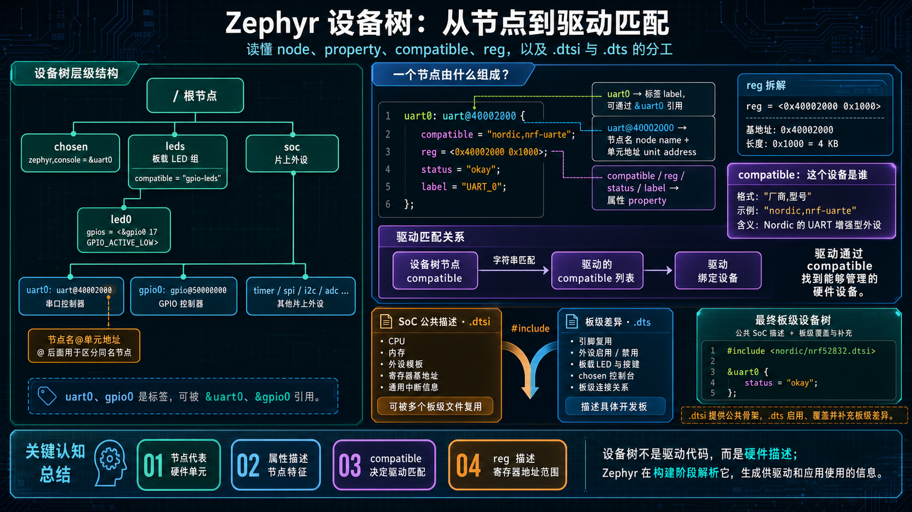
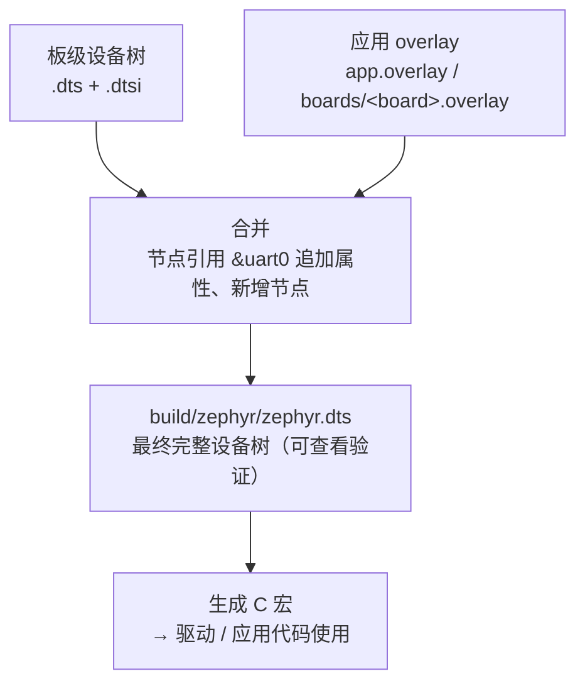
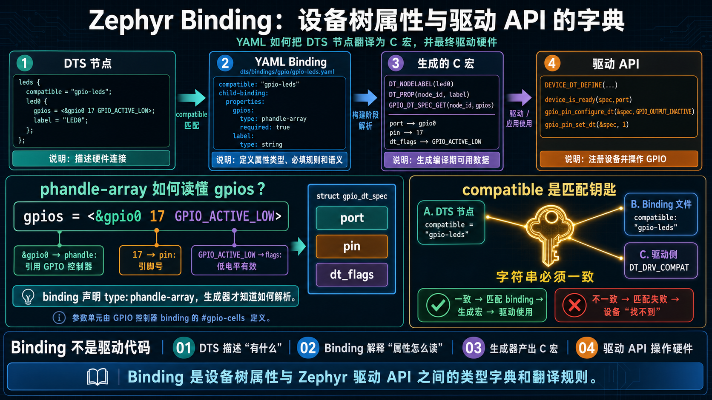
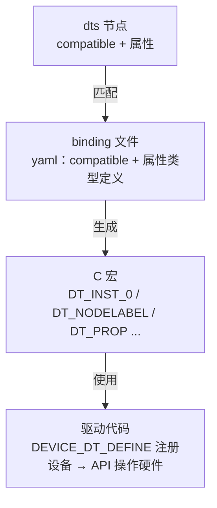

上一篇讲了 Kconfig——它回答"编译什么功能"。这一讲解决另一个问题："代码怎么知道硬件长什么样"。答案是 **Devicetree（设备树）**。这是 Zephyr 工程师要跨过的第一道思维门槛：不再在 C 代码里写寄存器地址和引脚号。

## 一、为什么需要设备树

先回忆裸机开发（或 FreeRTOS 工程）里，硬件信息是怎么进代码的：

```c
// 寄存器地址：宏定义
#define UART0_BASE      0x40002000
#define GPIO0_BASE      0x50000000

// 引脚号：初始化代码
GPIO_InitTypeDef gpio = {
    .Pin = GPIO_PIN_17,
    .Mode = GPIO_MODE_OUTPUT_PP,
};
```

这套写法的本质是**把硬件信息硬编码进 C 代码**。问题在换板子时爆发：换一颗 MCU，寄存器地址全变；换一块板子，引脚分配全变。你要在代码里翻找、修改、重新编译，而且改完之后，代码和"这块板子的硬件描述"再也分不开。

Zephyr 的解法是把硬件信息抽出来，单独用数据描述：

> **Devicetree 是构建期的硬件实例描述。** 它描述 SoC 中有哪些控制器、板上如何连接、外设挂在哪条总线以及固定硬件参数；构建系统把结果转换为生成宏和设备初始化数据，驱动与应用据此编译。

它和 Linux 设备树同源，理念一致：**"硬件长什么样"和"代码怎么干活"解耦**。在 Zephyr 里，驱动不写 `UART0_BASE`，而是问设备树"我的串口在哪、基地址多少"。

对照记忆：

| 裸机 / FreeRTOS 习惯 | Zephyr 方式 |
|:---|:---|
| `#define UART0_BASE 0x40002000` | 设备树节点 `uart0`，驱动用宏获取地址 |
| 初始化结构体写死引脚号 | `.overlay` 文件里写 `gpios = <&gpio0 17 ...>` |
| 换板子时硬件与业务代码一起修改 | 优先通过 board DTS、alias 和 overlay 隔离连接差异 |
| 硬件信息散落各处 | 一份描述，集中管理，编译期检查 |

设备树不会让所有应用自动跨板运行。只有业务代码依赖统一设备类别和稳定的 alias/chosen，目标板又提供等价硬件时，板级差异才主要落在 DTS。若代码依赖某个 SoC 的节点标签、专有属性或外设能力，换板仍需修改代码和配置。

还要区分 Kconfig 与 Devicetree：**“是否编译某种软件能力”通常属于 Kconfig；“这块机器固定接了什么、地址和引脚是什么”通常属于 Devicetree。** 采样周期等产品策略也不应为了方便而塞进 DTS。

## 二、一棵树长什么样

Devicetree 的源文件是 `.dts` 文本，语法类似 JSON 和 C 结构体的结合。看一个 nRF52832 的简化片段：

```dts
/ {
    model = "Nordic Semiconductor NRF52 DK";
    compatible = "nordic,nrf52-dk";

    chosen {
        zephyr,console = &uart0;
    };

    leds {
        compatible = "gpio-leds";
        led0: led_0 {
            gpios = <&gpio0 17 GPIO_ACTIVE_LOW>;
            label = "Green LED 0";
        };
    };

    soc {
        uart0: uart@40002000 {
            compatible = "nordic,nrf-uarte";
            reg = <0x40002000 0x1000>;
            current-speed = <115200>;
        };

        gpio0: gpio@50000000 {
            compatible = "nordic,nrf-gpio";
            reg = <0x50000000 0x1000>;
            gpio-controller;
        };
    };
};
```

先区分节点的几种“名字”，它们用途不同：

| 形式 | 示例 | 含义与用途 |
| --- | --- | --- |
| 节点路径 | `/soc/uart@40002000` | 树中的唯一身份，由所有父节点和节点名组成 |
| 节点名与 unit address | `uart@40002000` | `uart` 表示类别，`@...` 区分同级实例；unit address 应与第一个 `reg` 地址一致 |
| 节点标签 | `uart0:` | DTS 源码内的引用符号，C 中用 `DT_NODELABEL(uart0)` |
| alias | `aliases { led0 = &led_0; };` | 板级稳定的应用角色，C 中用 `DT_ALIAS(led0)` |
| chosen | `zephyr,console = &uart0` | 为系统角色选择节点，例如 console、flash、SRAM |
| `label` 属性 | `label = "Green LED 0"` | 普通字符串属性，不是节点标签，也不决定节点身份 |

新手最常见的问题就是把 `led0: led_0`、`aliases/led0` 和 `label = "..."` 都叫作 label。应用需要跨板表达“第一个用户 LED”时，应优先依赖 alias；驱动或 SoC 专用代码才更常使用节点标签。

`compatible` 不是任意名称，而是节点与 binding/驱动契约的键。它通常采用 `"vendor,device"`，也可以是从具体到通用的字符串列表。构建系统先用它选择 binding 校验属性；驱动再用相同 compatible 实例化所有 `status = "okay"` 的节点。

`reg` 的编码由父节点的 `#address-cells` 和 `#size-cells` 决定，不能在所有总线上都机械解释成“一个地址加一个长度”。在示例 SoC 总线上，`reg = <0x40002000 0x1000>` 才表示基地址和 4 KiB 区域；I2C 子设备的 `reg = <0x76>` 则通常只是从设备地址。

**`.dtsi` 和 `.dts` 的区别**：`.dtsi` 是公共描述（被 include 的片段），`.dts` 是最终板级文件。Zephyr 里 SoC 级通用内容（CPU、内存、外设模板）放 `.dtsi`，板级差异（引脚复用、外设启用、LED 定义）放 `.dts`，`#include` 组合。



## 三、从设备树到 C 代码：DT_* 宏

设备树是数据，C 代码怎么用？答案是一套编译期宏：**devicetree 生成器在编译前把每个节点展开成 C 宏，`#include <zephyr/devicetree.h>` 后即可使用**。这些宏在编译期就求值成常量，**零运行时开销**。

生成器为节点、属性和关系建立一组可组合的预处理器 token。应用通常从“选节点”开始，再把节点标识符传给“读属性”或“生成设备”的宏：

```c
#include <stddef.h>
#include <stdint.h>

#include <zephyr/devicetree.h>

/* 选择节点：返回的是预处理器节点标识符，不是整数或指针。 */
#define UART0_NODE DT_NODELABEL(uart0)

/* 消费节点：这些宏在编译期形成常量。 */
static const uintptr_t uart0_base = DT_REG_ADDR(UART0_NODE);
static const size_t uart0_size = DT_REG_SIZE(UART0_NODE);

/* 属性中的连字符在 C 宏参数中写成下划线。 */
static const uint32_t uart0_baud =
    DT_PROP(UART0_NODE, current_speed);

/* alias 适合表达应用角色，而不是 SoC 固定实例名。 */
#define USER_LED_NODE DT_ALIAS(led0)
```

节点标识符只在宏组合中有意义，不能存入变量、打印或在运行时比较。它更像编译器内部使用的唯一 token，而不是“编译期指针”。

这种模型把很多错误提前到构建期：节点标签不存在、必选属性缺失、属性类型不符合 binding，都会让宏展开或 Devicetree 校验失败。运行期没有“找不到属性返回 NULL”的分支，因为不合法固件通常根本无法生成。

如果某个属性是可选的，应先用 `DT_NODE_HAS_PROP(node_id, prop)`、`DT_PROP_OR()` 等宏显式表达缺省策略，而不是直接读取后期待运行时兜底。

应用通常不直接读取寄存器地址，而是让设备类别宏把多个属性组合成类型安全的描述对象。下面只是声明片段，完整错误处理实验放在后文：

```c
#include <zephyr/drivers/gpio.h>

#define LED0_NODE DT_ALIAS(led0)

/* 编译期提取 GPIO 控制器设备、引脚号和 Devicetree flags。 */
static const struct gpio_dt_spec led =
    GPIO_DT_SPEC_GET(LED0_NODE, gpios);
```

`GPIO_DT_SPEC_GET` 最终形成三个关键信息：

- `port`：由控制器节点对应的 `struct device` 指针；
- `pin`：GPIO 控制器内部的引脚编号；
- `dt_flags`：`GPIO_ACTIVE_LOW` 等由硬件描述给出的标志。

编译成功只证明节点和属性存在、binding 类型正确；它不证明 GPIO 驱动初始化成功。运行期仍要调用 `gpio_is_ready_dt()`，再检查 configure/toggle 的返回值。这样，Devicetree 负责“连接是什么”，驱动 API 负责“操作是否成功”。

## 四、overlay：应用层改硬件描述

问题来了：板级 `.dts` 在 Zephyr 源码里，应用不想（也不应该）去改它。如果我的应用想在某个自定义引脚上接一个外设，怎么办？

答案是 **overlay（覆盖文件）**：在**应用目录**下放一个 `.overlay` 文件，构建时自动和板级设备树合并，追加或修改节点。

```
my_app/
├── CMakeLists.txt
├── prj.conf
├── boards/
│   └── nrf52dk_nrf52832.overlay   ← 该板专用的 overlay（也可以直接叫 app.overlay）
└── src/
    └── main.c
```

在没有显式指定 overlay 变量时，构建系统按应用规则发现 `app.overlay` 和匹配 target 的 `boards/<board>.overlay`。`DTC_OVERLAY_FILE` 用来选择一组主 overlay，`EXTRA_DTC_OVERLAY_FILE` 用来追加 fragment；它们与 Kconfig 的 `CONF_FILE` / `EXTRA_CONF_FILE` 角色相似，但处理的是两套完全不同的输入语言。

overlay 里写什么？比如：启用板级文件里没启用的串口，并设置波特率：

```dts
&uart0 {
    status = "okay";
    current-speed = <115200>;
};
```

`&uart0` 是引用语法——"找到 uart0 节点，往里面追加/覆盖这些属性"。`status = "okay"` 表示启用（默认可能是 `"disabled"`，驱动不初始化）。

overlay 不是启动后执行的脚本，也没有“先初始化 UART，再修改波特率”的运行顺序。构建系统按节点身份合并树：同名属性由后来的 fragment 覆盖，已有子节点继续合并，新节点被添加；最终只有一棵树进入生成阶段。

`status = "okay"` 的准确含义是让节点成为 status-okay 候选，相关实例宏和驱动可以据此生成对象；它不保证时钟、父总线和驱动初始化一定成功。运行期的 ready 状态仍由驱动初始化结果决定。

再加一个自定义 LED：

```dts
/ {
    my_leds {
        compatible = "gpio-leds";
        blue_led: led_blue {
            gpios = <&gpio0 20 GPIO_ACTIVE_LOW>;
            label = "Blue LED";
        };
    };
};
```

合并后，`DT_NODELABEL(led_blue)` 就能用了。



> 💡 调试技巧：构建完成后，打开 `build/zephyr/zephyr.dts`，这是**合并后的最终设备树**。overlay 是否生效、属性值是否正确，都在这里一目了然——这是排查设备树问题最重要的文件。

## 五、binding：设备树属性 ↔ 驱动 API 的字典

设备树里写了 `gpios = <&gpio0 17 GPIO_ACTIVE_LOW>`，生成器怎么知道 `gpios` 是什么类型、怎么解析？这就是 **binding（绑定文件）** 的职责：



> **binding 是一个 YAML 文件，描述某类设备节点的属性含义**（类型、是否必填、单位）。devicetree 生成器靠它把节点翻译成正确的 C 宏。

比如 `"gpio-leds"` 的 binding（Zephyr 源码 `dts/bindings/gpio/gpio-leds.yaml`，简化）：

```yaml
# gpio-leds.yaml
description: Generic LEDs connected to GPIO pins
compatible: "gpio-leds"

child-binding:
  description: LED child node
  properties:
    gpios:
      type: phandle-array     # 类型：引用控制器 + 引脚号 + 标志
      required: true
    label:
      type: string
```

binding 声明 `gpios` 是 `phandle-array`，表示属性包含一个或多个“控制器引用 + cells”。具体 cell 数量和名字由被引用 GPIO 控制器的 `#gpio-cells` 及其 binding 决定；在这个控制器上，它们表示 pin 和 flags。`GPIO_ACTIVE_LOW` 是描述有效电平的 Devicetree flag，GPIO 驱动 API 会据此处理逻辑 active/inactive。

完整链路串起来：



`compatible` 是这条链路的契约键：节点用它匹配 binding；驱动通常定义 `DT_DRV_COMPAT`，再用 `DT_INST_FOREACH_STATUS_OKAY()` 等实例宏为每个可用节点生成配置、数据和 `struct device`。节点、binding 与驱动的 compatible 不一致时，可能表现为缺少 binding、属性宏无法生成，或根本没有驱动实例。

binding 只负责描述和校验数据结构，不会实现硬件操作。真正把属性转成寄存器配置的是驱动；应用最终调用的是设备类别 API。把这三层分开，才能判断错误发生在 DTS 写法、schema 约束还是驱动初始化。

## 六、实战：探索 nRF52832 DK 的设备树

动手环节。假设已经构建过 hello_world（build 目录存在）：

**1. 看最终设备树**

```powershell
cd $Env:HOMEPATH\zephyrproject\zephyr
west build -p always -b nrf52dk/nrf52832 samples/hello_world
```

打开 `build/zephyr/zephyr.dts`，搜索 `uart0`。下面只是最终节点的节选，省略号代表未展示的其他生成属性，不是可复制的完整 DTS：

```dts
uart0: uart@40002000 {
    compatible = "nordic,nrf-uarte";
    reg = <0x40002000 0x1000>;
    interrupts = <0 NRF_DEFAULT_IRQ_PRIORITY>;
    status = "okay";
    current-speed = <115200>;
    ...
};
```

对照数据手册：nRF52832 的 UARTE0 基地址确实是 0x40002000——设备树和硬件规格对上了。

**2. 用代码读设备树**

新建一个应用，用生成宏读取编译期值。`BUILD_ASSERT` 明确要求该节点可用且属性存在，让错误在编译时给出直接原因：

```c
#include <zephyr/devicetree.h>
#include <zephyr/sys/printk.h>

#define UART0_NODE DT_NODELABEL(uart0)

BUILD_ASSERT(DT_NODE_HAS_STATUS(UART0_NODE, okay),
             "uart0 must be enabled");
BUILD_ASSERT(DT_NODE_HAS_PROP(UART0_NODE, current_speed),
             "uart0 needs current-speed");

/**
 * @brief 打印由最终 Devicetree 生成的 UART 常量。
 *
 * @return 0，表示 main 线程正常结束。
 */
int main(void)
{
    /* 显式转换与格式匹配，避免地址宽度变化时产生告警。 */
    printk("uart0 base: 0x%lx\n",
           (unsigned long)DT_REG_ADDR(UART0_NODE));
    printk("uart0 size: 0x%lx\n",
           (unsigned long)DT_REG_SIZE(UART0_NODE));
    printk("baud: %u\n",
           (unsigned int)DT_PROP(UART0_NODE, current_speed));
    return 0;
}
```

预期输出：

```
uart0 base: 0x40002000
uart0 size: 0x1000
baud: 115200
```

**3. 常见问题排查**

- **找不到节点标签**：`DT_NODELABEL(uart0)` 编译报 undefined，说明最终树没有 `uart0:` 这个节点标签；节点为 disabled 不会让标签消失，应另用 status 宏检查；
- **节点存在但设备不可用**：确认 `status`、父总线和驱动 Kconfig，再在运行时检查 `device_is_ready()`；
- **compatible 不匹配**：构建时提示 missing binding——检查 dts 节点的 compatible 是否在 `dts/bindings/` 里有对应 yaml；
- **overlay 没生效**：确认文件命名（`app.overlay` 或 `boards/<board>.overlay`），并在 `zephyr.dts` 里验证合并结果。

## 七、完整 overlay 点灯实验

保留上面的设备树探索与图片。本实验为 Zephyr 4.4.x、`nrf52dk/nrf52832` 增加 P0.20 低有效外接 LED：LED 阳极经限流电阻接 3.3 V、阴极接 P0.20。以下为完整应用，不是可拼接片段。

```text
app/
├── CMakeLists.txt
├── prj.conf
├── app.overlay
└── src/main.c
```

```cmake
cmake_minimum_required(VERSION 3.20.0)
find_package(Zephyr REQUIRED HINTS $ENV{ZEPHYR_BASE})
project(dt_led)
target_sources(app PRIVATE src/main.c)
```

```ini
CONFIG_GPIO=y
CONFIG_LOG=y
```

```dts
#include <zephyr/dt-bindings/gpio/gpio.h>

/ {
    aliases {
        /* 属性名中的 '-' 在 DT_ALIAS() 参数里写成 '_'。 */
        my-led = &my_led;
    };

    leds {
        compatible = "gpio-leds";

        my_led: led_0 {
            /*
             * P0.20 低电平有效：逻辑 active 会把引脚拉低，
             * 与阳极接 3.3 V 的外接 LED 接法一致。
             */
            gpios = <&gpio0 20 GPIO_ACTIVE_LOW>;
        };
    };
};
```

`GPIO_DT_SPEC_GET(node_id, gpios)` 是编译期宏，生成 port/pin/flags 的 `gpio_dt_spec`；节点或属性缺失会构建失败。`gpio_is_ready_dt()` 返回控制器 init 状态，`gpio_pin_configure_dt()`/`gpio_pin_toggle_dt()` 返回 0 或负 errno，在线程上下文调用。

```c
#include <errno.h>
#include <zephyr/drivers/gpio.h>
#include <zephyr/kernel.h>
#include <zephyr/logging/log.h>

LOG_MODULE_REGISTER(dt_led, LOG_LEVEL_INF);

#define LED_NODE DT_ALIAS(my_led)

BUILD_ASSERT(DT_NODE_HAS_STATUS(LED_NODE, okay),
             "my-led alias must point to an enabled node");

static const struct gpio_dt_spec led =
    GPIO_DT_SPEC_GET(LED_NODE, gpios);

/**
 * @brief 配置并周期翻转 overlay 声明的外接 LED。
 *
 * @return 初始化或运行失败时返回负错误码。
 */
int main(void)
{
    int err;

    if (!gpio_is_ready_dt(&led)) {
        LOG_ERR("GPIO controller is not ready");
        return -ENODEV;
    }

    /* INACTIVE 会结合 GPIO_ACTIVE_LOW 得到物理高电平。 */
    err = gpio_pin_configure_dt(&led, GPIO_OUTPUT_INACTIVE);
    if (err != 0) {
        LOG_ERR("configure failed: %d", err);
        return err;
    }

    while (true) {
        err = gpio_pin_toggle_dt(&led);
        if (err != 0) {
            LOG_ERR("toggle failed: %d", err);
            return err;
        }

        k_sleep(K_MSEC(500));
    }
}
```

```powershell
west build -p always -b nrf52dk/nrf52832 app
west flash
Select-String build/zephyr/zephyr.dts -Pattern "my_led|gpio0"
```

预期 LED 每 500 ms 翻转；本文未声明已实际接线验证。若 `DT_ALIAS(my_led)` 失败，查 overlay 是否合并；若 ready 为 false，检查 GPIO 节点与 `CONFIG_GPIO`。

## 八、动手练习

1. 构建后打开 `build/zephyr/zephyr.dts`，找出板载 4 个 LED 的节点和引脚号（搜索 `led`），对照 nRF52 DK 原理图核对。
2. 写一个 `app.overlay`，给自定义引脚上的 LED 起别名 `my_led`，在代码里用 `DT_ALIAS(my_led)` 点亮它。
3. 用 `printk` 打印 uart0 的寄存器地址和 `current-speed` 属性，烧录验证输出。
4. 故意把 overlay 里某个节点的 `compatible` 写错，重新构建，观察报错信息，体会 binding 匹配机制。

## 九、里程碑自检

- [ ] 能说出设备树解决了裸机开发的什么问题
- [ ] 能区分节点路径、节点名、节点标签、alias、chosen 和 `label` 属性
- [ ] 看得懂 `.dts`：节点、属性、`compatible`、`reg`、`status`、`&引用` 语法
- [ ] 知道 `.dtsi` 和 `.dts`、overlay 三者的关系
- [ ] 知道节点标识符是预处理器 token，不是地址或运行时指针
- [ ] 会用 `DT_NODELABEL` / `DT_ALIAS` 选择节点，再用属性宏消费节点
- [ ] 理解 binding 负责 schema 校验，驱动负责实例化和硬件操作
- [ ] 能区分构建期节点存在与运行期 `device_is_ready()`
- [ ] 能在 `build/zephyr/zephyr.dts` 里验证设备树与 overlay 的合并结果

> 🏷️ 标签：Zephyr · Devicetree · 设备树 · dts · overlay · binding · DT_NODELABEL · nRF52832 · 硬件抽象
