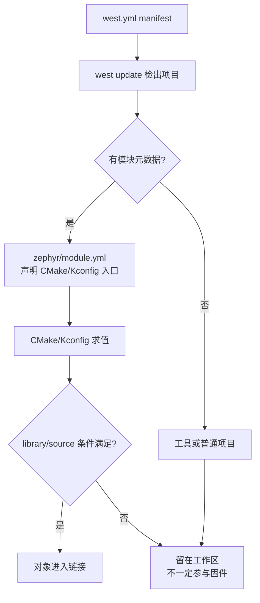
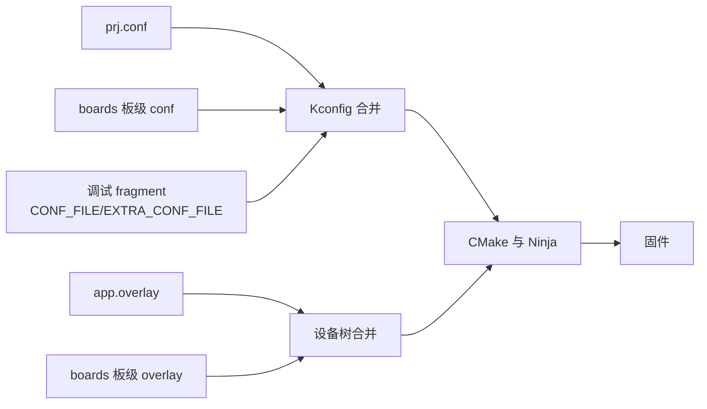

能编译一个示例，不等于拥有可维护的产品工程。Zephyr 把应用目录作为构建入口：业务代码、软件配置、硬件描述和外部组件从这里汇合，最后生成一份固件。

对 FreeRTOS 工程师而言，应用相当于产品主 Makefile 所在目录；不同之处是，Zephyr 不把软件开关、引脚和源码列表揉进一个工程文件，而是让 CMake、Kconfig、Devicetree 和 west 分别负责一个边界。本文基于 Zephyr 4.4.x，板目标固定为 nrf52dk/nrf52832。官方规则见 [Application Development](https://docs.zephyrproject.org/latest/develop/application/index.html) 与 [Modules](https://docs.zephyrproject.org/latest/develop/modules.html)。

## 一、应用、west 项目与模块

| 名称 | 解决的问题 | 谁让它生效 |
| --- | --- | --- |
| 应用 application | 本次构建生成哪个镜像、入口配置和业务源码 | `west build <app>` / `find_package(Zephyr)` |
| 应用组件 component | 把当前产品内部职责拆成多个 `.c/.h` | 应用 `target_sources(app ...)` |
| Zephyr module | 向构建系统扩展 CMake、Kconfig、DTS/binding 等能力 | module discovery + `zephyr/module.yml` |
| west project | manifest 需要检出哪个 Git 仓库和 revision | `west update` |
| CMake library/target | 哪些对象文件最终进入链接 | CMake/Zephyr library 规则 |

这些集合可以重叠，但不等价：

- 一个 west project 可以只是脚本或文档，不是 module，也不进入固件。
- 一个 module 可以通过 `EXTRA_ZEPHYR_MODULES` 从 west 之外发现。
- 一个仓库被发现为 module，只说明它的 CMake/Kconfig 入口被加载；源码仍要被 library 规则选中。
- 应用 `src/sensor_service.c` 是本地组件，不因为目录名叫 modules 就自动成为 Zephyr module。

排查大型工程时要逐层提问：仓库是否检出？module 是否发现？Kconfig 符号是否求值为 y？源文件是否进入编译命令？对象是否进入最终链接？只看 `west list` 或“头文件能跳转”都不能证明功能进了镜像。



【图1：west 工作区与模块的关系】

## 二、推荐的目录骨架

```text
env_node/
├── CMakeLists.txt
├── prj.conf
├── app.overlay
├── boards/
│   ├── nrf52dk_nrf52832.conf
│   └── nrf52dk_nrf52832.overlay
├── include/
│   └── env_node/
│       └── sensor_service.h
├── src/
│   ├── main.c
│   └── sensor_service.c
└── Kconfig                   # 仅当应用定义自己的 CONFIG_* 时需要
```

- `CMakeLists.txt`：声明应用源文件和 include 边界。
- `prj.conf`：应用的软件能力请求。
- `app.overlay` / `boards`：通用与 target 特定的硬件描述增量。
- `src`：实现文件，默认不作为其他组件的公共接口。
- `include/env_node`：当前产品内部需要跨源文件使用的头文件。
- 应用 `Kconfig`：定义本应用自己的符号；只使用上游符号时不必创建。

硬件模型 v2 的板目标含斜杠，但应用层板级文件用下划线命名。因此构建命令写 nrf52dk/nrf52832，文件名写 nrf52dk_nrf52832.conf 或 nrf52dk_nrf52832.overlay。

当 `sensor_helper` 真正成为独立仓库和 Zephyr module 后，workspace 更接近：

```text
workspace/
├── .west/
├── zephyr/
├── app/                         # manifest repository / application
│   ├── west.yml
│   └── CMakeLists.txt ...
└── modules/lib/sensor-helper/   # west project + Zephyr module
    ├── zephyr/module.yml
    ├── CMakeLists.txt
    ├── Kconfig
    ├── include/sensor_helper/
    └── src/
```

这里的目录名只是组织约定。真正让 `sensor-helper` 成为 module 的，是 manifest/`EXTRA_ZEPHYR_MODULES` 让它进入发现集合，再由 `zephyr/module.yml` 指向 CMake 和 Kconfig 入口。

## 三、最小应用与配置覆盖

```cmake
cmake_minimum_required(VERSION 3.20.0)

find_package(Zephyr REQUIRED HINTS $ENV{ZEPHYR_BASE})
project(env_node)

target_sources(app PRIVATE
  src/main.c
  src/sensor_service.c
)
target_include_directories(app PRIVATE include)
```

```ini
# prj.conf
CONFIG_GPIO=y
CONFIG_LOG=y
CONFIG_LOG_DEFAULT_LEVEL=3
CONFIG_MAIN_STACK_SIZE=1024
CONFIG_SYSTEM_WORKQUEUE_STACK_SIZE=1024
```

调试配置应单独存放，避免发布构建意外带入断言和详细日志：

```ini
# prj_debug.conf
CONFIG_LOG_DEFAULT_LEVEL=4
CONFIG_ASSERT=y
CONFIG_THREAD_STACK_INFO=y
```

```powershell
west build -p always -b nrf52dk/nrf52832 env_node
west build -p always -b nrf52dk/nrf52832 env_node -- -DCONF_FILE="prj.conf;prj_debug.conf"
west flash
```

PowerShell 中必须保留引号，因为分号既是 shell 命令分隔符，也是 CMake 列表分隔符。构建后检查 build/zephyr/.config，确认最终值，而不是根据输入文件猜测。

板级 overlay 可以只承载该板的外接硬件：

```dts
&i2c0 {
    status = "okay";
    pinctrl-0 = <&i2c0_default>;
    pinctrl-names = "default";
};
```



【图2：软件配置和硬件描述的两条合并链】

## 四、何时抽成模块

“文件很多”或“以后可能复用”都不足以成为 module。先把代码作为应用组件留在 `src`，只有同时出现以下信号时再提取：

- 接口已经稳定，调用者不需要知道内部设备和线程；
- 多个应用或镜像确实共享它；
- 需要自己的 Kconfig 命名空间、binding、驱动或独立测试；
- 有明确维护者和版本兼容责任。

过早模块化会增加 manifest、配置命名、版本升级和跨仓库调试成本。下面的 `sensor_service` 仍是应用组件：应用 CMake 直接编译它，头文件位于应用 include 目录。

```c
#include <zephyr/kernel.h>
#include <zephyr/logging/log.h>
#include <env_node/sensor_service.h>

LOG_MODULE_REGISTER(app, LOG_LEVEL_INF);

/**
 * @brief 初始化并周期调用当前应用的传感器服务组件。
 *
 * @return 初始化失败时返回错误码；正常服务循环不返回。
 */
int main(void)
{
    int err;

    err = sensor_service_init();

    if (err != 0) {
        LOG_ERR("sensor service init failed: %d", err);
        return err;
    }

    while (true) {
        err = sensor_service_sample();
        if (err != 0) {
            /*
             * 本例把单次采样失败视为可恢复错误；
             * 产品应在组件契约中规定重试、退避或故障状态。
             */
            LOG_WRN("sensor sample failed: %d", err);
        }

        k_sleep(K_SECONDS(1));
    }
}
```

当上述边界成立时，再把组件移到独立 module。module metadata 只声明入口：

```yaml
# modules/sensor_helper/zephyr/module.yml
name: sensor_helper
build:
  cmake: .
  kconfig: Kconfig
```

```cmake
# modules/sensor_helper/CMakeLists.txt
zephyr_library()
zephyr_library_include_directories(include)
zephyr_library_sources_ifdef(
  CONFIG_SENSOR_HELPER
  src/sensor_helper.c
)
```

```kconfig
menuconfig SENSOR_HELPER
    bool "Sensor helper"
    default n

if SENSOR_HELPER

config SENSOR_HELPER_FILTER_WINDOW
    int "Moving-average window"
    range 1 32
    default 4

endif
```

`module.yml` 让构建系统找到 CMake/Kconfig；`CONFIG_SENSOR_HELPER` 让产品选择是否启用；`zephyr_library_sources_ifdef` 才把实现文件放进编译图。这三步分别对应发现、配置和编译，缺一不可。可复用 module 默认关闭通常更安全，避免仅仅出现在 workspace 就增加镜像内容。

模块位于工作区外时可显式追加：

```powershell
west build -p always -b nrf52dk/nrf52832 env_node -- -DEXTRA_ZEPHYR_MODULES=C:/work/sensor_helper
```

`EXTRA_ZEPHYR_MODULES` 在 west 已发现模块集合上追加路径；`ZEPHYR_MODULES` 则替换自动发现结果，通常不该用于“再加一个模块”。若在应用 `CMakeLists.txt` 设置这些变量，必须发生在 `find_package(Zephyr)` 之前，因为 module discovery 属于 CMake 配置阶段。

## 五、west 让工作区可复现

```yaml
manifest:
  version: 1.2
  projects:
    - name: sensor-helper
      url: https://example.invalid/firmware/sensor-helper
      revision: v1.2.0
      path: modules/lib/sensor-helper
  self:
    path: app
```

URL 是结构示例，实际项目替换为真实仓库。revision 应使用 tag 或提交，不要长期追踪浮动分支：

- `name` 是 west 项目标识；
- `path` 是它在 workspace 中的检出位置，不决定它是否为 Zephyr module；
- `revision` 是 manifest 要求的 Git revision。分支名会随远端移动，发布和 CI 更适合固定 tag 或 commit；
- `self.path` 是 manifest 仓库自身在 workspace 中的位置。

manifest 管“源代码版本集合”，不管 Kconfig 是否启用功能，也不保证对象进入链接。`west update` 完成后，含 module metadata 的项目才会进入 Zephyr 的自动 module discovery；随后仍要经过配置和 CMake 选择。

```powershell
west init -m <manifest-repository-url> env-workspace
Set-Location env-workspace
west update
west list
west manifest --freeze
```

`west list` 显示当前 path 和 revision；`west manifest --freeze` 生成把活动 revision 固定为提交的 manifest 视图，适合审计和发布记录。它们只能证明仓库状态；CMake 输出、`build/zephyr/.config`、编译命令和 map 才分别证明 module 被发现、功能开启、源码编译和对象链接。

## 六、组件接口闭环与模块验证

前文的 `main.c` 只依赖 `sensor_service` 接口，不知道其内部状态。下面的最小组件不假装读取真实传感器，而是专门演示两个概念：头文件定义调用契约，源文件拥有生命周期状态。真实驱动接入时可以替换内部实现而不改 main。

```c
/* include/env_node/sensor_service.h */
#ifndef SENSOR_SERVICE_H
#define SENSOR_SERVICE_H

/**
 * @brief 初始化服务拥有的状态和底层依赖。
 *
 * @return 0 表示服务可用；负 errno 表示初始化失败。
 */
int sensor_service_init(void);

/**
 * @brief 执行一次采样周期。
 *
 * @return 0 表示完成；未初始化或采样失败时返回负 errno。
 */
int sensor_service_sample(void);

#endif
```

```c
/* src/sensor_service.c */
#include <errno.h>
#include <stdbool.h>
#include <stdint.h>

#include <zephyr/logging/log.h>

#include <env_node/sensor_service.h>

LOG_MODULE_REGISTER(sensor_service, LOG_LEVEL_INF);

static bool initialized;
static uint32_t sample_sequence;

int sensor_service_init(void)
{
    /*
     * 当前组件只由 main 线程拥有，因此普通 bool 足够；
     * 多线程调用时，接口契约必须增加锁或状态机。
     */
    initialized = true;
    sample_sequence = 0U;
    LOG_INF("service ready");
    return 0;
}

int sensor_service_sample(void)
{
    if (!initialized) {
        return -EACCES;
    }

    /* 真实产品在这里调用 sensor_sample_fetch/channel_get。 */
    LOG_INF("sample sequence %u", sample_sequence++);
    return 0;
}
```

这个组件由应用 `target_sources(app ...)` 直接编译，与 `module.yml` 无关。module 示例中的 `zephyr_library_sources_ifdef()` 则只有在 module 被发现且 `CONFIG_SENSOR_HELPER=y` 时才编译。两条路径不能混为一谈。

用真实 manifest URL 和固定 revision 替换 `example.invalid` 后，依次用 `west update`、`west list`、`west build` 验证仓库、发现、配置、编译与链接。预期应用组件先记录 `service ready`，随后递增采样序号；接入真实 sensor API 时只替换 `sensor_service.c` 内部。

## 七、常见问题

| 现象 | 原因 | 检查方法 |
| --- | --- | --- |
| 模块头文件找不到 | 模块未被发现或未导出 include 目录 | 检查 module.yml、CMake 输出与编译命令 |
| `west list` 有仓库但 Kconfig 搜不到符号 | west project 不是 module，或 metadata 入口错误 | 检查 `zephyr/module.yml` 和 CMake configure 日志 |
| Kconfig 符号为 y 但函数链接失败 | library 没选择源文件，或对象未进入链接 | 查看 compile commands、Ninja 和 map，而不是继续改 manifest |
| board 配置未生效 | 文件名不匹配或 build 目录复用 | 使用 -p always，查看 .config |
| overlay 无变化 | 读错 overlay 或节点路径 | 查看 build/zephyr/zephyr.dts |
| 多人构建结果不同 | manifest 引用浮动分支 | 用 west list 比对 revision |

## 八、动手练习

1. 将 hello world 拷贝成独立应用，加入 src 和 boards 目录，在 nRF52 DK 上构建。
2. 新增 prj_debug.conf，比较普通构建与调试构建生成的 .config。
3. 创建 sensor_helper 模块，把一个单位换算函数放进去，并从应用调用。
4. 在 manifest 固定一个私有库的 tag，执行 west list 记录 path 与 revision。

## 九、里程碑自检

- [ ] 能解释应用、west 项目和模块的边界
- [ ] 能区分应用组件、Zephyr module、CMake library 和 west project
- [ ] 能按“检出 → 发现 → 配置 → 编译 → 链接”定位组件为什么没有进入固件
- [ ] 会用 prj.conf、board 配置和 CONF_FILE 管理构建场景
- [ ] 知道通用 overlay 与板级 overlay 的适用范围
- [ ] 能写出 module.yml、CMakeLists.txt 和 Kconfig 的最小骨架
- [ ] 知道 `EXTRA_ZEPHYR_MODULES` 是追加，`ZEPHYR_MODULES` 是替换
- [ ] 会用 west list、.config、compile commands、map 和 zephyr.dts 验证不同阶段

## 小结

可靠的 Zephyr 工程不靠更多目录获得，而靠清楚边界：应用定义产品，Kconfig 定义软件取舍，设备树定义硬件，west 固定仓库版本，模块承载真正可复用的接口。

> 🏷️ 标签：Zephyr · west · CMake · Kconfig · Devicetree · 模块化 · nRF52832 · 工程结构
