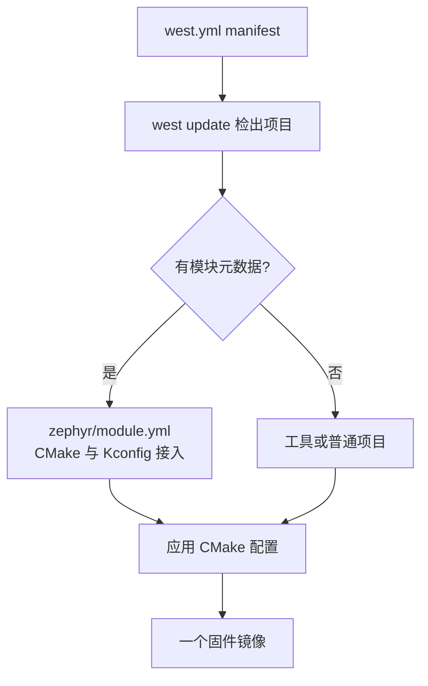
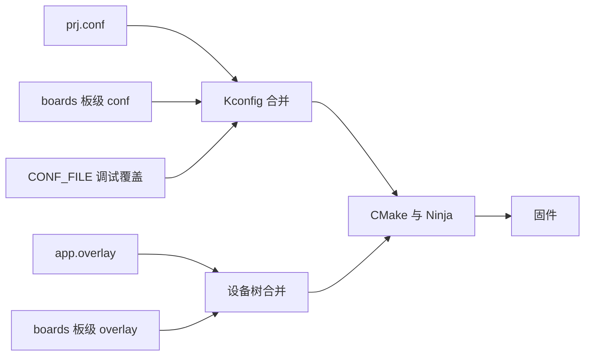

能编译一个示例，不等于拥有可维护的产品工程。Zephyr 把应用目录作为构建入口：业务代码、软件配置、硬件描述和外部组件从这里汇合，最后生成一份固件。

对 FreeRTOS 工程师而言，应用相当于产品主 Makefile 所在目录；不同之处是，Zephyr 不把软件开关、引脚和源码列表揉进一个工程文件，而是让 CMake、Kconfig、Devicetree 和 west 分别负责一个边界。本文基于 Zephyr 4.4.x，板目标固定为 nrf52dk/nrf52832。官方规则见 [Application Development](https://docs.zephyrproject.org/latest/develop/application/index.html) 与 [Modules](https://docs.zephyrproject.org/latest/develop/modules.html)。

## 一、应用、west 项目与模块

| 名称 | 解决的问题 | FreeRTOS / 裸机类比 |
| --- | --- | --- |
| 应用 application | 本次构建生成什么固件 | 一个产品主工程 |
| west 项目 west project | 工作区要检出哪些 Git 仓库 | 多仓库清单 |
| Zephyr 模块 module | 仓库如何提供代码和配置 | 带 CMake/Kconfig 的可复用组件 |

west 项目不一定进入固件，例如下载脚本和文档仓库。模块也不必由 west 管理，只要构建系统能找到它即可。把“仓库已检出”和“代码已参与编译”分开验证，是排查大型工程问题的起点。



【图1：west 工作区与模块的关系】

## 二、推荐的目录骨架

```text
env_node/
├── CMakeLists.txt
├── prj.conf
├── app.overlay
├── boards/
│   ├── nrf52dk_nrf52832.conf
│   └── nrf52dk_nrf52832.overlay
├── src/
│   ├── main.c
│   ├── sensor_service.c
│   └── sensor_service.h
├── modules/
│   └── sensor_helper/
│       ├── CMakeLists.txt
│       ├── Kconfig
│       ├── include/sensor_helper/sensor_helper.h
│       └── src/sensor_helper.c
└── west.yml
```

- CMakeLists.txt：连接应用与 Zephyr 构建系统。
- prj.conf：所有板子共用的软件配置。
- app.overlay：所有板子共用的硬件增量描述。
- boards：当前应用针对某块板子的差异。
- src：只服务当前产品的业务代码。
- modules：有稳定接口、独立配置或多个消费者的可复用代码。
- west.yml：只有应用充当 manifest 仓库时才需要。

硬件模型 v2 的板目标含斜杠，但应用层板级文件用下划线命名。因此构建命令写 nrf52dk/nrf52832，文件名写 nrf52dk_nrf52832.conf 或 nrf52dk_nrf52832.overlay。

## 三、最小应用与配置覆盖

```cmake
cmake_minimum_required(VERSION 3.20.0)

find_package(Zephyr REQUIRED HINTS $ENV{ZEPHYR_BASE})
project(env_node)

target_sources(app PRIVATE
  src/main.c
  src/sensor_service.c
)
target_include_directories(app PRIVATE src)
```

```ini
# prj.conf
CONFIG_GPIO=y
CONFIG_LOG=y
CONFIG_LOG_DEFAULT_LEVEL=3
CONFIG_MAIN_STACK_SIZE=1024
CONFIG_SYSTEM_WORKQUEUE_STACK_SIZE=1024
```

调试配置应单独存放，避免发布构建意外带入断言和详细日志：

```ini
# prj_debug.conf
CONFIG_LOG_DEFAULT_LEVEL=4
CONFIG_ASSERT=y
CONFIG_THREAD_STACK_INFO=y
```

```powershell
west build -p always -b nrf52dk/nrf52832 env_node
west build -p always -b nrf52dk/nrf52832 env_node -- -DCONF_FILE="prj.conf;prj_debug.conf"
west flash
```

PowerShell 中必须保留引号，因为分号既是 shell 命令分隔符，也是 CMake 列表分隔符。构建后检查 build/zephyr/.config，确认最终值，而不是根据输入文件猜测。

板级 overlay 可以只承载该板的外接硬件：

```dts
&i2c0 {
    status = "okay";
    pinctrl-0 = <&i2c0_default>;
    pinctrl-names = "default";
};
```



【图2：软件配置和硬件描述的两条合并链】

## 四、何时抽成模块

业务代码先留在 src。以下入口直接服务当前产品：

```c
#include <zephyr/kernel.h>
#include <zephyr/logging/log.h>
#include "sensor_service.h"

LOG_MODULE_REGISTER(app, LOG_LEVEL_INF);

int main(void)
{
    int err = sensor_service_init();

    if (err != 0) {
        LOG_ERR("sensor service init failed: %d", err);
        return 0;
    }

    while (true) {
        sensor_service_sample();
        k_sleep(K_SECONDS(1));
    }
}
```

当代码要跨产品复用，或必须暴露自己的 Kconfig 选项时，再抽成模块：

```yaml
# modules/sensor_helper/zephyr/module.yml
name: sensor_helper
build:
  cmake: .
  kconfig: Kconfig
```

```cmake
# modules/sensor_helper/CMakeLists.txt
zephyr_library()
zephyr_library_sources(src/sensor_helper.c)
zephyr_library_include_directories(include)
```

```kconfig
menuconfig SENSOR_HELPER
    bool "Sensor helper"
    default y

if SENSOR_HELPER

config SENSOR_HELPER_FILTER_WINDOW
    int "Moving-average window"
    range 1 32
    default 4

endif
```

模块位于工作区外时可显式追加：

```powershell
west build -p always -b nrf52dk/nrf52832 env_node -- -DEXTRA_ZEPHYR_MODULES=C:worksensor_helper
```

若手动设置 ZEPHYR_MODULES，必须发生在 find_package(Zephyr) 之前；模块发现已经完成后再改变量，不会把新模块补进当前配置。

## 五、west 让工作区可复现

```yaml
manifest:
  version: 1.2
  projects:
    - name: sensor-helper
      url: https://example.invalid/firmware/sensor-helper
      revision: v1.2.0
      path: modules/lib/sensor-helper
  self:
    path: app
```

URL 是结构示例，实际项目替换为真实仓库。revision 应使用 tag 或提交，不要长期追踪浮动分支：

```powershell
west init -m <manifest-repository-url> env-workspace
Set-Location env-workspace
west update
west list
```

west list 证明仓库版本正确；CMake 输出、build/zephyr/.config 和链接结果才证明模块参与了固件。

## 六、常见问题

| 现象 | 原因 | 检查方法 |
| --- | --- | --- |
| 模块头文件找不到 | 模块未被发现或未导出 include 目录 | 检查 module.yml、CMake 输出与编译命令 |
| board 配置未生效 | 文件名不匹配或 build 目录复用 | 使用 -p always，查看 .config |
| overlay 无变化 | 读错 overlay 或节点路径 | 查看 build/zephyr/zephyr.dts |
| 多人构建结果不同 | manifest 引用浮动分支 | 用 west list 比对 revision |

## 七、动手练习

1. 将 hello world 拷贝成独立应用，加入 src 和 boards 目录，在 nRF52 DK 上构建。
2. 新增 prj_debug.conf，比较普通构建与调试构建生成的 .config。
3. 创建 sensor_helper 模块，把一个单位换算函数放进去，并从应用调用。
4. 在 manifest 固定一个私有库的 tag，执行 west list 记录 path 与 revision。

## 八、里程碑自检

- [ ] 能解释应用、west 项目和模块的边界
- [ ] 会用 prj.conf、board 配置和 CONF_FILE 管理构建场景
- [ ] 知道通用 overlay 与板级 overlay 的适用范围
- [ ] 能写出 module.yml、CMakeLists.txt 和 Kconfig 的最小骨架
- [ ] 会用 west list、.config 和 zephyr.dts 分别验证仓库、配置与硬件描述

## 小结

可靠的 Zephyr 工程不靠更多目录获得，而靠清楚边界：应用定义产品，Kconfig 定义软件取舍，设备树定义硬件，west 固定仓库版本，模块承载真正可复用的接口。

> 🏷️ 标签：Zephyr · west · CMake · Kconfig · Devicetree · 模块化 · nRF52832 · 工程结构
