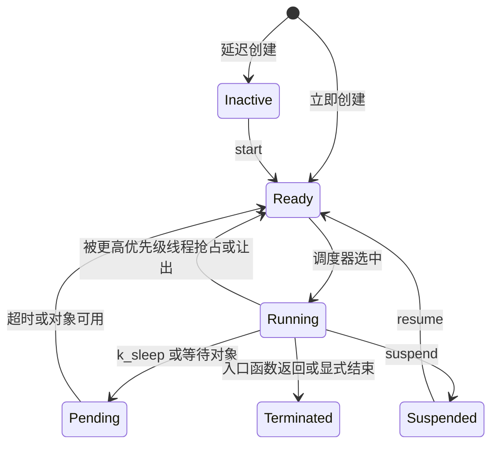
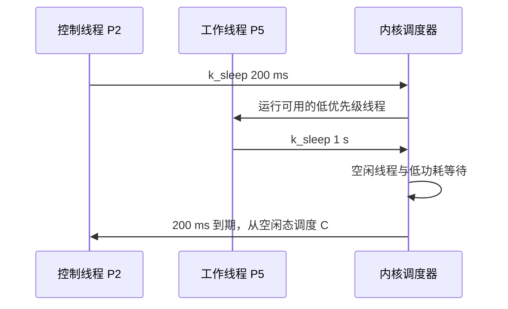

FreeRTOS 里的任务，在 Zephyr 中叫作线程。两者都有入口函数、栈、优先级和阻塞状态；真正容易出错的是调度细节：*Zephyr 的数值越小优先级越高，负优先级是协作线程，非负优先级是抢占线程。*

本文基于 Zephyr 4.4.x，目标板为 `nrf52dk/nrf52832`。完整规则见官方 [Threads](https://docs.zephyrproject.org/latest/kernel/services/threads/index.html)、[Scheduling](https://docs.zephyrproject.org/latest/kernel/services/scheduling/index.html) 与 [Thread analyzer](https://docs.zephyrproject.org/latest/services/debugging/thread-analyzer.html) 文档。

## 一、任务对象与线程对象

| FreeRTOS | Zephyr | 含义 |
| --- | --- | --- |
| `TaskHandle_t` | `struct k_thread` / `k_tid_t` | 线程控制块或线程标识 |
| `xTaskCreate` | `k_thread_create` 或 `K_THREAD_DEFINE` | 创建线程 |
| `configMINIMAL_STACK_SIZE` | `K_THREAD_STACK_DEFINE` | 声明满足架构约束的线程栈 |
| `vTaskDelay` | `k_sleep` | 让当前线程阻塞一段时间 |
| `uxTaskPriorityGet` | `k_thread_priority_get` | 查询优先级 |

一个 Zephyr 线程由几部分共同构成：

- **`struct k_thread` 控制块**：保存调度状态、优先级、等待对象、超时和架构上下文等内核信息；
- **线程栈**：保存函数调用帧、局部变量、保存的寄存器和编译器生成的临时数据；
- **入口函数与三个参数**：定义线程开始执行的位置和长期上下文；
- **`k_tid_t` 标识**：API 用来引用目标线程。它与控制块生命周期绑定，不是可以永久缓存的抽象整数。

`main()` 本身也运行在内核创建的 main 线程中。系统还可能有 idle、logging、system workqueue、Bluetooth 等线程；应用线程并不是独占 CPU，而是和这些系统线程一起进入调度器。

裸机 super loop 常把“轮询等待”和“执行业务”放在同一个循环。RTOS 线程化的重点不是把每个函数都变成线程，而是把**彼此独立的等待关系**拆开：没有事件时线程进入 not-ready，CPU 才能运行其他线程或 idle。一个不断轮询却从不阻塞的高优先级线程，会破坏这种模型。

线程状态与 ready queue 的关系比 API 名字更重要：

- **Ready**：具备运行条件，已经在调度候选集合中，但当前不一定获得 CPU；
- **Running**：本 CPU 当前选择的线程，单核同一时刻只有一个；
- **Pending/Sleeping**：等待内核对象或超时，不参与 ready 竞争；
- **Suspended/Inactive**：被显式阻止调度，唤醒条件与普通 pending 不同；
- **Terminated**：入口返回或线程被终止，不能继续使用其运行时状态。

“事件到来”只会把 pending 线程变为 ready，**不保证它立即运行**。调度器还要比较当前线程是否可抢占、各 ready 线程优先级以及同优先级顺序。



【图 1：Zephyr 线程的主要状态】

## 二、优先级先记住方向

Zephyr 的优先级不是越大越紧急：

| 范围 | 类型 | 典型用途 |
| --- | --- | --- |
| 负数 | 协作 cooperative | 极短、不阻塞的关键控制路径 |
| 0 及正数 | 抢占 preemptive | 普通业务、通信、日志处理 |
| 数值更小 | 优先级更高 | 例如 2 比 5 更早获得 CPU |

实际可用范围由 `CONFIG_NUM_COOP_PRIORITIES` 和 `CONFIG_NUM_PREEMPT_PRIORITIES` 决定。代码可用 `K_PRIO_COOP(n)`、`K_PRIO_PREEMPT(n)` 表达类别，避免把负号本身当成业务含义。

调度器的基本选择可以概括为：

1. 排除 sleeping、pending、suspended 和 inactive 线程；
2. 在 ready 集合中选择数值最小的优先级；
3. 同优先级按就绪等待顺序选择；若启用且符合阈值，时间片会让同级线程轮转；
4. 新的高优先级线程变为 ready 时，只有当前执行上下文允许抢占，才会立即切换。

优先级表达的是**对 CPU 延迟的要求**，不是业务“重要程度”。一个数据不能丢的低速存储线程未必需要高优先级；一个必须在几十微秒内响应、但工作量很短的控制线程才需要。把所有重要功能都设为高优先级，只会把错误从“延迟”变成“饥饿”。

协作线程一旦成为当前线程，会一直运行到它主动使自己变为 not-ready（例如等待、休眠、结束或显式让出）。通常即使有更高优先级线程就绪，内核也不会调度它；启用 Meta-IRQ priority 时是刻意设计的例外。因此协作线程只能承载短小、可证明会让出 CPU 的路径，不能被描述为“只不会被同级或低优先级线程抢占”。

协作线程必须主动让出 CPU，因此其中不能执行无限循环，也不能把长时间计算放进去。它更接近 FreeRTOS 中禁止切换时的临界业务，但不能用来代替互斥。

抢占线程允许更高优先级的普通线程在调度点取代当前线程。典型调度点包括中断返回时有线程被唤醒、当前线程等待对象、休眠、结束，或内核 API 触发重新调度。

时间片只解决“多个同优先级抢占线程都持续 ready”时的 CPU 分享，而且必须启用配置并满足优先级阈值。它不会让低优先级线程越过高优先级 busy loop，也不会替代等待对象。正确设计仍是在不需要 CPU 时主动进入 pending。

常见饥饿路径是：高优先级线程循环轮询一个标志，标志却要由低优先级线程更新。高线程不阻塞，低线程永远没有机会运行。解决方法是用 semaphore、queue、event 或 sleep 表达等待，而不是继续调优先级。

## 三、静态创建是产品默认选择

“静态创建”指栈、控制块和初始化描述在链接时就确定，不代表线程永远运行，也不代表入口在编译期执行。它的优势是 RAM 可从 map 中审计、不依赖运行期分配、对象生命周期覆盖整个固件。

`K_THREAD_DEFINE` 还会把线程登记为静态线程，内核启动时完成初始化。`delay=0` 的线程可能在 main 线程执行业务初始化前就进入 ready，因此依赖传感器、连接或应用状态的线程需要启动门、延迟启动或由 main 使用 `k_thread_create` 控制时机。静态数量确定不等于初始化顺序可以忽略。

选择方式时看两个维度：

| 需求 | 更适合的方式 |
| --- | --- |
| 数量和生命周期固定，启动条件也在系统启动时满足 | `K_THREAD_DEFINE` |
| 栈/控制块静态持有，但创建参数或启动时机由 main 决定 | `K_THREAD_STACK_DEFINE` + `k_thread_create` |
| 线程数量本身运行期变化 | 动态栈/对象机制，并承担失败和释放策略 |

大多数资源受限产品的常驻线程数量在编译时已知，前两种方式更容易审计。下面的 `thread_demo` 用代码验证“优先级 + 阻塞点 + 栈分析”，不是用代码替代调度概念。

```text
thread_demo/
├── CMakeLists.txt
├── prj.conf
└── src/
    └── main.c
```

`CMakeLists.txt` 保持最小即可：

```cmake
cmake_minimum_required(VERSION 3.20.0)
find_package(Zephyr REQUIRED HINTS $ENV{ZEPHYR_BASE})
project(thread_demo)
target_sources(app PRIVATE src/main.c)
```

开发构建的 `prj.conf`：

```ini
CONFIG_LOG=y
CONFIG_LOG_DEFAULT_LEVEL=3
CONFIG_THREAD_NAME=y
CONFIG_THREAD_STACK_INFO=y
CONFIG_INIT_STACKS=y
CONFIG_THREAD_ANALYZER=y
CONFIG_THREAD_ANALYZER_USE_LOG=y
```

`CONFIG_THREAD_STACK_INFO`、`CONFIG_INIT_STACKS` 和线程分析器会带来 RAM、启动时间或运行时开销；它们是用于测量和定位问题的开发设置。发布配置应以覆盖最坏路径后的实测栈余量为依据，逐项评估是否保留。

```c
/* src/main.c */
#include <stdint.h>

#include <zephyr/debug/thread_analyzer.h>
#include <zephyr/kernel.h>
#include <zephyr/logging/log.h>

LOG_MODULE_REGISTER(thread_demo, LOG_LEVEL_INF);

#define CONTROL_STACK_SIZE 768
#define WORKER_STACK_SIZE  1024
#define CONTROL_PRIORITY   2
#define WORKER_PRIORITY    5

struct periodic_thread_config {
    const char *message; /* 线程只借用字符串，不复制内容。 */
    int32_t period_ms;   /* 业务周期，运行时转换为 kernel timeout。 */
};

static const struct periodic_thread_config control_config = {
    .message = "control tick",
    .period_ms = 200,
};

static const struct periodic_thread_config worker_config = {
    .message = "worker samples data",
    .period_ms = 1000,
};

/**
 * @brief 按配置输出日志并周期性休眠。
 * @param p1 指向在整个线程生命周期内有效的周期配置。
 * @param p2 未使用，必须为 NULL。
 * @param p3 未使用，必须为 NULL。
 */
static void periodic_thread(void *p1, void *p2, void *p3)
{
    const struct periodic_thread_config *config = p1;

    ARG_UNUSED(p2);
    ARG_UNUSED(p3);

    while (true) {
        LOG_INF("%s", config->message);

        /*
         * sleep 让当前线程从 running 进入 pending。
         * 到期只会变为 ready，是否立即运行仍由调度器决定。
         */
        k_sleep(K_MSEC(config->period_ms));
    }
}

/* 宏为每个线程定义独立栈、控制块和 k_tid_t 标识。 */
K_THREAD_DEFINE(control_tid, CONTROL_STACK_SIZE, periodic_thread,
                (void *)&control_config, NULL, NULL, CONTROL_PRIORITY, 0, 0);
K_THREAD_DEFINE(worker_tid, WORKER_STACK_SIZE, periodic_thread,
                (void *)&worker_config, NULL, NULL, WORKER_PRIORITY, 0, 0);

/**
 * @brief 等待两个周期线程运行后打印一次栈分析。
 * @return 0，表示 main 正常返回。
 */
int main(void)
{
    /* main 本身也是线程，休眠期间两个静态线程可以运行。 */
    k_sleep(K_SECONDS(2));

    /* 统计只覆盖此前实际执行过的调用路径。 */
    thread_analyzer_print(0);
    return 0;
}
```

`K_THREAD_DEFINE` 是宏，不是函数；其精确签名为：

```c
K_THREAD_DEFINE(name, stack_size, entry, p1, p2, p3, prio, options, delay)
```

它一次性定义栈、线程控制块和线程 ID，并登记为系统启动阶段创建的线程。九个参数如下：

| 参数 | 含义 |
| --- | --- |
| `name` | 线程 ID 符号，例如 `control_tid`；也用作静态线程名。 |
| `stack_size` | 请求的可用栈大小（字节）。 |
| `entry` | `void (*)(void *, void *, void *)` 形式的入口函数。 |
| `p1` | 传给入口函数的第一个上下文指针。 |
| `p2` | 传给入口函数的第二个上下文指针。 |
| `p3` | 传给入口函数的第三个上下文指针。 |
| `prio` | 优先级；数值越小优先级越高。 |
| `options` | 创建选项的 OR 位掩码；无选项时为 `0`。 |
| `delay` | 静态启动延迟，必须是整毫秒整数；`0` 表示不延迟，不是 `k_timeout_t`，也不能用动态 API 的 `K_FOREVER`。 |

这里把 `p1` 指向文件作用域的 `static const` 配置，所以在线程存续期间始终有效。不要把返回后会失效的局部变量地址传给 `p1`：函数栈帧离开后，该指针已无效，即使它偶尔看似还能工作也是未定义行为。

`k_sleep` 的精确签名是 `int32_t k_sleep(k_timeout_t timeout)`。`timeout` 是所需睡眠时长，例如 `K_MSEC(200)` 或 `K_SECONDS(2)`；函数正常睡到期返回 `0`，若被 `k_wakeup()` 提前唤醒则返回向上取整后的剩余毫秒数。特殊地，`timeout` 为 `K_FOREVER` 且被提前唤醒时返回 `-1`。



【图 2：两个周期线程阻塞时的调度结果】

构建和烧录命令在已初始化 Zephyr 开发环境的上层目录执行：

```sh
west build -p always -b nrf52dk/nrf52832 thread_demo
west flash
```

## 四、动态创建与延迟启动

`k_thread_create` 更准确的说法是“运行期初始化线程”。它不必从 heap 分配任何内存：本例的栈和 `struct k_thread` 仍是静态对象，只把入口、参数、优先级和启动时机留到 main 决定。

调用前后对象经历这些阶段：

1. 栈和控制块存在，但尚未承载活动线程；
2. `k_thread_create(..., K_FOREVER)` 初始化上下文，线程保持 inactive；
3. 应用可以设置名称、加入内存域或完成依赖初始化；
4. `k_thread_start` 让线程进入 ready；
5. 入口返回或 abort 后线程结束；重用同一栈和控制块前必须确认旧线程已终止且无人仍持有旧 `k_tid_t`。

应用必须让 `new_thread`、`stack` 和三个参数指向的对象覆盖线程使用期。把控制块或参数放在启动函数局部栈上，会在线程运行时留下悬空对象。

下面的独立 `src/main.c` 假设只有 main 调用 `start_telemetry`；`telemetry_created` 因而不需要锁。若多个线程都能启动服务，必须用 mutex、atomic compare-and-set 或明确状态机保证只创建一次。

```c
/* src/main.c */
#include <errno.h>
#include <stdbool.h>

#include <zephyr/kernel.h>
#include <zephyr/logging/log.h>

LOG_MODULE_REGISTER(dynamic_thread_demo, LOG_LEVEL_INF);

K_THREAD_STACK_DEFINE(telemetry_stack, 1024);
static struct k_thread telemetry_thread;
static bool telemetry_created;

/**
 * @brief 周期性输出遥测状态。
 * @param p1 遥测线程的字符串名称，生命周期必须覆盖线程运行期。
 * @param p2 未使用，必须为 NULL。
 * @param p3 未使用，必须为 NULL。
 */
static void telemetry_entry(void *p1, void *p2, void *p3)
{
    const char *name = p1;

    ARG_UNUSED(p2);
    ARG_UNUSED(p3);

    while (true) {
        LOG_INF("%s active", name);
        k_sleep(K_SECONDS(5));
    }
}

/**
 * @brief 创建并启动一次遥测线程。
 * @return 0 表示已启动；重复调用返回 -EALREADY。
 */
static int start_telemetry(void)
{
    int name_rc;
    k_tid_t tid;

    if (telemetry_created) {
        return -EALREADY;
    }

    /*
     * 栈、控制块和字符串都具有静态生命周期。
     * K_FOREVER 让线程完成初始化但暂不进入 ready queue。
     */
    tid = k_thread_create(&telemetry_thread, telemetry_stack,
                          K_THREAD_STACK_SIZEOF(telemetry_stack),
                          telemetry_entry, "telemetry", NULL, NULL,
                          6, 0, K_FOREVER);

    /* 从此不能再次用同一对象创建第二个活动线程。 */
    telemetry_created = true;

    name_rc = k_thread_name_set(tid, "telemetry");
    if (name_rc != 0) {
        LOG_WRN("thread name was not set: %d", name_rc);
    }

    /* 依赖和诊断信息准备完成后，才把线程变为 ready。 */
    k_thread_start(tid);
    return 0;
}

/**
 * @brief 延后启动遥测线程并报告启动失败。
 * @return 0 表示启动成功，否则返回启动错误。
 */
int main(void)
{
    int rc;

    k_sleep(K_SECONDS(2));
    rc = start_telemetry();
    if (rc != 0) {
        LOG_ERR("telemetry start failed: %d", rc);
        return rc;
    }

    return 0;
}
```

以下 API 均应按其签名理解；前三项是宏，不能描述为函数：

| 宏或函数签名 | 参数与返回 |
| --- | --- |
| `K_THREAD_STACK_DEFINE(sym, size)` | 宏。`sym` 是栈符号，`size` 是请求的栈大小（字节）；定义架构可用的栈存储，无返回值。 |
| `K_THREAD_STACK_SIZEOF(sym)` | 宏。`sym` 是由 `K_THREAD_STACK_DEFINE` 定义的栈符号；展开为应传给 `k_thread_create` 的对齐后大小，无函数返回值。不能写 `sizeof(telemetry_stack)`，某些架构的栈对象含保留区或填充，`sizeof` 不等于可传入的栈大小。 |
| `k_tid_t k_thread_create(struct k_thread *new_thread, k_thread_stack_t *stack, size_t stack_size, k_thread_entry_t entry, void *p1, void *p2, void *p3, int prio, uint32_t options, k_timeout_t delay)` | 依次为控制块、栈、栈大小、入口、三个上下文指针、优先级、OR 选项位掩码和动态启动延迟。返回 `k_tid_t` 线程 ID。动态 `delay` 是 `k_timeout_t`：`K_NO_WAIT` 立即就绪，`K_FOREVER` 创建为未激活线程。 |
| `int k_thread_name_set(k_tid_t thread, const char *str)` | `thread` 是目标线程 ID，`str` 是名称字符串；内核只保留该字符串指针，字符串必须在线程生命周期内有效。成功返回 `0`；未启用 `CONFIG_THREAD_NAME` 时返回 `-ENOSYS`，故示例不能忽略其错误。 |
| `void k_thread_start(k_tid_t thread)` | `thread` 是先前以 `K_FOREVER` 创建的未激活线程；无返回值。它是兼容性 API，此处专门用于启动这个未激活线程。 |

不要混淆两个“立即”：静态 `K_THREAD_DEFINE(..., 0)` 的 `0` 是整毫秒启动延迟，表示启动阶段不延迟；动态 `k_thread_create(..., K_NO_WAIT)` 的 `K_NO_WAIT` 才是 `k_timeout_t` 的立即就绪值。动态 `K_FOREVER` 则保持未激活，等待 `k_thread_start`；它不是静态宏的 `delay` 参数。

## 五、用栈分析替代猜测

线程栈不是给 `k_malloc` 使用的小型 heap。它主要承载：

- 函数返回地址、保存寄存器和局部变量；
- 深层调用、递归、可变长度数组和较大的局部结构；
- libc/日志格式化等库函数的临时调用帧；
- 架构切换和异常入口需要保存在被中断线程上下文中的帧。

中断 handler 自身通常使用系统中断栈，但异常进入时仍可能在当前线程栈保存架构帧；FPU、用户态和栈保护配置也会改变开销。不能用“函数局部变量总和”直接算出安全栈大小。

`K_THREAD_STACK_DEFINE(size)` 的 `size` 表达请求的可用区域，实际对象还可能包含 MPU 对齐、guard 或保留空间。这也是 `K_THREAD_STACK_SIZEOF` 必须和栈对象配套使用的原因。

栈分析器的基本方法是在可用栈写入已知模式，再统计仍未被覆盖的区域。它给出的是**历史高水位近似**，不是未来保证：

- 没执行过的错误、配对、OTA、深层日志路径不会出现在结果里；
- 优化级别、日志后端、编译器版本和函数内联都会改变调用帧；
- “还剩几十字节”不代表安全，因为后续一次错误日志就可能跨过边界。

线程分析器的精确调用是 `void thread_analyzer_print(unsigned int cpu)`。在示例中，`thread_analyzer_print(0)` 会按当前配置打印统计信息；单核的 nRF52832 上 `cpu` 实际被忽略。输出格式和数值随配置、日志后端与执行路径而变，以下仅为示意，不能当作本机测量结果：

```text
Thread analyze:
 control_tid : STACK: unused 520 usage 248 / 768 (32 %)
 worker_tid  : STACK: unused 700 usage 324 / 1024 (32 %)
```

确定栈预算的流程是：开发配置启用分析 → 覆盖正常与故障场景 → 记录最大 usage → 为版本变化和未覆盖路径留余量 → 在发布优化配置重新测量。线程栈、main 栈、system workqueue 栈、logging 栈和中断栈都来自同一 RAM 预算，不能只优化业务线程。

## 六、常见问题

| 现象 | 原因 | 处理 |
| --- | --- | --- |
| 高优先级线程让系统无响应 | 线程不阻塞、也不让出 CPU | 加入等待对象或 `k_sleep`，缩短临界工作。 |
| 认为 5 比 2 优先级高 | 沿用了 FreeRTOS 的直觉 | 记住 Zephyr 数值越小越高。 |
| 静态定义中填 `K_FOREVER` | 把静态整毫秒 `delay` 与动态 `k_timeout_t` 混淆 | 静态无延迟用 `0`；动态立即用 `K_NO_WAIT`，延迟启动用 `K_FOREVER` 加 `k_thread_start`。 |
| 使用 `sizeof(telemetry_stack)` | 忽略架构栈保留区和对齐 | 只能传 `K_THREAD_STACK_SIZEOF(telemetry_stack)`。 |
| 运行一段时间后崩溃 | `p1` 指向已返回函数的局部变量 | 用静态存储期对象或由上层长期持有的对象。 |
| 名称没有显示且无告警 | 忽略了 `k_thread_name_set` 的返回值 | 检查错误；未启用名称时会得到 `-ENOSYS`。 |
| 栈似乎足够但偶发 HardFault | 只覆盖了普通路径 | 打开分析器，覆盖故障、日志和通信峰值路径。 |

## 七、动手练习

1. 运行 `thread_demo` 后记录分析器的 `usage`，让控制线程多输出一条格式化日志，再比较栈变化。
2. 把两个静态线程改为优先级 2 和 5，移除控制线程的 `k_sleep`，观察工作线程为何不再获得运行机会，然后恢复阻塞点。
3. 故意把 `periodic_thread` 的 `p1` 改为一个辅助函数局部配置的地址，说明其生命周期为什么不满足线程入口要求，再改回静态配置。
4. 将动态示例中的 `K_FOREVER` 改成 `K_NO_WAIT`，观察线程不再等待 `k_thread_start` 的语义；不要把这两个动态超时对象写入静态宏的 `delay` 位置。
5. 临时关闭 `CONFIG_THREAD_NAME`，验证 `k_thread_name_set` 的错误分支确实被记录，而不是静默忽略。

## 八、里程碑自检

- [ ] 知道 Zephyr 优先级数值越小越高。
- [ ] 能解释 ready、running、pending、suspended、inactive 和 terminated 的差异。
- [ ] 知道线程被唤醒只会变为 ready，不保证立即获得 CPU。
- [ ] 知道 `main()` 也是线程，并会与系统线程共同调度。
- [ ] 能区分协作线程和抢占线程的适用边界。
- [ ] 能按等待关系而不是函数数量决定是否创建线程。
- [ ] 会用 `K_THREAD_DEFINE` 静态创建常驻线程，并知道其 `delay` 是整毫秒值。
- [ ] 会用 `K_THREAD_STACK_DEFINE`、`K_THREAD_STACK_SIZEOF` 与 `k_thread_create` 延迟启动线程。
- [ ] 不会把短生命周期对象地址传给线程 `p1`，也不会忽略线程名称设置失败。
- [ ] 能解释线程栈里保存什么，以及高水位为什么不是未来安全保证。
- [ ] 能用 `thread_analyzer_print(0)` 覆盖最坏执行路径后估算栈大小。

## 小结

线程 API 的名字只是表面差异。真正决定系统是否稳定的是优先级方向、阻塞点、参数生命周期和栈预算：高优先级线程只做短而确定的工作，耗时业务主动让出 CPU，每一份栈都要为最坏路径留下余量。

> 🏷️ 标签：Zephyr · 线程 · 调度器 · 优先级 · 栈 · FreeRTOS · nRF52832
