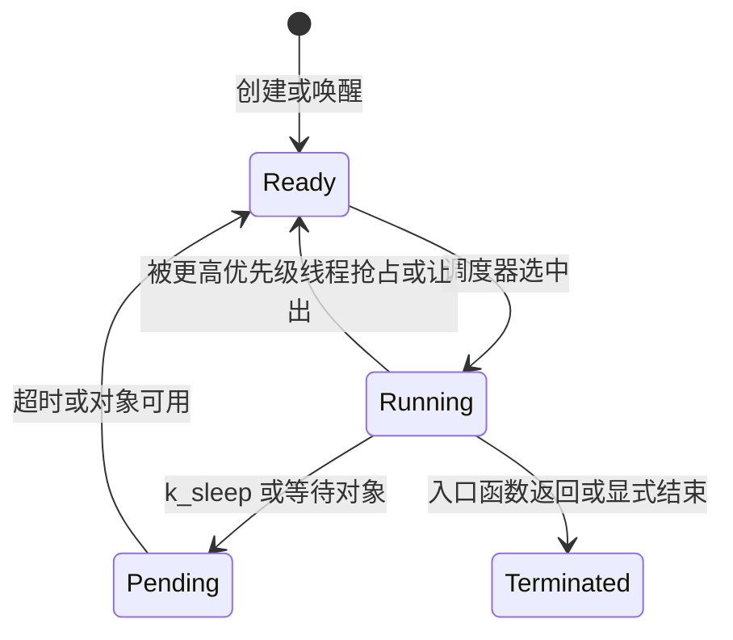

FreeRTOS 里的任务，在 Zephyr 中叫作线程。两者都拥有入口函数、栈、优先级和阻塞状态；真正容易出错的是调度细节：**Zephyr 的数值越小优先级越高，负优先级是协作线程，非负优先级是抢占线程。**

本文基于 Zephyr 4.4.x。线程与调度的完整规则见官方 [Threads](https://docs.zephyrproject.org/latest/kernel/services/threads/index.html) 和 [Scheduling](https://docs.zephyrproject.org/latest/kernel/services/scheduling/index.html)。

## 一、任务对象与线程对象

| FreeRTOS | Zephyr | 含义 |
| --- | --- | --- |
| TaskHandle_t | struct k_thread | 线程控制块 |
| xTaskCreate | k_thread_create 或 K_THREAD_DEFINE | 创建线程 |
| configMINIMAL_STACK_SIZE | K_THREAD_STACK_DEFINE | 声明满足架构约束的线程栈 |
| vTaskDelay | k_sleep | 让当前线程阻塞一段时间 |
| uxTaskPriorityGet | k_thread_priority_get | 查询优先级 |

裸机代码通常把循环写在 main 中；RTOS 的价值是将“等待事件”和“执行工作”拆到不同执行上下文。Zephyr 线程也遵守这一原则，但它强调栈必须由专用宏定义，不能把任意字节数组当作线程栈。



【图1：Zephyr 线程的主要状态】

## 二、优先级先记住方向

Zephyr 的优先级不是越大越紧急：

| 范围 | 类型 | 典型用途 |
| --- | --- | --- |
| 负数 | 协作 cooperative | 极短、不会阻塞的关键控制路径 |
| 0 及正数 | 抢占 preemptive | 普通业务、通信、日志处理 |
| 数值更小 | 优先级更高 | 例如 2 比 5 更早获得 CPU |

协作线程不会被同级或更低级的可运行线程抢占，因此其中不能执行无限循环，也不能把长时间计算放进去。它更接近 FreeRTOS 中禁止切换时的临界业务，但不能拿来替代互斥。

时间片轮转只在启用相应 Kconfig 配置后，对符合条件的同优先级抢占线程产生作用。不要把时间片当作线程公平性的唯一保障；正确做法仍是在线程不需要 CPU 时通过 k_sleep 或等待内核对象主动阻塞。

## 三、静态创建是产品默认选择

动态创建适合按需工作者；大多数 MCU 产品的线程数量在编译时已确定，静态定义更容易审计 RAM：

```c
#include <zephyr/kernel.h>
#include <zephyr/logging/log.h>

LOG_MODULE_REGISTER(thread_demo, LOG_LEVEL_INF);

#define CONTROL_STACK_SIZE 768
#define WORKER_STACK_SIZE  1024
#define CONTROL_PRIORITY   2
#define WORKER_PRIORITY    5

static void control_thread(void *a, void *b, void *c)
{
    ARG_UNUSED(a);
    ARG_UNUSED(b);
    ARG_UNUSED(c);

    while (true) {
        LOG_INF("control tick");
        k_sleep(K_MSEC(200));
    }
}

static void worker_thread(void *a, void *b, void *c)
{
    ARG_UNUSED(a);
    ARG_UNUSED(b);
    ARG_UNUSED(c);

    while (true) {
        LOG_INF("worker samples data");
        k_sleep(K_SECONDS(1));
    }
}

K_THREAD_DEFINE(control_tid, CONTROL_STACK_SIZE, control_thread,
                NULL, NULL, NULL, CONTROL_PRIORITY, 0, 0);

K_THREAD_DEFINE(worker_tid, WORKER_STACK_SIZE, worker_thread,
                NULL, NULL, NULL, WORKER_PRIORITY, 0, 0);
```

K_THREAD_DEFINE 同时分配栈、控制块并在启动阶段创建线程。控制线程的优先级是 2，比工作线程的 5 高；两者睡眠时，CPU 可进入空闲。

对应的最小 prj.conf：

```ini
CONFIG_LOG=y
CONFIG_LOG_DEFAULT_LEVEL=3
CONFIG_THREAD_NAME=y
CONFIG_THREAD_STACK_INFO=y
CONFIG_INIT_STACKS=y
```

线程名和栈信息会增加少量开销，但在开发阶段非常值得保留。nRF52832 只有 64 KB RAM，发布配置必须根据实测回收调试选项。


【图2：高优先级线程从睡眠恢复后的调度结果】

## 四、动态创建与延迟启动

需要运行期创建时，栈和控制块依然由应用持有：

```c
K_THREAD_STACK_DEFINE(telemetry_stack, 1024);
static struct k_thread telemetry_thread;

static void telemetry_entry(void *a, void *b, void *c)
{
    while (true) {
        k_sleep(K_SECONDS(5));
    }
}

void start_telemetry(void)
{
    k_tid_t tid;

    tid = k_thread_create(&telemetry_thread, telemetry_stack,
                          K_THREAD_STACK_SIZEOF(telemetry_stack),
                          telemetry_entry, NULL, NULL, NULL,
                          6, 0, K_FOREVER);
    k_thread_name_set(tid, "telemetry");
    k_thread_start(tid);
}
```

K_FOREVER 让线程创建后不进入就绪队列，直到 k_thread_start 调用。这很适合等待外设初始化完成的业务线程。不要从 ISR 中创建复杂线程或做可能阻塞的线程管理；ISR 应只发送信号，把策略放回线程上下文。

## 五、栈大小不是拍脑袋

栈不足常表现为随机 HardFault、日志在某处停止、或打开优化后才复现。推荐流程：

1. 开发构建启用 CONFIG_THREAD_STACK_INFO 和 CONFIG_INIT_STACKS。
2. 使用线程分析、调试器或线程栈使用率接口观察峰值。
3. 给峰值留出接口变化、日志格式化和中断嵌套所需余量。
4. 把每个线程的栈值记录在 prj.conf 或集中头文件中，不能散落为魔法数字。

FreeRTOS 的 uxTaskGetStackHighWaterMark 同样是在回答“还剩多少”；两者都只能覆盖已经执行过的路径。BLE 配对、错误日志、OTA 和异常恢复路径通常才是栈峰值出现的位置。

## 六、常见问题

| 现象 | 原因 | 处理 |
| --- | --- | --- |
| 高优先级线程让系统无响应 | 线程不阻塞、也不让出 CPU | 加入等待对象或 k_sleep，缩短临界工作 |
| 认为 5 比 2 优先级高 | 沿用了 FreeRTOS 的直觉 | 记住 Zephyr 数值越小越高 |
| 运行一段时间后崩溃 | 栈估计过小 | 开启栈分析，扩大栈并覆盖异常路径 |
| 协作线程阻塞大量工作 | 在协作上下文进行长计算 | 改为抢占线程或分片处理 |
| 线程一创建就执行 | 启动延迟设为 K_NO_WAIT | 用 K_FOREVER 加 k_thread_start 控制时机 |

## 七、动手练习

1. 将两个线程改成优先级 2 和 5，观察串口日志的交替节奏。
2. 去掉控制线程中的 k_sleep，观察工作线程为何不再输出，再恢复正确阻塞。
3. 把 worker 栈缩小到 256 字节，结合调试器和栈监测观察风险。
4. 用 K_FOREVER 创建 telemetry 线程，在按键或串口命令到来后再启动它。

## 八、里程碑自检

- [ ] 知道 Zephyr 优先级数值越小越高
- [ ] 能区分协作线程和抢占线程的适用边界
- [ ] 会用 K_THREAD_DEFINE 静态创建常驻线程
- [ ] 会用 K_THREAD_STACK_DEFINE 与 k_thread_create 延迟启动线程
- [ ] 能用可观测数据而非猜测确定栈大小

## 小结

线程 API 的名字只是表面差异。真正决定系统是否稳定的是优先级方向、阻塞点和栈预算：高优先级线程只做短而确定的工作，耗时业务主动让出 CPU，每一份栈都要为最坏路径留余量。

> 🏷️ 标签：Zephyr · 线程 · 调度器 · 优先级 · 栈 · FreeRTOS · nRF52832
