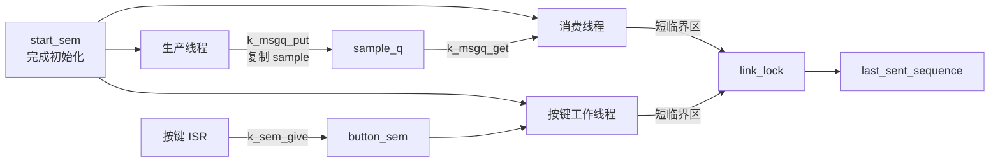
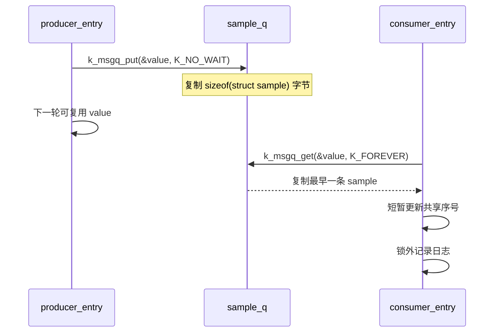

线程共享 CPU，但不应该随意共享状态。Zephyr 的同步对象把三个问题分开表达：**什么时候可以继续、谁拥有共享资源、数据如何交接**。信号量负责计数和通知，互斥锁保护具有所有权的临界区，消息队列在线程之间复制固定大小的数据。

它们分别对应 FreeRTOS 的 binary/counting semaphore、mutex 和 queue。迁移时最容易犯的错误不是函数名写错，而是对象语义选错：拿信号量当锁、在 ISR 中等待、把局部变量指针塞进队列，都会让系统在高负载时失去可预测性。

本文基于 Zephyr 4.4.x，目标板为 `nrf52dk/nrf52832`。接口与上下文限制见官方 [Message Queues](https://docs.zephyrproject.org/latest/kernel/services/data_passing/message_queues.html)、[Semaphores](https://docs.zephyrproject.org/latest/kernel/services/synchronization/semaphores.html) 和 [Mutexes](https://docs.zephyrproject.org/latest/kernel/services/synchronization/mutexes.html)。

## 一、先按问题选对象

| 需要表达的问题 | Zephyr 对象 | FreeRTOS 类比 | 不适合解决什么 |
| --- | --- | --- | --- |
| 发生了多少次事件 | `k_sem` | 二值或计数信号量 | 保护有所有者的共享结构 |
| 谁有权访问共享资源 | `k_mutex` | mutex | 从 ISR 唤醒线程 |
| 在线程间传固定大小消息 | `k_msgq` | queue | 可变长度大块数据 |
| 等待受锁保护的条件变化 | `k_condvar` | 条件变量 | 取代所有消息队列 |
| 传递由调用者管理的对象指针 | `k_fifo` / `k_queue` | 指针队列 | 自动复制业务对象 |

`k_msgq` 复制消息内容，不保留生产者传入的指针。因此生产者可以复用栈上的 `struct sample`，消费者仍会得到独立副本。代价是队列缓冲区固定，并且每次 put/get 都复制 `q_msg_size` 字节。

`k_sem` 没有“持有者”。任何允许的上下文都可以 give，take 只消耗计数。`k_mutex` 则记录所有者并支持优先级继承，只能在线程上下文使用。



【图 1：启动同步、事件通知、数据交接和共享状态使用不同对象】

## 二、同步对象的本质：状态、等待队列与所有权

线程协作的核心不是“调用一个 take API”，而是让**检查条件与进入等待**成为一个内核保护的原子过程。裸机代码常这样轮询：

```c
/* 错误方向：持续占用 CPU，并且检查与清零之间存在竞态。 */
while (!event_ready) {
    /* busy wait */
}
event_ready = false;
```

如果中断恰好在检查和清零之间更新标志，事件可能被覆盖；如果事件迟迟不到，线程一直消耗 CPU。内核对象把对象状态和等待线程队列放在一起管理：

1. 线程进入内核，检查对象当前状态；
2. 条件满足时原子消费计数、取得所有权或复制数据；
3. 条件不满足时，内核把线程挂到对象 wait queue，并把它变为 pending；
4. 生产者更新对象后，内核选择合适 waiter 变为 ready；
5. 调度器再按优先级决定它何时运行。

因此“give 之后线程立刻执行”不是对象保证；give 只改变对象状态并使 waiter ready。

三类对象保存的信息不同：

| 对象 | 内核保存的核心状态 | 是否携带业务数据 | 是否记录所有者 |
| --- | --- | --- | --- |
| semaphore | 当前计数、上限、等待线程 | 否 | 否 |
| mutex | owner、递归计数、等待线程、继承关系 | 否 | 是 |
| message queue | 固定大小 ring buffer、读写位置、等待线程 | 是，复制消息 | 否 |

这决定了它们不能互换：

- semaphore 能说“事件发生了三次”，却不能告诉消费者三次事件各自的数据；
- mutex 能保证同一时刻只有 owner 访问共享对象，却不能从 ISR 获取，也不保存历史事件；
- message queue 同时表达数据和背压，但固定缓冲区满时必须有等待或丢弃策略。

同步对象还承担**内存可见性边界**。生产者在 give/put/unlock 之前完成的数据写入，消费者在成功 take/get/lock 后再读取，才形成受内核同步保护的交接。仅用普通全局 bool 轮询不仅浪费 CPU，在 C 内存模型和 SMP 下也可能形成数据竞争。

## 三、完整实验：生产者、消费者与按键通知

实验每 500 ms 生成一个模拟电压样本，消费者从消息队列取出并记录最近发送序号。按下 `sw0` 后，GPIO ISR 只释放信号量，按键工作线程再读取受互斥锁保护的序号。

三个线程由 `K_THREAD_DEFINE` 静态创建。静态线程可能在 `main` 完成应用初始化前进入调度，所以示例增加 `start_sem`：三个线程首先永久等待，只有 GPIO 和回调都配置成功后，`main` 才给出三个启动令牌。初始化失败时，业务线程保持阻塞，不会在半初始化状态下运行。

### 3.1 工程目录

```text
ipc_demo/
├── CMakeLists.txt
├── prj.conf
└── src/
    └── main.c
```

`CMakeLists.txt`：

```cmake
cmake_minimum_required(VERSION 3.20.0)
find_package(Zephyr REQUIRED HINTS $ENV{ZEPHYR_BASE})
project(ipc_demo)

target_sources(app PRIVATE src/main.c)
```

`prj.conf`：

```ini
CONFIG_GPIO=y
CONFIG_LOG=y
CONFIG_LOG_DEFAULT_LEVEL=3
CONFIG_THREAD_NAME=y
```

### 3.2 完整的 src/main.c

```c
#include <errno.h>
#include <stdint.h>

#include <zephyr/drivers/gpio.h>
#include <zephyr/kernel.h>
#include <zephyr/logging/log.h>

LOG_MODULE_REGISTER(ipc_demo, LOG_LEVEL_INF);

#define BUTTON_NODE         DT_ALIAS(sw0)
#define PRODUCER_STACK_SIZE 768
#define CONSUMER_STACK_SIZE 1024
#define BUTTON_STACK_SIZE   768
#define PRODUCER_PRIORITY   5
#define CONSUMER_PRIORITY   4
#define BUTTON_PRIORITY     3

struct sample {
    int32_t millivolts;
    uint32_t sequence;
};

K_MSGQ_DEFINE(sample_q, sizeof(struct sample), 8,
              _Alignof(struct sample));
K_SEM_DEFINE(start_sem, 0, 3);
K_SEM_DEFINE(button_sem, 0, 1);
K_MUTEX_DEFINE(link_lock);

static const struct gpio_dt_spec button =
    GPIO_DT_SPEC_GET(BUTTON_NODE, gpios);
static struct gpio_callback button_cb;
static uint32_t next_sequence;
static uint32_t last_sent_sequence;

/**
 * @brief 等待初始化完成，然后每 500 ms 生成一个样本。
 *
 * @param p1 未使用。
 * @param p2 未使用。
 * @param p3 未使用。
 */
static void producer_entry(void *p1, void *p2, void *p3)
{
    struct sample value;
    int rc;

    ARG_UNUSED(p1);
    ARG_UNUSED(p2);
    ARG_UNUSED(p3);

    rc = k_sem_take(&start_sem, K_FOREVER);
    if (rc != 0) {
        LOG_ERR("producer start wait failed: %d", rc);
        return;
    }

    while (true) {
        value.millivolts = 3000 + (int32_t)(next_sequence % 100U);
        value.sequence = next_sequence++;

        rc = k_msgq_put(&sample_q, &value, K_NO_WAIT);
        if (rc == -ENOMSG) {
            LOG_WRN("sample queue full, drop %u", value.sequence);
        } else if (rc != 0) {
            LOG_ERR("sample enqueue failed: %d", rc);
        }

        k_sleep(K_MSEC(500));
    }
}

/**
 * @brief 消费样本，并更新受互斥锁保护的最近发送序号。
 *
 * @param p1 未使用。
 * @param p2 未使用。
 * @param p3 未使用。
 */
static void consumer_entry(void *p1, void *p2, void *p3)
{
    struct sample value;
    int rc;

    ARG_UNUSED(p1);
    ARG_UNUSED(p2);
    ARG_UNUSED(p3);

    rc = k_sem_take(&start_sem, K_FOREVER);
    if (rc != 0) {
        LOG_ERR("consumer start wait failed: %d", rc);
        return;
    }

    while (true) {
        rc = k_msgq_get(&sample_q, &value, K_FOREVER);
        if (rc != 0) {
            LOG_ERR("sample receive failed: %d", rc);
            continue;
        }

        rc = k_mutex_lock(&link_lock, K_FOREVER);
        if (rc != 0) {
            LOG_ERR("link lock failed: %d", rc);
            continue;
        }

        last_sent_sequence = value.sequence;

        rc = k_mutex_unlock(&link_lock);
        if (rc != 0) {
            LOG_ERR("link unlock failed: %d", rc);
            continue;
        }

        LOG_INF("send sample %u: %d mV",
                value.sequence, value.millivolts);
    }
}

/**
 * @brief 在线程上下文处理按键事件并读取共享状态。
 *
 * @param p1 未使用。
 * @param p2 未使用。
 * @param p3 未使用。
 */
static void button_worker_entry(void *p1, void *p2, void *p3)
{
    uint32_t sequence;
    int rc;

    ARG_UNUSED(p1);
    ARG_UNUSED(p2);
    ARG_UNUSED(p3);

    rc = k_sem_take(&start_sem, K_FOREVER);
    if (rc != 0) {
        LOG_ERR("button worker start wait failed: %d", rc);
        return;
    }

    while (true) {
        rc = k_sem_take(&button_sem, K_FOREVER);
        if (rc != 0) {
            LOG_ERR("button wait failed: %d", rc);
            continue;
        }

        rc = k_mutex_lock(&link_lock, K_FOREVER);
        if (rc != 0) {
            LOG_ERR("link lock failed: %d", rc);
            continue;
        }

        sequence = last_sent_sequence;

        rc = k_mutex_unlock(&link_lock);
        if (rc != 0) {
            LOG_ERR("link unlock failed: %d", rc);
            continue;
        }

        LOG_INF("button event, last sample %u", sequence);
    }
}

/**
 * @brief 将 GPIO 边沿转换为非阻塞信号量通知。
 *
 * @param port 触发回调的 GPIO 设备。
 * @param cb 已注册的回调对象。
 * @param pins 触发回调的引脚位掩码。
 */
static void button_isr(const struct device *port,
                       struct gpio_callback *cb,
                       uint32_t pins)
{
    ARG_UNUSED(port);
    ARG_UNUSED(cb);
    ARG_UNUSED(pins);

    k_sem_give(&button_sem);
}

K_THREAD_DEFINE(producer_tid, PRODUCER_STACK_SIZE, producer_entry,
                NULL, NULL, NULL, PRODUCER_PRIORITY, 0, 0);
K_THREAD_DEFINE(consumer_tid, CONSUMER_STACK_SIZE, consumer_entry,
                NULL, NULL, NULL, CONSUMER_PRIORITY, 0, 0);
K_THREAD_DEFINE(button_tid, BUTTON_STACK_SIZE, button_worker_entry,
                NULL, NULL, NULL, BUTTON_PRIORITY, 0, 0);

/**
 * @brief 配置按键中断并释放三个线程的启动门。
 *
 * @return 成功返回 0，否则返回设备或 GPIO 接口的负错误码。
 */
int main(void)
{
    int rc;

    if (!gpio_is_ready_dt(&button)) {
        LOG_ERR("button device is not ready");
        return -ENODEV;
    }

    rc = gpio_pin_configure_dt(&button, GPIO_INPUT);
    if (rc != 0) {
        LOG_ERR("button configure failed: %d", rc);
        return rc;
    }

    rc = gpio_pin_interrupt_configure_dt(
        &button, GPIO_INT_EDGE_TO_ACTIVE);
    if (rc != 0) {
        LOG_ERR("button interrupt configure failed: %d", rc);
        return rc;
    }

    gpio_init_callback(&button_cb, button_isr, BIT(button.pin));
    rc = gpio_add_callback(button.port, &button_cb);
    if (rc != 0) {
        LOG_ERR("button callback add failed: %d", rc);
        return rc;
    }

    k_sem_give(&start_sem);
    k_sem_give(&start_sem);
    k_sem_give(&start_sem);

    LOG_INF("IPC demo ready");
    return 0;
}
```

### 3.3 构建与预期输出

在已经初始化的 Zephyr 4.4 工作区上层目录执行：

```powershell
west build -p always -b nrf52dk/nrf52832 ipc_demo
west flash
```

日志时间戳和线程切换顺序由调度器决定，下面只展示业务关系：

```text
IPC demo ready
send sample 0: 3000 mV
send sample 1: 3001 mV
button event, last sample 1
```

如果看不到按键日志，先确认 `sw0` alias 存在，再检查 GPIO 回调是否注册成功；不要先怀疑信号量。

## 四、消息队列：交接的是数据副本

`K_MSGQ_DEFINE` 是静态定义宏：

```c
K_MSGQ_DEFINE(q_name, q_msg_size, q_max_msgs, q_align)
```

| 参数 | 含义 |
| --- | --- |
| `q_name` | 队列对象名称。 |
| `q_msg_size` | 每条消息复制的字节数。put 与 get 的缓冲区都必须至少这么大。 |
| `q_max_msgs` | 环形缓冲区可容纳的最大消息数。 |
| `q_align` | 队列缓冲区对齐，必须是 2 的幂；`1` 已足够，本例用 `_Alignof(struct sample)` 表达类型对齐。 |

put/get 的精确签名为：

```c
int k_msgq_put(struct k_msgq *msgq, const void *data,
               k_timeout_t timeout);
int k_msgq_get(struct k_msgq *msgq, void *data,
               k_timeout_t timeout);
```

`msgq` 是队列地址；`data` 分别指向源消息或接收缓冲区；`timeout` 可以是 `K_NO_WAIT`、`K_FOREVER` 或有界超时。成功返回 `0`；不等待且无法完成，或队列被 purge 时返回 `-ENOMSG`；有界等待到期返回 `-EAGAIN`。ISR 调用时 `timeout` 必须为 `K_NO_WAIT`。

`k_msgq_put` 在返回前已经复制数据，内核不会保存 `&value`。因此生产者下一轮覆盖局部变量不会影响队列中的旧样本。

队列把所有权问题简化成两个阶段：put 前，源对象仍由生产者拥有；put 成功后，队列拥有一份副本；get 成功后，消费者拥有目标缓冲区中的副本。生产者和消费者不共享同一个 `struct sample`，所以不需要再用 mutex 保护消息内容。

代价也很明确：静态消息存储至少需要 `q_msg_size × q_max_msgs` 字节，并发生两次复制。大图像、固件块或可变长度帧通常不适合直接塞进 msgq，可以改传固定描述符/指针，但此时必须重新定义缓冲区所有权、释放者和失效时机。

队列长度是 8。若生产速度持续高于消费速度，第 9 次非阻塞 put 返回 `-ENOMSG`。遥测数据可以明确丢弃并计数；控制命令则通常需要有界等待、限流或协议确认，不能静默丢失。

“把队列加大”只能吸收短时突发，不能修复长期生产率大于消费率。设计队列深度前先估算最大突发长度、单条大小、可接受延迟和丢弃策略，再用运行时高水位验证。



【图 2：消息队列交接数据副本，而不是局部变量指针】

## 五、信号量：事件计数而不是所有权

静态定义宏和核心函数为：

```c
K_SEM_DEFINE(name, initial_count, count_limit);
void k_sem_give(struct k_sem *sem);
int k_sem_take(struct k_sem *sem, k_timeout_t timeout);
```

| 参数 | 含义 |
| --- | --- |
| `name` | 信号量对象名称。 |
| `initial_count` | 启动时可 take 的次数，必须不大于上限。 |
| `count_limit` | 最大计数，必须大于 0；达到上限后继续 give 不再增长。 |
| `sem` | 目标信号量地址。 |
| `timeout` | take 的等待策略；ISR 中只能使用 `K_NO_WAIT`。 |

`k_sem_take` 成功返回 `0`；`K_NO_WAIT` 下没有令牌返回 `-EBUSY`；等待超时或信号量被 reset 返回 `-EAGAIN`。`k_sem_give` 无返回值并可在 ISR 中调用。

本例的 `start_sem` 上限为 3，用三个令牌放行三个线程；`button_sem` 上限为 1，连续边沿只保留“至少发生过一次”。这能避免抖动事件无限累计，但不等于完整按键消抖。如果产品需要识别每次独立按压，应在 GPIO 硬件或线程/工作队列中增加时间判定。

信号量不能替代 mutex：它不记录谁 take 过它，也不提供优先级继承。任何线程都可以 give；一旦错误路径多 give 一次，临界区就不再互斥。

## 六、互斥锁：保护短小的共享状态

`K_MUTEX_DEFINE` 是静态定义宏：

```c
K_MUTEX_DEFINE(name);
int k_mutex_lock(struct k_mutex *mutex, k_timeout_t timeout);
int k_mutex_unlock(struct k_mutex *mutex);
```

`k_mutex_lock` 成功返回 `0`；不等待且锁不可用返回 `-EBUSY`；等待超时返回 `-EAGAIN`。`k_mutex_unlock` 成功返回 `0`；当前线程不是所有者返回 `-EPERM`；锁没有处于加锁状态返回 `-EINVAL`。mutex 具有线程所有权和优先级继承语义，不能在 ISR 中 lock 或 unlock。

优先级继承针对经典优先级反转：

1. 低优先级 L 已持有 mutex；
2. 高优先级 H 尝试 lock 并进入 pending；
3. 中优先级 M 持续 ready，若没有继承会长期抢占 L；
4. 内核临时提升 L，使它尽快运行到 unlock；
5. H 获得锁后，L 恢复原优先级。

它只缩短“低线程因中线程抢占而无法释放锁”的时间，不会缩短 L 自己在临界区做的工作。若 L 在锁内等待网络 5 秒，H 仍可能等待 5 秒。

完整示例里，消费者在锁内只更新 `last_sent_sequence`，按键线程在锁内只复制它，日志都放在锁外。不要在持锁期间等待网络、Flash、I2C 或 BLE 发送完成；优先级继承能缓解优先级反转，但不能让过长临界区变合理。

mutex 也不等于“关中断”。ISR 仍然可以发生，SMP 上其他 CPU 也仍运行，只是试图取得同一 mutex 的线程会等待。需要在线程和 ISR 之间共享极短状态时，应选择 atomic、spinlock 或中断安全的数据交接模式，而不是让 ISR 访问 mutex 保护的数据。

## 七、ISR 只能走非阻塞路径

GPIO ISR 的职责应限制为确认硬件事件、保存最少状态、触发非阻塞通知。本例的 `button_isr` 只调用 `k_sem_give`；等待、互斥锁、共享状态读取和日志都在 `button_worker_entry`。

- `k_sem_give` 可以直接通知线程。
- `k_msgq_put/get` 在 ISR 中必须传 `K_NO_WAIT`。
- `k_mutex_lock/unlock` 不允许在 ISR 中调用。
- 任何可能睡眠的超时、日志格式化或外设事务都应移到线程或工作队列。

启动信号量解决的是另一条边界：静态线程创建完成不等于应用依赖初始化完成。把启动条件显式做成对象，比依赖“main 应该先运行”更可靠。

## 八、超时就是系统策略

| 超时参数 | 行为 | 典型用法 |
| --- | --- | --- |
| K_NO_WAIT | 立刻成功或失败 | ISR、不能阻塞的路径 |
| K_FOREVER | 一直等待 | 必须收到的命令、常驻消费者 |
| K_MSEC(n) | 有界等待 | 总线访问、连接状态、故障恢复 |

FreeRTOS 中把 `portMAX_DELAY` 写得到处都是，最终容易掩盖死锁。Zephyr 同样如此：常驻消费者可以用 `K_FOREVER`，ISR 和不能阻塞的路径使用 `K_NO_WAIT`，总线与请求响应则更适合有界超时。每个失败分支都要明确是重试、丢弃、降级还是进入故障状态。

timeout 本身不是恢复策略：

- `K_NO_WAIT` 表示一次 try 操作，失败后立即重试会退化成 busy loop；
- 有界超时给上层一个重新决策的机会，但超时长度必须来自业务 deadline，不是随手写 100 ms；
- `K_FOREVER` 适合对象就是线程唯一唤醒源的常驻服务循环；若还需要停机，应另外设计 shutdown event，不能指望线程自然返回。

调用者还要区分错误原因。例如 msgq 的 `-ENOMSG` 表示当前无法无等待完成，`-EAGAIN` 表示等待期限已过；这两种情况可能对应不同统计和恢复动作。

## 九、常见问题与定位

| 现象 | 根因 | 检查与处理 |
| --- | --- | --- |
| 生产/消费线程没有输出 | `start_sem` 没收到三个令牌 | 检查 `main` 是否在 GPIO 配置或回调注册处提前返回。 |
| 队列周期性满 | 生产平均速率高于消费速率 | 查看丢弃序号；降低生产速率、缩短消费时间或按预算增加深度。 |
| 消费者读到错误数据 | 消息大小与结构不一致，或错误改成指针队列 | 对照 `q_msg_size` 和接收缓冲区；`k_msgq` 应复制完整结构。 |
| 按键一次产生多次业务 | 边沿抖动且没有时间消抖 | `button_sem` 上限 1 只能合并积压，加入延迟工作或硬件消抖。 |
| 高优先级线程等待很久 | 低优先级线程在锁内执行慢操作 | 把日志和 I/O 移到锁外，只在锁内复制或更新状态。 |
| ISR 后系统异常 | ISR 使用 mutex 或等待型 API | ISR 只走 `K_NO_WAIT` 或 give 路径，把业务交给线程。 |
| `k_mutex_unlock` 返回 `-EPERM` | 当前线程不是锁所有者 | 检查错误分支，只有 lock 成功的线程才能执行对应 unlock。 |

## 十、动手练习

1. 在 `consumer_entry` 处理完样本后睡眠 2 秒，将队列深度改为 2，记录 `-ENOMSG` 和丢弃序号。
2. 把 `start_sem` 的上限错误改为 2，分析为什么一个线程永久停在启动门，然后恢复为 3。
3. 保持 `button_isr` 只 give，在 `button_worker_entry` 中增加 20 ms 消抖判定，比较原始边沿数和业务按压数。
4. 给 `k_mutex_lock` 设置 `K_MSEC(50)`，故意让另一个线程长时间持锁，记录 `-EAGAIN` 并设计降级策略。
5. 给 `struct sample` 增加状态字段，验证 `sizeof(struct sample)` 和 `_Alignof(struct sample)` 自动更新队列定义。

## 十一、里程碑自检

- [ ] 能按事件、所有权和数据交接选择 `k_sem`、`k_mutex` 与 `k_msgq`。
- [ ] 能解释内核如何把条件检查和进入 wait queue 做成原子操作。
- [ ] 知道 give/put/unlock 让 waiter ready，不保证它立即运行。
- [ ] 知道消息队列复制固定大小数据，生产者局部变量可以安全复用。
- [ ] 能说明 put 前、队列中、get 后的数据所有权分别属于谁。
- [ ] 会用启动同步阻止静态线程在依赖初始化前执行业务。
- [ ] 能解释 `K_NO_WAIT`、有界超时和 `K_FOREVER` 的失败策略。
- [ ] 知道 ISR 只能走非阻塞路径，mutex 只能在线程上下文使用。
- [ ] 能用 L/M/H 三线程场景解释优先级反转和优先级继承的边界。
- [ ] 会检查 GPIO、队列、信号量和 mutex 的关键返回值。
- [ ] 能把日志和慢 I/O 移出互斥锁临界区。

## 小结

同步对象不是可互换的工具。信号量表达“事件或许可发生了多少次”，互斥锁表达“哪个线程拥有共享资源”，消息队列表达“固定大小数据如何交接”。再把初始化门、ISR 非阻塞边界和失败策略写清楚，线程关系才能在高负载与异常路径下保持可预测。

> 🏷️ 标签：Zephyr · 信号量 · 互斥锁 · 消息队列 · ISR · FreeRTOS · 线程通信
