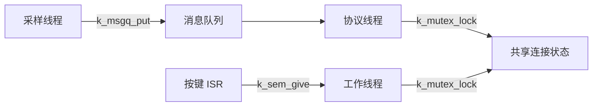
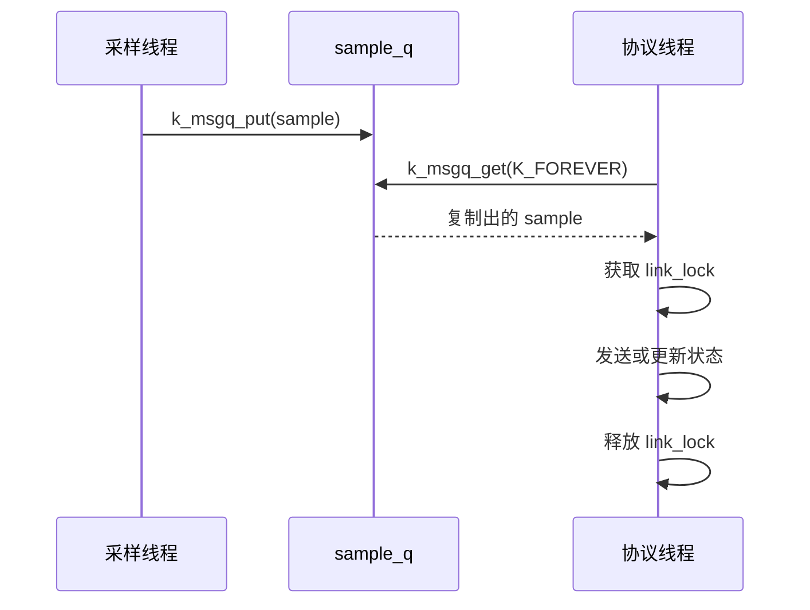

线程之间共享 CPU，却不应该随意共享状态。Zephyr 的同步对象把“什么时候可以继续”和“数据如何交接”分开表达：**信号量负责计数与通知，互斥锁保护共享资源，消息队列传递固定大小的数据副本。**

它们分别对应 FreeRTOS 的二值或计数信号量、mutex 和 queue。最重要的迁移点不是函数名字，而是先选择对象语义，再决定超时策略。

官方 API 与上下文限制见 [Kernel Services](https://docs.zephyrproject.org/latest/kernel/services/)。

## 一、先按问题选对象

| 问题 | Zephyr 对象 | FreeRTOS 类比 | 不该用它解决什么 |
| --- | --- | --- | --- |
| 发生了多少次事件 | k_sem | 二值或计数信号量 | 保护多字段共享结构 |
| 谁有权访问共享资源 | k_mutex | mutex | 从 ISR 唤醒线程 |
| 在线程间传固定大小消息 | k_msgq | xQueue | 可变长度大块数据 |
| 多条件等待 | k_condvar | 条件变量 | 取代所有队列 |
| 只要传递指针 | k_fifo 或 k_queue | 指针队列 | 自动复制业务结构 |

消息队列复制消息内容，能避免生产者复用局部变量后消费者读到脏数据；代价是固定缓冲区和拷贝。传感器采样值、命令帧、状态快照很适合它。



【图1：通知、数据和共享状态使用不同对象】

## 二、一个可运行的生产者与消费者

下面示例模拟传感器线程每 500 ms 生成一个样本，协议线程取出样本。按键中断只增加信号量，让工作线程处理业务，不在 ISR 中打印日志或等待锁。

```c
#include <zephyr/kernel.h>
#include <zephyr/drivers/gpio.h>
#include <zephyr/logging/log.h>

LOG_MODULE_REGISTER(ipc_demo, LOG_LEVEL_INF);

struct sample {
    int32_t millivolts;
    uint32_t sequence;
};

K_MSGQ_DEFINE(sample_q, sizeof(struct sample), 8, 4);
K_SEM_DEFINE(button_sem, 0, 1);
K_MUTEX_DEFINE(link_lock);

static uint32_t next_sequence;

static void producer(void)
{
    struct sample value;

    while (true) {
        value.millivolts = 3000 + (next_sequence % 100);
        value.sequence = next_sequence++;

        if (k_msgq_put(&sample_q, &value, K_NO_WAIT) != 0) {
            LOG_WRN("sample queue full, drop %u", value.sequence);
        }

        k_sleep(K_MSEC(500));
    }
}

static void consumer(void)
{
    struct sample value;

    while (true) {
        k_msgq_get(&sample_q, &value, K_FOREVER);

        k_mutex_lock(&link_lock, K_FOREVER);
        LOG_INF("send sample %u: %d mV", value.sequence, value.millivolts);
        k_mutex_unlock(&link_lock);
    }
}

static void button_isr(const struct device *port,
                       struct gpio_callback *cb, uint32_t pins)
{
    ARG_UNUSED(port);
    ARG_UNUSED(cb);
    ARG_UNUSED(pins);
    k_sem_give(&button_sem);
}
```

队列长度是 8，生产速率高于消费速率时，第 9 个非阻塞 put 返回错误。丢样策略在传感器遥测中经常合理；控制命令则通常应使用等待超时、限流或协议确认，而不是静默丢弃。



【图2：消息队列交接的是数据副本】

## 三、信号量不能替代互斥锁

信号量只表示“可继续的次数”。它不记录持有者，也不提供优先级继承。因此，以下写法是错误设计：用一个二值信号量当作共享 I2C 总线锁，然后让一个线程在持有期间等待长时间网络响应。

互斥锁的语义是所有权。Zephyr mutex 支持优先级继承，用来缓解优先级反转：高优先级线程等待低优先级持锁者时，内核可临时提高持锁者优先级，使其尽快释放资源。

正确的临界区应短小：

```c
static int link_state;

static void set_link_state(int state)
{
    k_mutex_lock(&link_lock, K_FOREVER);
    link_state = state;
    k_mutex_unlock(&link_lock);
}
```

不要在持锁期间调用可能长时间阻塞的网络、Flash 或等待函数。无法避免时，应重新设计为复制状态后释放锁，再执行慢操作。

## 四、ISR 只能走非阻塞路径

中断服务程序的职责是确认硬件事件、保存必要信息并唤醒工作线程。ISR 不能等待；可用对象的超时必须是 K_NO_WAIT。常用模式是：

1. ISR 调用 k_sem_give，或以非阻塞方式写入队列。
2. 工作线程以 K_FOREVER 等待。
3. 工作线程读取外设、更新状态、记录日志或发 BLE 通知。

对于按键，信号量最大值应为 1，因为连续抖动不应积累成多次业务事件。对于脉冲计数，最大值可设置为上限值，并在溢出时记录诊断。

## 五、超时就是系统策略

| 超时参数 | 行为 | 典型用法 |
| --- | --- | --- |
| K_NO_WAIT | 立刻成功或失败 | ISR、不能阻塞的路径 |
| K_FOREVER | 一直等待 | 必须收到的命令、常驻消费者 |
| K_MSEC(n) | 有界等待 | 总线访问、连接状态、故障恢复 |

FreeRTOS 中把 portMAX_DELAY 写得到处都是，最终容易掩盖死锁。Zephyr 同样如此：除非对象就是永久服务循环，否则为互斥锁和请求响应设置有意义的上限，并在失败时给出可诊断日志。

## 六、常见问题

| 现象 | 根因 | 处理 |
| --- | --- | --- |
| 队列偶发丢数据 | 生产速度超过消费速度 | 增大队列、降采样或明确丢弃策略 |
| 系统在中断后卡住 | ISR 使用了会等待的 API | 只用 K_NO_WAIT 路径，把工作交给线程 |
| 高优先级线程延迟很大 | 低优先级线程长时间持锁 | 缩短临界区，避免锁内慢操作 |
| 消费者读到错误数据 | 队列里放的是已失效指针 | 传递结构副本或规定对象生命周期 |
| 按键触发多次 | 没有消抖或信号量上限过大 | 在 GPIO 或工作线程中消抖，最大计数设为 1 |

## 七、动手练习

1. 将队列深度改为 2，故意让消费者睡眠 2 秒，观察队列满时的行为。
2. 在按键中断中只给信号量，在线程中输出日志，验证 ISR 与线程职责差异。
3. 写两个不同优先级的线程争用同一 mutex，并将临界区缩短前后对比延迟。
4. 把样本队列改为 K_FOREVER 写入，分析这对采样实时性的影响。

## 八、里程碑自检

- [ ] 能按通知、共享资源和数据交接选择对象
- [ ] 会定义并使用 k_sem、k_mutex 和 k_msgq
- [ ] 知道 ISR 必须走非阻塞路径
- [ ] 能解释为什么消息队列复制数据而不是只传指针
- [ ] 会为等待对象设计明确的超时和失败策略

## 小结

同步对象不是可互换的工具箱。信号量表达事件，互斥锁表达所有权，消息队列表达数据交接；对象语义正确后，线程间关系才会在高负载和异常路径下保持可预测。

> 🏷️ 标签：Zephyr · 信号量 · 互斥锁 · 消息队列 · ISR · FreeRTOS · 线程通信
