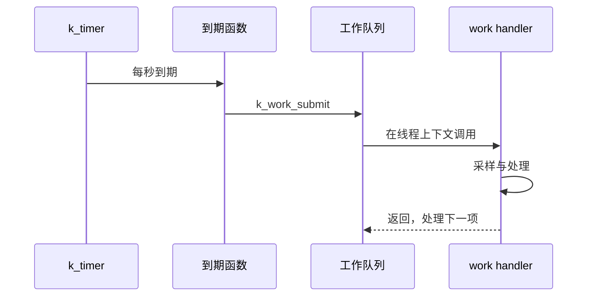

很多 FreeRTOS 工程把所有延迟工作塞进软件定时器回调。Zephyr 需要先分清两个角色：**k_timer 负责在正确时间通知；工作队列负责在线程上下文执行可能较慢的处理。**

k_timer 类比 FreeRTOS software timer 的计时部分，k_work 则像一个由内核管理的后台 worker。两者组合后，ISR、定时器回调和业务线程都能把耗时工作推迟到安全的执行上下文。官方说明见 [Timers](https://docs.zephyrproject.org/latest/kernel/services/timing/timers.html) 与 [Workqueue Threads](https://docs.zephyrproject.org/latest/kernel/services/threads/workqueue.html)。

## 一、先问“代码运行在哪里”

| 机制 | 回调或处理位置 | 能否阻塞 | 适合做什么 |
| --- | --- | --- | --- |
| GPIO ISR | 中断上下文 | 否 | 记录边沿、发信号 |
| k_timer 到期函数 | 系统时钟中断相关上下文 | 否 | 更新时间戳、提交工作 |
| 系统工作队列 handler | 内核工作线程 | 谨慎，避免拖住其他工作 | 消抖、协议状态更新 |
| 自定义工作队列 handler | 自己的工作线程 | 可以按设计阻塞 | 隔离慢 I/O 或复杂任务 |
| 普通线程 | 独立线程 | 可以 | 长时间业务循环 |

定时器回调不是普通线程函数。不要在回调里读 I2C、写 Flash、发送 BLE 通知或等待互斥锁；这些操作可能耗时或阻塞。


【图1：时间触发与实际处理分离】

## 二、用延迟工作完成按键消抖

按键中断到来后，真正稳定的电平通常要等待数十毫秒。以下示例把 20 ms 消抖放到工作队列中：

```c
#include <zephyr/kernel.h>
#include <zephyr/drivers/gpio.h>
#include <zephyr/logging/log.h>

LOG_MODULE_REGISTER(work_demo, LOG_LEVEL_INF);

#define BUTTON_NODE DT_ALIAS(sw0)
static const struct gpio_dt_spec button =
    GPIO_DT_SPEC_GET(BUTTON_NODE, gpios);

static struct gpio_callback button_cb;

static void debounce_handler(struct k_work *work)
{
    int value;

    ARG_UNUSED(work);
    value = gpio_pin_get_dt(&button);
    if (value < 0) {
        LOG_ERR("button read failed: %d", value);
        return;
    }

    LOG_INF("stable button state: %d", value);
}

K_WORK_DELAYABLE_DEFINE(button_debounce, debounce_handler);

static void button_isr(const struct device *port,
                       struct gpio_callback *cb, uint32_t pins)
{
    ARG_UNUSED(port);
    ARG_UNUSED(cb);
    ARG_UNUSED(pins);

    k_work_reschedule(&button_debounce, K_MSEC(20));
}

int main(void)
{
    int err;

    if (!gpio_is_ready_dt(&button)) {
        return 0;
    }

    err = gpio_pin_configure_dt(&button, GPIO_INPUT);
    if (err != 0) {
        return 0;
    }

    err = gpio_pin_interrupt_configure_dt(&button, GPIO_INT_EDGE_BOTH);
    if (err != 0) {
        return 0;
    }

    gpio_init_callback(&button_cb, button_isr, BIT(button.pin));
    gpio_add_callback(button.port, &button_cb);

    return 0;
}
```

K_WORK_DELAYABLE_DEFINE 创建可延迟提交的工作项。这里使用 k_work_reschedule，而不是 k_work_schedule：每次新边沿都重新从 20 ms 开始计时，最后一次抖动之后才读取稳定电平。

最低配置：

```ini
CONFIG_GPIO=y
CONFIG_LOG=y
CONFIG_SYSTEM_WORKQUEUE_STACK_SIZE=1024
```

系统工作队列是共享资源。handler 内部不应长时间等待网络、Flash 或其他锁，否则同一队列中的 Bluetooth、驱动或系统工作都可能被拖延。

## 三、周期行为用 k_timer，业务放到工作里

周期采样需要稳定的时间基准时，可用 k_timer：

```c
static struct k_timer sample_timer;

static void sample_work_handler(struct k_work *work)
{
    ARG_UNUSED(work);
    LOG_INF("sample sensor in thread context");
}

K_WORK_DEFINE(sample_work, sample_work_handler);

static void sample_timer_expiry(struct k_timer *timer)
{
    ARG_UNUSED(timer);
    k_work_submit(&sample_work);
}

void start_sampling(void)
{
    k_timer_init(&sample_timer, sample_timer_expiry, NULL);
    k_timer_start(&sample_timer, K_SECONDS(1), K_SECONDS(1));
}
```

k_timer_start 的第二个参数是首次超时，第三个参数是周期。到期函数只提交工作，采样逻辑在工作线程中运行。若工作处理时间超过周期，k_work_submit 不会把同一个已排队工作无限复制；这保护内存，但也意味着必须明确“丢掉旧周期”还是“累计所有周期”的产品策略。



【图2：定时器只提交工作，工作线程执行业务】

## 四、什么时候需要自定义工作队列

默认系统队列适合短小、可预测的工作，例如消抖、简单状态转换和轻量回调。以下情况应创建自定义队列：

- handler 可能等待外设或网络。
- 某类工作必须有独立优先级。
- 需要避免影响 Bluetooth、日志或其他子系统的系统工作。
- 希望在停机流程中单独 drain 某类工作。

自定义队列本质上仍是一条线程和队列，需要为它分配栈。对 nRF52832 而言，每新增一条工作队列都意味着固定 RAM 成本；多数应用先从系统队列开始，确实观察到阻塞问题后再隔离。

## 五、取消与关闭顺序

延迟工作使关闭流程更容易出现竞态：外设先关闭，工作却在稍后运行。推荐顺序是：

1. 禁用中断或停止定时器，阻止新工作进入。
2. 取消或同步等待正在执行的延迟工作。
3. 释放外设、连接和应用资源。
4. 最后允许系统休眠或重启。

带同步的取消 API 能等待 handler 结束；同步对象必须具有足够生命周期，不能把它放进即将返回的临时栈帧。工作项 pending 时也不要重新初始化其结构。

## 六、常见问题

| 现象 | 根因 | 处理 |
| --- | --- | --- |
| 每次抖动都触发一次业务 | 使用 schedule 而非 reschedule | 对消抖采用 k_work_reschedule |
| 系统工作延迟变大 | handler 中执行慢 I/O 或等待锁 | 缩短 handler 或迁移到自定义队列 |
| 定时器回调异常 | 在回调中调用阻塞 API | 回调只更新状态或提交工作 |
| 停止应用后仍访问外设 | 未取消待执行的延迟工作 | 先停来源，再同步取消工作 |
| 周期采样次数少于预期 | handler 处理时间超过周期 | 明确丢样、排队或降低采样率 |

## 七、动手练习

1. 用板载按键和 LED 实现 20 ms 消抖，观察连续按压只产生稳定状态变化。
2. 把 k_work_reschedule 改成 k_work_schedule，比较两者在抖动期间的差别。
3. 用 k_timer 每秒提交一次采样工作，在 handler 中故意睡眠 1500 ms，分析丢周期策略。
4. 为慢速串口输出创建独立工作队列，比较它与系统工作队列的影响。

## 八、里程碑自检

- [ ] 知道 ISR、定时器到期函数和工作 handler 的上下文边界
- [ ] 会用 K_WORK_DELAYABLE_DEFINE 与 k_work_reschedule 实现消抖
- [ ] 会用 k_timer 产生周期触发，并在工作线程处理业务
- [ ] 能判断系统工作队列何时需要隔离
- [ ] 会在关闭流程中先停来源，再取消待执行工作

## 小结

定时器解决“何时发生”，工作队列解决“在哪里处理”。把耗时业务从中断和到期函数移开，既能保持响应时间，也能让延迟处理在复杂系统中仍然可控。

> 🏷️ 标签：Zephyr · k_timer · k_work · 工作队列 · 延迟工作 · 按键消抖 · 异步设计
