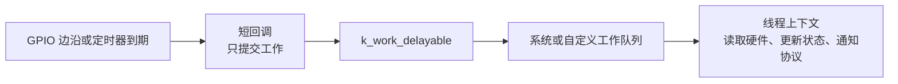
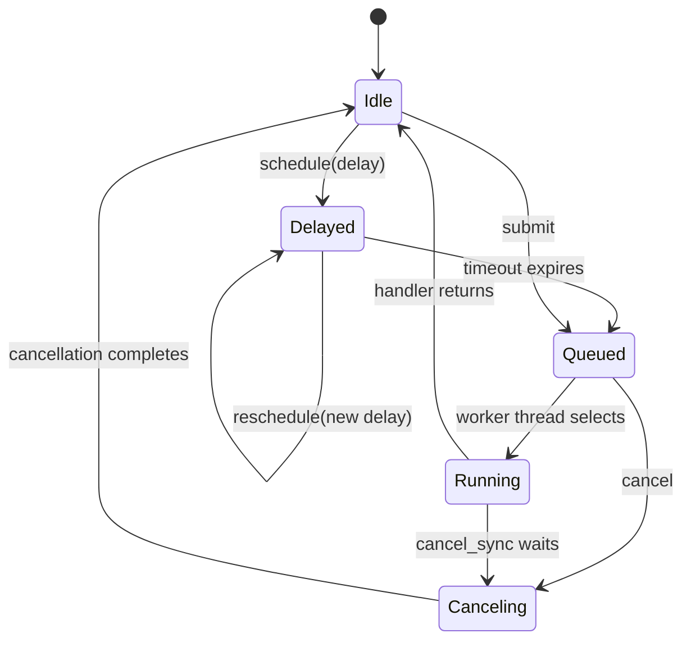
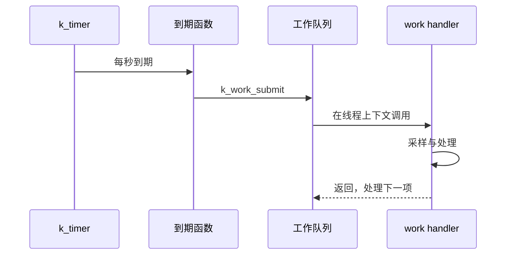

很多 FreeRTOS 工程把所有延迟工作塞进软件定时器回调。Zephyr 需要先分清两个角色：**k_timer 负责在正确时间通知；工作队列负责在线程上下文执行可能较慢的处理。**

`k_timer` 类比 FreeRTOS software timer 的计时部分，`k_work` 则像一个由内核管理的后台 worker。两者组合后，ISR、定时器回调和业务线程都能把耗时工作推迟到安全的执行上下文。

本文基于 Zephyr 4.4.x，目标板为 `nrf52dk/nrf52832`。接口语义与竞态约束见官方 [Timers](https://docs.zephyrproject.org/latest/kernel/services/timing/timers.html) 与 [Workqueue Threads](https://docs.zephyrproject.org/latest/kernel/services/threads/workqueue.html)。

## 一、先问“代码运行在哪里”

| 机制 | 回调或处理位置 | 能否阻塞 | 适合做什么 |
| --- | --- | --- | --- |
| GPIO ISR | 中断上下文 | 否 | 记录边沿、发信号 |
| k_timer 到期函数 | 系统时钟中断相关上下文 | 否 | 更新时间戳、提交工作 |
| 系统工作队列 handler | 内核工作线程 | 谨慎，避免拖住其他工作 | 消抖、协议状态更新 |
| 自定义工作队列 handler | 自己的工作线程 | 可以按设计阻塞 | 隔离慢 I/O 或复杂任务 |
| 普通线程 | 独立线程 | 可以 | 长时间业务循环 |

定时器回调不是普通线程函数。不要在回调里读 I2C、写 Flash、发送 BLE 通知或等待互斥锁；这些操作可能耗时或阻塞。



【图1：时间触发与实际处理分离】

## 二、work item 和 timer 各自保存什么

`k_work` 不是线程，也不会为每个工作项分配栈。它是一个包含 handler 和内部状态的内核对象；提交时，内核把对象放进某条 workqueue，真正执行 handler 的是该队列唯一的 worker 线程。

这带来三个直接结果：

1. 同一队列的 handler 串行执行，一个 handler 长时间阻塞会推迟后面的所有工作；
2. 同一个 work item 代表一个待处理状态，不是可无限复制的消息；重复提交可能合并；
3. handler 使用的是 workqueue 线程栈，多个工作项共享这份栈预算。

`k_work_delayable` 在普通 work 外增加 timeout 状态。它可能处于 idle、delayed、queued、running 或 canceling 等组合状态。API 返回值描述状态变化，不能一律丢弃。



【图 2：delayable work 的时间状态与 workqueue 执行状态】

`k_work_schedule` 只在尚未安排时建立 deadline；已经 delayed 时不会把 deadline 推后。`k_work_reschedule` 则明确替换 deadline，所以按键每次抖动都能把“稳定读取”推迟到最后一个边沿之后。

`k_timer` 保存的是超时、周期、到期/停止回调和状态计数，它同样不是线程。到期回调运行在系统时钟中断相关上下文，只适合更新时间戳、计数或提交工作。把 I2C/Flash/BLE 业务直接放进 timer callback，会把不可阻塞上下文变成系统瓶颈。

与 FreeRTOS software timer 相比，Zephyr 更鼓励显式拆分“计时”和“工作执行”：timer 只产生时间事件，workqueue 决定在哪个线程上下文处理。这样能看清栈、优先级和阻塞对其他任务的影响。

## 三、用延迟工作完成按键消抖

按键中断到来后，真正稳定的电平通常要等待数十毫秒。完整实验同时完成两件事：用延迟工作做 20 ms 按键消抖，用 `k_timer` 每秒提交一次周期工作。定时器和 ISR 都只提交工作，真正的日志与业务在系统工作队列线程执行。

```text
work_demo/
├── CMakeLists.txt
├── prj.conf
└── src/
    └── main.c
```

`CMakeLists.txt`：

```cmake
cmake_minimum_required(VERSION 3.20.0)
find_package(Zephyr REQUIRED HINTS $ENV{ZEPHYR_BASE})
project(work_demo)

target_sources(app PRIVATE src/main.c)
```

`prj.conf`：

```ini
CONFIG_GPIO=y
CONFIG_LOG=y
CONFIG_LOG_DEFAULT_LEVEL=3
CONFIG_SYSTEM_WORKQUEUE_STACK_SIZE=1024
```

```c
#include <errno.h>

#include <zephyr/drivers/gpio.h>
#include <zephyr/kernel.h>
#include <zephyr/logging/log.h>
#include <zephyr/sys/atomic.h>

LOG_MODULE_REGISTER(work_demo, LOG_LEVEL_INF);

#define BUTTON_NODE DT_ALIAS(sw0)
static const struct gpio_dt_spec button =
    GPIO_DT_SPEC_GET(BUTTON_NODE, gpios);

static struct gpio_callback button_cb;
static atomic_t stopping;

/**
 * @brief 消抖时间到期后读取并报告按键稳定状态。
 *
 * @param work `button_debounce` 内嵌的工作项。
 */
static void debounce_handler(struct k_work *work)
{
    int value;

    ARG_UNUSED(work);
    value = gpio_pin_get_dt(&button);
    if (value < 0) {
        LOG_ERR("button read failed: %d", value);
        return;
    }

    LOG_INF("stable button state: %d", value);
}

K_WORK_DELAYABLE_DEFINE(button_debounce, debounce_handler);

/**
 * @brief 在系统工作队列线程中执行周期业务。
 *
 * @param work 由 `sample_timer_expiry` 提交的工作项。
 */
static void sample_work_handler(struct k_work *work)
{
    ARG_UNUSED(work);
    LOG_INF("sample sensor in thread context");
}

K_WORK_DEFINE(sample_work, sample_work_handler);

/**
 * @brief 在定时器到期上下文中非阻塞提交周期工作。
 *
 * @param timer 本次到期的定时器。
 */
static void sample_timer_expiry(struct k_timer *timer)
{
    ARG_UNUSED(timer);

    /*
     * 同一个工作项已排队时，新的周期会合并；这里的产品策略
     * 是保留一次待处理采样，而不是累计无界采样请求。
     */
    if (!atomic_get(&stopping)) {
        (void)k_work_submit(&sample_work);
    }
}

K_TIMER_DEFINE(sample_timer, sample_timer_expiry, NULL);

/**
 * @brief 每次按键边沿到来时重新计算消抖截止时间。
 *
 * @param port 触发回调的 GPIO 设备。
 * @param cb 已注册的回调对象。
 * @param pins 触发回调的引脚位掩码。
 */
static void button_isr(const struct device *port,
                       struct gpio_callback *cb, uint32_t pins)
{
    ARG_UNUSED(port);
    ARG_UNUSED(cb);

    if (!atomic_get(&stopping) && (pins & BIT(button.pin)) != 0U) {
        /* 最后一个边沿决定 20 ms 消抖截止时间；返回值刻意合并。 */
        (void)k_work_reschedule(&button_debounce, K_MSEC(20));
    }
}

/**
 * @brief 配置按键中断并启动一秒周期定时器。
 *
 * @return 成功返回 0，否则返回设备或 GPIO 接口的负错误码。
 */
int main(void)
{
    int err;

    atomic_clear(&stopping);
    if (!gpio_is_ready_dt(&button)) {
        LOG_ERR("button device is not ready");
        return -ENODEV;
    }

    err = gpio_pin_configure_dt(&button, GPIO_INPUT);
    if (err != 0) {
        LOG_ERR("button configure failed: %d", err);
        return err;
    }

    gpio_init_callback(&button_cb, button_isr, BIT(button.pin));
    err = gpio_add_callback(button.port, &button_cb);
    if (err != 0) {
        LOG_ERR("button callback add failed: %d", err);
        return err;
    }

    err = gpio_pin_interrupt_configure_dt(&button, GPIO_INT_EDGE_BOTH);
    if (err != 0) {
        LOG_ERR("button interrupt configure failed: %d", err);
        (void)gpio_remove_callback(button.port, &button_cb);
        return err;
    }

    k_timer_start(&sample_timer, K_SECONDS(1), K_SECONDS(1));
    LOG_INF("work demo ready");
    return 0;
}
```

构建与烧录：

```powershell
west build -p always -b nrf52dk/nrf52832 work_demo
west flash
```

参考日志中的先后顺序取决于按键和调度时刻：

```text
work demo ready
sample sensor in thread context
stable button state: 1
```

`K_WORK_DELAYABLE_DEFINE` 和 `K_WORK_DEFINE` 都是静态定义宏：

```c
K_WORK_DELAYABLE_DEFINE(work, work_handler);
K_WORK_DEFINE(work, work_handler);

int k_work_reschedule(struct k_work_delayable *dwork,
                      k_timeout_t delay);
int k_work_submit(struct k_work *work);
```

`work` 是工作项名称，`work_handler` 必须符合 `void (*)(struct k_work *)`。`dwork` 是延迟工作地址，`delay` 是重新计算后的提交延迟。对非零延迟，`k_work_reschedule` 成功安排工作返回 `1`；`K_NO_WAIT` 时返回值与提交接口一致。

消抖必须使用 reschedule 而不是 schedule：每个新边沿都替换原截止时间，最后一次抖动之后 20 ms 才读取稳定电平。`k_work_submit` 对同一个已经排队的工作不会无界复制；返回 `0` 表示它已在队列中，`1` 表示本次新入队，`2` 表示运行中的工作又被排队。提交失败还可能返回 `-EBUSY`、`-EINVAL` 或 `-ENODEV`。

系统工作队列是共享资源。handler 内部不应长时间等待网络、Flash 或其他锁，否则同一队列中的 Bluetooth、驱动或系统工作都可能被拖延。

## 四、周期行为用 k_timer，业务放到工作里

`K_TIMER_DEFINE` 同样是静态定义宏：

```c
K_TIMER_DEFINE(name, expiry_fn, stop_fn);
void k_timer_start(struct k_timer *timer,
                   k_timeout_t duration,
                   k_timeout_t period);
```

`name` 是定时器对象；`expiry_fn` 是到期函数；`stop_fn` 是停止回调，不需要时传 `NULL`。`duration` 是第一次到期时间，`period` 是后续周期；`period` 为 `K_NO_WAIT` 时是单次定时器。

到期函数运行在系统时钟中断相关上下文，不能等待 mutex、访问慢速 I2C、写 Flash 或直接发送 BLE 通知。完整示例的到期函数只调用 `k_work_submit`，采样逻辑在工作线程中执行。

若 handler 处理时间超过周期，同一个工作项的多个周期会合并。这保护固定内存，但也意味着产品必须明确“保留一次最新处理”还是“每次周期都不能丢”；后一种需求通常要改用消息计数或队列，而不是重复提交同一工作项。



【图2：定时器只提交工作，工作线程执行业务】

## 五、什么时候需要自定义工作队列

默认系统队列适合短小、可预测的工作，例如消抖、简单状态转换和轻量回调。以下情况应创建自定义队列：

- handler 可能等待外设或网络。
- 某类工作必须有独立优先级。
- 需要避免影响 Bluetooth、日志或其他子系统的系统工作。
- 希望在停机流程中单独 drain 某类工作。

自定义队列本质上仍是一条线程和队列，需要为它分配栈。对 nRF52832 而言，每新增一条工作队列都意味着固定 RAM 成本；多数应用先从系统队列开始，确实观察到阻塞问题后再隔离。

下面是对完整示例的可选扩展。把代码放在 `main` 之前，并在初始化成功后调用 `start_slow_queue`；慢工作使用 `k_work_submit_to_queue(&slow_queue, &slow_work)` 提交，不再占用系统队列：

```c
#define SLOW_QUEUE_STACK_SIZE 1024
#define SLOW_QUEUE_PRIORITY   7

K_THREAD_STACK_DEFINE(slow_queue_stack, SLOW_QUEUE_STACK_SIZE);
static struct k_work_q slow_queue;

/**
 * @brief 在独立工作队列中执行可能阻塞的慢速 I/O。
 *
 * @param work 提交到 `slow_queue` 的工作项。
 */
static void slow_work_handler(struct k_work *work)
{
    ARG_UNUSED(work);
    LOG_INF("slow I/O runs outside the system workqueue");
}

K_WORK_DEFINE(slow_work, slow_work_handler);

/**
 * @brief 启动具有独立栈和优先级的工作队列。
 */
static void start_slow_queue(void)
{
    k_work_queue_init(&slow_queue);
    k_work_queue_start(&slow_queue,
                       slow_queue_stack,
                       K_THREAD_STACK_SIZEOF(slow_queue_stack),
                       SLOW_QUEUE_PRIORITY,
                       NULL);
}
```

核心签名如下。`queue` 是目标队列，`stack` 与 `stack_size` 必须对应专用线程栈，`prio` 决定工作线程优先级，`cfg` 可传 `NULL` 使用默认设置：

```c
void k_work_queue_init(struct k_work_q *queue);
void k_work_queue_start(struct k_work_q *queue,
                        k_thread_stack_t *stack,
                        size_t stack_size,
                        int prio,
                        const struct k_work_queue_config *cfg);
int k_work_submit_to_queue(struct k_work_q *queue,
                           struct k_work *work);
```

自定义队列隔离的是调度与栈预算，不会自动解决资源竞争。handler 仍要为 mutex、设备超时和关闭竞态设计失败路径。

## 六、取消与关闭顺序

取消不是“让已经执行的机器指令倒退”。异步 cancel 可能只阻止 queued/delayed 状态，handler 若已经 running，函数返回后仍可能访问资源。同步 cancel 会等待 handler 离开，但在等待期间 ISR 或 timer callback 也可能再次提交同一个工作。

因此关闭必须先建立一个任何生产者都能观察到的 stopping 状态，再关闭硬件事件源，最后 drain/cancel 消费端。推荐顺序是：

1. 禁用中断或停止定时器，阻止新工作进入。
2. 取消或同步等待正在执行的延迟工作。
3. 释放外设、连接和应用资源。
4. 最后允许系统休眠或重启。

带同步的取消 API 能等待 handler 结束。下面的 helper 必须由普通线程调用，并放在完整示例的 `main.c` 中；先停止新事件，再等待已有工作结束：

```c
/**
 * @brief 停止事件源，并等待两个工作项进入空闲状态。
 */
static void stop_async_processing(void)
{
    struct k_work_sync debounce_sync;
    struct k_work_sync sample_sync;
    int rc;

    /* 先关逻辑门，防止 ISR/timer 在 drain 期间重新提交。 */
    atomic_set(&stopping, 1);
    rc = gpio_pin_interrupt_configure_dt(&button, GPIO_INT_DISABLE);
    if (rc != 0) {
        LOG_ERR("button interrupt disable failed: %d", rc);
    }

    k_timer_stop(&sample_timer);
    (void)k_work_cancel_delayable_sync(
        &button_debounce, &debounce_sync);
    (void)k_work_cancel_sync(&sample_work, &sample_sync);
}
```

```c
bool k_work_cancel_delayable_sync(struct k_work_delayable *dwork,
                                  struct k_work_sync *sync);
bool k_work_cancel_sync(struct k_work *work,
                        struct k_work_sync *sync);
```

返回 `true` 表示函数取消了待提交工作或等待了运行中的 handler；返回 `false` 表示工作原本已空闲。`sync` 是内核使用的不透明同步状态，必须一直有效到调用返回，也不能同时用于另一个取消操作。

示例中的 `atomic_t stopping` 只负责关闭状态可见性，不保护复杂共享结构。ISR 和 timer 在提交前读取它，关闭线程先置位再禁用来源，这样即使边沿与关闭并发，也不会形成“cancel 完成后又重新入队”的窗口。

不要在运行该工作项的同一工作队列 handler 中调用同步取消：worker 等待自己返回会形成无法完成的依赖。工作项 pending 或 running 时也不能重新初始化其结构；外设和父对象的内存必须至少保留到同步取消返回。

## 七、常见问题

| 现象 | 根因 | 处理 |
| --- | --- | --- |
| 每次抖动都触发一次业务 | 使用 schedule 而非 reschedule | 对消抖采用 k_work_reschedule |
| 系统工作延迟变大 | handler 中执行慢 I/O 或等待锁 | 缩短 handler 或迁移到自定义队列 |
| 定时器回调异常 | 在回调中调用阻塞 API | 回调只更新状态或提交工作 |
| 停止应用后仍访问外设 | 未取消待执行的延迟工作 | 先停来源，再同步取消工作 |
| 周期采样次数少于预期 | handler 处理时间超过周期 | 明确丢样、排队或降低采样率 |

## 八、动手练习

1. 用板载按键和 LED 实现 20 ms 消抖，观察连续按压只产生稳定状态变化。
2. 把 k_work_reschedule 改成 k_work_schedule，比较两者在抖动期间的差别。
3. 用 k_timer 每秒提交一次采样工作，在 handler 中故意睡眠 1500 ms，分析丢周期策略。
4. 为慢速串口输出创建独立工作队列，比较它与系统工作队列的影响。

## 九、里程碑自检

- [ ] 知道 ISR、定时器到期函数和工作 handler 的上下文边界
- [ ] 能解释 work item 不是线程，多个 item 共享 workqueue 线程和栈
- [ ] 能画出 idle、delayed、queued、running、canceling 的状态变化
- [ ] 知道重复 submit 同一 item 不是创建多条消息
- [ ] 会用 K_WORK_DELAYABLE_DEFINE 与 k_work_reschedule 实现消抖
- [ ] 能解释 schedule 保留已有 deadline、reschedule 替换 deadline 的差异
- [ ] 会用 k_timer 产生周期触发，并在工作线程处理业务
- [ ] 能判断系统工作队列何时需要隔离
- [ ] 会在关闭流程中先设置 stopping 门、停止来源，再同步取消工作
- [ ] 知道同步取消不能在同一 workqueue handler 中等待自己

## 小结

定时器解决“何时发生”，工作队列解决“在哪里处理”。把耗时业务从中断和到期函数移开，既能保持响应时间，也能让延迟处理在复杂系统中仍然可控。

> 🏷️ 标签：Zephyr · k_timer · k_work · 工作队列 · 延迟工作 · 按键消抖 · 异步设计
