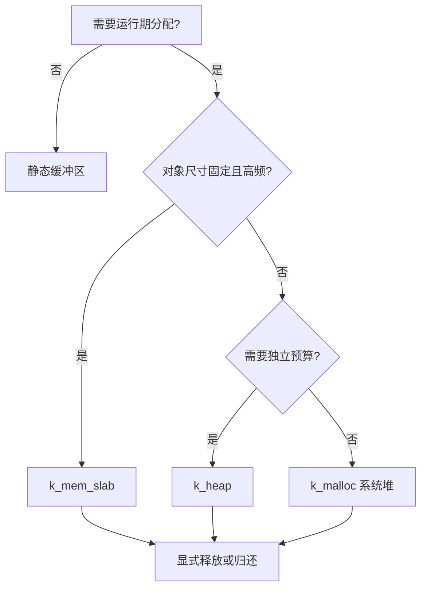
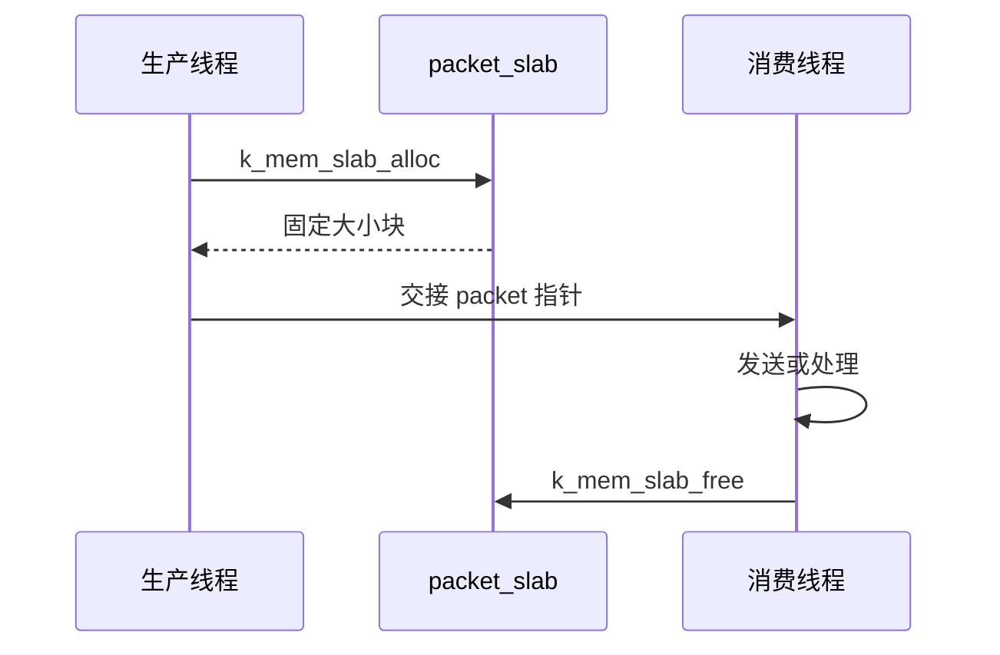

在小 MCU 上，内存管理不是“会不会调用 malloc”的问题，而是**每一类内存的生命周期、碎片风险和故障策略是否可解释**。Zephyr 提供系统堆、专用堆、内存块池和用户态内存域；它们并不互相替代。

FreeRTOS 常见模式是 pvPortMalloc 加固定块池。Zephyr 的迁移原则相同：动态分配适合确实动态的生命周期，固定大小且频繁分配的对象优先使用 slab，长期存在的缓冲区尽量静态化。官方资料见 [Memory Management](https://docs.zephyrproject.org/latest/kernel/memory_management/index.html) 和 [Memory Heaps](https://docs.zephyrproject.org/latest/kernel/memory_management/heap.html)。

## 一、先按生命周期选择分配器

| 需求 | Zephyr 机制 | FreeRTOS 类比 | 特性 |
| --- | --- | --- | --- |
| 少量通用动态对象 | k_malloc / k_free | pvPortMalloc / vPortFree | 方便，但要处理 NULL 与碎片 |
| 一个子系统的独立预算 | k_heap | 独立 heap_4 实例 | 可限制模块最大占用 |
| 固定尺寸、高频对象 | k_mem_slab | 固定块内存池 | 无碎片、分配时间稳定 |
| 静态缓冲区 | 全局数组或宏 | 静态数组 | 最省心、最可审计 |
| 线程访问隔离 | memory domain + partition | MPU 区域配置 | 面向用户态隔离 |

nRF52832 的 RAM 只有 64 KB。线程栈、蓝牙缓冲区、日志缓冲区和堆都会从同一预算中取钱，因此先读构建末尾的 RAM 使用报告，再决定是否增加堆。



【图1：按对象生命周期选择内存机制】

## 二、系统堆与专用堆

启用系统堆后，k_malloc 从 CONFIG_HEAP_MEM_POOL_SIZE 指定的全局池取空间：

```ini
CONFIG_HEAP_MEM_POOL_SIZE=2048
CONFIG_THREAD_STACK_INFO=y
CONFIG_INIT_STACKS=y
```

```c
#include <zephyr/kernel.h>
#include <zephyr/logging/log.h>

LOG_MODULE_REGISTER(memory_demo, LOG_LEVEL_INF);

static void encode_payload(size_t length)
{
    uint8_t *buffer = k_malloc(length);

    if (buffer == NULL) {
        LOG_ERR("allocation failed: %u", (unsigned int)length);
        return;
    }

    memset(buffer, 0, length);
    k_free(buffer);
}
```

k_malloc 失败时返回 NULL，不会替应用恢复业务。对控制命令和安全升级这类关键路径，必须在设计上避免“只能靠临时分配才可继续”的结构。

专用堆把预算绑定到模块：

```c
K_HEAP_DEFINE(telemetry_heap, 1024);

static void publish_frame(size_t length)
{
    uint8_t *frame = k_heap_alloc(&telemetry_heap, length, K_NO_WAIT);

    if (frame == NULL) {
        return;
    }

    k_heap_free(&telemetry_heap, frame);
}
```

这使遥测模块即使异常突发也不能吃掉 BLE 或主业务的全部动态内存。专用堆仍可能产生碎片，所以它解决的是隔离，不是所有实时性问题。

## 三、固定块对象使用 slab

传感器帧、BLE 通知描述符、命令对象若大小固定，应优先使用内存块池。以下 8 个 packet 槽位每个 64 字节，分配和归还都不需要寻找可变长度块：

```c
struct packet {
    uint8_t bytes[64];
};

K_MEM_SLAB_DEFINE(packet_slab, sizeof(struct packet), 8, 4);

static int allocate_packet(struct packet **packet)
{
    return k_mem_slab_alloc(&packet_slab, (void **)packet, K_NO_WAIT);
}

static void release_packet(struct packet *packet)
{
    k_mem_slab_free(&packet_slab, (void *)packet);
}
```

slab 的核心约束是对象尺寸固定、容量固定。池满时可以立即失败、等待有限时间或永久等待，选择取决于业务：

- 遥测包：池满时丢弃旧数据或本次数据通常可接受。
- 控制命令：池满需要返回忙状态并让上层重试。
- 中断路径：只能使用 K_NO_WAIT，不能阻塞。
- 升级数据：应通过流控限制生产速度，而不是无界增加池。



【图2：内存块池的明确所有权转移】

## 四、用户态与内存域

Zephyr 用户态将应用线程限制在用户权限，系统调用会检查对象权限与内存访问。它类似裸机上认真配置 MPU 的隔离模型，而不是 FreeRTOS 默认任务模型。

内存域由一个或多个分区组成，内核把指定分区授予指定线程。典型流程是：

1. 定义可被用户线程访问的内存分区。
2. 初始化 memory domain，并加入分区。
3. 创建带用户选项的线程。
4. 把线程加入 domain。
5. 通过系统调用访问被授权对象。

用户态能把错误线程的写越界影响缩小，但会增加 RAM、栈对齐和 MPU 区域压力。Cortex-M4 的 MPU 区域数量有限，nRF52832 上不应为了“看起来更安全”把每个小缓冲区都切成独立分区。先保护密钥、协议状态和不可信输入边界，再评估构建产物和实际限制。

## 五、RAM 预算要同时看静态和动态

构建报告显示的是已链接的静态区域，不能证明运行期堆永远够用。建议建立一个简单预算表：

| 项目 | 来源 | 验证方法 |
| --- | --- | --- |
| 线程栈 | K_THREAD_DEFINE 与系统线程 | 栈监测和最坏路径测试 |
| 蓝牙缓冲区 | Bluetooth Kconfig | build/zephyr/.config 与 map |
| 系统堆 | CONFIG_HEAP_MEM_POOL_SIZE | 失败计数与压力测试 |
| slab | K_MEM_SLAB_DEFINE | 槽位高水位统计 |
| 日志缓冲 | Log Kconfig | 关闭或降低级别后比较 RAM |

不要把日志打开时的 RAM 余量当作产品余量，也不要只在 hello world 上测栈。配对、异常日志和 OTA 才会进入真正的峰值路径。

## 六、常见问题

| 现象 | 根因 | 处理 |
| --- | --- | --- |
| k_malloc 偶发返回 NULL | 堆耗尽或碎片 | 限制生命周期，改用 slab 或专用堆 |
| 长运行后分配变慢或失败 | 多尺寸对象频繁分配释放 | 用固定块池或静态缓冲 |
| ISR 后崩溃 | 在不可阻塞路径等待内存 | 使用 K_NO_WAIT 并设计丢弃或缓冲策略 |
| 加 BLE 后 RAM 突然不足 | 忽略协议栈与线程栈预算 | 对比 .config、map 与构建 RAM 报告 |
| 用户态线程访问失败 | 未授予对象或分区权限 | 检查对象权限、domain 与 MPU 对齐限制 |

## 七、动手练习

1. 设置 512 字节系统堆，逐步增加分配大小，记录失败点。
2. 用 slab 替换固定长度传感器队列中的动态缓冲，比较可预测性。
3. 为遥测模块建立 1 KB 专用堆，确认它耗尽时其他模块仍可运行。
4. 开启栈监测，覆盖日志、按键和传感器异常路径后重新评估每个线程栈。

## 八、里程碑自检

- [ ] 会按生命周期选择静态缓冲、系统堆、专用堆或 slab
- [ ] 知道 k_malloc 失败必须由应用处理
- [ ] 会用 K_HEAP_DEFINE 为子系统设置动态内存预算
- [ ] 会用 K_MEM_SLAB_DEFINE 管理固定尺寸高频对象
- [ ] 理解用户态与内存域解决的是访问隔离，不是内存扩容

## 小结

在资源受限的 Zephyr 产品中，内存管理的目标不是“分配成功”，而是让最坏情况下的失败行为可预测。静态化长期对象，使用 slab 管理固定帧，给动态子系统设预算，再用实际峰值校准栈与堆，系统才有真正可控的 RAM 边界。

> 🏷️ 标签：Zephyr · 内存管理 · k_malloc · k_heap · k_mem_slab · 用户态 · MPU · nRF52832
