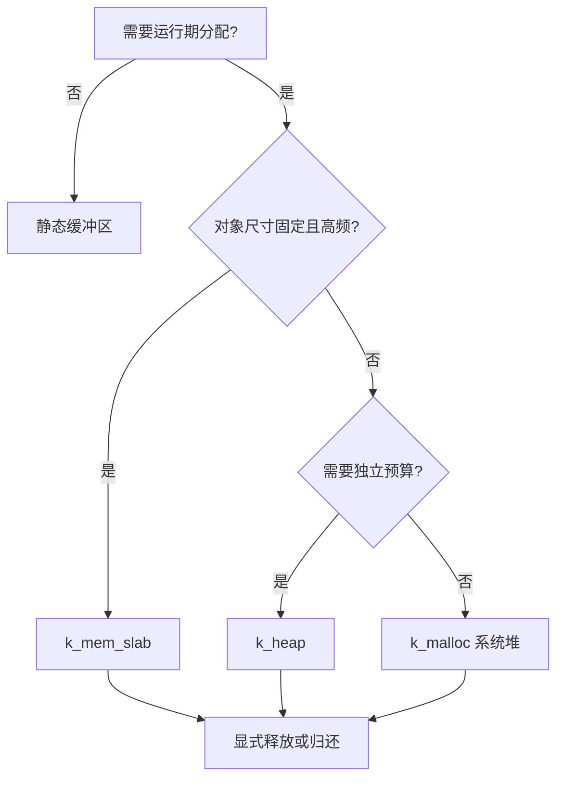
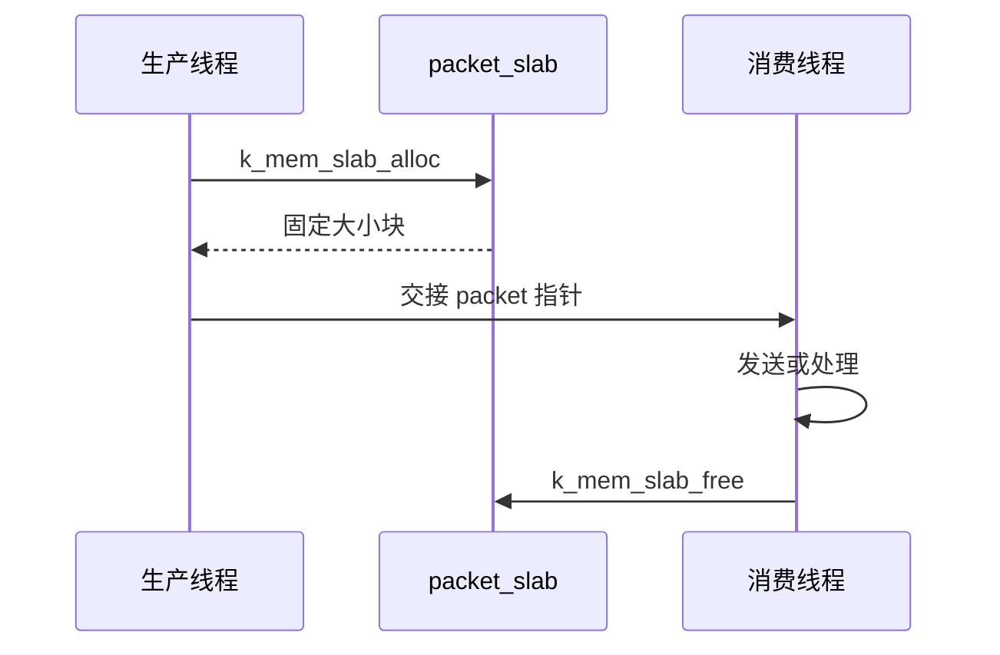

在小 MCU 上，内存管理不是“会不会调用 malloc”的问题，而是**每一类内存的生命周期、碎片风险和故障策略是否可解释**。Zephyr 提供系统堆、专用堆、内存块池和用户态内存域；它们并不互相替代。

FreeRTOS 常见模式是 `pvPortMalloc` 加固定块池。Zephyr 的迁移原则相同：动态分配适合确实动态的生命周期，固定大小且频繁分配的对象优先使用 slab，长期存在的缓冲区尽量静态化。

本文基于 Zephyr 4.4.x，目标板为 `nrf52dk/nrf52832`。官方资料见 [Memory Management](https://docs.zephyrproject.org/latest/kernel/memory_management/index.html)、[Memory Heaps](https://docs.zephyrproject.org/latest/kernel/memory_management/heap.html) 和 [Memory Protection](https://docs.zephyrproject.org/latest/kernel/usermode/memory_domain.html)。

## 一、先按生命周期选择分配器

分配器首先回答所有权：谁分配、谁持有、何时归还、池满时如何降级。可变长度 heap 会因长期混合分配/释放产生碎片；slab 以等长块消除外部碎片，代价是固定容量和内部浪费。跨线程交接时，生产者转移指针后不得再访问，消费者完成后归还；MPU memory domain 只限制用户线程可访问地址，不改变上述生命周期。

分配器的第一个问题不是“能否拿到地址”，而是**谁拥有这块内存、何时归还、失败是否可恢复**。系统堆和 `k_heap` 都管理可变长度块，长期混合分配/释放会留下不能满足大请求的空洞，即碎片；slab 用等长块换掉外部碎片，代价是内部浪费与容量上限。对象跨线程交接时，所有权应在队列/回调接口处显式转移，生产者在转移后不得写入或释放，消费者在完成后归还。用户态的 MPU 分区不改变分配器生命周期，只限制用户线程可访问的地址范围；线程必须在加入 domain 后才开始访问分区。

| 需求 | Zephyr 机制 | FreeRTOS 类比 | 特性 |
| --- | --- | --- | --- |
| 少量通用动态对象 | k_malloc / k_free | pvPortMalloc / vPortFree | 方便，但要处理 NULL 与碎片 |
| 一个子系统的独立预算 | k_heap | 独立 heap_4 实例 | 可限制模块最大占用 |
| 固定尺寸、高频对象 | k_mem_slab | 固定块内存池 | 无碎片、分配时间稳定 |
| 静态缓冲区 | 全局数组或宏 | 静态数组 | 最省心、最可审计 |
| 线程访问隔离 | memory domain + partition | MPU 区域配置 | 面向用户态隔离 |

nRF52832 的 RAM 只有 64 KB。线程栈、蓝牙缓冲区、日志缓冲区和堆都会从同一预算中取钱，因此先读构建末尾的 RAM 使用报告，再决定是否增加堆。



【图1：按对象生命周期选择内存机制】

## 二、系统堆与专用堆

完整实验依次验证系统堆、模块专用堆和固定块 slab。工程目录如下：

```text
memory_demo/
├── CMakeLists.txt
├── prj.conf
└── src/
    └── main.c
```

```cmake
cmake_minimum_required(VERSION 3.20.0)
find_package(Zephyr REQUIRED HINTS $ENV{ZEPHYR_BASE})
project(memory_demo)

target_sources(app PRIVATE src/main.c)
```

启用系统堆后，`k_malloc` 从 `CONFIG_HEAP_MEM_POOL_SIZE` 指定的全局池取空间：

```ini
CONFIG_HEAP_MEM_POOL_SIZE=2048
CONFIG_LOG=y
CONFIG_LOG_DEFAULT_LEVEL=3
```

```c
#include <errno.h>
#include <stdint.h>
#include <string.h>

#include <zephyr/kernel.h>
#include <zephyr/logging/log.h>

LOG_MODULE_REGISTER(memory_demo, LOG_LEVEL_INF);

#define TELEMETRY_HEAP_SIZE 1024
#define PACKET_COUNT        8

struct packet {
    uint8_t bytes[64];
};

K_HEAP_DEFINE(telemetry_heap, TELEMETRY_HEAP_SIZE);
K_MEM_SLAB_DEFINE(packet_slab, sizeof(struct packet), PACKET_COUNT,
                  _Alignof(struct packet));

/**
 * @brief 从系统堆分配、初始化并释放载荷缓冲区。
 *
 * @param length 需要分配的字节数。
 * @return 成功返回 0；系统堆耗尽时返回 `-ENOMEM`。
 */
static int prepare_system_payload(size_t length)
{
    uint8_t *buffer = k_malloc(length);

    if (buffer == NULL) {
        return -ENOMEM;
    }

    memset(buffer, 0xA5, length);
    k_free(buffer);
    return 0;
}

/**
 * @brief 从遥测模块专用堆分配并释放一帧缓冲区。
 *
 * @param length 需要分配的帧字节数。
 * @return 成功返回 0；专用堆无法满足请求时返回 `-ENOMEM`。
 */
static int prepare_telemetry_frame(size_t length)
{
    uint8_t *frame =
        k_heap_alloc(&telemetry_heap, length, K_NO_WAIT);

    if (frame == NULL) {
        return -ENOMEM;
    }

    memset(frame, 0, length);
    k_heap_free(&telemetry_heap, frame);
    return 0;
}

/**
 * @brief 以非阻塞方式获取一个固定大小的数据包。
 *
 * @param packet 用于接收数据包指针的输出参数。
 * @return 成功返回 0；参数为空时返回 `-EINVAL`；无可用块时
 *         返回 `k_mem_slab_alloc` 的错误码。
 */
static int allocate_packet(struct packet **packet)
{
    if (packet == NULL) {
        return -EINVAL;
    }

    return k_mem_slab_alloc(
        &packet_slab, (void **)packet, K_NO_WAIT);
}

/**
 * @brief 将数据包归还给固定块内存池。
 *
 * @param packet 之前由 `allocate_packet` 返回的数据包。
 */
static void release_packet(struct packet *packet)
{
    k_mem_slab_free(&packet_slab, packet);
}

/**
 * @brief 依次验证系统堆、专用堆和固定块内存池。
 *
 * @return 成功返回 0，否则返回遇到的第一个分配错误码。
 */
int main(void)
{
    struct packet *packet;
    int rc;

    rc = prepare_system_payload(128);
    if (rc != 0) {
        LOG_ERR("system payload allocation failed: %d", rc);
        return rc;
    }

    rc = prepare_telemetry_frame(256);
    if (rc != 0) {
        LOG_ERR("telemetry allocation failed: %d", rc);
        return rc;
    }

    rc = allocate_packet(&packet);
    if (rc != 0) {
        LOG_ERR("packet allocation failed: %d", rc);
        return rc;
    }

    memset(packet->bytes, 0x5A, sizeof(packet->bytes));
    release_packet(packet);

    LOG_INF("allocator demo complete, slab free blocks: %u",
            k_mem_slab_num_free_get(&packet_slab));
    return 0;
}
```

构建与烧录：

```powershell
west build -p always -b nrf52dk/nrf52832 memory_demo
west flash
```

参考输出：

```text
allocator demo complete, slab free blocks: 8
```

系统堆接口为：

```c
void *k_malloc(size_t size);
void k_free(void *ptr);
```

`size` 是请求字节数。分配成功返回满足基本对齐要求的地址，失败返回 `NULL`；`k_free` 的 `ptr` 必须来自系统堆，传 `NULL` 不执行操作。系统堆大小由 `CONFIG_HEAP_MEM_POOL_SIZE` 控制。

`k_malloc` 失败不会替应用恢复业务。对控制命令和安全升级这类关键路径，必须避免“只有临时分配成功才能继续”的单点设计，并为 `NULL` 设计清晰的丢弃、重试或故障路径。

专用堆把预算绑定到模块：

```c
K_HEAP_DEFINE(name, bytes);
void *k_heap_alloc(struct k_heap *h, size_t bytes,
                   k_timeout_t timeout);
void k_heap_free(struct k_heap *h, void *mem);
```

`name` 是堆对象，`bytes` 是该堆管理的静态内存区域大小；`h` 是目标堆，`timeout` 决定内存不足时是否等待。`k_heap_alloc` 成功返回地址，无法在超时内满足请求时返回 `NULL`。ISR 中只能传 `K_NO_WAIT`。

完整示例的 `telemetry_heap` 让遥测模块即使异常突发也不能吃掉 BLE 或主业务的全部动态内存。专用堆仍可能产生碎片，所以它解决的是预算隔离，不是所有实时性问题。

## 三、固定块对象使用 slab

传感器帧、BLE 通知描述符、命令对象若大小固定，应优先使用内存块池。完整示例定义了 8 个 `packet` 槽位，每个 64 字节，分配和归还都不需要寻找可变长度块。

```c
K_MEM_SLAB_DEFINE(name, slab_block_size,
                  slab_num_blocks, slab_align);
int k_mem_slab_alloc(struct k_mem_slab *slab, void **mem,
                     k_timeout_t timeout);
void k_mem_slab_free(struct k_mem_slab *slab, void *mem);
```

`slab_block_size` 是单块字节数，`slab_num_blocks` 是块数量，`slab_align` 必须是 2 的幂，并且块大小必须是对齐值的整数倍。本例使用 C17 `_Alignof(struct packet)`，避免把目标架构对齐写成魔法数字。

`k_mem_slab_alloc` 成功返回 `0` 并通过 `mem` 写回块地址；`K_NO_WAIT` 下无空闲块返回 `-ENOMEM`，等待超时返回 `-EAGAIN`。ISR 中只能使用 `K_NO_WAIT`。`k_mem_slab_free` 只能归还由同一 slab 分配且尚未释放的块。

slab 的核心约束是对象尺寸固定、容量固定。池满时可以立即失败、等待有限时间或永久等待，选择取决于业务：

- 遥测包：池满时丢弃旧数据或本次数据通常可接受。
- 控制命令：池满需要返回忙状态并让上层重试。
- 中断路径：只能使用 K_NO_WAIT，不能阻塞。
- 升级数据：应通过流控限制生产速度，而不是无界增加池。



【图2：内存块池的明确所有权转移】

## 四、用户态与内存域

Zephyr 用户态将应用线程限制在用户权限，系统调用会检查对象权限与内存访问。它类似裸机上认真配置 MPU 的隔离模型，而不是 FreeRTOS 默认任务模型。

内存域由一个或多个分区组成，内核把指定分区授予指定线程。典型流程是：

1. 定义可被用户线程访问的内存分区。
2. 初始化 memory domain，并加入分区。
3. 创建带用户选项的线程。
4. 把线程加入 domain。
5. 通过系统调用访问被授权对象。

下面是一个独立的用户态变体。用它替换前面实验的 `src/main.c`，并将 `prj.conf` 改为启用用户态。线程先以 `K_FOREVER` 创建为未激活状态，加入内存域后才启动，避免它在权限安装前访问分区。

```ini
CONFIG_USERSPACE=y
CONFIG_LOG=y
CONFIG_LOG_DEFAULT_LEVEL=3
```

```c
#include <stdint.h>

#include <zephyr/app_memory/app_memdomain.h>
#include <zephyr/kernel.h>
#include <zephyr/logging/log.h>

LOG_MODULE_REGISTER(user_memory_demo, LOG_LEVEL_INF);

#define USER_STACK_SIZE 1024
#define USER_PRIORITY   5

K_APPMEM_PARTITION_DEFINE(shared_partition);
K_APP_BMEM(shared_partition) uint32_t shared_counter;

K_THREAD_STACK_DEFINE(user_stack, USER_STACK_SIZE);
static struct k_thread user_thread;
static struct k_mem_domain user_domain;

/**
 * @brief 写入通过 shared_partition 授权的内存。
 *
 * @param p1 指向分区中的 shared_counter。
 * @param p2 未使用。
 * @param p3 未使用。
 */
static void user_entry(void *p1, void *p2, void *p3)
{
    uint32_t *counter = p1;

    ARG_UNUSED(p2);
    ARG_UNUSED(p3);
    *counter = 42U;
}

/**
 * @brief 建立内存域，加入用户线程并等待线程结束。
 *
 * @return 成功返回 0，否则返回内存域或 join 接口的错误码。
 */
int main(void)
{
    struct k_mem_partition *partitions[] = {
        &shared_partition,
    };
    k_tid_t tid;
    int rc;

    rc = k_mem_domain_init(
        &user_domain, ARRAY_SIZE(partitions), partitions);
    if (rc != 0) {
        LOG_ERR("memory domain init failed: %d", rc);
        return rc;
    }

    tid = k_thread_create(&user_thread, user_stack,
                          K_THREAD_STACK_SIZEOF(user_stack),
                          user_entry, &shared_counter, NULL, NULL,
                          USER_PRIORITY, K_USER, K_FOREVER);

    rc = k_mem_domain_add_thread(&user_domain, tid);
    if (rc != 0) {
        LOG_ERR("add user thread failed: %d", rc);
        return rc;
    }

    k_thread_start(tid);

    rc = k_thread_join(tid, K_FOREVER);
    if (rc != 0) {
        LOG_ERR("user thread join failed: %d", rc);
        return rc;
    }

    LOG_INF("shared counter: %u", shared_counter);
    return 0;
}
```

```powershell
west build -p always -d build-user `
  -b nrf52dk/nrf52832 memory_demo
west flash -d build-user
```

`K_APPMEM_PARTITION_DEFINE(name)` 让构建系统生成满足 MPU 对齐的读写分区；`K_APP_DMEM(name)` 放置有初值的全局变量，`K_APP_BMEM(name)` 放置启动时清零的全局变量。

```c
int k_mem_domain_init(struct k_mem_domain *domain,
                      uint8_t num_parts,
                      struct k_mem_partition *parts[]);
int k_mem_domain_add_thread(struct k_mem_domain *domain,
                            k_tid_t thread);
```

`domain` 是内存域对象，`parts` 是分区指针数组，`num_parts` 是数组元素数。初始化成功返回 `0`，参数无效返回 `-EINVAL`，资源不足返回 `-ENOMEM`。`k_mem_domain_add_thread` 会把线程从原内存域移入目标域；线程在同一时刻只属于一个内存域。

用户态能把错误线程的写越界影响缩小，但会增加 RAM、栈对齐和 MPU 区域压力。Cortex-M4 的 MPU 区域数量有限，nRF52832 上不应为了“看起来更安全”把每个小缓冲区都切成独立分区。先保护密钥、协议状态和不可信输入边界，再评估构建产物和实际限制。

## 五、RAM 预算要同时看静态和动态

构建报告显示的是已链接的静态区域，不能证明运行期堆永远够用。建议建立一个简单预算表：

| 项目 | 来源 | 验证方法 |
| --- | --- | --- |
| 线程栈 | K_THREAD_DEFINE 与系统线程 | 栈监测和最坏路径测试 |
| 蓝牙缓冲区 | Bluetooth Kconfig | build/zephyr/.config 与 map |
| 系统堆 | CONFIG_HEAP_MEM_POOL_SIZE | 失败计数与压力测试 |
| slab | K_MEM_SLAB_DEFINE | 槽位高水位统计 |
| 日志缓冲 | Log Kconfig | 关闭或降低级别后比较 RAM |

不要把日志打开时的 RAM 余量当作产品余量，也不要只在 hello world 上测栈。配对、异常日志和 OTA 才会进入真正的峰值路径。

需要记录 slab 历史峰值时，在开发配置加入：

```ini
CONFIG_MEM_SLAB_TRACE_MAX_UTILIZATION=y
```

然后读取：

```c
uint32_t k_mem_slab_max_used_get(struct k_mem_slab *slab);
```

返回值是启动以来同时占用块数的最大值。未启用该配置时接口返回 `0`，不能把它误读为“从未使用”。将峰值与 `slab_num_blocks` 比较，才能判断容量是过紧还是浪费。

## 六、常见问题

| 现象 | 根因 | 处理 |
| --- | --- | --- |
| k_malloc 偶发返回 NULL | 堆耗尽或碎片 | 限制生命周期，改用 slab 或专用堆 |
| 长运行后分配变慢或失败 | 多尺寸对象频繁分配释放 | 用固定块池或静态缓冲 |
| ISR 后崩溃 | 在不可阻塞路径等待内存 | 使用 K_NO_WAIT 并设计丢弃或缓冲策略 |
| 加 BLE 后 RAM 突然不足 | 忽略协议栈与线程栈预算 | 对比 .config、map 与构建 RAM 报告 |
| 用户态线程访问失败 | 未授予对象或分区权限 | 检查对象权限、domain 与 MPU 对齐限制 |

## 七、动手练习

1. 设置 512 字节系统堆，逐步增加分配大小，记录失败点。
2. 用 slab 替换固定长度传感器队列中的动态缓冲，比较可预测性。
3. 为遥测模块建立 1 KB 专用堆，确认它耗尽时其他模块仍可运行。
4. 开启栈监测，覆盖日志、按键和传感器异常路径后重新评估每个线程栈。

## 八、里程碑自检

- [ ] 会按生命周期选择静态缓冲、系统堆、专用堆或 slab
- [ ] 知道 k_malloc 失败必须由应用处理
- [ ] 会用 K_HEAP_DEFINE 为子系统设置动态内存预算
- [ ] 会用 K_MEM_SLAB_DEFINE 管理固定尺寸高频对象
- [ ] 理解用户态与内存域解决的是访问隔离，不是内存扩容
- [ ] 能为一个跨线程缓冲区说清楚分配者、当前所有者、归还者和池满时的业务动作

## 小结

在资源受限的 Zephyr 产品中，内存管理的目标不是“分配成功”，而是让最坏情况下的失败行为可预测。静态化长期对象，使用 slab 管理固定帧，给动态子系统设预算，再用实际峰值校准栈与堆，系统才有真正可控的 RAM 边界。

> 🏷️ 标签：Zephyr · 内存管理 · k_malloc · k_heap · k_mem_slab · 用户态 · MPU · nRF52832
