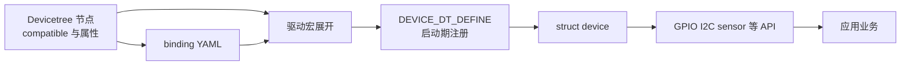
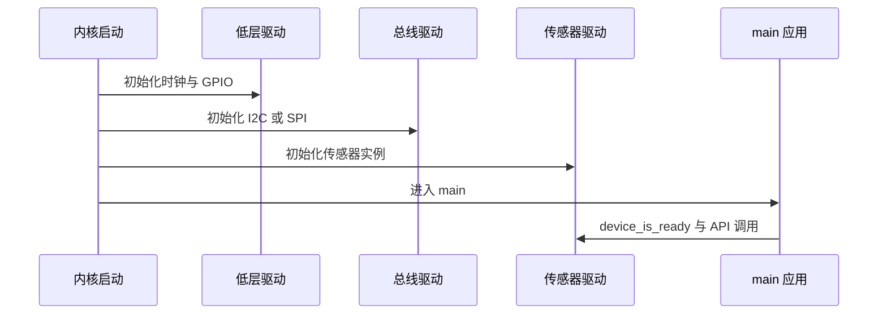

FreeRTOS 没有规定驱动模型：同一份 GPIO 或传感器代码常常把 HAL 句柄、寄存器地址和业务回调混在一起。Zephyr 的 device model 把它们拆开：**设备树描述实例，驱动提供 API，实现由构建期注册为 device 对象，应用只拿设备引用并调用子系统 API。**

Zephyr 4.4.x 的正式定义见 [Device Driver Model](https://docs.zephyrproject.org/latest/kernel/drivers/index.html)。

## 一、一个设备从描述到可用

| 层次 | 职责 | 类比 |
| --- | --- | --- |
| Devicetree 节点 | 描述芯片、地址、中断、引脚与属性 | 板级初始化参数 |
| binding YAML | 规定 compatible 和属性类型 | 驱动配置结构的 schema |
| 驱动实例 | 初始化硬件，保存 config 与 data | HAL 句柄加初始化函数 |
| 子系统 API | GPIO、I2C、sensor 等统一调用 | 自定义 driver_ops 表 |
| 应用 | 查询就绪状态，调用 API | 业务层使用抽象接口 |

compatible 是中心钥匙：节点用它匹配 binding，驱动用它选择自己要实例化的节点。C 代码不必把基地址写死，因为寄存器、中断和 pinctrl 都已来自节点。



【图1：设备树、binding、驱动和应用的闭环】

## 二、应用如何获得设备

应用层最常用的模式是从设备树节点取得引用，再检查其初始化是否成功：

```c
#include <zephyr/device.h>
#include <zephyr/drivers/i2c.h>
#include <zephyr/kernel.h>

#define I2C_NODE DT_NODELABEL(i2c0)

static const struct device *const i2c_bus = DEVICE_DT_GET(I2C_NODE);

int main(void)
{
    if (!device_is_ready(i2c_bus)) {
        return 0;
    }

    return 0;
}
```

DEVICE_DT_GET 是编译期绑定：若节点不存在或对应驱动没有被链接，通常会在构建或链接阶段暴露问题。device_is_ready 则处理“对象存在但初始化失败”的情况，例如时钟、电源或底层依赖未准备好。

GPIO 的 gpio_dt_spec、I2C 的 i2c_dt_spec 等更高层结构把设备引用和节点属性一起打包。优先使用它们，避免应用重复读取 pin、地址和 flag。

不要把 device_get_binding 作为新代码首选。它按字符串名称在运行期查询，少了编译期检查，也更容易被 board 名称变化影响。

## 三、启动顺序不是随意的

驱动初始化发生在 main 之前，按初始化级别和优先级排序。常见层级包括 PRE_KERNEL、POST_KERNEL 和 APPLICATION。内核时钟、GPIO 控制器等底层依赖要比使用它们的上层设备先完成。



【图2：依赖驱动必须先于应用初始化】

驱动初始化不应该做无限等待。若外设不存在、总线被锁死或配置错误，初始化函数应返回错误，让 device_is_ready 表现为 false，并将可诊断信息保留在日志中。

## 四、统一 API 为什么重要

以 GPIO 为例，应用调用 gpio_pin_set_dt；以 I2C 为例，应用调用 i2c_write_dt。调用点并不关心底层是 Nordic、ST 还是 NXP 驱动。换板时，只要节点兼容且 API 功能满足，业务层无需修改。

这与 Linux platform driver 的设备与驱动匹配思想相近，也比在 FreeRTOS 项目里把 HAL 调用包成一堆全局函数更有边界。统一 API 的代价是：不能绕过设备树和 Kconfig。若节点 disabled、binding 不匹配或驱动未开启，正确答案是修配置，而不是在应用里手写寄存器访问。

## 五、检查设备依赖

构建结束后检查两个文件：

```powershell
Select-String -Path build/zephyr/zephyr.dts -Pattern "i2c0"
Select-String -Path build/zephyr/.config -Pattern "CONFIG_I2C"
```

第一条确认最终硬件描述中节点是否启用；第二条确认相应子系统与驱动是否被 Kconfig 选中。设备不 ready 时，也应检查 build/zephyr/zephyr.map，确认驱动对象确实链接进镜像。

## 六、常见问题

| 现象 | 根因 | 处理 |
| --- | --- | --- |
| DEVICE_DT_GET 链接失败 | 节点驱动未被构建 | 检查 status、compatible 与 Kconfig |
| device_is_ready 为 false | 初始化函数或依赖失败 | 查启动日志和依赖设备 |
| 换板后应用要改很多 | 应用直接写 pin 或地址 | 用 dt_spec 与设备树属性 |
| 初始化依赖错误 | 上层驱动过早访问总线 | 修正 init level 和依赖描述 |
| 字符串查找设备失败 | 名称变化或拼写错误 | 改用 DEVICE_DT_GET |

## 七、动手练习

1. 在 nRF52 DK 上取得 uart0 和 gpio0 的设备引用，打印各自的 ready 状态。
2. 将一个 overlay 中的节点设为 disabled，观察 DEVICE_DT_GET 和 device_is_ready 的差异。
3. 在 zephyr.dts 中跟踪 LED 节点到 GPIO 控制器的依赖。
4. 对比 gpio_dt_spec 与手工传入 port、pin、flag 的代码量。

## 八、里程碑自检

- [ ] 能说明 compatible 在节点、binding 和驱动之间的作用
- [ ] 会用 DEVICE_DT_GET 和 device_is_ready 获取并验证设备
- [ ] 知道驱动在 main 之前按依赖顺序初始化
- [ ] 会用 zephyr.dts 和 .config 排查驱动是否进入镜像
- [ ] 理解统一 API 如何让业务代码脱离具体 MCU

## 小结

Zephyr 驱动模型的重点不是一个宏，而是可追溯的依赖链：设备树给出事实，binding 定义语义，驱动在启动期实例化，统一 API 向应用暴露能力。顺着这条链排查，驱动问题就不再是黑盒。

> 🏷️ 标签：Zephyr · device model · DEVICE_DT_GET · 驱动 · Devicetree · binding · nRF52832
