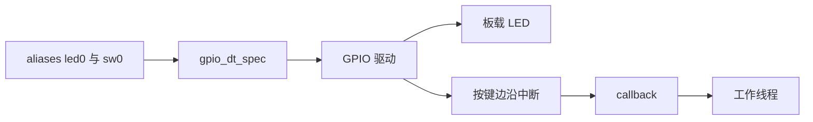
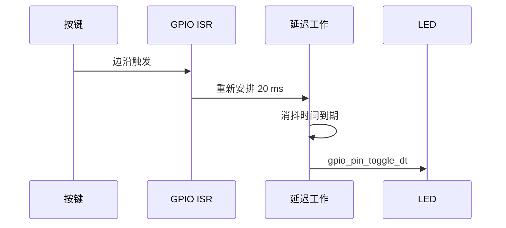

GPIO 是最小的驱动实战，但不能退回到写死引脚号的裸机习惯。**gpio_dt_spec 把 GPIO 控制器、引脚和有效电平合成一个设备树派生对象**，应用只操作逻辑状态，因此同一段代码可以跟随 board alias 换到另一块板。

nRF52 DK 的 LED 和按键别名由板级设备树提供。GPIO 通用语义见 [GPIO documentation](https://docs.zephyrproject.org/latest/hardware/peripherals/gpio.html)。

## 一、LED 与按键的硬件抽象

| 裸机写法 | Zephyr 写法 | 好处 |
| --- | --- | --- |
| GPIO0 第 17 脚 | DT_ALIAS(led0) | 不依赖具体引脚 |
| 写输出寄存器 | gpio_pin_set_dt | 自动处理有效电平 |
| EXTI 号加 ISR | gpio_pin_interrupt_configure_dt 加 callback | 控制器差异被驱动吸收 |
| 手工记录 port、pin | gpio_dt_spec | 属性随设备树集中管理 |



【图1：设备树别名将板载资源映射到 GPIO API】

## 二、最小链路：按键事件到 LED

DT flag 定义 logical 与 physical level 的映射，低有效 LED 的 logical active 是物理低电平，不能用 raw API 在业务层手动取反。边沿 ISR 只表示状态可能改变，不表示机械按键稳定；callback 重排同一个 delayable work 合并抖动，work 再读取稳定输入。callback 是中断上下文，不能 sleep、I2C 或 BLE；注册/配置失败必须有错误分支。

代码把 ISR 限制为提交工作，实际读取与翻转在系统工作队列完成。这样既能消抖，也不会在中断上下文做日志和 GPIO 以外的慢操作。

```c
#include <zephyr/kernel.h>
#include <zephyr/device.h>
#include <zephyr/drivers/gpio.h>
#include <zephyr/logging/log.h>

LOG_MODULE_REGISTER(gpio_demo, LOG_LEVEL_INF);

#define LED_NODE DT_ALIAS(led0)
#define BUTTON_NODE DT_ALIAS(sw0)

static const struct gpio_dt_spec led = GPIO_DT_SPEC_GET(LED_NODE, gpios);
static const struct gpio_dt_spec button =
    GPIO_DT_SPEC_GET(BUTTON_NODE, gpios);

static struct gpio_callback button_cb;

static void button_work_handler(struct k_work *work)
{
    int err;

    ARG_UNUSED(work);
    err = gpio_pin_toggle_dt(&led);
    if (err != 0) {
        LOG_ERR("LED toggle failed: %d", err);
    }
}

K_WORK_DELAYABLE_DEFINE(button_work, button_work_handler);

static void button_callback(const struct device *port,
                            struct gpio_callback *cb, uint32_t pins)
{
    ARG_UNUSED(port);
    ARG_UNUSED(cb);
    ARG_UNUSED(pins);
    k_work_reschedule(&button_work, K_MSEC(20));
}

int main(void)
{
    int err;

    if (!gpio_is_ready_dt(&led) || !gpio_is_ready_dt(&button)) {
        return 0;
    }

    err = gpio_pin_configure_dt(&led, GPIO_OUTPUT_INACTIVE);
    if (err != 0) {
        return 0;
    }

    err = gpio_pin_configure_dt(&button, GPIO_INPUT);
    if (err != 0) {
        return 0;
    }

    gpio_init_callback(&button_cb, button_callback, BIT(button.pin));
    err = gpio_add_callback(button.port, &button_cb);
    if (err != 0) {
        return 0;
    }

    err = gpio_pin_interrupt_configure_dt(&button, GPIO_INT_EDGE_TO_ACTIVE);
    if (err != 0) {
        (void)gpio_remove_callback(button.port, &button_cb);
        return 0;
    }

    return 0;
}
```

```ini
CONFIG_GPIO=y
CONFIG_LOG=y
CONFIG_SYSTEM_WORKQUEUE_STACK_SIZE=1024
```

GPIO_ACTIVE_LOW 等极性来自设备树。gpio_pin_set_dt 或 gpio_pin_toggle_dt 使用的是逻辑有效状态，不要为了“修正低电平有效”再在应用中手动取反，否则换板后最容易出现 LED 逻辑颠倒。



【图2：按键事件从中断移交到工作线程】

## 三、贯穿实验：可消抖按键切换 LED

本实验固定 **Zephyr 4.4.x** 与 `nrf52dk/nrf52832`。板载 `led0`、`sw0` alias 由 board DTS 提供，故不需要 overlay；前提是按键没有被其他 shield 占用。裸机中常把 EXTI ISR、延时消抖和寄存器翻转放一起；Zephyr 的边界是：GPIO callback 快速投递工作，delayable work 在系统工作线程读取稳定输入并操作 LED。

```text
app/
├── CMakeLists.txt
├── prj.conf
└── src/
    └── main.c
```

```cmake
# CMakeLists.txt
cmake_minimum_required(VERSION 3.20.0)
find_package(Zephyr REQUIRED HINTS $ENV{ZEPHYR_BASE})
project(gpio_button_led)
target_sources(app PRIVATE src/main.c)
```

```ini
# prj.conf
CONFIG_GPIO=y
CONFIG_LOG=y
CONFIG_LOG_DEFAULT_LEVEL=3
CONFIG_SYSTEM_WORKQUEUE_STACK_SIZE=1024
```

`GPIO_DT_SPEC_GET(node_id, prop)` 是宏，产生带 `port`、`pin`、`dt_flags` 的 `struct gpio_dt_spec` 静态初始化器；节点或属性不存在即构建失败。`gpio_pin_configure_dt(const struct gpio_dt_spec *spec, gpio_flags_t extra_flags)` 以逻辑极性配置引脚，返回 `0` 或负 errno。`gpio_pin_interrupt_configure_dt(spec, GPIO_INT_EDGE_TO_ACTIVE)` 配置中断，同样返回错误；它不是 callback 注册。`gpio_init_callback(callback, handler, pin_mask)` 是返回 `void` 的初始化 helper，随后必须检查 `gpio_add_callback(port, callback)` 的返回值。callback 在中断相关上下文运行：不可 sleep、取 mutex、做 I2C/BLE 或长日志。

```c
/* src/main.c */
#include <errno.h>
#include <stdint.h>
#include <zephyr/device.h>
#include <zephyr/drivers/gpio.h>
#include <zephyr/kernel.h>
#include <zephyr/logging/log.h>

LOG_MODULE_REGISTER(gpio_button_led, LOG_LEVEL_INF);
#define LED_NODE DT_ALIAS(led0)
#define BUTTON_NODE DT_ALIAS(sw0)

static const struct gpio_dt_spec led = GPIO_DT_SPEC_GET(LED_NODE, gpios);
static const struct gpio_dt_spec button = GPIO_DT_SPEC_GET(BUTTON_NODE, gpios);
static struct gpio_callback button_cb;

/**
 * @brief 在线程上下文确认按键状态并翻转 LED。
 */
static void button_work_handler(struct k_work *work)
{
    int level;
    int err;

    ARG_UNUSED(work);
    level = gpio_pin_get_dt(&button);
    if (level < 0) {
        LOG_ERR("button read failed: %d", level);
        return;
    }
    if (level == 0) {
        return;
    }
    err = gpio_pin_toggle_dt(&led);
    if (err != 0) {
        LOG_ERR("LED toggle failed: %d", err);
    }
}

K_WORK_DELAYABLE_DEFINE(button_work, button_work_handler);

/**
 * @brief 在 GPIO 回调中重新安排消抖工作。
 */
static void button_callback(const struct device *port,
                            struct gpio_callback *cb, uint32_t pins)
{
    ARG_UNUSED(port);
    ARG_UNUSED(cb);
    if ((pins & BIT(button.pin)) != 0U) {
        (void)k_work_reschedule(&button_work, K_MSEC(20));
    }
}

int main(void)
{
    int err;

    if (!gpio_is_ready_dt(&led) || !gpio_is_ready_dt(&button)) {
        LOG_ERR("GPIO device is not ready");
        return -ENODEV;
    }
    err = gpio_pin_configure_dt(&led, GPIO_OUTPUT_INACTIVE);
    if (err != 0) { LOG_ERR("LED configure failed: %d", err); return err; }
    err = gpio_pin_configure_dt(&button, GPIO_INPUT);
    if (err != 0) { LOG_ERR("button configure failed: %d", err); return err; }
    gpio_init_callback(&button_cb, button_callback, BIT(button.pin));
    err = gpio_add_callback(button.port, &button_cb);
    if (err != 0) { LOG_ERR("callback registration failed: %d", err); return err; }
    err = gpio_pin_interrupt_configure_dt(&button, GPIO_INT_EDGE_TO_ACTIVE);
    if (err != 0) {
        LOG_ERR("interrupt configure failed: %d", err);
        (void)gpio_remove_callback(button.port, &button_cb);
        return err;
    }
    LOG_INF("press button to toggle LED");
    return 0;
}
```

`k_work_reschedule(struct k_work_delayable *dwork, k_timeout_t delay)` 可从 ISR 调用，返回上一次剩余延迟或负错误；本例忽略其值只因重复按键应合并为一次 20 ms 后的稳定检查。`gpio_pin_get_dt()` 返回逻辑电平或负 errno，因此 `0` 也可能是有效的未按下状态，不能写成 `if (!level)` 后把错误吞掉。

```powershell
west build -p always -b nrf52dk/nrf52832 app
west flash
Select-String -Path build/zephyr/zephyr.dts -Pattern "led0|sw0"
Select-String -Path build/zephyr/.config -Pattern "CONFIG_GPIO"
```

预期启动日志是 `press button to toggle LED`；每次稳定按下翻转一次 LED。此处是预期，不是对未接板卡的成功声明。

### 3.1 外接 LED 变体和排错

外接低有效 LED 时才增加完整 `app.overlay`：阳极经限流电阻接 3.3 V，阴极接 P0.20。C 中改 `DT_ALIAS(led0)` 为 `DT_ALIAS(status_led)`，其余代码不变；不能用 C 代码手动取反来弥补接法。

```dts
/ {
    aliases { status-led = &status_led; };
    leds { compatible = "gpio-leds";
        status_led: status_led { gpios = <&gpio0 20 GPIO_ACTIVE_LOW>; };
    };
};
```

| 症状 | 根因 | 检查与修复 |
| --- | --- | --- |
| 启动 LED 亮 | 极性或接法不符 | 检查 `GPIO_ACTIVE_LOW` 与 `GPIO_OUTPUT_INACTIVE` |
| 一按多次 | 机械抖动 | 保留 delayable work，延长 20 ms 到实际稳定值 |
| callback 不进 | alias、mask、注册或中断模式错误 | 查 DTS；检查 `gpio_add_callback` 与 interrupt 配置返回码 |
| `gpio_is_ready_dt` 为 false | 控制器 disabled 或 GPIO 未启用 | 查 `status` 与 `CONFIG_GPIO` |
| ISR 中系统不稳定 | 回调执行了阻塞业务 | 回调只投递工作或非阻塞事件 |

## 四、从实验拆解 overlay

板载 alias 已经存在，外接器件要在应用 overlay 中描述。下面以 P0.20 上的低电平有效 LED 为例：

```dts
/ {
    aliases {
        status-led = &status_led;
    };

    leds {
        compatible = "gpio-leds";
        status_led: status_led {
            gpios = <&gpio0 20 GPIO_ACTIVE_LOW>;
            label = "Status LED";
        };
    };
};
```

代码中改用 DT_ALIAS(status_led)，其余逻辑无需变化。接线必须在文章或工程 README 中写清楚：LED 阳极通过限流电阻接 3.3 V，阴极接 P0.20，低电平点亮；若接法相反，就修改设备树 flag，而不是修改 C 逻辑。

## 五、从实验拆解中断边界

GPIO callback 的参数 pins 可能包含多个触发引脚。一个控制器上注册多个回调时，应用必须结合 mask 判断是否是自己关心的 pin。回调中应执行以下最小动作之一：

- 给信号量或消息队列发送非阻塞通知。
- 重新安排 delayable work。
- 保存时间戳或边沿状态到原子变量。

不要在回调中 sleep、等待 mutex、进行 I2C 访问或发 BLE notification。即使某个开发板“暂时能跑”，也会在更高频事件或不同驱动实现下暴露延迟问题。

## 六、常见问题

| 现象 | 根因 | 处理 |
| --- | --- | --- |
| LED 上电即亮 | 有效电平与接法不一致 | 检查 gpios flag 和 GPIO_OUTPUT_INACTIVE |
| 按一次触发多次 | 机械抖动 | 在工作队列中消抖，不在 ISR 延迟 |
| 回调从不进入 | alias、pin mask 或中断模式错误 | 看 zephyr.dts，检查 gpio_add_callback 返回值 |
| gpio_is_ready_dt 为 false | 控制器或节点未启用 | 查 status 与 CONFIG_GPIO |
| 换板后灯逻辑反了 | C 中手动取反 | 让设备树描述极性 |

## 七、动手练习

1. 将 LED 初始状态改为 active，观察逻辑有效状态与电平的关系。
2. 把中断模式换成 EDGE_BOTH，在工作 handler 中打印稳定的按键状态。
3. 接一颗外部 LED 到 P0.20，写 overlay 并验证不改 C 代码即可工作。
4. 故意移除 alias，再构建，观察设备树宏的错误信息。

## 八、里程碑自检

- [ ] 会用 GPIO_DT_SPEC_GET 取得 GPIO 规格
- [ ] 知道 gpio_is_ready_dt 必须在访问前检查
- [ ] 会用逻辑 API 操作低电平有效的 LED
- [ ] 会注册 GPIO callback 并把工作移交到线程上下文
- [ ] 能用 overlay 描述外接 GPIO，不把 pin 写进 C 代码

## 小结

GPIO 实战的价值不在点亮一颗灯，而在建立正确边界：设备树拥有引脚和极性，驱动拥有寄存器，中断只上报事件，线程完成业务。这个模式可以直接迁移到传感器中断、唤醒源和产品按键。

> 🏷️ 标签：Zephyr · GPIO · gpio_dt_spec · 中断 · overlay · nRF52 DK · Devicetree
