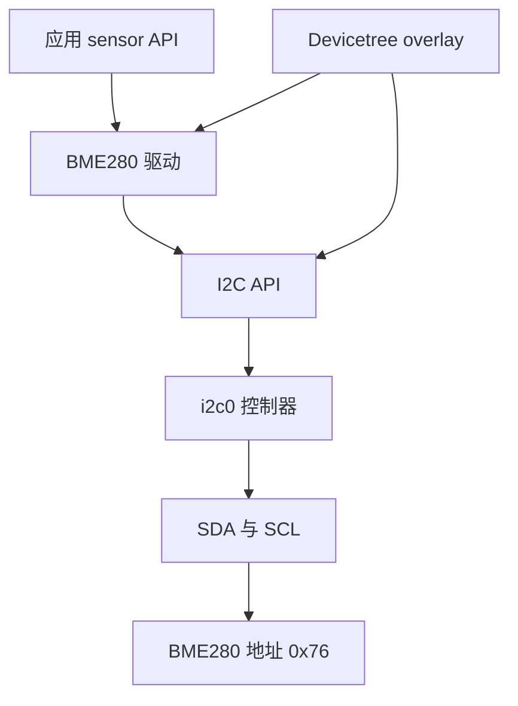
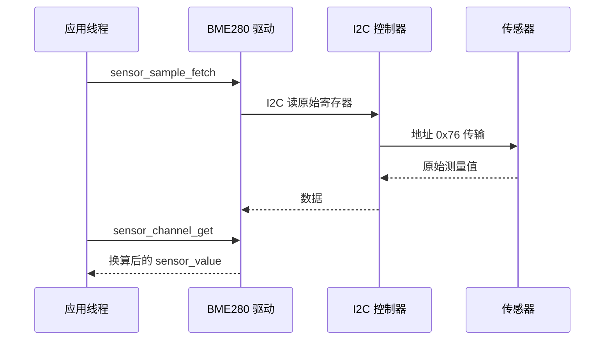

UART、SPI 和 I2C 的驱动入口看起来不同，Zephyr 的工程思路却一致：**总线控制器、地址、片选和引脚属于设备树；应用先获得设备，再调用子系统 API。**

UART 更像字节流，适合日志和命令行；SPI 速度高、全双工，适合高速 ADC、显示屏和 Flash；I2C 用地址共享两根线，适合环境传感器。本文以 BME280 为例，基于 Zephyr 4.4.x 的 sensor API。

## 一、先按物理约束选总线

| 总线 | 线数与寻址 | 优点 | 典型限制 |
| --- | --- | --- | --- |
| UART | TX/RX 点对点 | 简单、调试友好 | 无多从机寻址，吞吐有限 |
| I2C | SDA/SCL 加地址 | 两线多设备 | 上拉、电容和速率敏感 |
| SPI | SCK/MOSI/MISO/CS | 高速、全双工 | 每个从机通常要独立 CS |

FreeRTOS 中常把 HAL_I2C_Mem_Read 包在传感器函数里；Zephyr 把总线节点和传感器节点独立描述，BME280 驱动由 compatible 自动匹配，应用只使用 sensor_sample_fetch 和 sensor_channel_get。



【图1：传感器驱动通过 I2C 控制器连接到硬件】

## 二、nRF52 DK 与 BME280 接线

BME280 模块必须使用 3.3 V 供电。示例采用 I2C 地址 0x76；部分模块将 SDO 拉高后会变为 0x77，应以模块原理图或地址扫描结果为准。

| BME280 引脚 | nRF52 DK | 说明 |
| --- | --- | --- |
| VCC | 3.3 V | 不要向 nRF52832 GPIO 输入 5 V |
| GND | GND | 必须共地 |
| SCL | P0.27 | 示例使用 i2c0 SCL |
| SDA | P0.26 | 示例使用 i2c0 SDA |
| CSB | 3.3 V | 选择 I2C 模式 |
| SDO | GND | 选择地址 0x76 |

若开发板或模块已带上拉电阻，不要重复并联太小电阻。I2C 读不到设备时，首先确认实际引脚、地址和上拉，而不是先修改应用代码。

## 三、overlay 启用总线并声明传感器

```dts
&i2c0 {
    status = "okay";
    pinctrl-0 = <&i2c0_default>;
    pinctrl-names = "default";

    bme280: bme280@76 {
        compatible = "bosch,bme280";
        reg = <0x76>;
    };
};
```

最低配置：

```ini
CONFIG_I2C=y
CONFIG_SENSOR=y
CONFIG_BME280=y
CONFIG_LOG=y
```

构建后在 build/zephyr/zephyr.dts 搜索 bme280@76，确认 overlay 真正合并。再在 build/zephyr/.config 搜索 CONFIG_BME280，确认驱动被选中。

## 四、应用使用统一 sensor API

```c
#include <zephyr/device.h>
#include <zephyr/drivers/sensor.h>
#include <zephyr/kernel.h>
#include <zephyr/logging/log.h>

LOG_MODULE_REGISTER(bme280_demo, LOG_LEVEL_INF);

#define BME280_NODE DT_NODELABEL(bme280)
static const struct device *const bme280 = DEVICE_DT_GET(BME280_NODE);

int main(void)
{
    struct sensor_value temperature;
    struct sensor_value pressure;
    int err;

    if (!device_is_ready(bme280)) {
        LOG_ERR("BME280 is not ready");
        return 0;
    }

    while (true) {
        err = sensor_sample_fetch(bme280);
        if (err == 0) {
            sensor_channel_get(bme280, SENSOR_CHAN_AMBIENT_TEMP,
                               &temperature);
            sensor_channel_get(bme280, SENSOR_CHAN_PRESS,
                               &pressure);
            LOG_INF("temp %d.%06d C, pressure %d.%06d kPa",
                    temperature.val1, temperature.val2,
                    pressure.val1, pressure.val2);
        } else {
            LOG_ERR("sample fetch failed: %d", err);
        }

        k_sleep(K_SECONDS(1));
    }
}
```

sensor_value 使用整数部分 val1 与百万分之一部分 val2，避免在小 MCU 上强制引入浮点格式化。不同传感器可用的 channel 不同；调用前应查该驱动的 binding、样例或 API 文档。



【图2：统一 sensor API 隐藏寄存器读取与校准过程】

## 五、UART 与 SPI 的同一模式

UART 常用于日志，也可用 uart_callback_set 进入异步收发模式；SPI 常用 spi_dt_spec 将控制器、频率、片选和 mode 放进设备树。它们与 I2C 的共同流程仍是：

1. 在设备树启用控制器，设置 pinctrl。
2. 在子节点描述从设备、地址或片选。
3. 通过 DT 宏得到设备或 dt_spec。
4. 用子系统 API 收发。
5. 在线程或工作队列处理长时间协议解析。

不要把 UART 回调里收到的 buffer 直接交给会延迟使用的线程，除非已经规定所有权；不要在 SPI/I2C 错误时无限重试，先区分接线错误、从机未上电和总线忙。

## 六、常见问题

| 现象 | 根因 | 处理 |
| --- | --- | --- |
| BME280 未 ready | 节点 disabled、驱动未启用或 compatible 错 | 查 zephyr.dts、.config 与日志 |
| I2C NACK | 地址、接线或供电错误 | 核对 0x76/0x77、SDA/SCL、上拉和共地 |
| 数值不合理 | 读错 channel 或未调用 sample_fetch | 先 fetch，再按驱动支持的 channel get |
| I2C 总线一直忙 | SDA 被拉低或时序异常 | 用示波器检查并执行总线恢复策略 |
| 日志影响采样 | 串口输出太频繁 | 降低日志频率或在缓存中聚合 |

## 七、动手练习

1. 将地址改成 0x77 并观察 NACK，再恢复为模块实际地址。
2. 打印温度、气压和湿度，分别验证传感器支持的 channel。
3. 用逻辑分析仪观察一次 I2C 读事务，核对起始、地址和 ACK。
4. 将采样移入 delayable work，再把结果发到消息队列。

## 八、里程碑自检

- [ ] 能根据速率、线数和拓扑选择 UART、SPI 或 I2C
- [ ] 会为 BME280 写 I2C overlay 与 Kconfig
- [ ] 会用 DEVICE_DT_GET 和 sensor API 采样
- [ ] 能从 zephyr.dts 与 .config 验证总线和驱动
- [ ] 知道 I2C 失败要先检查地址、上拉、供电和引脚

## 小结

外设接入的可移植性来自描述与访问分离：设备树记录电气连接，子系统 API 表达业务意图，驱动负责协议细节。掌握这一模式后，换传感器或换 MCU 时不再需要从寄存器初始化重新开始。

> 🏷️ 标签：Zephyr · I2C · SPI · UART · BME280 · sensor API · Devicetree · nRF52832
