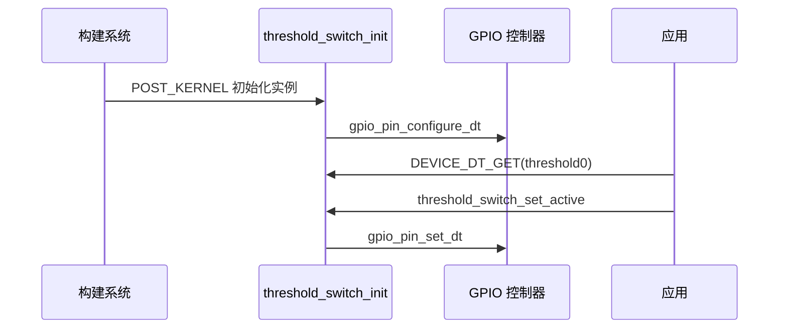

自定义驱动不是把寄存器操作放进一个新的 C 文件。一个合格的 Zephyr 驱动要同时回答四个问题：**硬件如何在设备树中描述、属性由谁验证、每个实例如何初始化、应用通过什么稳定 API 使用它。**

本文以一个数字阈值开关为例。它使用一个 GPIO 输出表示阈值状态，硬件很简单，但完整包含 binding、节点、驱动配置、API 和应用调用，流程可直接迁移到 I2C/SPI 自研外设。

## 一、五个文件的边界

| 文件 | 作用 |
| --- | --- |
| dts/bindings/acme,threshold-switch.yaml | 定义 compatible 和合法属性 |
| app.overlay | 描述某块板上的一个真实实例 |
| include/threshold_switch.h | 应用可依赖的稳定 API |
| drivers/threshold_switch.c | 初始化硬件并实现 API |
| CMakeLists.txt 与 Kconfig | 让源码和配置进入构建 |

这与 FreeRTOS 中“驱动头文件加驱动源文件”相比多了设备树与 binding；但换来的好处是一个驱动可由多个节点实例化，应用不必传递裸 GPIO 号。


【图1：自定义驱动从 binding 到应用的完整路径】

## 二、先定义 binding 和实例

binding 文件声明属性类型与是否必填：

```yaml
description: Digital threshold output switch
compatible: "acme,threshold-switch"

properties:
  threshold-gpios:
    type: phandle-array
    required: true
    description: GPIO driven active when threshold is exceeded
```

应用 overlay 为 nRF52 DK 增加一个实例。P0.20 可按自己的接线替换：

```dts
/ {
    threshold0: threshold-switch {
        compatible = "acme,threshold-switch";
        threshold-gpios = <&gpio0 20 GPIO_ACTIVE_HIGH>;
        status = "okay";
    };
};
```

binding 属性名带连字符，C 宏中使用下划线。因此 threshold-gpios 在驱动里对应 threshold_gpios。先构建并查看 zephyr.dts，确保节点和 compatible 原样存在。

## 三、定义可维护的 API

应用不应该知道该开关背后是 GPIO、I2C 还是 PWM。头文件只暴露“设定是否触发”的能力：

```c
/* include/threshold_switch.h */
#ifndef THRESHOLD_SWITCH_H
#define THRESHOLD_SWITCH_H

#include <zephyr/device.h>
#include <zephyr/sys/util.h>
#include <errno.h>

struct threshold_switch_driver_api {
    int (*set_active)(const struct device *dev, bool active);
};

static inline int threshold_switch_set_active(const struct device *dev,
                                              bool active)
{
    const struct threshold_switch_driver_api *api = dev->api;

    if (api == NULL || api->set_active == NULL) {
        return -ENOSYS;
    }

    return api->set_active(dev, active);
}

#endif
```

API 结构是 Zephyr 子系统 API 的缩小版。应用拿到 struct device 后只调用 threshold_switch_set_active；将来把 GPIO 实现换成 I2C 扩展器，不需要改业务层。

## 四、实现配置、初始化与实例化

```c
/* drivers/threshold_switch.c */
#define DT_DRV_COMPAT acme_threshold_switch

#include <zephyr/device.h>
#include <zephyr/drivers/gpio.h>
#include <zephyr/kernel.h>
#include <errno.h>
#include "threshold_switch.h"

struct threshold_switch_config {
    struct gpio_dt_spec output;
};

static int threshold_switch_set_active(const struct device *dev, bool active)
{
    const struct threshold_switch_config *cfg = dev->config;

    return gpio_pin_set_dt(&cfg->output, active);
}

static int threshold_switch_init(const struct device *dev)
{
    const struct threshold_switch_config *cfg = dev->config;

    if (!gpio_is_ready_dt(&cfg->output)) {
        return -ENODEV;
    }

    return gpio_pin_configure_dt(&cfg->output, GPIO_OUTPUT_INACTIVE);
}

static const struct threshold_switch_driver_api threshold_switch_api = {
    .set_active = threshold_switch_set_active,
};

#define THRESHOLD_SWITCH_DEFINE(inst)                                      \
    static const struct threshold_switch_config threshold_switch_cfg_##inst = { \
        .output = GPIO_DT_SPEC_INST_GET(inst, threshold_gpios),            \
    };                                                                      \
    DEVICE_DT_INST_DEFINE(inst, threshold_switch_init, NULL, NULL,          \
                          &threshold_switch_cfg_##inst, POST_KERNEL,        \
                          CONFIG_KERNEL_INIT_PRIORITY_DEVICE,               \
                          &threshold_switch_api);

DT_INST_FOREACH_STATUS_OKAY(THRESHOLD_SWITCH_DEFINE)
```

config 是每个实例的只读硬件描述，通常放 Flash；data 是运行期状态，只有需要缓存、锁、统计或异步状态时才加入。DEVICE_DT_INST_DEFINE 会为每个 status okay 的 compatible 节点创建一个 device 对象，并在指定初始化阶段调用 init。



【图2：实例初始化与应用调用顺序】

## 五、应用端只依赖设备与 API

```c
#include <zephyr/device.h>
#include <zephyr/kernel.h>
#include "threshold_switch.h"

#define THRESHOLD_NODE DT_NODELABEL(threshold0)
static const struct device *const threshold =
    DEVICE_DT_GET(THRESHOLD_NODE);

int main(void)
{
    if (!device_is_ready(threshold)) {
        return 0;
    }

    while (true) {
        threshold_switch_set_active(threshold, true);
        k_sleep(K_SECONDS(1));
        threshold_switch_set_active(threshold, false);
        k_sleep(K_SECONDS(1));
    }
}
```

工程 CMakeLists.txt 必须把 drivers/threshold_switch.c 加入 app 目标，Kconfig 至少开启 GPIO。实际产品还应给驱动添加独立 Kconfig symbol，使不需要该驱动的板子不会链接它。

## 六、常见问题

| 现象 | 根因 | 处理 |
| --- | --- | --- |
| DT_INST_FOREACH 没有实例 | compatible 拼写或 status 错误 | 查 zephyr.dts 中节点与字符串 |
| GPIO_DT_SPEC_INST_GET 编译失败 | binding 缺属性或属性名不一致 | 对照 YAML 的 threshold-gpios |
| device_is_ready 为 false | init 返回错误或 GPIO 控制器未 ready | 打开日志，检查依赖节点 |
| 应用直接访问 dev config | 绕过稳定 API | 只从头文件的 wrapper 调用 |
| 多个实例状态串扰 | 把运行状态写成全局变量 | 将状态放入每实例 data |

## 七、动手练习

1. 为驱动增加一个 invert 属性，在 binding 中声明 bool，并在 config 中读取它。
2. 添加 data 结构记录切换次数，提供只读统计 API。
3. 在 overlay 增加第二个实例，验证 DT_INST_FOREACH 会生成两个设备。
4. 把输出 GPIO 改为外部 I2C 扩展器的驱动实现，保持应用 API 不变。

## 八、里程碑自检

- [ ] 能写 binding、overlay、公共头和驱动源文件的最小组合
- [ ] 知道 config 保存硬件描述，data 保存实例运行状态
- [ ] 会用 DT_DRV_COMPAT 与 DT_INST_FOREACH_STATUS_OKAY 生成实例
- [ ] 会用 DEVICE_DT_INST_DEFINE 注册启动期设备
- [ ] 能让应用只通过 device 和稳定 API 使用自定义硬件

## 小结

自定义驱动的可维护性来自职责分离：binding 限制配置，设备树描述实例，config 和 data 区分静态与运行时信息，API 隔离实现细节。掌握这条链后，自研外设就能像 Zephyr 内置驱动一样被应用使用。

> 🏷️ 标签：Zephyr · 自定义驱动 · binding · DEVICE_DT_INST_DEFINE · device API · Devicetree
