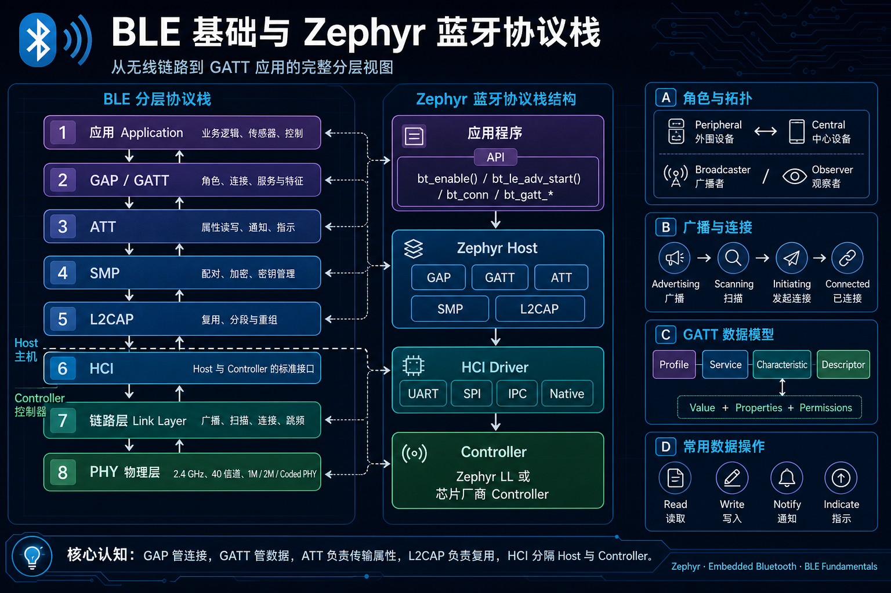
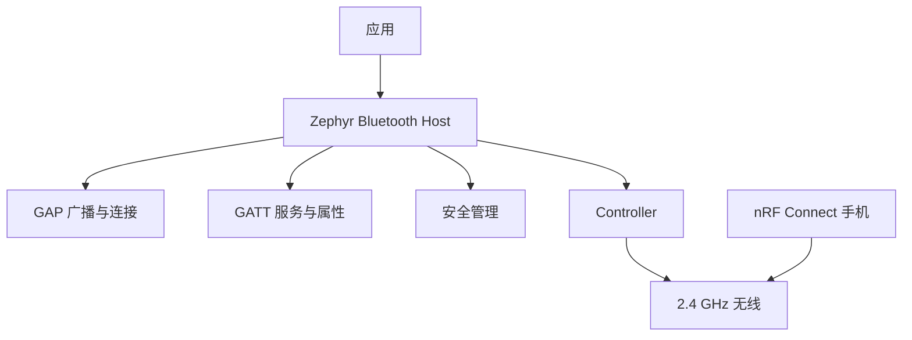
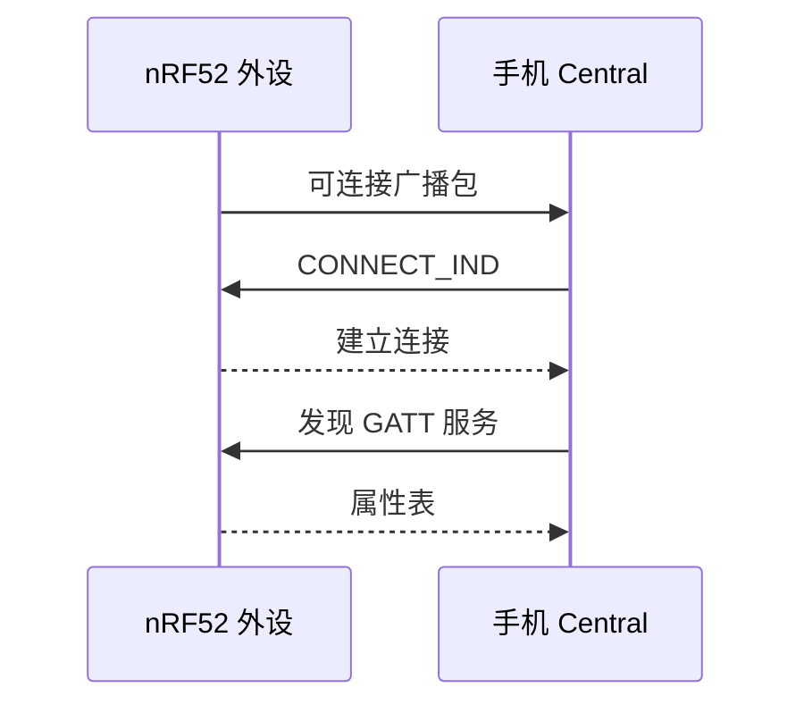

Nordic SoftDevice 把协议栈封装为厂商二进制；Zephyr 则将蓝牙 Host、Controller、驱动和应用置于开源构建体系中。对应用开发者最重要的边界是：**GAP 决定发现与连接，ATT 定义属性传输，GATT 用服务和特征组织数据。**

Zephyr 4.4.x 的角色与 Host API 见 [LE Host](https://docs.zephyrproject.org/latest/services/connectivity/bluetooth/bluetooth-le-host.html)。

## 一、先区分三层协议职责

| 层 | 问题 | 类比 |
| --- | --- | --- |
| GAP | 谁能发现、连接、广播 | 设备接入与会话建立 |
| ATT | 一条属性如何读写通知 | 最小读写协议 |
| GATT | 属性如何组成服务和特征 | 面向业务的数据模型 |
| Host | 执行 GAP/GATT/安全策略 | SoftDevice API 的可见部分 |
| Controller | 无线时序、链路层与 PHY | 无线协处理器固件职责 |



nRF52832 DK 在本系列中固定做可连接外设：手机用 nRF Connect 扫描它、建立连接，再浏览 GATT 数据库。外设不等于只能发送数据，读、写、通知和安全要求都由属性权限定义。



【图1：应用通过 Host 使用蓝牙控制器】

## 二、贯穿实验：广播、连接与重启

本工程面向 **Zephyr 4.4.x**、`nrf52dk/nrf52832`。GAP 负责广播、扫描和连接参数；ATT 是属性读写/通知协议；GATT 用服务和特征组织 ATT 属性。Host 实现 GAP/GATT/安全策略，Controller 实现链路层、PHY 和无线时序。Zephyr 的 [LE Host API](https://docs.zephyrproject.org/4.4.0/connectivity/bluetooth/api/host.html) 是本章 API 的权威来源。

```text
app/
├── CMakeLists.txt
├── prj.conf
└── src/main.c
```

```cmake
# CMakeLists.txt
cmake_minimum_required(VERSION 3.20.0)
find_package(Zephyr REQUIRED HINTS $ENV{ZEPHYR_BASE})
project(ble_basic)
target_sources(app PRIVATE src/main.c)
```

```ini
# prj.conf
CONFIG_BT=y
CONFIG_BT_PERIPHERAL=y
CONFIG_BT_DEVICE_NAME="Env Node"
CONFIG_BT_MAX_CONN=1
CONFIG_BT_GATT_CLIENT=y
CONFIG_LOG=y
CONFIG_MAIN_STACK_SIZE=1024
```

`bt_enable(bt_ready_cb_t cb)` 初始化 Bluetooth Host；`cb == NULL` 时同步等待完成，返回 `0` 或负 errno，必须在线程上下文调用。`bt_le_adv_start(const struct bt_le_adv_param *param, const struct bt_data *ad, size_t ad_len, const struct bt_data *sd, size_t sd_len)` 启动广告并返回 `0` 或负 errno；`ad`/`sd` 描述仅在调用时读取，静态数组最简单。默认 legacy advertising 中 AD data 和 scan response 各最多 31 字节，字段自身还占 type/length；过长不是手机问题，应缩短名称或把数据转移到连接后的 GATT。

```c
/* src/main.c */
#include <errno.h>
#include <zephyr/bluetooth/bluetooth.h>
#include <zephyr/bluetooth/conn.h>
#include <zephyr/kernel.h>
#include <zephyr/logging/log.h>

LOG_MODULE_REGISTER(ble_basic, LOG_LEVEL_INF);
static const struct bt_data ad[] = {
    BT_DATA_BYTES(BT_DATA_FLAGS, BT_LE_AD_GENERAL | BT_LE_AD_NO_BREDR),
    BT_DATA(BT_DATA_NAME_COMPLETE, CONFIG_BT_DEVICE_NAME,
            sizeof(CONFIG_BT_DEVICE_NAME) - 1),
};

/**
 * @brief 启动可连接广播。
 * @return 0 表示已请求启动；负 errno 表示 Host 状态或参数失败。
 */
static int start_advertising(void)
{
    int err = bt_le_adv_start(BT_LE_ADV_CONN_FAST_1, ad, ARRAY_SIZE(ad), NULL, 0);
    if (err != 0 && err != -EALREADY) { LOG_ERR("advertising start failed: %d", err); }
    return err == -EALREADY ? 0 : err;
}

/**
 * @brief 记录连接结果；回调中不执行阻塞业务。
 */
static void connected(struct bt_conn *conn, uint8_t err)
{
    ARG_UNUSED(conn);
    if (err != 0U) { LOG_ERR("connection failed: 0x%02x", err); return; }
    LOG_INF("connected");
}

/**
 * @brief 断开后恢复可连接广播。
 */
static void disconnected(struct bt_conn *conn, uint8_t reason)
{
    int err;
    ARG_UNUSED(conn);
    LOG_INF("disconnected: 0x%02x", reason);
    err = start_advertising();
    if (err != 0) { LOG_ERR("advertising restart failed: %d", err); }
}

BT_CONN_CB_DEFINE(connection_callbacks) = {
    .connected = connected,
    .disconnected = disconnected,
};

int main(void)
{
    int err = bt_enable(NULL);
    if (err != 0) { LOG_ERR("Bluetooth enable failed: %d", err); return err; }
    err = start_advertising();
    if (err != 0) { return err; }
    LOG_INF("advertising as %s", CONFIG_BT_DEVICE_NAME);
    return 0;
}
```

`BT_CONN_CB_DEFINE(name)` 是静态注册连接回调的宏；`connected`/`disconnected` 的 `conn` 只保证在回调期间有效，若工作线程需要异步使用，必须先 `bt_conn_ref(conn)`，并在完成时 `bt_conn_unref()`。本例不保存指针。回调属于 Bluetooth 子系统上下文，不应 sleep、等待 mutex、读取 I2C 或发起耗时 GATT 操作。

```powershell
west build -p always -b nrf52dk/nrf52832 app
west flash
Select-String build/zephyr/.config -Pattern "CONFIG_BT_(PERIPHERAL|MAX_CONN)"
```

用 nRF Connect 手机端扫描 `Env Node`，连接后观察串口 `connected`；主动断开后应看到 `disconnected` 和重新开始广播。预期流程不等于本文已做过无线硬件验证。手机扫描不到时先确认没有仍连接的 Central、日志中 start 成功、天线区未遮挡和 `.config` 含 `CONFIG_BT=y`。

| 现象 | 根因 | 检查与修复 |
| --- | --- | --- |
| 扫描不到 | Host 未启用、未启动广告或仍连接 | 检查 `bt_enable`/`bt_le_adv_start` 返回值与连接状态 |
| start 返回错误 | 广告字段过长或状态不允许 | 计算 legacy 31-byte 限制，缩短名称/移入 scan response |
| 断开后不再出现 | 未在 disconnected 回调重启 | 保留 `start_advertising()` 与错误日志 |
| RAM 上升 | 增加连接数、buffer 或安全特性 | 逐项改配置并比较构建内存报告 |
| 回调内死锁/延迟 | 在 Host 上下文做阻塞工作 | 引用连接后投递 work，或只记录事件 |

## 三、从实验拆解广播启动

Controller 管无线时序和链路层，Host 管 GAP 状态、连接与 ATT/GATT。广告只解决发现/建连，静态广告数据避免生命周期问题；callback 内的 `bt_conn` 仅被借用，异步使用须 ref/unref。断开是外设状态机回到 advertising 的正常分支，不是在 callback 内做耗时业务的理由。

```ini
CONFIG_BT=y
CONFIG_BT_PERIPHERAL=y
CONFIG_BT_DEVICE_NAME="Env Node"
CONFIG_BT_MAX_CONN=1
CONFIG_LOG=y
CONFIG_MAIN_STACK_SIZE=1024
```

```c
#include <zephyr/bluetooth/bluetooth.h>
#include <zephyr/kernel.h>
#include <zephyr/logging/log.h>

LOG_MODULE_REGISTER(ble_basic, LOG_LEVEL_INF);

static const struct bt_data ad[] = {
    BT_DATA_BYTES(BT_DATA_FLAGS, BT_LE_AD_GENERAL | BT_LE_AD_NO_BREDR),
    BT_DATA(BT_DATA_NAME_COMPLETE, CONFIG_BT_DEVICE_NAME,
            sizeof(CONFIG_BT_DEVICE_NAME) - 1),
};

int main(void)
{
    int err;

    err = bt_enable(NULL);
    if (err != 0) {
        LOG_ERR("Bluetooth enable failed: %d", err);
        return 0;
    }

    err = bt_le_adv_start(BT_LE_ADV_CONN_FAST_1, ad, ARRAY_SIZE(ad),
                          NULL, 0);
    if (err != 0) {
        LOG_ERR("Advertising start failed: %d", err);
        return 0;
    }

    LOG_INF("Advertising as %s", CONFIG_BT_DEVICE_NAME);
    return 0;
}
```

构建并烧录：

```powershell
west build -p always -b nrf52dk/nrf52832 app
west flash
```

nRF Connect 扫描时应看到 Env Node。看不到时先确认板子没有连接到其他 Central、天线区域未被金属遮挡、CONFIG_BT 已进入 build/zephyr/.config。



【图2：手机发现、连接并浏览属性的过程】

## 四、从实验拆解广播数据

传统 BLE 广播数据有效载荷有限。设备名、Flags、服务 UUID 和厂商数据都要争夺空间；把完整传感器数据塞进广播会降低互操作性，也不适合需要可靠确认的命令。

推荐策略：

- 广播放设备名、服务 UUID 和发现所需的最小信息。
- 连接后通过 GATT 读取或通知传感器值。
- 多连接、长包、2M PHY 和扩展广播都要重新评估 nRF52832 的 RAM 与空中时间。
- 构建后记录 Flash/RAM 报告；蓝牙配置的每一次扩展都应有资源数据。

## 五、从实验拆解连接生命周期

应用应注册连接回调，保存连接引用、处理断开原因，并在断开后恢复广播。连接回调运行于 Bluetooth 子系统上下文，耗时业务仍应移交到工作队列或应用线程。

不要把“能广播”误判为“产品已可用”。真实设备还要处理重复连接、手机强制断开、连接参数协商、配对失败与重新广播。

## 六、常见问题

| 现象 | 根因 | 处理 |
| --- | --- | --- |
| 手机扫描不到 | 未启动广播、已连接或配置未生效 | 查日志、.config 和广播状态 |
| 连接后没有业务数据 | 只有 GAP，尚未定义 GATT 服务 | 添加服务与特征 |
| RAM 急剧上升 | 增大连接数、buffer 或安全特性 | 逐项比较构建报告 |
| 广播包过长 | 字段总长度超限 | 缩短名称，UUID 放扫描响应或 GATT |
| 重启后不再广播 | 未处理初始化或断开路径 | 用连接回调恢复广告策略 |

## 七、动手练习

1. 将设备名改为自己的节点名，用 nRF Connect 确认变化。
2. 在广告中加入一个 16 位服务 UUID，观察手机扫描页显示。
3. 将广播模式从快速改为更慢的间隔，比较手机发现时间。
4. 打开 build 输出，记录仅启用 BLE 后的 RAM 和 Flash 占用。

## 八、里程碑自检

- [ ] 能解释 GAP、ATT 和 GATT 的分工
- [ ] 知道 Host 与 Controller 的边界
- [ ] 会用 bt_enable 与 bt_le_adv_start 启动外设广播
- [ ] 能用 nRF Connect 发现并连接 nRF52 DK
- [ ] 知道广播数据、连接数和安全特性都会影响 RAM 预算

## 小结

BLE 应用的第一步不是写 GATT 宏，而是建立正确分层：广播负责被发现，连接承载会话，属性承载业务数据。把这三层分开后，传感器、升级和安全功能都能沿同一条链扩展。

> 🏷️ 标签：Zephyr · BLE · GAP · ATT · GATT · 广播 · nRF Connect · nRF52832
