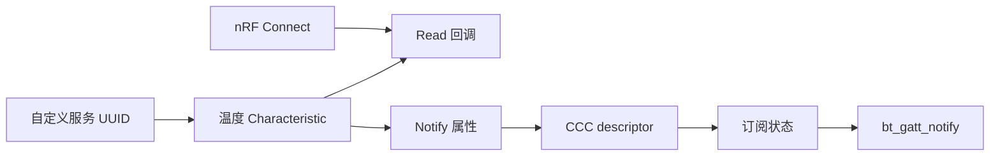
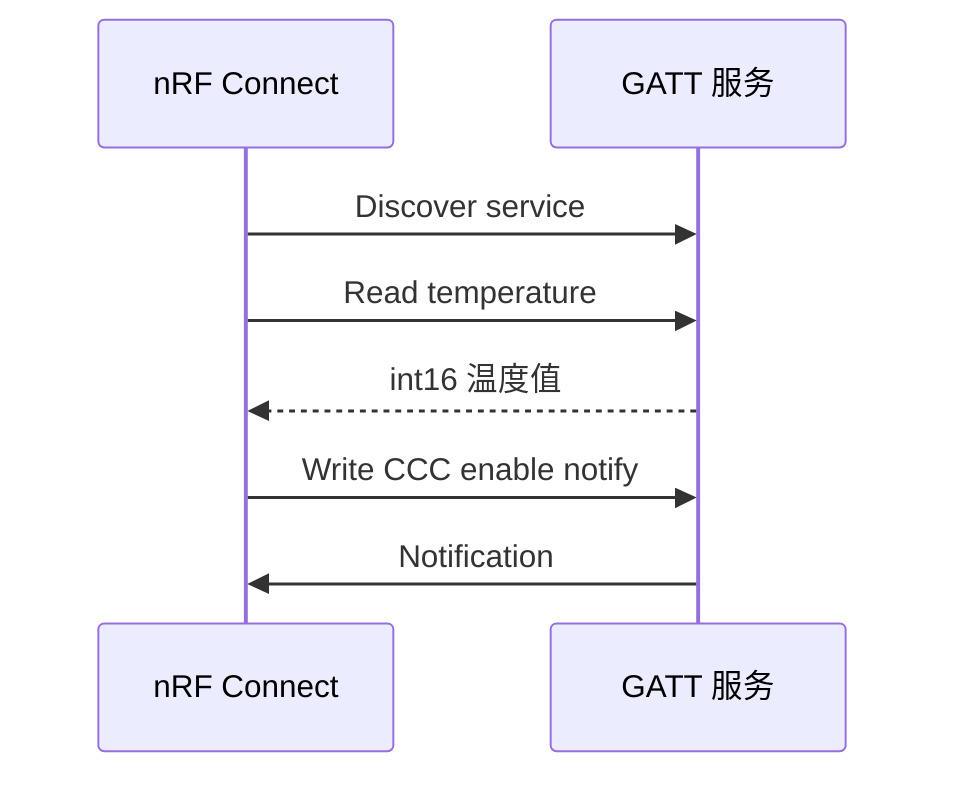

GATT 服务是 BLE 的业务数据模型。一个服务包含一个或多个特征；特征的 value 是数据本身，descriptor 补充格式、权限或通知配置。**notify 是服务器主动推送的无确认更新，indicate 才有协议级确认，但吞吐更低。**

## 一、属性表与 CCC

| 元素 | 用途 |
| --- | --- |
| Primary Service | 定义业务服务 UUID |
| Characteristic | 定义 value、读写和通知属性 |
| CCC descriptor | 让每个连接选择是否订阅通知 |
| Read callback | 响应手机读请求 |
| bt_gatt_notify | 向已订阅连接推送新值 |



【图1：GATT 特征、CCC 和通知的关系】

## 二、一个可读又可通知的温度服务

示例 UUID 只用于演示，产品必须分配自己的 128 位 UUID：

```c
#include <zephyr/bluetooth/gatt.h>
#include <zephyr/bluetooth/uuid.h>
#include <zephyr/kernel.h>

#define BT_UUID_ENV_SERVICE_VAL     BT_UUID_128_ENCODE(0x6e400001, 0xb5a3, 0xf393, 0xe0a9, 0xe50e24dcca9e)
#define BT_UUID_TEMP_VAL     BT_UUID_128_ENCODE(0x6e400002, 0xb5a3, 0xf393, 0xe0a9, 0xe50e24dcca9e)

static struct bt_uuid_128 env_service_uuid =
    BT_UUID_INIT_128(BT_UUID_ENV_SERVICE_VAL);
static struct bt_uuid_128 temp_uuid =
    BT_UUID_INIT_128(BT_UUID_TEMP_VAL);

static int16_t temperature_centi;

static ssize_t read_temperature(struct bt_conn *conn,
                                const struct bt_gatt_attr *attr,
                                void *buf, uint16_t len, uint16_t offset)
{
    return bt_gatt_attr_read(conn, attr, buf, len, offset,
                             &temperature_centi,
                             sizeof(temperature_centi));
}

BT_GATT_SERVICE_DEFINE(env_service,
    BT_GATT_PRIMARY_SERVICE(&env_service_uuid.uuid),
    BT_GATT_CHARACTERISTIC(&temp_uuid.uuid,
        BT_GATT_CHRC_READ | BT_GATT_CHRC_NOTIFY,
        BT_GATT_PERM_READ, read_temperature, NULL, &temperature_centi),
    BT_GATT_CCC(NULL, BT_GATT_PERM_READ | BT_GATT_PERM_WRITE)
);

void env_service_publish_temperature(int16_t centi_c)
{
    temperature_centi = centi_c;
    bt_gatt_notify(NULL, &env_service.attrs[2],
                   &temperature_centi, sizeof(temperature_centi));
}
```

BT_GATT_SERVICE_DEFINE 静态注册属性表。CCC 是每个连接独立保存的订阅配置；当客户端没有启用 notification 时，调用 bt_gatt_notify 不会把数据推给它。实际产品应检查返回值、连接数和数据生命周期。



【图2：手机读值并订阅通知】

## 三、数据格式必须可解释

示例用 int16 保存摄氏度乘以 100，2501 表示 25.01 C。这样避免端侧浮点歧义，也比直接把字符串通知给手机更节省空中时间。服务文档应明确：

- UUID、字节序、长度与单位。
- 每个特征是 read、write、notify 还是 indicate。
- 通知频率、丢包是否允许、客户端重连后的订阅策略。
- 写入数据的范围、权限和错误码。

手机端在 nRF Connect 中连接 Env Node，展开自定义服务，读取 temperature 特征，然后点击通知开关。读操作和通知开关都成功，才证明属性表、权限和 CCC 链路完整。

## 四、常见问题

| 现象 | 根因 | 处理 |
| --- | --- | --- |
| 手机找不到服务 | 服务未链接或 UUID 写错 | 检查 CONFIG_BT、属性表和广播 |
| 能读但没有通知 | 客户端未写 CCC | 在 nRF Connect 启用通知 |
| 通知返回错误 | 无连接、未订阅或 attr 指针错误 | 检查连接状态与属性索引 |
| 手机显示温度异常 | 单位、字节序或缩放未约定 | 固定二进制格式并写入文档 |
| 数据必须确认却用 notify | notify 不保证应用确认 | 改用 indicate 或上层确认协议 |

## 五、动手练习

1. 增加湿度特征，采用百分比乘以 100 的整数格式。
2. 将温度特征改为 indicate，观察手机确认带来的节奏变化。
3. 增加可写采样间隔特征，并验证输入范围。
4. 断开后重连，检查客户端是否需要重新订阅通知。

## 六、里程碑自检

- [ ] 能说明 service、characteristic、descriptor 和 CCC 的关系
- [ ] 会用 BT_GATT_SERVICE_DEFINE 注册属性表
- [ ] 会实现 read callback 与 bt_gatt_notify
- [ ] 能在 nRF Connect 完成发现、读取和订阅
- [ ] 知道 notify 与 indicate 的可靠性和吞吐取舍

## 小结

GATT 的重点不是堆叠宏，而是定义稳定的数据契约。服务给业务边界，特征给数据含义，CCC 给订阅选择；格式、频率和可靠性明确后，手机端、网关和固件才能独立演进。

> 🏷️ 标签：Zephyr · BLE · GATT · UUID · notify · indicate · CCC · nRF Connect
