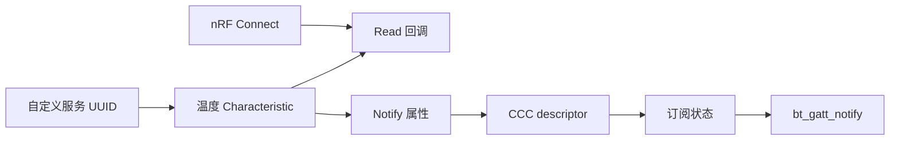
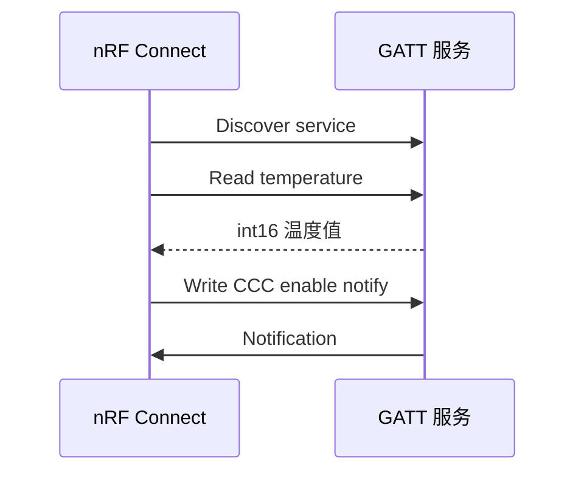

GATT 服务是 BLE 的业务数据模型。一个服务包含一个或多个特征；特征的 value 是数据本身，descriptor 补充格式、权限或通知配置。**notify 是服务器主动推送的无确认更新，indicate 才有协议级确认，但吞吐更低。**

## 一、属性表与 CCC

| 元素 | 用途 |
| --- | --- |
| Primary Service | 定义业务服务 UUID |
| Characteristic | 定义 value、读写和通知属性 |
| CCC descriptor | 让每个连接选择是否订阅通知 |
| Read callback | 响应手机读请求 |
| bt_gatt_notify | 向已订阅连接推送新值 |



【图1：GATT 特征、CCC 和通知的关系】

## 二、贯穿实验：可读、可订阅温度服务

本实验固定 **Zephyr 4.4.x** 与 `nrf52dk/nrf52832`。服务将摄氏温度乘 100 后编码为 **little-endian signed int16**；例如 `2501` 表示 25.01 C。该格式、UUID、单位、长度和通知频率是手机/网关与固件之间的契约。以下文件是一个完整应用树，而不是需要粘到同一 C 文件的片段。

```text
app/
├── CMakeLists.txt
├── prj.conf
├── include/env_service.h
├── src/env_service.c
└── src/main.c
```

```cmake
# CMakeLists.txt
cmake_minimum_required(VERSION 3.20.0)
find_package(Zephyr REQUIRED HINTS $ENV{ZEPHYR_BASE})
project(env_gatt_service)
target_include_directories(app PRIVATE include)
target_sources(app PRIVATE src/main.c src/env_service.c)
```

```ini
# prj.conf
CONFIG_BT=y
CONFIG_BT_PERIPHERAL=y
CONFIG_BT_DEVICE_NAME="Env Node"
CONFIG_BT_MAX_CONN=1
CONFIG_LOG=y
CONFIG_MAIN_STACK_SIZE=1024
```

```c
/* include/env_service.h */
#ifndef ENV_SERVICE_H
#define ENV_SERVICE_H
#include <stdint.h>
/**
 * @brief 更新温度值；有订阅者时发送 notification。
 * @return 0 表示写入且通知请求成功；负 errno 表示没有订阅者或 Host 发送失败。
 */
int env_service_publish_temperature(int16_t centi_c);
#endif
```

`BT_GATT_SERVICE_DEFINE(name, ...)` 是静态注册属性表的宏；`BT_GATT_CCC(changed, perm)` 为每个连接维护 Client Characteristic Configuration。CCC changed callback 的 `value` 包含 `BT_GATT_CCC_NOTIFY` 位时，客户端已经订阅。它可在 Bluetooth 子系统上下文调用，因此本例只更新原子标志。`bt_gatt_attr_read(conn, attr, buf, len, offset, value, value_len)` 处理 offset、长度和 ATT read 的返回值；read callback 不能自行忽略 offset。

```c
/* src/env_service.c */
#include <errno.h>
#include <stdint.h>
#include <zephyr/bluetooth/gatt.h>
#include <zephyr/bluetooth/uuid.h>
#include <zephyr/sys/atomic.h>
#include <zephyr/sys/byteorder.h>
#include "env_service.h"

#define BT_UUID_ENV_SERVICE_VAL BT_UUID_128_ENCODE(0x6e400001, 0xb5a3, 0xf393, 0xe0a9, 0xe50e24dcca9e)
#define BT_UUID_ENV_TEMP_VAL BT_UUID_128_ENCODE(0x6e400002, 0xb5a3, 0xf393, 0xe0a9, 0xe50e24dcca9e)

static struct bt_uuid_128 env_service_uuid = BT_UUID_INIT_128(BT_UUID_ENV_SERVICE_VAL);
static struct bt_uuid_128 env_temp_uuid = BT_UUID_INIT_128(BT_UUID_ENV_TEMP_VAL);
static atomic_t temperature_centi;
static atomic_t notify_enabled;

/**
 * @brief 处理客户端读温度属性请求。
 * @return ATT 可读取的字节数或 ATT 错误编码。
 */
static ssize_t read_temperature(struct bt_conn *conn, const struct bt_gatt_attr *attr,
                                void *buf, uint16_t len, uint16_t offset)
{
    uint16_t temperature_le = sys_cpu_to_le16((uint16_t)(int16_t)atomic_get(&temperature_centi));

    return bt_gatt_attr_read(conn, attr, buf, len, offset,
                             &temperature_le, sizeof(temperature_le));
}

/**
 * @brief 记录单连接应用的通知订阅状态。
 */
static void temperature_ccc_changed(const struct bt_gatt_attr *attr, uint16_t value)
{
    ARG_UNUSED(attr);
    atomic_set(&notify_enabled, (value & BT_GATT_CCC_NOTIFY) != 0U ? 1 : 0);
}

BT_GATT_SERVICE_DEFINE(env_service,
    BT_GATT_PRIMARY_SERVICE(&env_service_uuid.uuid),
    BT_GATT_CHARACTERISTIC(&env_temp_uuid.uuid,
        BT_GATT_CHRC_READ | BT_GATT_CHRC_NOTIFY, BT_GATT_PERM_READ,
        read_temperature, NULL, NULL),
    BT_GATT_CCC(temperature_ccc_changed, BT_GATT_PERM_READ | BT_GATT_PERM_WRITE)
);

int env_service_publish_temperature(int16_t centi_c)
{
    uint16_t temperature_le;

    atomic_set(&temperature_centi, centi_c);
    if (!atomic_get(&notify_enabled)) { return -EACCES; }
    temperature_le = sys_cpu_to_le16((uint16_t)centi_c);
    return bt_gatt_notify_uuid(NULL, &env_temp_uuid.uuid,
                               env_service.attrs,
                               &temperature_le,
                               sizeof(temperature_le));
}
```

`bt_gatt_notify_uuid()` 在 Zephyr 4.4 可用：它从 `attr` 指定的起点向后搜索首个 UUID 匹配的 characteristic value。本例以 `env_service.attrs` 作为服务起点，以 `env_temp_uuid` 定位 value，因此在属性表中插入 descriptor 时不需要维护数字索引。若同一服务重复使用相同 UUID，则应改为导出明确的 value attribute 指针。`conn == NULL` 时只向已通过 CCC 订阅的 peer 通知，返回 `0` 或负 errno。即使先检查 CCC，断开与发送之间仍可能发生，调用者必须检查返回值。本文把 `BT_MAX_CONN=1` 固定为 1；多连接不能用单个 `notify_enabled` 代替每连接 CCC 状态。温度由 atomic 快照保存，read callback 和发布线程不再并发访问普通 `uint16_t` 对象。

```c
/* src/main.c */
#include <errno.h>
#include <zephyr/bluetooth/bluetooth.h>
#include <zephyr/bluetooth/conn.h>
#include <zephyr/kernel.h>
#include <zephyr/logging/log.h>
#include "env_service.h"

LOG_MODULE_REGISTER(env_app, LOG_LEVEL_INF);
static const struct bt_data ad[] = {
    BT_DATA_BYTES(BT_DATA_FLAGS, BT_LE_AD_GENERAL | BT_LE_AD_NO_BREDR),
    BT_DATA(BT_DATA_NAME_COMPLETE, CONFIG_BT_DEVICE_NAME, sizeof(CONFIG_BT_DEVICE_NAME) - 1),
};
/** @brief 启动或恢复可连接广播。
 * @return 0 成功；负 errno 表示参数或 Host 状态错误。 */
static int start_advertising(void)
{
    int err = bt_le_adv_start(BT_LE_ADV_CONN_FAST_1, ad, ARRAY_SIZE(ad), NULL, 0);
    return err == -EALREADY ? 0 : err;
}
/** @brief 在断开后恢复广播。 */
static void disconnected(struct bt_conn *conn, uint8_t reason)
{
    int err;
    ARG_UNUSED(conn);
    LOG_INF("disconnected: 0x%02x", reason);
    err = start_advertising();
    if (err != 0) { LOG_ERR("advertising restart failed: %d", err); }
}
BT_CONN_CB_DEFINE(conn_callbacks) = { .disconnected = disconnected };
int main(void)
{
    int err = bt_enable(NULL);
    int16_t temperature = 2500;
    if (err != 0) { LOG_ERR("Bluetooth enable failed: %d", err); return err; }
    err = start_advertising();
    if (err != 0) { LOG_ERR("advertising failed: %d", err); return err; }
    while (true) {
        err = env_service_publish_temperature(temperature++);
        if (err != 0 && err != -EACCES && err != -ENOTCONN) {
            LOG_ERR("temperature publish failed: %d", err);
        }
        k_sleep(K_SECONDS(1));
    }
}
```

```powershell
west build -p always -b nrf52dk/nrf52832 app
west flash
Select-String build/zephyr/.config -Pattern "CONFIG_BT_(PERIPHERAL|MAX_CONN)"
```

手机验证步骤：nRF Connect 扫描 `Env Node`，连接，发现 128-bit 服务，读取温度特征，点击 notification 开关，再观察每秒变化的 two-byte little-endian 值。先读再订阅有助于验证 read callback、属性权限和 CCC 三段链路。断开重连通常需要重新订阅，除非产品明确启用并验证了 bonding/settings。

| 现象 | 根因 | 检查与修复 |
| --- | --- | --- |
| 找不到服务 | 服务源未链接或 UUID 不一致 | 核对 CMake 和手机发现结果 |
| 可读不可通知 | CCC 未写入或未订阅 | 在手机启用 notify，检查 CCC callback |
| 返回 `-EACCES` | 本例的订阅 guard 拒绝未订阅发送 | 这是正常保护，不应当作无线错误 |
| 返回其他负 errno | 已断开、Host 状态或 payload 错误 | 记录返回码并恢复广播/连接 |
| 数值异常 | 客户端按大端或无符号解析 | 固定 int16 little-endian、单位为 0.01 C |

## 三、从实验拆解属性表与通知

service declaration、characteristic declaration、value 与 CCC 是不同 attribute：CCC 保存每连接订阅选择。ATT read 会携带 offset，必须经 `bt_gatt_attr_read` 处理；notify 的数据在调用期间必须稳定，CCC guard 与断开可并发，仍须检查返回值。固定属性索引不是稳定 ABI，应以 UUID 或受控引用定位 value。

示例 UUID 只用于演示，产品必须分配自己的 128 位 UUID：

```c
#include <zephyr/bluetooth/gatt.h>
#include <zephyr/bluetooth/uuid.h>
#include <zephyr/kernel.h>

#define BT_UUID_ENV_SERVICE_VAL     BT_UUID_128_ENCODE(0x6e400001, 0xb5a3, 0xf393, 0xe0a9, 0xe50e24dcca9e)
#define BT_UUID_TEMP_VAL     BT_UUID_128_ENCODE(0x6e400002, 0xb5a3, 0xf393, 0xe0a9, 0xe50e24dcca9e)

static struct bt_uuid_128 env_service_uuid =
    BT_UUID_INIT_128(BT_UUID_ENV_SERVICE_VAL);
static struct bt_uuid_128 temp_uuid =
    BT_UUID_INIT_128(BT_UUID_TEMP_VAL);

static int16_t temperature_centi;

static ssize_t read_temperature(struct bt_conn *conn,
                                const struct bt_gatt_attr *attr,
                                void *buf, uint16_t len, uint16_t offset)
{
    return bt_gatt_attr_read(conn, attr, buf, len, offset,
                             &temperature_centi,
                             sizeof(temperature_centi));
}

BT_GATT_SERVICE_DEFINE(env_service,
    BT_GATT_PRIMARY_SERVICE(&env_service_uuid.uuid),
    BT_GATT_CHARACTERISTIC(&temp_uuid.uuid,
        BT_GATT_CHRC_READ | BT_GATT_CHRC_NOTIFY,
        BT_GATT_PERM_READ, read_temperature, NULL, &temperature_centi),
    BT_GATT_CCC(NULL, BT_GATT_PERM_READ | BT_GATT_PERM_WRITE)
);

void env_service_publish_temperature(int16_t centi_c)
{
    temperature_centi = centi_c;
    (void)bt_gatt_notify_uuid(NULL, &temp_uuid.uuid,
                              env_service.attrs,
                              &temperature_centi,
                              sizeof(temperature_centi));
}
```

BT_GATT_SERVICE_DEFINE 静态注册属性表。CCC 是每个连接独立保存的订阅配置；当客户端没有启用 notification 时，调用 bt_gatt_notify 不会把数据推给它。实际产品应检查返回值、连接数和数据生命周期。



【图2：手机读值并订阅通知】

## 四、从实验拆解数据格式

示例用 int16 保存摄氏度乘以 100，2501 表示 25.01 C。这样避免端侧浮点歧义，也比直接把字符串通知给手机更节省空中时间。服务文档应明确：

- UUID、字节序、长度与单位。
- 每个特征是 read、write、notify 还是 indicate。
- 通知频率、丢包是否允许、客户端重连后的订阅策略。
- 写入数据的范围、权限和错误码。

手机端在 nRF Connect 中连接 Env Node，展开自定义服务，读取 temperature 特征，然后点击通知开关。读操作和通知开关都成功，才证明属性表、权限和 CCC 链路完整。

## 五、常见问题

| 现象 | 根因 | 处理 |
| --- | --- | --- |
| 手机找不到服务 | 服务未链接或 UUID 写错 | 检查 CONFIG_BT、属性表和广播 |
| 能读但没有通知 | 客户端未写 CCC | 在 nRF Connect 启用通知 |
| 通知返回错误 | 无连接、未订阅或 attr 指针错误 | 检查连接状态与属性索引 |
| 手机显示温度异常 | 单位、字节序或缩放未约定 | 固定二进制格式并写入文档 |
| 数据必须确认却用 notify | notify 不保证应用确认 | 改用 indicate 或上层确认协议 |

## 六、动手练习

1. 增加湿度特征，采用百分比乘以 100 的整数格式。
2. 将温度特征改为 indicate，观察手机确认带来的节奏变化。
3. 增加可写采样间隔特征，并验证输入范围。
4. 断开后重连，检查客户端是否需要重新订阅通知。

## 七、里程碑自检

- [ ] 能说明 service、characteristic、descriptor 和 CCC 的关系
- [ ] 会用 BT_GATT_SERVICE_DEFINE 注册属性表
- [ ] 会实现 read callback 与 bt_gatt_notify
- [ ] 能在 nRF Connect 完成发现、读取和订阅
- [ ] 知道 notify 与 indicate 的可靠性和吞吐取舍

## 小结

GATT 的重点不是堆叠宏，而是定义稳定的数据契约。服务给业务边界，特征给数据含义，CCC 给订阅选择；格式、频率和可靠性明确后，手机端、网关和固件才能独立演进。

> 🏷️ 标签：Zephyr · BLE · GATT · UUID · notify · indicate · CCC · nRF Connect
