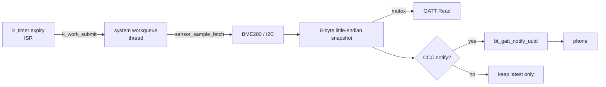
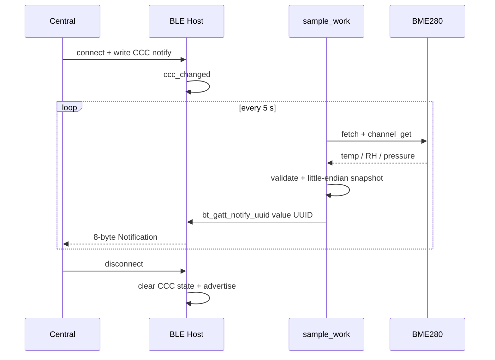

本章在 Zephyr 4.4.x 和 `nrf52dk/nrf52832` 上实现完整环境节点：每 5 秒从 BME280 读取温度、湿度、气压，形成固定小端快照；手机既能 Read，也能打开 CCC 接收 Notification。本文不声称当前环境已编译或上板，所有日志与手机结果均标为预期验收结果。

## 一、先建立所有权流水线

传感器上行不是“读一次再发一次”，而是四个所有权阶段：

1. **采集所有权**：BME280 驱动拥有硬件事务；一次 `fetch` 完成前，应用不能把 channel 值当成新样本。
2. **快照所有权**：采样 work 把驱动内部值复制为应用快照；此后 GATT Read 不再碰 I2C。
3. **编码所有权**：应用把物理量转换为固定单位和小端 wire format；结构布局由协议而非 CPU ABI 决定。
4. **发送所有权**：CCC 属于每条连接；Host 接受 notify 只表示排队成功，不表示手机已经消费。



【图1：定时器只调度，阻塞式采样在线程中完成】

`k_timer` expiry 可能运行在系统时钟中断路径，不能在其中访问可能睡眠的 I2C。`k_work_submit()` 可从 ISR 提交静态 work，handler 才在系统工作队列线程执行。FreeRTOS 用户可把它类比为“软件定时器/ISR 只发任务通知，任务访问总线”。

### 1.1 状态、生命周期与失败传播

| 对象 | 所有者/生命周期 | 并发关系 | 失败后的策略 |
| --- | --- | --- | --- |
| BME280 device | 设备模型静态对象，贯穿系统生命周期 | 只由 work 发起事务 | 本周期失败，计数并等待下周期 |
| `sample_work` | 静态 work，不能并行复制自己 | timer ISR 提交、系统队列执行 | 忙时合并周期，不积压无界样本 |
| `latest` | 应用长期快照 | work 写、Host read callback 读 | mutex 防止结构撕裂 |
| `payload` | handler 栈上的本次编码 | notify 调用期间有效 | Host 拒绝排队就丢本帧 |
| CCC 状态 | Bluetooth Host 按连接维护 | callback 更新、work 查询 | 断线清状态，多连接需逐连接管理 |

这里选择“最新值”语义而不是消息队列语义：环境数据允许覆盖旧样本，所以背压时丢旧帧比堆积更合理。若业务要求每个事件都可追溯，应改用有界队列、sequence 和明确的满队列策略，而不是继续扩大 BLE buffer。

### 1.2 资源模型

采样周期同时受 I2C 最坏时延、系统工作队列占用、BLE TX buffer、连接间隔和手机处理速度约束。`k_work_submit()==0` 表示没有形成新的提交，本例统计为 skipped period；`bt_gatt_notify_uuid()<0` 表示本帧未进入 Host 发送路径。二者都不能在原上下文中忙重试，否则会把短暂背压放大成系统饥饿。

## 二、工程树与接线

```text
ble_env/
|-- CMakeLists.txt
|-- prj.conf
|-- boards/
|   `-- nrf52dk_nrf52832.overlay
`-- src/
    `-- main.c
```

BME280 接 3.3 V、GND 和开发板 I2C SDA/SCL。`reg = <0x76>` 是 7 位地址；若模块地址脚选择 0x77，应同步修改。模块必须处于 I2C 模式。

```cmake
# CMakeLists.txt
cmake_minimum_required(VERSION 3.20.0)
find_package(Zephyr REQUIRED HINTS $ENV{ZEPHYR_BASE})
project(ble_env)
target_sources(app PRIVATE src/main.c)
```

```ini
# prj.conf
CONFIG_BT=y
CONFIG_BT_PERIPHERAL=y
CONFIG_BT_DEVICE_NAME="Zephyr Env"
CONFIG_BT_MAX_CONN=1
CONFIG_I2C=y
CONFIG_SENSOR=y
CONFIG_BME280=y
CONFIG_LOG=y
CONFIG_LOG_DEFAULT_LEVEL=3
CONFIG_SYSTEM_WORKQUEUE_STACK_SIZE=1536
```

```dts
/* boards/nrf52dk_nrf52832.overlay */
&i2c0 {
    status = "okay";

    bme280: bme280@76 {
        compatible = "bosch,bme280";
        reg = <0x76>;
    };
};
```

## 三、完整 src/main.c

```c
#include <errno.h>
#include <stdint.h>

#include <zephyr/bluetooth/bluetooth.h>
#include <zephyr/bluetooth/conn.h>
#include <zephyr/bluetooth/gatt.h>
#include <zephyr/bluetooth/uuid.h>
#include <zephyr/device.h>
#include <zephyr/drivers/sensor.h>
#include <zephyr/kernel.h>
#include <zephyr/logging/log.h>
#include <zephyr/sys/atomic.h>
#include <zephyr/sys/byteorder.h>
#include <zephyr/sys/util.h>

LOG_MODULE_REGISTER(ble_env, LOG_LEVEL_INF);

#define BME_NODE DT_NODELABEL(bme280)
#define SAMPLE_PERIOD K_SECONDS(5)
#define BT_UUID_ENV_SERVICE_VAL     BT_UUID_128_ENCODE(0x7d2a0001, 0x9d54, 0x4f62, 0xa839, 0x0f17c43a17d1)
#define BT_UUID_ENV_VALUE_VAL     BT_UUID_128_ENCODE(0x7d2a0002, 0x9d54, 0x4f62, 0xa839, 0x0f17c43a17d1)

static const struct device *const bme = DEVICE_DT_GET(BME_NODE);
static struct bt_uuid_128 service_uuid =
    BT_UUID_INIT_128(BT_UUID_ENV_SERVICE_VAL);
static struct bt_uuid_128 value_uuid =
    BT_UUID_INIT_128(BT_UUID_ENV_VALUE_VAL);

/* 这是 wire format，不依赖 CPU 原生字节序。 */
struct env_payload {
    int16_t temperature_centi_le;
    uint16_t humidity_centi_le;
    uint32_t pressure_pa_le;
} __packed;

BUILD_ASSERT(sizeof(struct env_payload) == 8, "payload must be 8 bytes");

static struct env_payload latest;
static struct k_mutex latest_lock;
static atomic_t notify_enabled;
static atomic_t sample_failures;
static atomic_t skipped_periods;

/**
 * @brief 响应环境特征的 ATT Read。
 *
 * @param conn 发起读取的有效连接。
 * @param attr 当前 characteristic value attribute。
 * @param buf Host 提供的输出缓冲区。
 * @param len buf 的容量。
 * @param offset 客户端请求的读取偏移。
 * @return 复制字节数，或 BT_GATT_ERR 编码的 ATT 错误。
 *
 * @note 由 Bluetooth Host 在线程上下文调用；不在这里访问 I2C。
 */
static ssize_t read_env(struct bt_conn *conn,
                        const struct bt_gatt_attr *attr,
                        void *buf, uint16_t len, uint16_t offset)
{
    struct env_payload snapshot;

    k_mutex_lock(&latest_lock, K_FOREVER);
    snapshot = latest;
    k_mutex_unlock(&latest_lock);

    return bt_gatt_attr_read(conn, attr, buf, len, offset,
                             &snapshot, sizeof(snapshot));
}

/**
 * @brief 记录客户端对 Notification 的订阅状态。
 *
 * @param attr CCC attribute，本例不读取其内容。
 * @param value 新 CCC 值；BT_GATT_CCC_NOTIFY 表示开启通知。
 *
 * @note Host 回调与采样 work 并发，因此使用 atomic_t。示例限制单连接；
 * 多连接产品需要逐连接处理 CCC，不能共享一个布尔值。
 */
static void ccc_changed(const struct bt_gatt_attr *attr, uint16_t value)
{
    ARG_UNUSED(attr);
    atomic_set(&notify_enabled, value == BT_GATT_CCC_NOTIFY);
    LOG_INF("notify %s",
            value == BT_GATT_CCC_NOTIFY ? "enabled" : "disabled");
}

BT_GATT_SERVICE_DEFINE(env_service,
    BT_GATT_PRIMARY_SERVICE(&service_uuid),
    BT_GATT_CHARACTERISTIC(&value_uuid.uuid,
        BT_GATT_CHRC_READ | BT_GATT_CHRC_NOTIFY,
        BT_GATT_PERM_READ, read_env, NULL, NULL),
    BT_GATT_CCC(ccc_changed,
        BT_GATT_PERM_READ | BT_GATT_PERM_WRITE)
);

static const struct bt_data ad[] = {
    BT_DATA_BYTES(BT_DATA_FLAGS,
        BT_LE_AD_GENERAL | BT_LE_AD_NO_BREDR),
    BT_DATA_BYTES(BT_DATA_UUID128_ALL, BT_UUID_ENV_SERVICE_VAL),
};

static const struct bt_data sd[] = {
    BT_DATA(BT_DATA_NAME_COMPLETE, CONFIG_BT_DEVICE_NAME,
            sizeof(CONFIG_BT_DEVICE_NAME) - 1),
};

/**
 * @brief 启动可连接快速广播。
 *
 * @return 0 成功，负 errno 表示 Bluetooth Host 拒绝请求。
 * @note 只能在 bt_enable() 成功后从线程上下文调用。
 */
static int start_advertising(void)
{
    return bt_le_adv_start(BT_LE_ADV_CONN_FAST_1,
                           ad, ARRAY_SIZE(ad), sd, ARRAY_SIZE(sd));
}

static void connected(struct bt_conn *conn, uint8_t err)
{
    ARG_UNUSED(conn);
    if (err != 0U) {
        LOG_WRN("connection failed (HCI 0x%02x)", err);
        return;
    }
    LOG_INF("connected");
}

static void disconnected(struct bt_conn *conn, uint8_t reason)
{
    int err;

    ARG_UNUSED(conn);
    atomic_clear(&notify_enabled);
    LOG_INF("disconnected (HCI 0x%02x)", reason);

    err = start_advertising();
    if (err != 0) {
        LOG_ERR("advertising restart failed: %d", err);
    }
}

BT_CONN_CB_DEFINE(conn_callbacks) = {
    .connected = connected,
    .disconnected = disconnected,
};

/**
 * @brief 读取 BME280，发布一致快照，并在已订阅时通知。
 *
 * @param work 静态 sample_work；未使用容器字段。
 *
 * @note 运行在系统工作队列线程。失败后不循环重试，避免占满队列。
 */
static void sample_handler(struct k_work *work)
{
    struct sensor_value temp;
    struct sensor_value humidity;
    struct sensor_value pressure;
    struct env_payload payload;
    int64_t temp_centi;
    int64_t humidity_centi;
    int64_t pressure_pa;
    int err;

    ARG_UNUSED(work);

    /* 阶段 1：完成一次硬件采集，后续 channel 属于同一采样批次。 */
    err = sensor_sample_fetch(bme);
    if (err != 0) {
        atomic_inc(&sample_failures);
        LOG_ERR("sensor_sample_fetch failed: %d", err);
        return;
    }

    err = sensor_channel_get(bme, SENSOR_CHAN_AMBIENT_TEMP, &temp);
    if (err == 0) {
        err = sensor_channel_get(bme, SENSOR_CHAN_HUMIDITY, &humidity);
    }
    if (err == 0) {
        err = sensor_channel_get(bme, SENSOR_CHAN_PRESS, &pressure);
    }
    if (err != 0) {
        atomic_inc(&sample_failures);
        LOG_ERR("sensor_channel_get failed: %d", err);
        return;
    }

    /* 阶段 2：脱离驱动内部缓存，转换成有范围约束的物理量。 */
    temp_centi = sensor_value_to_milli(&temp) / 10;
    humidity_centi = sensor_value_to_milli(&humidity) / 10;
    /* Pressure channel 的 SI 单位是 kPa；milli-kPa 数值等于 Pa。 */
    pressure_pa = sensor_value_to_milli(&pressure);

    if (temp_centi < INT16_MIN || temp_centi > INT16_MAX ||
        humidity_centi < 0 || humidity_centi > UINT16_MAX ||
        pressure_pa < 0 || pressure_pa > UINT32_MAX) {
        atomic_inc(&sample_failures);
        LOG_ERR("sample outside wire-format range");
        return;
    }

    /* 阶段 3：形成稳定的协议快照；线上协议固定为 little-endian。 */
    payload.temperature_centi_le =
        (int16_t)sys_cpu_to_le16((uint16_t)(int16_t)temp_centi);
    payload.humidity_centi_le =
        sys_cpu_to_le16((uint16_t)humidity_centi);
    payload.pressure_pa_le =
        sys_cpu_to_le32((uint32_t)pressure_pa);

    k_mutex_lock(&latest_lock, K_FOREVER);
    latest = payload;
    k_mutex_unlock(&latest_lock);

    LOG_INF("sample: %lld centi-C, %lld centi-RH, %lld Pa",
            temp_centi, humidity_centi, pressure_pa);

    /* 阶段 4：CCC 未打开时只更新快照，不消耗无线发送资源。 */
    if (!atomic_get(&notify_enabled)) {
        return;
    }

    err = bt_gatt_notify_uuid(NULL, &value_uuid.uuid,
                              env_service.attrs,
                              &payload, sizeof(payload));
    if (err != 0) {
        LOG_WRN("bt_gatt_notify_uuid failed: %d", err);
    }
}

K_WORK_DEFINE(sample_work, sample_handler);

/**
 * @brief 周期到期时提交一次采样。
 *
 * @param timer 静态 sample_timer，未使用。
 *
 * @note expiry 可能处于 ISR；这里只调用 ISR-safe 的 k_work_submit()。
 */
static void timer_expiry(struct k_timer *timer)
{
    ARG_UNUSED(timer);
    if (k_work_submit(&sample_work) == 0) {
        atomic_inc(&skipped_periods);
    }
}

K_TIMER_DEFINE(sample_timer, timer_expiry, NULL);

int main(void)
{
    int err;

    /* 先建立应用同步对象，再验证设备和启动 Bluetooth Host。 */
    k_mutex_init(&latest_lock);
    if (!device_is_ready(bme)) {
        LOG_ERR("BME280 is not ready");
        return -ENODEV;
    }

    err = bt_enable(NULL);
    if (err != 0) {
        LOG_ERR("bt_enable failed: %d", err);
        return err;
    }

    err = start_advertising();
    if (err != 0) {
        LOG_ERR("bt_le_adv_start failed: %d", err);
        return err;
    }

    /* 初始化成功后才启动采样节奏，避免 work 观察到半初始化状态。 */
    LOG_INF("ready: %s", CONFIG_BT_DEVICE_NAME);
    (void)k_work_submit(&sample_work);
    k_timer_start(&sample_timer, SAMPLE_PERIOD, SAMPLE_PERIOD);
    return 0;
}
```

`env_service` 由 `BT_GATT_SERVICE_DEFINE` 明确定义。通知使用 `bt_gatt_notify_uuid()`：`value_uuid` 指定目标 characteristic UUID，`env_service.attrs` 指定搜索起点，因此在 value 前插入 attribute 不会破坏硬编码索引。负温度先转换为有符号 16 位，再按位写成小端。API 返回 0 才表示 Host 接受发送；断线或缓冲不足时记录并丢弃本帧，不忙重试。

### 3.1 代码阶段回看

| 阶段 | 输入 | 输出 | 为什么不能合并 |
| --- | --- | --- | --- |
| 初始化 | devicetree device、静态 service | ready device、Host、广播 | 防止回调看到半初始化对象 |
| 采集 | BME280 与 I2C | 三个 `sensor_value` | 可能睡眠，只能在线程 |
| 快照/编码 | channel 值 | 8 字节小端 payload | 固定单位、范围和 ABI |
| 发布 | payload + CCC | Read 快照或 notify 排队 | 客户端订阅和 TX 背压独立 |
| 恢复 | disconnect/error | 清 CCC、重广播、下周期重试 | 不在故障路径形成忙循环 |

## 四、接口与宏逐项说明

| 接口/宏 | 参数与返回 | 上下文和要点 |
| --- | --- | --- |
| `DEVICE_DT_GET(node)` | 编译期得到 device 指针，无错误码 | 运行时仍用 `device_is_ready()` 验证 |
| `sensor_sample_fetch(dev)` | 0 成功，负 errno 失败 | 可能阻塞，只在线程调用 |
| `sensor_channel_get(dev, chan, val)` | 读取最近一次 fetch 的 channel | `val` 由调用者提供，不触发新采样 |
| `k_work_submit(work)` | 正数为提交，0 为未产生新提交，负数为错 | 可从 ISR 调用；handler 在线程执行 |
| `bt_enable(NULL)` | 同步初始化；0 成功，负 errno 失败 | 所有广播/GATT 活动之前调用 |
| `BT_GATT_SERVICE_DEFINE(name, ...)` | 静态定义 service 和 `name.attrs` | 编译期宏，无运行时返回值 |
| `bt_gatt_attr_read(...)` | 返回复制长度或 ATT error | 正确处理 `offset` 与 `len` |
| `bt_gatt_notify_uuid(conn, uuid, attr, data, len)` | `conn=NULL` 面向已订阅连接；`uuid` 定位 value，`attr` 是搜索起点；0 成功 | 在线程调用，错误不可忽略；UUID 在 service 范围内应唯一 |
| `sys_cpu_to_le16/32(v)` | 返回小端编码整数 | 在线协议边界使用 |

mutex 保护 `latest` 免于 Read 回调读到撕裂结构；`notify_enabled` 只在单连接假设下成立。payload 是 8 字节：`int16 temperature_centi`、`uint16 humidity_centi`、`uint32 pressure_pa`，手机必须按 little-endian 解码，不能按 float 猜测。

## 五、构建与预期结果

```powershell
west build -p always -b nrf52dk/nrf52832 ble_env
west flash
```

构建后检查 `build/zephyr/zephyr.dts` 中 bme280 节点，并保留 `zephyr.elf`、`zephyr.hex`、`zephyr.map`。串口预期：

```text
<inf> ble_env: ready: Zephyr Env
<inf> ble_env: sample: 2431 centi-C, 4682 centi-RH, 100842 Pa
<inf> ble_env: notify enabled
```

手机用 nRF Connect 连接 “Zephyr Env”，读取 value 得到 8 字节；打开 Notification 后约每 5 秒一帧。关闭 CCC 后采样日志继续，但通知停止。数值随环境变化，以上不是实测数据。



【图2：订阅、采样、通知与断线重广播闭环】

## 六、排错

| 现象 | 原因 | 处理 |
| --- | --- | --- |
| 编译找不到 node | overlay 未被目标发现 | 核对文件名与 `DT_NODELABEL(bme280)` |
| device not ready | 地址、节点状态或驱动配置错误 | 查最终 DTS 和 `CONFIG_BME280` |
| fetch 返回 `-EIO` | 0x76/0x77、供电、上拉或接线 | 扫地址并修正硬件 |
| 能 Read 但无通知 | 客户端未写 CCC | 在手机明确开启 Notify |
| 数据随机 | 字节序、长度或单位错误 | 按 2+2+4 小端整数解析 |
| notify 返回负值 | 断线、未订阅或 TX buffer 紧张 | 降频并丢弃本帧，不循环重试 |
| 周期丢失 | 上次 work 尚忙 | 查看 `skipped_periods`，拉长周期 |
| 偶发撕裂 | 快照缺少同步 | 保留 mutex 或实现版本化双缓冲 |

## 七、练习与里程碑

练习：

1. 增加小端 sequence 字段，让手机检测丢帧。
2. 连续三次 I2C 失败后在 payload 增加状态位。
3. 改成专用 `k_work_q`，验证故障总线不会占用系统工作队列。
4. 为负温度、100%RH 和边界溢出写 ztest。
5. 把采样周期做成第 16 篇的加密写特征。

概念里程碑：

- [ ] 能画出采集、快照、编码、发布四段所有权
- [ ] 能解释 timer ISR 为什么只能提交 work
- [ ] 能区分最新值覆盖语义与逐事件队列语义
- [ ] 能说明 CCC 是连接状态而不是全局发送开关
- [ ] 能解释 notify 排队成功为何不等于手机已消费
- [ ] 能为 work 合并和 TX 背压选择有界失败策略

## 八、官方资料

- [Zephyr 4.4 GATT API](https://docs.zephyrproject.org/4.4.0/connectivity/bluetooth/api/gatt.html)
- [Zephyr 4.4 Sensor subsystem](https://docs.zephyrproject.org/4.4.0/hardware/peripherals/sensor.html)
- [Zephyr 4.4 Workqueue](https://docs.zephyrproject.org/4.4.0/kernel/services/threads/workqueue.html)
- [Zephyr BME280 sample](https://docs.zephyrproject.org/4.4.0/samples/sensor/bme280/README.html)
- [nRF52 DK board](https://docs.zephyrproject.org/4.4.0/boards/nordic/nrf52dk/doc/index.html)

## 小结

这条链路不再依赖未定义符号：Bluetooth 初始化、静态 GATT 服务、CCC、广播、断线恢复、BME280 采样、快照锁、小端编码和通知错误处理均在完整工程里闭合。timer 负责节奏，work 负责阻塞操作，GATT 只暴露稳定快照。

> 🏷️ 标签：Zephyr · BLE · GATT · BME280 · 传感器 · notify · 工作队列
