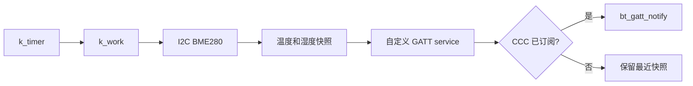
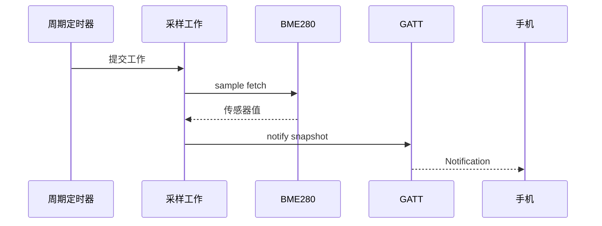

传感器上行不是在采样函数末尾直接调用 notify。可靠的结构要把采样节奏、数据格式、连接订阅状态和无线发送节奏分开：**采样在工作线程完成，GATT 只承载已准备好的快照，CCC 决定是否发送。**

## 一、数据链路



【图1：从定时采样到手机通知的边界】

采样率不能只按传感器决定，也要受连接间隔、手机处理能力和功耗预算约束。环境值通常以 1 秒到数十秒为周期；把每个 ADC 原始点都通知给手机只会消耗 RAM、空中时间和电池。

## 二、完整的应用骨架

以下代码假设 BME280 节点和自定义服务已经按前文配置。数据以摄氏度和相对湿度各乘以 100 的 int16 发送，手机无需猜测浮点格式。

```c
#include <zephyr/bluetooth/gatt.h>
#include <zephyr/device.h>
#include <zephyr/drivers/sensor.h>
#include <zephyr/kernel.h>

#define BME280_NODE DT_NODELABEL(bme280)
static const struct device *const bme280 = DEVICE_DT_GET(BME280_NODE);

struct env_payload {
    int16_t temperature_centi;
    int16_t humidity_centi;
} __packed;

static struct env_payload latest;

static void sample_handler(struct k_work *work)
{
    struct sensor_value temp;
    struct sensor_value humidity;

    ARG_UNUSED(work);
    if (sensor_sample_fetch(bme280) != 0) {
        return;
    }

    sensor_channel_get(bme280, SENSOR_CHAN_AMBIENT_TEMP, &temp);
    sensor_channel_get(bme280, SENSOR_CHAN_HUMIDITY, &humidity);

    latest.temperature_centi = temp.val1 * 100 + temp.val2 / 10000;
    latest.humidity_centi = humidity.val1 * 100 + humidity.val2 / 10000;

    bt_gatt_notify(NULL, &env_service.attrs[2], &latest, sizeof(latest));
}

K_WORK_DEFINE(sample_work, sample_handler);

static void timer_expiry(struct k_timer *timer)
{
    ARG_UNUSED(timer);
    k_work_submit(&sample_work);
}

K_TIMER_DEFINE(sample_timer, timer_expiry, NULL);

int main(void)
{
    if (!device_is_ready(bme280)) {
        return 0;
    }

    k_timer_start(&sample_timer, K_SECONDS(1), K_SECONDS(5));
    return 0;
}
```

```ini
CONFIG_BT=y
CONFIG_BT_PERIPHERAL=y
CONFIG_I2C=y
CONFIG_SENSOR=y
CONFIG_BME280=y
CONFIG_SYSTEM_WORKQUEUE_STACK_SIZE=1536
```

代码使用 NULL 连接参数，让 Zephyr 向所有已订阅连接通知。产品若只允许一个 Central，仍应明确 CONFIG_BT_MAX_CONN；若允许多个连接，需要评估每个连接的 CCC、缓冲和空中时间成本。



【图2：通知发送的是已经完成采样的数据快照】

## 三、验证与故障策略

nRF Connect 中应能读取当前值、启用通知并每 5 秒看到一帧更新。断开连接后，采样仍可继续更新 latest，但 notify 不应阻塞业务。传感器失败时记录错误计数，不要无限快速重试；I2C 短路或供电异常需要退避和外部诊断。

| 现象 | 原因 | 处理 |
| --- | --- | --- |
| 手机无通知 | CCC 未订阅或 attr 错误 | 先读值，再在手机启用通知 |
| 温湿度跳变 | 缩放或 val2 处理错误 | 固定单位和整数格式，写测试样本 |
| 采样拖慢 BLE | I2C 在高优先级路径运行 | 放到工作线程并限制频率 |
| 重连数据陈旧 | 没有新采样或未定义刷新策略 | 连接后读最新值或立即提交采样 |
| RAM 紧张 | 栈和蓝牙 buffer 增加 | 查看构建报告，缩短 payload 和队列 |

## 四、动手练习

1. 增加气压字段，并把 payload 格式写成手机端可解析的表。
2. 连接建立后立即提交一次采样，比较首次通知延迟。
3. 将采样周期改为 100 ms，观察手机刷新、日志和 RAM 的变化。
4. 模拟 I2C 断线，记录连续失败次数并限制重试频率。

## 五、里程碑自检

- [ ] 会把采样放进工作线程而不是定时器回调
- [ ] 能定义稳定、无浮点歧义的 BLE payload
- [ ] 会用 CCC 控制通知的消费端选择
- [ ] 能用 nRF Connect 验证读取与实时通知
- [ ] 会从频率、连接数和栈预算评估资源

## 小结

BLE 传感器节点的核心不是一次 notify 调用，而是节奏解耦：时间触发采样，线程形成快照，GATT 在订阅者需要时发送。这样即使手机断开或总线波动，采集与无线业务仍各自可控。

> 🏷️ 标签：Zephyr · BLE · GATT · BME280 · 传感器 · notify · 工作队列
