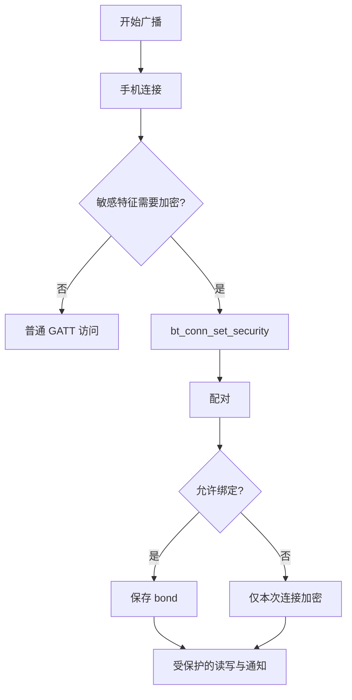
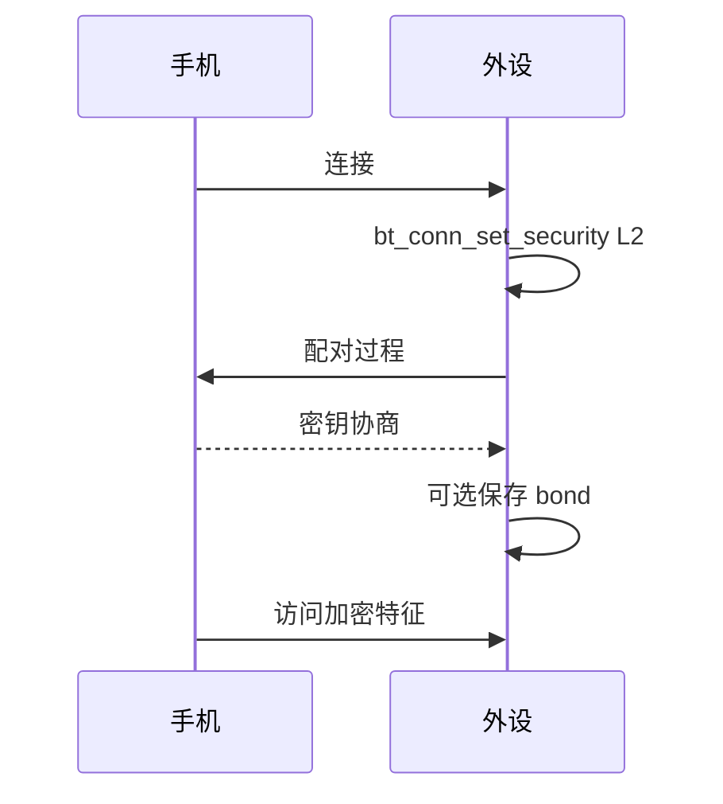

BLE 能连接不等于连接安全，也不等于省电。产品必须明确谁能连接、哪些属性要求加密、绑定信息是否保存、广播多久一次，以及连接间隔可允许多大。Zephyr 中，**配对建立密钥，绑定保存可复用关系，bt_conn_set_security 请求连接达到指定安全等级。**

官方安全流程见 [LE Host](https://docs.zephyrproject.org/latest/services/connectivity/bluetooth/bluetooth-le-host.html) 与 connection API。

## 一、安全和功耗的关系

| 需求 | 主要机制 | 代价 |
| --- | --- | --- |
| 仅展示公开传感器值 | 无加密 read/notify | 最低复杂度 |
| 手机控制配置 | 特征权限加密加 write | 配对交互与密钥存储 |
| 重连不再配对 | bonding 加 settings | Flash、隐私和擦除策略 |
| 更低平均功耗 | 更长广播与连接间隔 | 发现和响应变慢 |
| 更快交互 | 更短间隔 | 无线唤醒更频繁 |



【图1：连接、配对、绑定和受保护访问的关系】

## 二、连接回调中请求安全等级

```c
#include <zephyr/bluetooth/conn.h>
#include <zephyr/logging/log.h>

LOG_MODULE_REGISTER(ble_security, LOG_LEVEL_INF);

static void connected(struct bt_conn *conn, uint8_t err)
{
    int ret;

    if (err != 0) {
        LOG_WRN("connection failed: 0x%02x", err);
        return;
    }

    ret = bt_conn_set_security(conn, BT_SECURITY_L2);
    if (ret != 0) {
        LOG_ERR("security request failed: %d", ret);
    }
}

static void disconnected(struct bt_conn *conn, uint8_t reason)
{
    ARG_UNUSED(conn);
    LOG_INF("disconnected: 0x%02x", reason);
    /* 在这里恢复应用的广播策略 */
}

BT_CONN_CB_DEFINE(conn_callbacks) = {
    .connected = connected,
    .disconnected = disconnected,
};
```

BT_SECURITY_L2 请求加密连接。它不替代属性权限：真正需要保护的写配置、DFU 或私有数据仍要在 GATT 属性上声明合适的读写权限。设备无显示或键盘时，不能声称具有防中间人攻击能力；应根据 I/O 能力、OOB 通道和威胁模型选择方案。

常见配置起点：

```ini
CONFIG_BT=y
CONFIG_BT_PERIPHERAL=y
CONFIG_BT_SMP=y
CONFIG_BT_BONDABLE=y
CONFIG_BT_SETTINGS=y
CONFIG_SETTINGS=y
CONFIG_BT_MAX_CONN=1
```

绑定信息写入非易失存储前，要规划清除策略。开发阶段反复修改安全配置时，手机和板端的旧 bond 经常造成配对失败；应提供受控的“擦除所有 bond”维护入口，而不是在量产固件中每次启动清除。



【图2：应用主动请求连接加密】

## 三、功耗从空中时间开始

广播间隔越短，手机发现越快，平均电流越高；连接间隔越短，通知和命令延迟越低，唤醒越频繁。调整顺序应是：

1. 明确人机体验目标，例如手机在 3 秒内发现设备。
2. 在满足目标的前提下逐步拉长广播间隔。
3. 对实时通知定义最大可接受延迟，再调整连接参数。
4. 用电流表测量广播、连接空闲、通知和深睡眠四种状态。
5. 同时检查日志是否改变时序和平均电流。

nRF52832 DK 本身的板载调试器和 LED 会显著影响测量，产品功耗结论必须在目标硬件或切断无关负载后获得。

## 四、常见问题

| 现象 | 根因 | 处理 |
| --- | --- | --- |
| 手机反复要求配对 | 双方保存的 bond 不一致 | 在受控条件下清除两端绑定 |
| 请求安全失败 | I/O 能力或安全级别不匹配 | 降低要求或配置正确配对回调 |
| 加密后仍可写敏感值 | 特征权限仍为公开写 | 同时设置 GATT 权限 |
| 发现很慢 | 广播间隔过长或信号差 | 根据体验目标缩短间隔 |
| 平均电流偏高 | 短间隔、频繁 notify 或日志 | 分别测量并降低活动频率 |

## 五、动手练习

1. 为采样间隔特征增加加密写权限，并在手机端验证配对前后行为。
2. 清除手机与开发板 bond，重新配对，记录失败时的日志。
3. 分别测试快速和慢速广播，记录发现时间和平均电流。
4. 将连接间隔调大，测量通知到达延迟的变化。

## 六、里程碑自检

- [ ] 能区分配对、绑定、加密和 GATT 属性权限
- [ ] 会注册连接回调并调用 bt_conn_set_security
- [ ] 知道绑定信息需要 settings 与可控清除策略
- [ ] 会从广播、连接和通知频率分析功耗
- [ ] 不会把开发板测得的电流直接当作产品功耗

## 小结

安全和低功耗都不是一个 Kconfig 开关。安全由连接策略、配对能力、属性权限和密钥生命周期共同决定；功耗由广播、连接、数据频率和硬件负载共同决定。先定义产品目标，再让配置服务于目标。

> 🏷️ 标签：Zephyr · BLE · 配对 · bonding · 加密 · 连接参数 · 低功耗
