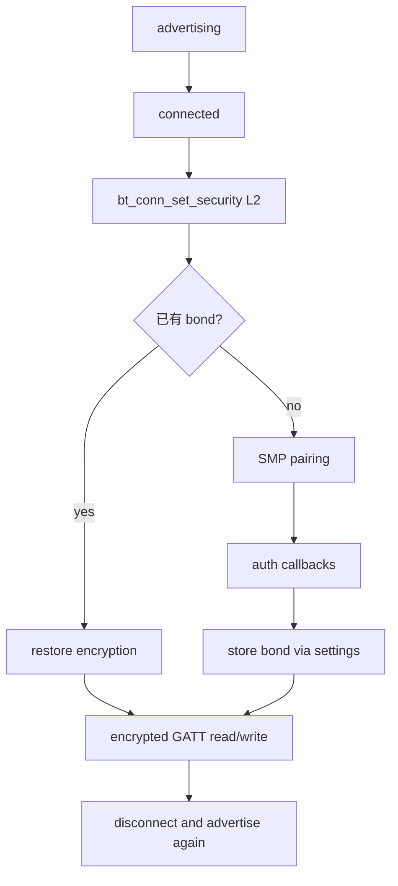
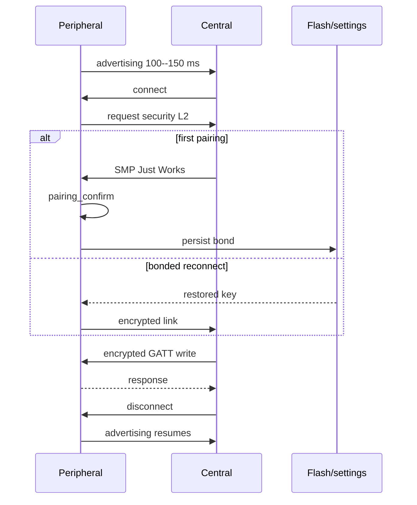

本章面向 Zephyr 4.4.x、`nrf52dk/nrf52832`。工程暴露一个“采样周期”特征：未加密连接不能读写；连接后应用请求 L2，完成配对并把 bond 写入 settings，重启后加载。启动时按住 SW0 可受控清除本机 bond。本文给出预期结果，不声称当前环境已编译、配对或测流。

## 一、四个词不能混用

- 配对（pairing）：本次协商密钥。
- 加密（encryption）：链路使用密钥保护数据。
- 绑定（bonding）：双方保存密钥，重连可恢复加密。
- 授权（authorization）：业务层决定“这个已认证身份能否做某操作”。

这四者的所有权不同：SMP/Host 负责密钥协商与链路加密；settings 后端负责本机 bond 的持久生命周期；GATT attribute 权限负责最低链路门槛；应用仍负责 peer 级授权。把 `BT_GATT_PERM_WRITE_ENCRYPT` 当作“管理员权限”会把链路安全和业务身份混为一谈。



【图1：连接、配对、绑定与属性权限形成闭环】

### 1.1 安全状态与回调契约

`bt_conn_set_security()` 返回 0 只表示请求已受理，最终等级必须从 `security_changed` 观察。首次 peer 会进入 SMP pairing；已有 bond 的 peer 可直接用保存的 LTK 恢复加密。auth callback 负责当下交互，auth-info callback 负责结果通知，它们引用的 callback 结构必须在整个 Bluetooth 生命周期有效，所以示例使用静态对象。

| 状态/对象 | 所有者 | 生命周期 | 典型失败 |
| --- | --- | --- | --- |
| `bt_conn` | Bluetooth Host 引用计数对象 | connection 建立到断开 | HCI 失败、监督超时 |
| pairing transaction | SMP | 当前连接内短期存在 | I/O 能力不匹配、用户取消 |
| bond key | Host + settings | 跨复位，直到 unpair | 两端密钥不一致、Flash 写失败 |
| attribute permission | 静态 GATT DB | 固件生命周期 | 安全级别不足返回 ATT error |
| 应用授权表 | 应用 | 产品策略定义 | 已加密 peer 仍无业务权限 |

## 二、L2 到 L4 与威胁模型

| 级别 | 链路要求 | 能力边界 | 常见代价 |
| --- | --- | --- | --- |
| L1 | 无认证、无加密 | 公开数据 | 最低 |
| L2 | 加密，允许 unauthenticated pairing | 防被动窃听；Just Works 不防 MITM | SMP 时间、Flash bond |
| L3 | authenticated pairing + 加密 | 需要可信 I/O 或 OOB 来防 MITM | 用户交互、失败路径更多 |
| L4 | LE Secure Connections authenticated，128-bit key | 最强 LE 等级 | 两端能力、I/O/OOB 与时延要求最高 |

nRF52832 支持 LE Secure Connections，但板子“有按钮”不自动等于产品有可信输入输出。若产品无显示、键盘或可信 OOB，只能诚实地选择 L2，不能把 `BT_SECURITY_L3` 当成开关强行宣称防 MITM。本例是 NoInputNoOutput + L2。

### 2.1 连接参数的能量模型

平均无线能量可粗略拆成 `E_avg ≈ E_event / T_interval + E_notify * f_notify + E_adv / T_adv`。这不是芯片电流公式，而是找主导项的模型：

- 广播间隔短，发现快但单位时间广告事件更多。
- 连接间隔短，空闲连接也更频繁唤醒。
- slave latency 允许外设跳过无数据事件，但增加最坏响应延迟。
- supervision timeout 是失联判据，不直接等于休眠时长。
- 加密计算有成本，但日志、LED、短 interval 和频繁 notify 往往更显著。

参数由双方协商，应用请求值不等于最终值；功耗计算必须使用 `le_param_updated` 回报的实际参数和手机端真实数据频率。

## 三、工程文件

```text
ble_secure/
|-- CMakeLists.txt
|-- prj.conf
`-- src/
    `-- main.c
```

```cmake
cmake_minimum_required(VERSION 3.20.0)
find_package(Zephyr REQUIRED HINTS $ENV{ZEPHYR_BASE})
project(ble_secure)
target_sources(app PRIVATE src/main.c)
```

```ini
CONFIG_BT=y
CONFIG_BT_PERIPHERAL=y
CONFIG_BT_SMP=y
CONFIG_BT_BONDABLE=y
CONFIG_BT_SETTINGS=y
CONFIG_BT_SMP_APP_PAIRING_ACCEPT=y
CONFIG_BT_DEVICE_NAME="Secure Env"
CONFIG_BT_MAX_CONN=1
CONFIG_BT_MAX_PAIRED=4

CONFIG_SETTINGS=y
CONFIG_FLASH=y
CONFIG_FLASH_MAP=y
CONFIG_NVS=y
CONFIG_SETTINGS_NVS=y

CONFIG_GPIO=y
CONFIG_LOG=y
CONFIG_LOG_DEFAULT_LEVEL=3
```

无需 overlay：SW0 来自板级 `sw0` alias；Bluetooth settings 后端使用板定义的 storage partition。构建后仍要检查最终 DTS，确认 storage 不与其他用途重叠。

## 四、完整 src/main.c

```c
#include <errno.h>
#include <stdint.h>
#include <string.h>

#include <zephyr/bluetooth/bluetooth.h>
#include <zephyr/bluetooth/conn.h>
#include <zephyr/bluetooth/gatt.h>
#include <zephyr/bluetooth/uuid.h>
#include <zephyr/device.h>
#include <zephyr/drivers/gpio.h>
#include <zephyr/kernel.h>
#include <zephyr/logging/log.h>
#include <zephyr/settings/settings.h>
#include <zephyr/sys/byteorder.h>
#include <zephyr/sys/util.h>

LOG_MODULE_REGISTER(ble_secure, LOG_LEVEL_INF);

#define ERASE_BUTTON DT_ALIAS(sw0)
#define BT_UUID_CFG_SERVICE_VAL     BT_UUID_128_ENCODE(0x8e100001, 0x2137, 0x45cb, 0xa245, 0x510f56dd2601)
#define BT_UUID_PERIOD_VAL     BT_UUID_128_ENCODE(0x8e100002, 0x2137, 0x45cb, 0xa245, 0x510f56dd2601)

static const struct gpio_dt_spec erase_button =
    GPIO_DT_SPEC_GET(ERASE_BUTTON, gpios);
static struct bt_uuid_128 cfg_service_uuid =
    BT_UUID_INIT_128(BT_UUID_CFG_SERVICE_VAL);
static struct bt_uuid_128 period_uuid =
    BT_UUID_INIT_128(BT_UUID_PERIOD_VAL);
static uint32_t sample_period_ms = 5000U;

static const struct bt_le_adv_param adv_param =
    BT_LE_ADV_PARAM_INIT(BT_LE_ADV_OPT_CONN,
                         0x00a0, 0x00f0, NULL);
static const struct bt_data ad[] = {
    BT_DATA_BYTES(BT_DATA_FLAGS,
        BT_LE_AD_GENERAL | BT_LE_AD_NO_BREDR),
    BT_DATA_BYTES(BT_DATA_UUID128_ALL, BT_UUID_CFG_SERVICE_VAL),
};
static const struct bt_data sd[] = {
    BT_DATA(BT_DATA_NAME_COMPLETE, CONFIG_BT_DEVICE_NAME,
            sizeof(CONFIG_BT_DEVICE_NAME) - 1),
};

/**
 * @brief 读取受加密保护的采样周期。
 *
 * @return 复制字节数或 ATT 错误；线上值为 uint32 little-endian。
 * @note Host 线程回调，不从 ISR 调用。
 */
static ssize_t read_period(struct bt_conn *conn,
                           const struct bt_gatt_attr *attr,
                           void *buf, uint16_t len, uint16_t offset)
{
    uint32_t wire = sys_cpu_to_le32(sample_period_ms);

    return bt_gatt_attr_read(conn, attr, buf, len, offset,
                             &wire, sizeof(wire));
}

/**
 * @brief 写入受加密保护的采样周期。
 *
 * @param conn 发起写入的连接。
 * @param attr value attribute，本例不使用 user_data。
 * @param buf 输入字节，必须恰为 4 字节 little-endian。
 * @param len 输入长度。
 * @param offset 仅允许 0，不支持 prepare/long write。
 * @param flags ATT 写标志；本例不区分 command/request。
 * @return 成功返回 len；失败返回 BT_GATT_ERR 编码。
 *
 * @note Host 线程回调；只做有界校验与原子宽度赋值。
 */
static ssize_t write_period(struct bt_conn *conn,
                            const struct bt_gatt_attr *attr,
                            const void *buf, uint16_t len,
                            uint16_t offset, uint8_t flags)
{
    uint32_t wire;
    uint32_t value;

    ARG_UNUSED(conn);
    ARG_UNUSED(attr);
    ARG_UNUSED(flags);

    /* 先验证 ATT 写形状，再解析客户端拥有的字节。 */
    if (offset != 0U || len != sizeof(wire)) {
        return BT_GATT_ERR(BT_ATT_ERR_INVALID_OFFSET);
    }

    memcpy(&wire, buf, sizeof(wire));
    value = sys_le32_to_cpu(wire);
    if (value < 1000U || value > 3600000U) {
        return BT_GATT_ERR(BT_ATT_ERR_VALUE_NOT_ALLOWED);
    }

    /* 通过链路权限和值域后，应用才接管这个配置值。 */
    sample_period_ms = value;
    LOG_INF("period updated: %u ms", value);
    return len;
}

BT_GATT_SERVICE_DEFINE(cfg_service,
    BT_GATT_PRIMARY_SERVICE(&cfg_service_uuid),
    BT_GATT_CHARACTERISTIC(&period_uuid.uuid,
        BT_GATT_CHRC_READ | BT_GATT_CHRC_WRITE,
        BT_GATT_PERM_READ_ENCRYPT | BT_GATT_PERM_WRITE_ENCRYPT,
        read_period, write_period, NULL)
);

/**
 * @brief 启动 100--150 ms 的可连接广播。
 *
 * @return 0 成功，负 errno 失败。
 * @note bt_enable() 成功后在线程上下文调用。
 */
static int start_advertising(void)
{
    return bt_le_adv_start(&adv_param, ad, ARRAY_SIZE(ad),
                           sd, ARRAY_SIZE(sd));
}

static void connected(struct bt_conn *conn, uint8_t err)
{
    int ret;

    if (err != 0U) {
        LOG_WRN("connection failed: HCI 0x%02x", err);
        return;
    }

    /* 连接成功不等于安全完成；这里只发起异步安全升级。 */
    LOG_INF("connected; requesting L2");
    ret = bt_conn_set_security(conn, BT_SECURITY_L2);
    if (ret != 0) {
        LOG_ERR("bt_conn_set_security failed: %d", ret);
    }
}

static void disconnected(struct bt_conn *conn, uint8_t reason)
{
    int err;

    ARG_UNUSED(conn);
    LOG_INF("disconnected: HCI 0x%02x", reason);
    err = start_advertising();
    if (err != 0) {
        LOG_ERR("advertising restart failed: %d", err);
    }
}

static void security_changed(struct bt_conn *conn,
                             bt_security_t level,
                             enum bt_security_err err)
{
    ARG_UNUSED(conn);
    if (err == BT_SECURITY_ERR_SUCCESS) {
        LOG_INF("security level %u", level);
    } else {
        LOG_ERR("security failed: level %u err %d", level, err);
    }
}

static void le_param_updated(struct bt_conn *conn,
                             uint16_t interval,
                             uint16_t latency,
                             uint16_t timeout)
{
    uint32_t interval_ms_x100 = (uint32_t)interval * 125U;

    ARG_UNUSED(conn);
    LOG_INF("conn params: %u.%02u ms latency %u timeout %u ms",
            interval_ms_x100 / 100U, interval_ms_x100 % 100U,
            latency, timeout * 10U);
}

BT_CONN_CB_DEFINE(conn_callbacks) = {
    .connected = connected,
    .disconnected = disconnected,
    .security_changed = security_changed,
    .le_param_updated = le_param_updated,
};

/**
 * @brief 接受进入 SMP 的配对请求。
 *
 * @param conn 待配对连接。
 * @note 仅因本产品策略允许任意物理邻近设备配对才自动接受；
 * 有配对窗口的产品应先检查按钮/状态，再接受或取消。
 */
static void pairing_confirm(struct bt_conn *conn)
{
    /* 产品版应先检查配对窗口/物理授权，再接受邻近 peer。 */
    int err = bt_conn_auth_pairing_confirm(conn);

    if (err != 0) {
        LOG_ERR("pairing confirm failed: %d", err);
    }
}

static void auth_cancel(struct bt_conn *conn)
{
    ARG_UNUSED(conn);
    LOG_WRN("pairing cancelled");
}

static struct bt_conn_auth_cb auth_callbacks = {
    .pairing_confirm = pairing_confirm,
    .cancel = auth_cancel,
};

static void pairing_complete(struct bt_conn *conn, bool bonded)
{
    ARG_UNUSED(conn);
    LOG_INF("pairing complete, bonded=%d", bonded);
}

static void pairing_failed(struct bt_conn *conn,
                           enum bt_security_err reason)
{
    ARG_UNUSED(conn);
    LOG_ERR("pairing failed: %d", reason);
}

static void bond_deleted(uint8_t id, const bt_addr_le_t *peer)
{
    char addr[BT_ADDR_LE_STR_LEN];

    bt_addr_le_to_str(peer, addr, sizeof(addr));
    LOG_INF("bond deleted: id=%u peer=%s", id, addr);
}

static struct bt_conn_auth_info_cb auth_info_callbacks = {
    .pairing_complete = pairing_complete,
    .pairing_failed = pairing_failed,
    .bond_deleted = bond_deleted,
};

/**
 * @brief 启动时按键有效则清除本地全部 bond。
 *
 * @return 0 表示未按或清除成功，负 errno 表示 GPIO/删除失败。
 * @note bt_enable() 与 settings_load() 之后在线程上下文调用。
 */
static int erase_bonds_if_requested(void)
{
    int pressed = gpio_pin_get_dt(&erase_button);

    if (pressed < 0) {
        return pressed;
    }
    if (pressed == 0) {
        return 0;
    }

    LOG_WRN("SW0 held: deleting all local bonds");
    return bt_unpair(BT_ID_DEFAULT, NULL);
}

int main(void)
{
    int err;

    if (!gpio_is_ready_dt(&erase_button)) {
        LOG_ERR("erase button is not ready");
        return -ENODEV;
    }
    err = gpio_pin_configure_dt(&erase_button, GPIO_INPUT);
    if (err != 0) {
        LOG_ERR("button configure failed: %d", err);
        return err;
    }

    /* 先准备持久后端和静态回调，再启动可能触发回调的 Host。 */
    err = settings_subsys_init();
    if (err != 0) {
        LOG_ERR("settings_subsys_init failed: %d", err);
        return err;
    }

    err = bt_conn_auth_cb_register(&auth_callbacks);
    if (err != 0) {
        LOG_ERR("auth callback register failed: %d", err);
        return err;
    }
    err = bt_conn_auth_info_cb_register(&auth_info_callbacks);
    if (err != 0) {
        LOG_ERR("auth info callback register failed: %d", err);
        return err;
    }

    err = bt_enable(NULL);
    if (err != 0) {
        LOG_ERR("bt_enable failed: %d", err);
        return err;
    }

    /* Host 已就绪后加载 bond，使其能把 key 恢复到 Bluetooth 子系统。 */
    err = settings_load();
    if (err != 0) {
        LOG_ERR("settings_load failed: %d", err);
        return err;
    }

    /* 清 bond 是显式物理维护动作，不是每次启动的默认流程。 */
    err = erase_bonds_if_requested();
    if (err != 0) {
        LOG_ERR("bt_unpair failed: %d", err);
        return err;
    }

    err = start_advertising();
    if (err != 0) {
        LOG_ERR("advertising start failed: %d", err);
        return err;
    }

    LOG_INF("ready: %s", CONFIG_BT_DEVICE_NAME);
    return 0;
}
```

注意：手机也保存 bond。板端删除后，手机旧密钥仍可能导致重连失败；测试时要在两端同时“Forget”。量产入口应要求物理动作或已认证管理命令，不应每次启动清空。

## 五、关键接口说明

| API/宏 | 参数与返回 | 语义与上下文 |
| --- | --- | --- |
| `bt_conn_auth_cb_register(cb)` | 注册一次认证交互回调；0 或负 errno | 在 `bt_enable` 前注册；重复注册会失败 |
| `bt_conn_auth_info_cb_register(cb)` | 注册配对结果回调；0 或负 errno | callback 对象必须长期有效 |
| `bt_conn_set_security(conn, level)` | 请求最低等级；0 表示请求已受理 | 最终结果看 `security_changed`，0 不等于已完成 |
| `bt_conn_auth_pairing_confirm(conn)` | 接受 app pairing 请求；0 或负 errno | 仅在对应 auth callback 中使用 |
| `settings_subsys_init()` | 初始化 settings；0 或负 errno | 线程上下文；失败不能继续假装有持久 bond |
| `settings_load()` | 从后端加载所有 handler；0 或负 errno | Bluetooth 启用后加载 BT keys |
| `bt_unpair(id, addr)` | `addr=NULL` 删除该 identity 全部 bond | 会改变持久状态，必须有受控入口 |
| `BT_GATT_PERM_READ_ENCRYPT` | 属性权限宏 | 未加密时 Host 返回 ATT 权限错误 |
| `BT_LE_ADV_PARAM_INIT(...)` | 广播参数宏，无运行时返回 | interval 单位 0.625 ms |
| `le_param_updated` | interval 单位 1.25 ms，timeout 单位 10 ms | 记录实际协商结果，不只看请求值 |

`write_period` 的 `offset/len/buf/flags` 都来自 Host；函数返回正长度代表成功，`BT_GATT_ERR(...)` 代表 ATT 错误。它只保护“链路已加密”，若业务要求管理员身份，还需在应用层做授权表。

### 5.1 代码阶段回看

| 阶段 | 机制 | 完成判据 |
| --- | --- | --- |
| 回调/后端注册 | 静态 auth、auth-info、settings | 所有注册返回 0 |
| Host 启动与恢复 | `bt_enable` 后 `settings_load` | bond key 可被 Host 使用 |
| 连接安全升级 | connect 后请求 L2 | `security_changed` 报告成功等级 |
| 受保护访问 | GATT encrypted permission + 值域 | 未加密被 Host 拒绝，合法写返回 len |
| 生命周期结束 | disconnect 清连接态并重广播 | 不泄漏 `bt_conn`，广告状态唯一 |

## 六、广播、连接参数与功耗

广播 100--150 ms 便于实验发现，但量产通常要两阶段：开机/按键后快速广播一段时间，随后转慢速或停止。连接事件平均间隔、slave latency、监督超时和 notify 频率共同决定唤醒次数。

请求连接参数的示例（可在安全完成后调用）：

```c
static const struct bt_le_conn_param slow_params =
    BT_LE_CONN_PARAM_INIT(80, 160, 4, 600);

int err = bt_conn_le_param_update(conn, &slow_params);
```

这里 interval 是 100--200 ms，latency=4 允许外设跳过部分事件，timeout=6 s。Central 可以拒绝或另行协商，所以必须以 `le_param_updated` 回调的实际值为准。长 interval/latency 降低空闲功耗但增加控制和通知延迟；加密本身的 AES 成本通常不是最大项，广播、连接事件、日志和应用唤醒更常主导。



【图2：首次配对与 bonded reconnect 的差异】

## 七、构建与验收

```powershell
west build -p always -b nrf52dk/nrf52832 ble_secure
west flash
```

预期流程：

1. 手机连接 “Secure Env”，板端请求 L2。
2. 首次连接完成 Just Works 配对，日志显示 `bonded=1` 和 security level 2。
3. 4 字节小端周期可在加密后读写，范围是 1000--3600000 ms。
4. 重启双方，连接恢复加密，不重复完整配对。
5. 按住 SW0 复位，板端删除 bond；手机也 Forget 后可重新配对。
6. 用功耗仪分别记录快速广播、连接空闲、周期写入和关闭日志四组条件。

## 八、排错、练习与里程碑

| 现象 | 原因 | 处理 |
| --- | --- | --- |
| 每次都重新配对 | settings 未加载或分区不可写 | 检查 Kconfig、storage 与 settings 日志 |
| 配对反复失败 | 两端 bond 不一致 | 通过受控入口清两端，不在每次启动清 |
| L3/L4 请求失败 | I/O/OOB 能力不足 | 修正威胁模型或实现可信交互 |
| 加密后仍拒绝写 | security 尚未完成或 payload 非 4 字节 | 看 `security_changed` 和 ATT 数据 |
| 电流仍高 | 短广播/连接间隔、日志、LED/J-Link | 分状态测量并逐一隔离 |
| 重广播报错 | 回调时广告状态未清或并发启动 | 只保留一个广告状态机/工作项 |

练习：

1. 增加 30 秒配对窗口，窗口外在 `pairing_confirm` 中取消。
2. 用显示器或可信 OOB 实现 L3，记录 MITM 能力来源。
3. 在 `security_changed` 后请求慢连接参数并测延迟。
4. 为“删除单一 peer bond”增加已认证 Shell 管理命令。

概念里程碑：

- [ ] 能区分 pairing、encryption、bonding、authorization 的所有者
- [ ] 能解释安全请求返回 0 与安全完成的差别
- [ ] 能根据 I/O/OOB 能力判断 L2、L3、L4 是否可实现
- [ ] 能说明 bond 双端生命周期和受控清除策略
- [ ] 能用事件频率模型解释 interval、latency、notify 的功耗代价
- [ ] 能区分 GATT 链路权限与应用 peer 授权

## 九、官方资料

- [Zephyr 4.4 Bluetooth connection management](https://docs.zephyrproject.org/4.4.0/connectivity/bluetooth/api/connection_mgmt.html)
- [Zephyr 4.4 Bluetooth security sample](https://docs.zephyrproject.org/4.4.0/samples/bluetooth/peripheral_sc_only/README.html)
- [Zephyr 4.4 Settings](https://docs.zephyrproject.org/4.4.0/services/storage/settings/index.html)
- [Bluetooth GAP sample](https://docs.zephyrproject.org/4.4.0/samples/bluetooth/gap_peripheral/README.html)

## 小结

安全不是单个 Kconfig，低功耗也不是单个 interval。完整闭环包含属性权限、主动安全请求、真实 I/O 能力、认证回调、bond 生命周期、settings 加载、断线重广播，以及可重复的功耗条件。L2 可以满足本例的加密目标，但不能冒充 L3/L4 的 MITM 防护。

> 🏷️ 标签：Zephyr · BLE · 配对 · bonding · 加密 · 连接参数 · 低功耗
