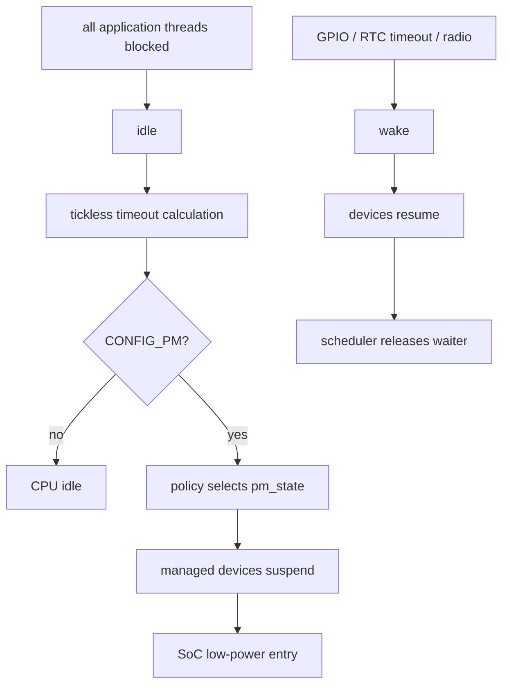
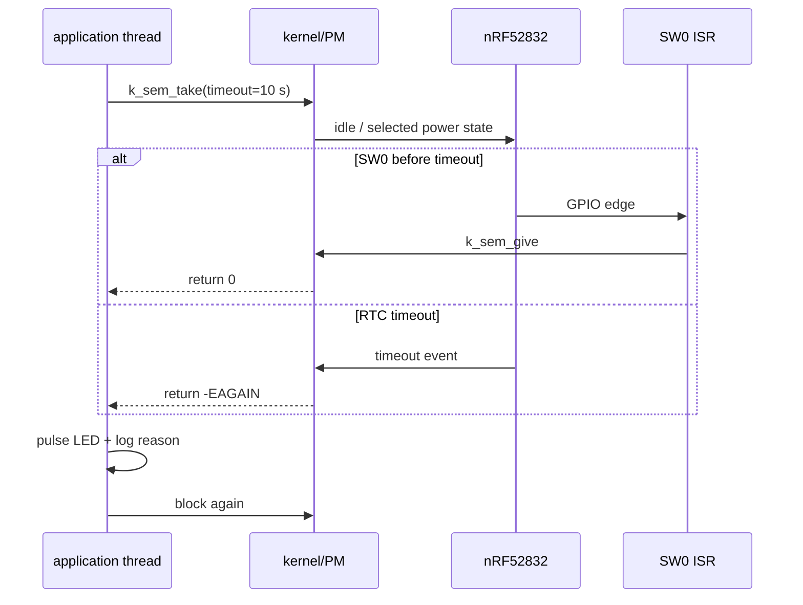

本章目标不是承诺一个微安数字，而是建立可重复实验：`nrf52dk/nrf52832` 上主线程阻塞等待 SW0 或 10 秒内核超时；GPIO ISR 只释放 semaphore；线程醒来后短暂点亮 LED0 并记录唤醒原因。Zephyr 4.4.x 的 PM 策略可利用空闲窗口，实际进入何种 SoC 状态必须从日志、最终配置、硬件手册和电流波形共同验证。

当前环境没有被声明具备 Zephyr 工具链、开发板或功耗仪，因此本文只给命令、预期行为和测量方法，不虚构实测值。

## 一、先分清五层状态机

| 层 | 定义 | 应用责任 |
| --- | --- | --- |
| 线程阻塞 | `k_sem_take`、`k_sleep` 让线程不可运行 | 不写 busy loop |
| tickless kernel | 下次超时前不必维持周期 tick | 给出足够长的空闲窗口 |
| system PM | 策略选择 CPU/SoC power state | 不假设某次 sleep 必进某状态 |
| device PM | 系统状态转换时 suspend/resume 设备 | 驱动声明并正确实现动作 |
| runtime PM | 单个设备按使用计数独立 suspend/resume | `get/put` 必须配对，处理异步恢复 |

FreeRTOS 的 tickless idle 主要对应前两层；Zephyr 还把 SoC 状态策略和设备状态单独建模。

CPU idle 只说明处理器此刻没有可运行线程；system PM 还要根据下次 deadline、exit latency 和 SoC 支持选择状态；device PM 决定外设如何跟随系统状态；runtime PM 则由单设备使用计数驱动。四者不是深度递增的同一枚举，也不能用一个 `k_sleep` 证明全部发生。



【图1：应用制造空闲窗口，内核与驱动完成状态转换】

### 1.1 所有权、唤醒契约与失败模型

| 状态/事件 | 决策者 | 生命周期 | 失败表现 |
| --- | --- | --- | --- |
| thread blocked | 应用/内核等待对象 | 条件满足或 timeout 前 | busy loop 使 idle 永不运行 |
| system power state | PM policy + SoC | 一次 idle 窗口 | latency 太大时选择更浅状态 |
| device state | 设备 PM driver | suspend 到 resume | busy device 拒绝 suspend |
| runtime usage count | 设备使用者 | get/put 配对区间 | 漏 put 导致常驻 active |
| wake source | SoC + board wiring | 进入状态前到唤醒 | 源在深状态不可用导致“睡死” |

“能产生中断”和“能从目标状态唤醒”不是同义词。GPIO edge 在 CPU active 时可中断，不代表它一定能从 System OFF 恢复；RTC timeout 能唤醒某个 system state，也不代表被 runtime-suspended 的外设已恢复可用。唤醒契约必须同时写出电源状态、源、触发电平、保持时间、复位语义和恢复顺序。

### 1.2 资源与时间预算

PM policy 比较预测 idle 时间与状态 exit latency。短周期 timer、日志 flush、LED work、BLE connection event 都会截短窗口；一个“每 10 秒醒一次”的主循环也可能被其他线程每 10 ms 唤醒。功耗排查先列出全部 deadline 和可运行线程，再讨论状态深度。

### 1.3 系统 PM、设备 PM 与 runtime PM

`CONFIG_PM=y` 允许系统 PM 策略在 idle 时选择受支持状态；它不保证 nRF52832 每次都进入 System OFF。状态是否可用由 SoC/board、下次 timeout、latency 要求和唤醒源共同决定。

`CONFIG_PM_DEVICE=y` 允许驱动参与系统 suspend/resume。驱动的 `pm_device_action_cb_t` 接收 device 和 `enum pm_device_action`，成功返回 0，拒绝/失败返回负 errno。应用一般不应绕过系统策略手动暂停控制台或 GPIO controller。

runtime PM 是另一条路径。使用某设备前 `pm_device_runtime_get(dev)` 增加使用计数并确保 active；结束后 `pm_device_runtime_put(dev)` 减计数，归零后驱动可 suspend。两者是线程 API，返回 0 或负 errno；漏掉 put 会永久阻止设备休眠，过早 put 会在传输未完成时关设备。只有实现 runtime PM 的驱动才适用。

#### 关于 System OFF

nRF52832 的 System OFF 接近复位式唤醒，能用哪些 GPIO/NFC/reset 源以及 RAM 是否保持，应以 Nordic 产品规范和 Zephyr SoC 实现为准。通用 `k_sem_take` 示例验证的是“阻塞与可唤醒”，不应把它直接描述成 System OFF 测试。若业务需要 System OFF，应单独建立显式关机、wake pin sense、复位原因和状态恢复实验。

## 二、完整工程

```text
pm_wakeup/
|-- CMakeLists.txt
|-- prj.conf
`-- src/
    `-- main.c
```

板级 `sw0` 和 `led0` alias 已存在，无需 overlay。

```cmake
cmake_minimum_required(VERSION 3.20.0)
find_package(Zephyr REQUIRED HINTS $ENV{ZEPHYR_BASE})
project(pm_wakeup)
target_sources(app PRIVATE src/main.c)
```

### 2.1 功能验证配置

```ini
CONFIG_GPIO=y
CONFIG_PM=y
CONFIG_PM_DEVICE=y
CONFIG_TICKLESS_KERNEL=y

CONFIG_LOG=y
CONFIG_LOG_DEFAULT_LEVEL=3
CONFIG_MAIN_STACK_SIZE=1024
```

这个配置便于先验证行为，但日志 backend 和串口会引入唤醒与额外电流。正式测流建立第二份 `prj_release.conf`：

```ini
CONFIG_GPIO=y
CONFIG_PM=y
CONFIG_PM_DEVICE=y
CONFIG_TICKLESS_KERNEL=y

CONFIG_LOG=n
CONFIG_PRINTK=n
CONFIG_ASSERT=n
```

不要为了低数字盲目关闭 watchdog、关键断言或安全检查；测量构建与产品发布构建应分别留档。

## 三、完整 src/main.c

```c
#include <errno.h>
#include <stdbool.h>
#include <stdint.h>

#include <zephyr/device.h>
#include <zephyr/drivers/gpio.h>
#include <zephyr/kernel.h>
#include <zephyr/logging/log.h>
#include <zephyr/sys/atomic.h>

LOG_MODULE_REGISTER(pm_wakeup, LOG_LEVEL_INF);

#define BUTTON_NODE DT_ALIAS(sw0)
#define LED_NODE DT_ALIAS(led0)
#define PERIODIC_WAKE K_SECONDS(10)
#define LED_PULSE K_MSEC(25)

static const struct gpio_dt_spec button =
    GPIO_DT_SPEC_GET(BUTTON_NODE, gpios);
static const struct gpio_dt_spec led =
    GPIO_DT_SPEC_GET(LED_NODE, gpios);
static struct gpio_callback button_cb;
K_SEM_DEFINE(wake_sem, 0, 1);
static atomic_t button_events;

/**
 * @brief 响应 SW0 GPIO 中断并唤醒等待线程。
 *
 * @param port 产生中断的 GPIO controller。
 * @param cb 已注册的静态 callback 对象。
 * @param pins 触发中断的 pin bit mask。
 *
 * @note ISR 上下文：只做原子计数与 k_sem_give()；不睡眠、不打印日志。
 */
static void button_isr(const struct device *port,
                       struct gpio_callback *cb,
                       gpio_port_pins_t pins)
{
    ARG_UNUSED(port);
    ARG_UNUSED(cb);
    ARG_UNUSED(pins);

    /* ISR 只保存最小证据并释放等待者，不执行恢复后的业务。 */
    atomic_inc(&button_events);
    k_sem_give(&wake_sem);
}

/**
 * @brief 初始化按键唤醒输入及其中断。
 *
 * @return 0 成功；负 errno 表示设备、pin 或 callback 配置失败。
 * @note main 线程调用；失败后不能继续假装 GPIO 可唤醒。
 */
static int configure_button(void)
{
    int err;

    if (!gpio_is_ready_dt(&button)) {
        return -ENODEV;
    }

    /* 先配置输入，再注册 callback，最后打开中断，避免半初始化回调。 */
    err = gpio_pin_configure_dt(&button, GPIO_INPUT);
    if (err != 0) {
        return err;
    }

    gpio_init_callback(&button_cb, button_isr, BIT(button.pin));
    err = gpio_add_callback(button.port, &button_cb);
    if (err != 0) {
        return err;
    }

    return gpio_pin_interrupt_configure_dt(
        &button, GPIO_INT_EDGE_TO_ACTIVE);
}

/**
 * @brief 初始化用于观察线程活动的 LED。
 *
 * @return 0 成功；负 errno 表示 LED controller 或 pin 配置失败。
 */
static int configure_led(void)
{
    if (!gpio_is_ready_dt(&led)) {
        return -ENODEV;
    }

    return gpio_pin_configure_dt(&led, GPIO_OUTPUT_INACTIVE);
}

/**
 * @brief 在线程醒来后产生一个有界 LED 脉冲。
 *
 * @return 0 成功；负 errno 表示 GPIO 写失败。
 * @note 线程上下文，会睡眠 25 ms；测流版本应删除整个脉冲。
 */
static int pulse_led(void)
{
    int err = gpio_pin_set_dt(&led, 1);

    if (err != 0) {
        return err;
    }

    k_sleep(LED_PULSE);
    return gpio_pin_set_dt(&led, 0);
}

int main(void)
{
    int err;
    uint32_t wake_count = 0U;

    err = configure_button();
    if (err != 0) {
        LOG_ERR("button setup failed: %d", err);
        return err;
    }

    err = configure_led();
    if (err != 0) {
        LOG_ERR("LED setup failed: %d", err);
        return err;
    }

    LOG_INF("wait for SW0 or 10-second timeout");

    while (true) {
        /* 阻塞创造 idle 窗口；它不承诺 PM policy 选择具体状态。 */
        int64_t before_ms = k_uptime_get();
        int take_result = k_sem_take(&wake_sem, PERIODIC_WAKE);
        int64_t slept_ms = k_uptime_get() - before_ms;
        const char *reason;

        if (take_result == 0) {
            reason = "button";
        } else if (take_result == -EAGAIN) {
            reason = "timeout";
        } else {
            LOG_ERR("k_sem_take failed: %d", take_result);
            continue;
        }

        /* 线程恢复后再判定原因、操作 LED 和输出日志。 */
        wake_count++;
        err = pulse_led();
        if (err != 0) {
            LOG_ERR("LED pulse failed: %d", err);
        }

        LOG_INF("wake=%u reason=%s blocked=%lld ms button_irqs=%ld",
                wake_count, reason, slept_ms,
                (long)atomic_get(&button_events));
    }

    return 0;
}
```

`K_SEM_DEFINE(name, initial, limit)` 是静态对象宏，无返回值；limit=1 会合并按键抖动期间多个未消费事件。`k_sem_take(&wake_sem, K_SECONDS(10))` 在线程中阻塞：0 表示拿到 semaphore，`-EAGAIN` 表示超时。`k_sem_give` 可从 ISR 调用。本例没有在 ISR 里使用日志或 `k_sleep`。

### 3.1 代码阶段回看

| 阶段 | 责任 | 证据 |
| --- | --- | --- |
| GPIO 准备 | 建立 wake signal 的输入与 callback | 所有 GPIO API 返回 0 |
| 阻塞 | 主线程让出 CPU，设置 10 秒 deadline | `k_sem_take` 处于等待 |
| ISR | 原子计数并 give semaphore | button IRQ 计数增加 |
| 恢复 | 线程区分 event/timeout | 返回值 0 或 `-EAGAIN` |
| 观察 | LED/log 仅辅助功能验收 | 测流构建必须移除 |

LED 只用于功能观察，会污染功耗结果。测流时删除 `pulse_led`、关闭日志，并用功耗仪的数字标记或外部 GPIO 探头建立时间关联。

## 四、构建、行为验收与 PM 观测

```powershell
west build -p always -b nrf52dk/nrf52832 pm_wakeup
west flash

# 测流构建（覆盖基础 prj.conf）
west build -p always -b nrf52dk/nrf52832 pm_wakeup -- -DEXTRA_CONF_FILE=prj_release.conf
```

功能构建预期：

```text
<inf> pm_wakeup: wait for SW0 or 10-second timeout
<inf> pm_wakeup: wake=1 reason=timeout blocked=10000 ms button_irqs=0
<inf> pm_wakeup: wake=2 reason=button blocked=2374 ms button_irqs=1
```

timeout 会受调度和日志影响，不要求恰好 10000 ms。按键应在 10 秒内提前释放线程。按键机械抖动可能让 `button_irqs` 增加，但 semaphore limit=1 不堆积无限事件。

需要观察 PM 状态转换时，可为专门诊断构建启用 PM debug/statistics 选项，并核对 4.4.x 的 Kconfig help；不要把这些调试选项留在最终测流镜像。最终 `build/zephyr/.config` 是实际生效配置，不以手写 prj.conf 猜测。



【图2：GPIO 与内核超时是两条独立唤醒路径】

## 五、测量方法

1. 固定供电电压、固件 commit、`zephyr/.config`、室温和仪器带宽。
2. 断开或旁路板载 J-Link OB、串口桥、LED 和外部传感器负载；按 DK 用户指南配置电流测量跳线。
3. 分别测“持续运行基线”“10 秒 timeout 空闲”“GPIO 提前唤醒”“加入 BLE 广播”。
4. 同时保存平均值、峰值、事件周期与采样窗口，不能只有一个平均电流。
5. 每次只改变一个变量：日志、LED、timeout、广播 interval 或连接参数。
6. 重复至少三次并记录离散性；目标板结论不能直接从 DK 推导。

本文没有提供“典型微安数”，因为 J-Link、供电路径、LFCLK、日志、温度和测量带宽都会改变结果；孤立数字不可复现。

## 六、排错

| 现象 | 检查 | 处理 |
| --- | --- | --- |
| 电流周期性尖峰 | timeout、日志、LED、BLE 定时事件 | 对齐波形时间并逐项关闭 |
| 按键不唤醒 | alias、active level、interrupt 和目标状态 | 查最终 DTS 与 GPIO sense 能力 |
| 立即连续唤醒 | 按键抖动或 level 仍 active | 做线程侧消抖/释放确认 |
| 配了 PM 但电流高 | 可运行线程、debugger、设备未 suspend | 看线程、PM 状态和外部负载 |
| 进入深状态后像重启 | 状态语义接近 reset | 保存状态并检查 reset reason |
| runtime get 失败 | 驱动不支持或状态转换错误 | 查驱动 PM 实现和返回 errno |

## 七、练习与里程碑

练习：

1. 用 `k_poll` 同时等待按键、传感器 data-ready 和周期 timeout。
2. 增加 50 ms 线程侧去抖，比较 IRQ 次数与业务事件次数。
3. 对支持 runtime PM 的外设成对加入 get/put，并注入失败。
4. 用逻辑分析仪标记 active 窗口，与功耗波形对齐。
5. 建立一张不同 timeout 下的平均电流/响应延迟表。

概念里程碑：

- [ ] 能区分 CPU idle、system PM、device PM、runtime PM 的决策者
- [ ] 能写出某电源状态的完整唤醒契约
- [ ] 能解释 deadline 与 exit latency 如何限制状态深度
- [ ] 能从全部线程/定时事件中找出无效唤醒
- [ ] 能设计单变量、可重复的功耗测量
- [ ] 能说明 DK 电流为何不能直接代表目标产品

## 八、官方资料

- [Zephyr 4.4 System Power Management](https://docs.zephyrproject.org/4.4.0/services/pm/system.html)
- [Zephyr 4.4 Device Power Management](https://docs.zephyrproject.org/4.4.0/services/pm/device.html)
- [Zephyr 4.4 Runtime Device Power Management](https://docs.zephyrproject.org/4.4.0/services/pm/device_runtime.html)
- [Zephyr Kernel Semaphores](https://docs.zephyrproject.org/4.4.0/kernel/services/synchronization/semaphores.html)
- [nRF52 DK board documentation](https://docs.zephyrproject.org/4.4.0/boards/nordic/nrf52dk/doc/index.html)

## 小结

低功耗从“没有无效可运行线程”开始，但不止于 `k_sleep`。完整工程把 GPIO ISR、semaphore、timeout 和线程活动做成可观察闭环；PM 分层说明了谁选择系统状态、谁暂停设备、谁管理单设备使用计数；测量流程则把开发板负载和软件变量纳入证据链。

> 🏷️ 标签：Zephyr · PM · 低功耗 · idle thread · 唤醒源 · nRF52832
