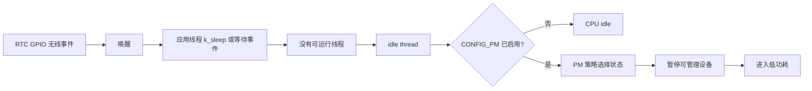
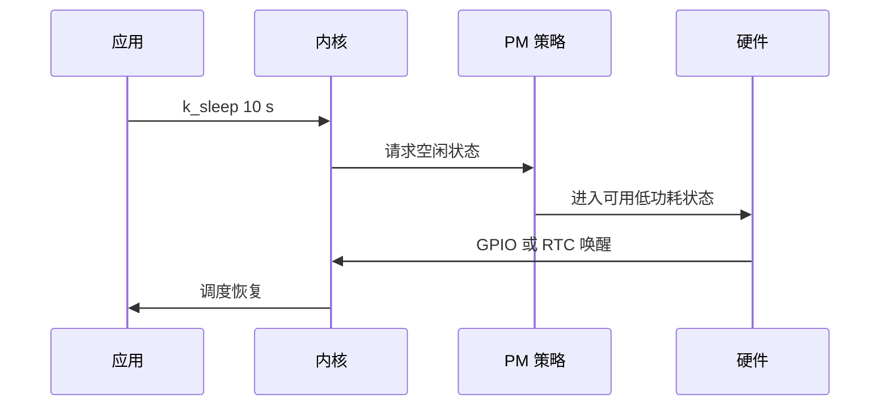

低功耗不是在 while 循环里加更长的 sleep。Zephyr 在没有可运行线程时由 idle thread 进入空闲；启用系统 PM 后，内核根据下次唤醒时间和板级策略选择可用电源状态。**应用负责减少无效唤醒并提供可靠唤醒源，PM 子系统负责状态转换。**

官方机制见 [System Power Management](https://docs.zephyrproject.org/latest/services/pm/system.html)。

## 一、从线程阻塞到系统休眠



【图1：应用阻塞后由内核触发低功耗决策】

FreeRTOS tickless idle 也在做类似事情：任务都阻塞时停止周期性 tick 并睡眠。区别在于 Zephyr 将系统状态、设备状态和策略明确拆分，应用不应直接假设某个 sleep 一定进入某个 SoC 模式。

## 二、低功耗应用骨架

```ini
CONFIG_PM=y
CONFIG_LOG=y
CONFIG_LOG_MODE_MINIMAL=y
CONFIG_SYSTEM_WORKQUEUE_STACK_SIZE=1024
```

```c
#include <zephyr/kernel.h>
#include <zephyr/drivers/gpio.h>

#define WAKE_BUTTON DT_ALIAS(sw0)
static const struct gpio_dt_spec wake_button =
    GPIO_DT_SPEC_GET(WAKE_BUTTON, gpios);

int main(void)
{
    if (!gpio_is_ready_dt(&wake_button)) {
        return 0;
    }

    gpio_pin_configure_dt(&wake_button, GPIO_INPUT);
    gpio_pin_interrupt_configure_dt(&wake_button, GPIO_INT_EDGE_TO_ACTIVE);

    while (true) {
        /* 采样、发送、保存状态必须在这里短时间完成。 */
        k_sleep(K_SECONDS(10));
    }
}
```

k_sleep 只表示线程不再可运行；是否进入深睡眠取决于板支持的状态、下次内核超时和可用唤醒源。GPIO、RTC、counter 或无线事件能否从某个状态唤醒，必须查 nRF52832 的硬件手册与板级实现。



【图2：PM 状态由空闲时长和唤醒源共同约束】

## 三、测量方法比数字更重要

测量前必须移除或隔离 LED、J-Link OB、串口转换器等非产品负载。至少记录四组数据：持续运行、广播、已连接空闲、周期采样加通知。每组固定广播间隔、连接参数、日志等级、采样周期和供电电压。

| 现象 | 优先检查 |
| --- | --- |
| sleep 后电流仍高 | 日志、LED、调试器、持续运行工作队列 |
| 无法唤醒 | 唤醒 GPIO、电源状态与中断配置 |
| 延迟变大 | 连接间隔、RTC 精度、设备恢复时间 |
| 状态切换异常 | 设备 runtime PM 与系统 PM 的依赖 |

## 四、动手练习

1. 关闭日志并移除 LED 翻转，比较 10 秒 sleep 的平均电流。
2. 用按键作为唤醒事件，验证每种目标状态是否真的能恢复。
3. 将 BLE 广播间隔拉长，记录发现时间与电流变化。
4. 列出所有周期性 wakeup，删除没有业务价值的定时器。

## 五、里程碑自检

- [ ] 知道 k_sleep 不保证特定低功耗状态
- [ ] 能说明 idle thread、PM 策略和唤醒源的分工
- [ ] 会从日志、LED、调试器和无线周期中排查功耗
- [ ] 会用可重复条件记录功耗而非给出孤立数字
- [ ] 知道深睡眠可用唤醒源必须由 SoC 验证

## 小结

低功耗的主线是减少唤醒、缩短活跃工作、让内核有足够空闲窗口，并验证硬件确实能从选定状态醒来。把它当作一次系统级测量，而不是单个 API 调用，结果才可复现。

> 🏷️ 标签：Zephyr · PM · 低功耗 · idle thread · 唤醒源 · nRF52832
