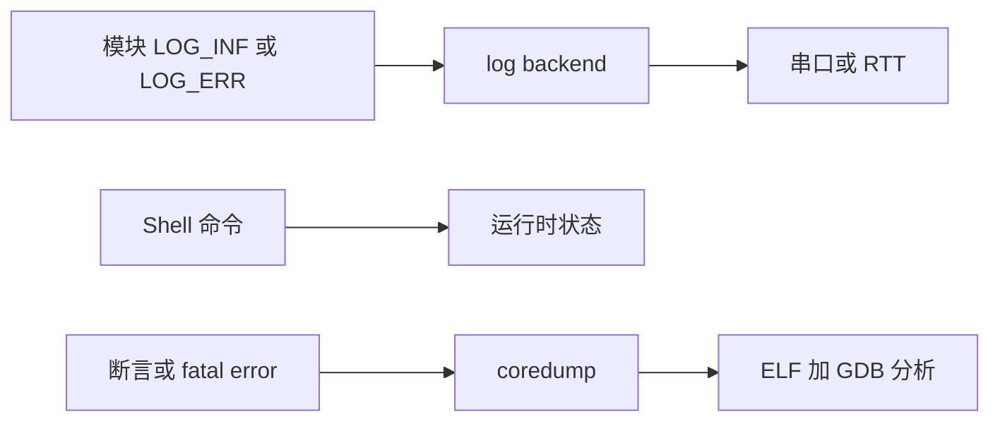
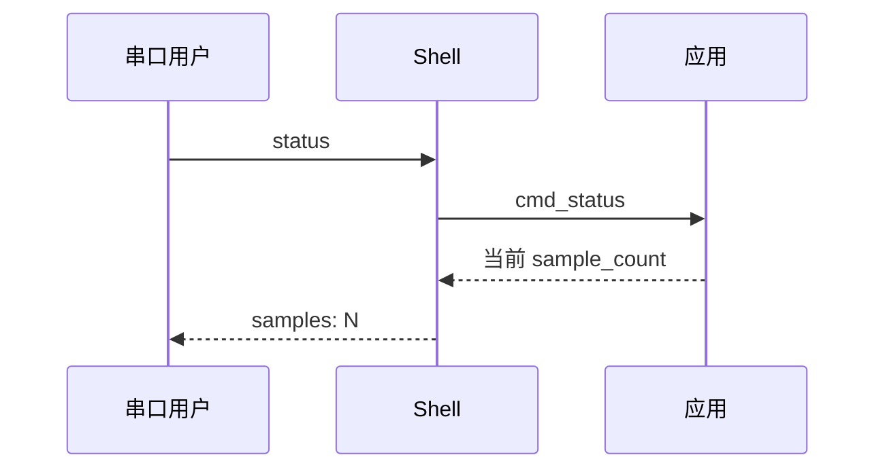

产品化调试的目标不是打印更多，而是让故障有路径可追：发生了什么、当前状态是什么、能否复现、无法复现时是否留下寄存器和栈信息。Zephyr 的 log、Shell、fatal error 和 coredump 正好覆盖这条链。

## 一、从日志到离线分析



【图1：运行日志、交互诊断和故障转储互补】

FreeRTOS 常见做法是 printf 加 assert；Zephyr 的 LOG_MODULE_REGISTER 让每个模块拥有级别和名称，Shell 让现场人员不改代码就能读状态，coredump 在系统停止后保留 CPU 寄存器与内存片段。

## 二、模块日志和 Shell 命令

```ini
CONFIG_LOG=y
CONFIG_LOG_DEFAULT_LEVEL=3
CONFIG_SHELL=y
CONFIG_SHELL_BACKEND_SERIAL=y
CONFIG_ASSERT=y
CONFIG_DEBUG_COREDUMP=y
CONFIG_DEBUG_COREDUMP_BACKEND_LOGGING=y
```

```c
#include <zephyr/kernel.h>
#include <zephyr/logging/log.h>
#include <zephyr/shell/shell.h>

LOG_MODULE_REGISTER(env_node, LOG_LEVEL_INF);

static int32_t sample_count;

static int cmd_status(const struct shell *shell, size_t argc, char **argv)
{
    ARG_UNUSED(argc);
    ARG_UNUSED(argv);
    shell_print(shell, "samples: %d", sample_count);
    return 0;
}

SHELL_CMD_REGISTER(status, NULL, "show node status", cmd_status);

int main(void)
{
    while (true) {
        sample_count++;
        LOG_INF("sample %d complete", sample_count);
        k_sleep(K_SECONDS(5));
    }
}
```

Shell 命令必须快速返回。需要耗时操作时，命令只设置请求或提交 work，再由线程执行。发布版本应关闭开发级日志、限制 Shell 权限，不能把调试命令变成未认证的产品控制接口。



【图2：Shell 在不重刷固件时读取运行状态】

## 三、断言、coredump 与 GDB

断言用于违反内部不变量，不是普通用户输入错误的处理方式。发生 fatal error 后，coredump 可将寄存器与选定内存输出到日志或 Flash。官方 [Core Dump](https://docs.zephyrproject.org/latest/services/debugging/coredump.html) 指出 logging backend 适合将转储捕获到文件，再结合 zephyr.elf 用脚本启动 GDB server 分析。

J-Link 在线调试的最小流程：

```powershell
west debug
# 在 GDB 中
bt
info registers
thread apply all bt
```

调试器能停在当前故障，coredump 能处理现场不可复现的问题。两者都依赖与固件严格匹配的 ELF；不要用另一版构建产物解析地址。

## 四、常见问题

| 现象 | 根因 | 处理 |
| --- | --- | --- |
| 日志打乱实时性 | 同步输出或频率过高 | 降级、限流、使用异步 backend |
| Shell 命令卡住系统 | 命令执行长操作 | 移交工作线程 |
| 断言无上下文 | 只看最后一行日志 | 保存版本、配置、转储与 map |
| GDB 地址不匹配 | ELF 与烧录镜像不同 | 固定构建产物和版本号 |
| coredump 太大 | 选择了过多内存区域 | 只保留定位所需数据 |

## 五、动手练习

1. 为传感器模块独立设置日志级别，比较开发与发布构建。
2. 添加 status 和 reset_stats Shell 命令，验证命令不会阻塞采样。
3. 触发一个受控 assert，保存日志与 zephyr.elf，再用 GDB 查看回溯。
4. 用 west debug 停在工作队列 handler，查看线程栈和局部变量。

## 六、里程碑自检

- [ ] 会用 LOG_MODULE_REGISTER 建立模块化日志
- [ ] 会注册快速、只读优先的 Shell 命令
- [ ] 知道 assert 与普通错误处理的边界
- [ ] 能说明 coredump 与在线 J-Link 调试各自适用的场景
- [ ] 会保留与固件匹配的 ELF、map 和配置文件

## 小结

日志回答时间线，Shell 回答当前状态，调试器回答正在发生什么，coredump 回答现场已经过去时发生了什么。四者组合后，嵌入式调试从依赖运气变成可重复的工程流程。

> 🏷️ 标签：Zephyr · logging · Shell · GDB · J-Link · coredump · 调试
