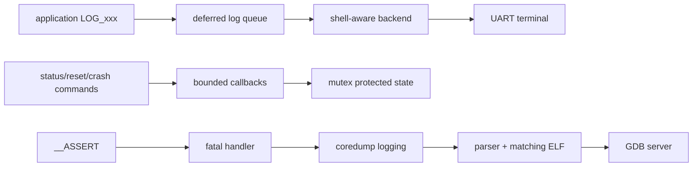
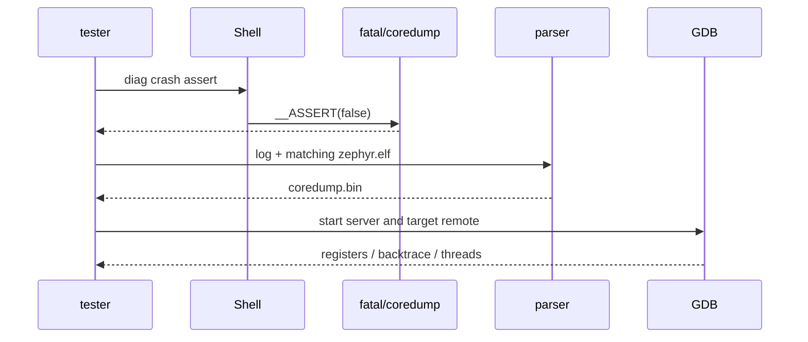

日志回答“按什么顺序发生”，Shell 回答“当前状态是什么”，在线 GDB 回答“现在停在哪里”，coredump 回答“现场已经消失后当时在哪里”。本章在 Zephyr 4.4.x、`nrf52dk/nrf52832` 上给出一个完整诊断应用：后台 work 更新统计，Shell 并发读取/清零，所有共享字段由 mutex 保护；`crash assert` 命令可在实验固件中触发可控断言。

本文不声称已在当前环境运行命令。所有输出是明确标注的预期结果，实际分析必须使用与烧录镜像完全匹配的 `zephyr.elf`。

## 一、先建立证据链



【图1：在线观测和离线故障转储共享同一版本证据链】

延迟日志先把消息放入队列，再由日志线程/backend 输出，减少业务路径阻塞，但格式参数的数据生命周期必须安全。不要写 `LOG_INF("%s", stack_buffer)` 后立刻让缓冲失效；可复制、使用静态存储或把值格式化为标量。

### 1.1 deferred logging 的内部阶段

调用 `LOG_INF` 时，producer 先做级别过滤并把消息描述放入有限日志缓冲；log processing thread 再格式化并交给 backend；UART/RTT 最后承担物理传输。于是“调用很快”不等于“日志已发出”，queue 满也可能丢记录。fatal 前必须考虑缓冲中尚未 flush 的尾部证据。

| 阶段/对象 | 所有者与生命周期 | 并发/资源风险 |
| --- | --- | --- |
| log 参数 | producer；至少活到消息捕获完成 | 延迟解引用栈指针会悬空 |
| log buffer | logging subsystem；有限容量 | 洪泛时丢消息或覆盖诊断重点 |
| Shell input | Shell backend/thread | 日志输出可能重绘提示符 |
| `stats` | 应用 | work 写、Shell 读/清零，需要 mutex |
| coredump bytes | fatal path/backend | 串口带宽有限，掉行后不可恢复 |
| `zephyr.elf` | 构建归档 | 与固件不匹配时回溯没有证据价值 |

### 1.2 Shell callback 不是主循环

Shell handler 在 Shell 线程执行。它可以短时获取 mutex、解析参数并提交 work，但不应等待传感器、升级或长时间 Flash 擦除。命令参数内存归 Shell 管理，只在 callback 期间有效；异步 job 必须复制所需参数。Shell 输出也不应在持有应用锁时进行，否则慢 backend 会把观察动作变成业务阻塞。

### 1.3 assert、fatal、coredump、GDB 的边界

assert 表达“程序内部不变量被破坏”，普通用户输入、I2C NACK 或连接断开都不是 assert 条件。assert 进入 fatal path 后，coredump 保存的是配置选中的寄存器/内存快照；GDB 用匹配 ELF 解释地址和类型。日志、coredump、ELF、`.config`、map、源码 revision 少一个，证据链都可能断裂。

## 二、工程树与配置

```text
diag_app/
|-- CMakeLists.txt
|-- prj.conf
`-- src/
    `-- main.c
```

```cmake
cmake_minimum_required(VERSION 3.20.0)
find_package(Zephyr REQUIRED HINTS $ENV{ZEPHYR_BASE})
project(diag_app)
target_sources(app PRIVATE src/main.c)
```

```ini
CONFIG_LOG=y
CONFIG_LOG_MODE_DEFERRED=y
CONFIG_LOG_DEFAULT_LEVEL=3
CONFIG_LOG_BUFFER_SIZE=4096
CONFIG_LOG_PROCESS_THREAD=y

CONFIG_SERIAL=y
CONFIG_CONSOLE=y
CONFIG_UART_CONSOLE=y
CONFIG_SHELL=y
CONFIG_SHELL_BACKEND_SERIAL=y
CONFIG_SHELL_LOG_BACKEND=y
CONFIG_SHELL_CMD_BUFF_SIZE=128
CONFIG_SHELL_STACK_SIZE=2048

CONFIG_ASSERT=y
CONFIG_ASSERT_VERBOSE=y
CONFIG_DEBUG_COREDUMP=y
CONFIG_DEBUG_COREDUMP_BACKEND_LOGGING=y
CONFIG_DEBUG_COREDUMP_MEMORY_DUMP_MIN=y

CONFIG_SYSTEM_WORKQUEUE_STACK_SIZE=1536
```

`CONFIG_DEBUG_COREDUMP_MEMORY_DUMP_MIN` 只保存最小内存区域，降低串口转储量；具体可分析内容取决于架构与配置。生产固件是否启用 Shell、assert 和 coredump 必须经过安全、Flash、隐私和可用性评审，不能照搬实验配置。

## 三、完整 src/main.c

```c
#include <errno.h>
#include <stdbool.h>
#include <stdint.h>
#include <string.h>

#include <zephyr/kernel.h>
#include <zephyr/logging/log.h>
#include <zephyr/shell/shell.h>
#include <zephyr/sys/__assert.h>
#include <zephyr/sys/util.h>

LOG_MODULE_REGISTER(diag_app, LOG_LEVEL_INF);

#define SAMPLE_INTERVAL K_SECONDS(2)

struct app_stats {
    uint32_t samples;
    uint32_t failures;
    int32_t last_value;
    int64_t last_update_ms;
};

static struct app_stats stats;
static struct k_mutex stats_lock;
static struct k_work_delayable sample_work;

/**
 * @brief 复制一份一致的统计快照。
 *
 * @param out 指向调用者提供的有效 app_stats。
 * @note 线程上下文，会获取 mutex；不得从 ISR 调用。
 */
static void stats_snapshot(struct app_stats *out)
{
    /* 锁内只复制；慢速 Shell 输出放到解锁后。 */
    k_mutex_lock(&stats_lock, K_FOREVER);
    *out = stats;
    k_mutex_unlock(&stats_lock);
}

/**
 * @brief 清零全部运行统计。
 *
 * @note 线程上下文；与后台 work 通过同一 mutex 串行化。
 */
static void stats_reset(void)
{
    k_mutex_lock(&stats_lock, K_FOREVER);
    memset(&stats, 0, sizeof(stats));
    k_mutex_unlock(&stats_lock);
}

/**
 * @brief 模拟一次周期采样并重新调度自身。
 *
 * @param work delayable work 的内嵌 k_work。
 *
 * @note 系统工作队列线程。示例值用于复现并发诊断，不代表传感器实测。
 */
static void sample_handler(struct k_work *work)
{
    uint32_t sequence;
    int ret;

    ARG_UNUSED(work);

    /* producer 在一个临界区内发布完整统计状态。 */
    k_mutex_lock(&stats_lock, K_FOREVER);
    stats.samples++;
    stats.last_value = (int32_t)(stats.samples * 7U);
    stats.last_update_ms = k_uptime_get();
    sequence = stats.samples;
    k_mutex_unlock(&stats_lock);

    /* 日志只携带标量，避免 deferred backend 引用失效缓冲。 */
    LOG_INF("sample %u complete", sequence);

    ret = k_work_reschedule(&sample_work, SAMPLE_INTERVAL);
    if (ret < 0) {
        LOG_ERR("k_work_reschedule failed: %d", ret);
    }
}

/**
 * @brief 打印一致的运行状态。
 *
 * @param shell 当前 Shell 会话。
 * @param argc 参数个数，命令要求恰为 1。
 * @param argv 参数数组，argv[0] 是命令名。
 * @return 0 成功，负 errno 表示用法错误。
 *
 * @note Shell 线程；只复制快照并输出，不持锁做串口 I/O。
 */
static int cmd_status(const struct shell *shell,
                      size_t argc, char **argv)
{
    struct app_stats snapshot;

    ARG_UNUSED(argv);
    if (argc != 1U) {
        shell_error(shell, "usage: diag status");
        return -EINVAL;
    }

    /* 先取一致快照，再在无锁状态输出到 Shell backend。 */
    stats_snapshot(&snapshot);
    shell_print(shell,
                "samples=%u failures=%u last=%d updated_ms=%lld",
                snapshot.samples, snapshot.failures,
                snapshot.last_value, snapshot.last_update_ms);
    return 0;
}

/**
 * @brief 清零统计计数。
 *
 * @return 0 成功，负 errno 表示参数不正确。
 * @note Shell 线程；命令执行有界，不等待外设。
 */
static int cmd_reset(const struct shell *shell,
                     size_t argc, char **argv)
{
    ARG_UNUSED(argv);
    if (argc != 1U) {
        shell_error(shell, "usage: diag reset");
        return -EINVAL;
    }

    stats_reset();
    shell_print(shell, "statistics reset");
    return 0;
}

/**
 * @brief 触发实验用断言以验证 coredump 链。
 *
 * @return 正常情况下不返回；参数错误返回 -EINVAL。
 * @warning 该命令会让系统进入 fatal error，禁止放入无保护的量产 Shell。
 */
static int cmd_crash_assert(const struct shell *shell,
                            size_t argc, char **argv)
{
    if (argc != 2U || strcmp(argv[1], "assert") != 0) {
        shell_error(shell, "usage: diag crash assert");
        return -EINVAL;
    }

    /* 这是实验故障注入，不是普通参数错误处理。 */
    shell_warn(shell, "triggering controlled assertion");
    __ASSERT(false, "controlled diagnostic assertion");
    return 0;
}

SHELL_STATIC_SUBCMD_SET_CREATE(diag_commands,
    SHELL_CMD(status, NULL, "show a consistent snapshot", cmd_status),
    SHELL_CMD(reset, NULL, "reset statistics", cmd_reset),
    SHELL_CMD(crash, NULL, "diag crash assert", cmd_crash_assert),
    SHELL_SUBCMD_SET_END
);
SHELL_CMD_REGISTER(diag, &diag_commands,
                   "diagnostic commands", NULL);

int main(void)
{
    int ret;

    /* 同步对象与 delayable work 都在首次调度前完成初始化。 */
    k_mutex_init(&stats_lock);
    k_work_init_delayable(&sample_work, sample_handler);

    ret = k_work_schedule(&sample_work, K_NO_WAIT);
    if (ret < 0) {
        LOG_ERR("initial k_work_schedule failed: %d", ret);
        return ret;
    }

    LOG_INF("diagnostic app ready; use 'diag status'");
    return 0;
}
```

`stats_snapshot` 在锁内只复制结构，`shell_print` 在解锁后执行，避免慢串口扩大临界区。`cmd_reset` 与 work 使用同一 mutex，所以不会产生部分清零。Shell callback 返回 0 表示成功，负 errno 让调用者和测试脚本识别失败；assert 用于内部不变量，普通输入错误只返回 `-EINVAL`。

### 3.1 代码阶段回看

| 阶段 | 线程/所有者 | 结果 |
| --- | --- | --- |
| 周期 producer | system workqueue | 锁内发布完整 stats，锁外写日志 |
| status consumer | Shell thread | 复制一致快照，锁外输出 |
| reset writer | Shell thread | 与 producer 用同一 mutex 串行 |
| crash injector | Shell thread → fatal path | 仅实验命令触发 assert/coredump |
| 重新调度 | work handler | 每次检查 `k_work_reschedule` 返回 |

## 四、宏/API 参数与上下文

| 接口/宏 | 参数与返回 | 上下文 |
| --- | --- | --- |
| `LOG_MODULE_REGISTER(name, level)` | 定义模块与编译期级别，无返回值 | 每个 C 文件只注册一次 |
| `LOG_INF(fmt, ...)` | 记录 info 消息，无可处理返回值 | 关注 deferred 参数生命周期；ISR 中要限量 |
| `SHELL_CMD_REGISTER(...)` | 注册顶层命令，无运行时返回 | handler 在 Shell 线程执行 |
| `SHELL_STATIC_SUBCMD_SET_CREATE` | 静态子命令集合宏 | `SHELL_SUBCMD_SET_END` 必须收尾 |
| `shell_print(shell, fmt, ...)` | 输出普通文本，无错误返回 | 不应持应用 mutex 做大量输出 |
| `k_work_schedule(dwork, delay)` | 1 新调度、0 未改变、负 errno 失败 | delayable work；ISR 能力按 API 文档约束 |
| `k_work_reschedule(dwork, delay)` | 重置 deadline；非负为状态，负值错误 | handler 中可调用 |
| `__ASSERT(test, fmt, ...)` | test false 进入 fatal path | 开发期不变量；不是用户错误处理 |
| `k_mutex_lock(mutex, timeout)` | 0 成功或负 errno | mutex 不能由 ISR 获取 |

日志 queue 满时可能丢日志；日志是观测通道，不应成为控制流。关键错误计数和最后状态应保存在结构或非易失故障记录中，并在 Shell 中查询。

## 五、正常交互的预期结果

```powershell
west build -p always -b nrf52dk/nrf52832 diag_app
west flash
```

串口输入：

```text
uart:~$ diag status
samples=4 failures=0 last=28 updated_ms=6007
uart:~$ diag reset
statistics reset
uart:~$ diag status
samples=0 failures=0 last=0 updated_ms=0
```

后台日志可能穿插在提示符之间；`CONFIG_SHELL_LOG_BACKEND` 让 Shell backend 尽量维护输入行。具体时间不是实测保证。

## 六、受控 coredump 与离线 GDB

1. 为这一固件单独保存 `build/zephyr/zephyr.elf`、`zephyr.map`、`.config`、`zephyr.dts`、完整串口日志和源码 revision。
2. 输入 `diag crash assert`，从 `#CD:BEGIN#` 到 `#CD:END#` 完整捕获为 `coredump.log`。
3. 在同一 Zephyr 4.4.x workspace 先查看脚本帮助，确认参数未因版本改变。
4. 解析二进制并启动 coredump GDB server。
5. 用与 Zephyr SDK 匹配的 Arm GDB 连接 server。

```powershell
python "$env:ZEPHYR_BASE/scripts/coredump/coredump_serial_log_parser.py" --help
python "$env:ZEPHYR_BASE/scripts/coredump/coredump_serial_log_parser.py" coredump.log coredump.bin

python "$env:ZEPHYR_BASE/scripts/coredump/coredump_gdbserver.py" --help
python "$env:ZEPHYR_BASE/scripts/coredump/coredump_gdbserver.py" build/zephyr/zephyr.elf coredump.bin

arm-zephyr-eabi-gdb build/zephyr/zephyr.elf
```

GDB 中连接 server（默认端口以脚本启动输出为准）：

```gdb
target remote localhost:1234
info registers
bt
thread apply all bt
list
```

coredump 只包含配置选中的寄存器和内存，不能像在线目标一样任意读取全部地址。若 parser/server 的 4.4.x `--help` 与示例不同，以该版本脚本为准并把实际命令写入故障报告。



【图2：可控断言到离线回溯的证据流程】

## 七、在线 J-Link/GDB

对仍在实验室可复现的故障：

```powershell
west debug
# 或先启动调试 server，再由另一个终端连接
west debugserver
```

常用 GDB 命令：

```gdb
break sample_handler
continue
info threads
thread apply all bt
info registers
p stats
x/16wx &stats
```

`west debug` 可能复位或停住目标，改变竞态和时序；“加断点后消失”也是线索。在线调试与 coredump 都必须匹配同一 ELF，地址只看 hex 而没有 build ID/commit 不足以复盘。

## 八、故障排查

| 现象 | 原因 | 处理 |
| --- | --- | --- |
| Shell 输入被日志打碎 | backend 未整合或日志洪泛 | 启用 Shell log backend、降级/限流 |
| status 偶发不一致 | 共享状态未同步 | 快照和更新使用同一 mutex |
| work 停止 | 忘记 reschedule 或返回负值 | 检查调度返回与日志 |
| 没有 coredump 标记 | Kconfig 未生效或 fatal 策略重启 | 查 `.config` 和启动日志 |
| parser 报格式错 | 串口日志缺行/被终端改写 | 原样捕获 BEGIN 到 END |
| GDB 栈完全错误 | ELF 与设备固件不匹配 | 用发布归档中的 ELF/map |
| 打开日志后问题消失 | 时序敏感竞态 | 用计数、trace/coredump，减少扰动 |
| Shell 成为安全入口 | 量产仍开放 crash/reset | 关闭、鉴权或物理限制管理接口 |

## 九、练习与里程碑

练习：

1. 添加 `diag loglevel`，但只允许预定义模块/级别。
2. 增加耗时自检 work，Shell 只提交并返回 job id。
3. 人为去掉 mutex，用压力命令复现不一致，再恢复保护。
4. 归档一次受控 coredump，写出 PC、线程和断言位置。
5. 比较 deferred 与 immediate logging 对周期 work 的抖动。

概念里程碑：

- [ ] 能画出 producer、log buffer、processing thread、backend
- [ ] 能解释 deferred 日志参数的生命周期风险
- [ ] 能说明 Shell thread 为什么不能承载长操作
- [ ] 能区分普通错误、assert 与 fatal path
- [ ] 能列出离线回溯所需的完整证据集合
- [ ] 能根据现场可复现性选择在线 GDB 或 coredump

## 十、官方资料

- [Zephyr 4.4 Logging](https://docs.zephyrproject.org/4.4.0/services/logging/index.html)
- [Zephyr 4.4 Shell](https://docs.zephyrproject.org/4.4.0/services/shell/index.html)
- [Zephyr 4.4 Core Dump](https://docs.zephyrproject.org/4.4.0/services/debugging/coredump.html)
- [Zephyr Debugging](https://docs.zephyrproject.org/4.4.0/develop/debug/index.html)
- [Zephyr Assertions](https://docs.zephyrproject.org/4.4.0/kernel/services/other/fatal.html)

## 小结

完整诊断链不靠“多打 printf”：共享状态先线程安全，Shell 命令有边界，日志保留时间线，assert 只守内部不变量，coredump 与 GDB 使用严格匹配的 ELF。这样现场问题才能从一段串口文本变成可审计的故障证据。

> 🏷️ 标签：Zephyr · logging · Shell · GDB · J-Link · coredump · 调试
