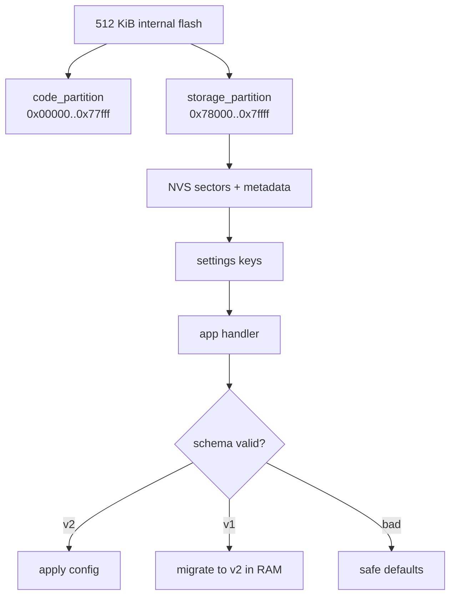
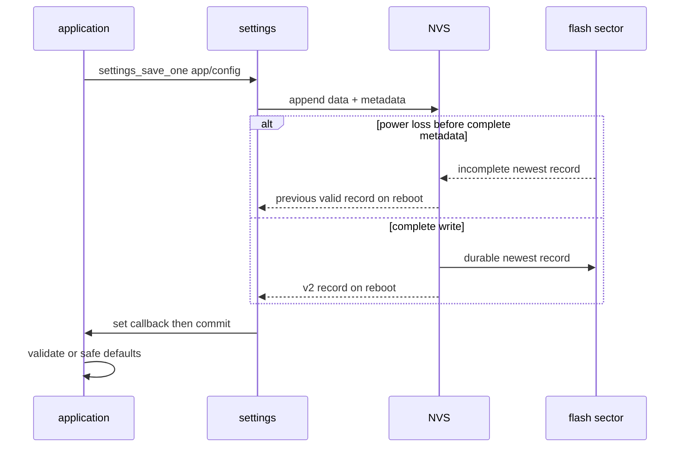

本章在 Zephyr 4.4.x、`nrf52dk/nrf52832` 上实现一个可复现的持久配置工程。Flash 前 480 KiB 是单镜像 code partition，最后 32 KiB 是独立 `storage`；settings 以 NVS 为后端。应用提供完整静态 handler，能加载旧 v1、迁移到 v2、校验范围、显式保存并通过 Shell 验证重启行为。

这是单镜像实验布局，不可直接复制到第 20 篇的 MCUboot 双槽工程。本文不声称当前环境已构建、写 Flash 或执行断电测试。

## 一、先从 Flash 物理约束推导软件分层

- fixed-partitions：空间所有权，回答“谁能写哪段地址”。
- NVS：Flash 追加式键值记录后端，回答“如何写、轮换和从中断写恢复”。
- settings：树形名字与 handler，回答“业务如何加载、校验、迁移和导出”。



【图1：分区、后端和业务 schema 是不同层】

nRF52 内部 Flash 擦除按 page，写入只能把位从 1 改为 0，恢复 1 必须擦除整页。NVS 通过追加记录、元数据和 sector 轮换管理这些限制；它不是无限日志，也不替代业务数据版本设计。

### 1.1 擦除、写入、原子性与磨损

Flash 写入的最小粒度和擦除 page 不同；一次业务“保存”可能产生 data、metadata 和垃圾回收写。掉电不能保证新值一定出现，合理原子语义是重启后得到“旧完整值或新完整值”，而不是半个结构。NVS 用追加记录和 metadata 提交识别最新完整记录；sector 满后轮换和擦除，因此写频率最终转化为有限擦除寿命。

### 1.2 settings key 路由与 handler 生命周期

key `app/config` 先按根 `app` 路由到静态 handler，`h_set` 可被调用多次以收集值，最后 `h_commit` 才把候选状态发布给应用。handler 读取的是后端交付的字节，必须检查 key 剩余路径、长度、短读、magic、version 和值域。`settings_load_subtree() == 0` 只表示遍历完成，不保证 key 存在。

| 阶段/对象 | 所有者 | 生命周期 | 失败策略 |
| --- | --- | --- | --- |
| fixed partition | devicetree/linker | 固件布局生命周期 | 重叠时停止构建/烧录 |
| NVS record | settings NVS backend | 写入到被更新/回收 | 忽略不完整最新记录 |
| loaded candidate | handler | 一次 load 的 set→commit | 无效则不发布 |
| active config | 应用 + mutex | commit 到下一次更新 | 始终保持完整默认/有效值 |
| wire schema | 产品协议 | 跨固件版本 | 显式迁移，不按 C struct 猜 |

### 1.3 schema 先于代码

Flash 中不直接保存编译器原生 struct；字段显式小端并有 magic/version/length：

```text
v1 (12 bytes): magic:u32, version:u16=1, length:u16=12, period_ms:u32
v2 (16 bytes): magic:u32, version:u16=2, length:u16=16,
               period_ms:u32, flags:u32
```

v1 加载后在 RAM 中补 `flags=0` 并标记 `migration_pending`；只有用户执行 `cfg save` 才写成 v2。这样启动加载不立即消耗擦写寿命，也让迁移失败可观察。

## 二、工程树

```text
settings_demo/
|-- CMakeLists.txt
|-- prj.conf
|-- boards/
|   `-- nrf52dk_nrf52832.overlay
`-- src/
    `-- main.c
```

```cmake
cmake_minimum_required(VERSION 3.20.0)
find_package(Zephyr REQUIRED HINTS $ENV{ZEPHYR_BASE})
project(settings_demo)
target_sources(app PRIVATE src/main.c)
```

```ini
CONFIG_FLASH=y
CONFIG_FLASH_MAP=y
CONFIG_NVS=y
CONFIG_SETTINGS=y
CONFIG_SETTINGS_NVS=y

CONFIG_SERIAL=y
CONFIG_CONSOLE=y
CONFIG_SHELL=y
CONFIG_SHELL_BACKEND_SERIAL=y
CONFIG_LOG=y
CONFIG_LOG_DEFAULT_LEVEL=3
```

## 三、固定分区 overlay

```dts
/* boards/nrf52dk_nrf52832.overlay */

/ {
    chosen {
        zephyr,code-partition = &code_partition;
    };
};

&flash0 {
    /delete-node/ partitions;

    partitions {
        compatible = "fixed-partitions";
        #address-cells = <1>;
        #size-cells = <1>;

        code_partition: partition@0 {
            label = "image-0";
            reg = <0x00000000 0x00078000>;
        };

        storage_partition: partition@78000 {
            label = "storage";
            reg = <0x00078000 0x00008000>;
        };
    };
};
```

`/delete-node/ partitions` 是刻意的：它先移除板文件已有的 partition 子节点，避免叠加后产生重叠。`zephyr,code-partition` 约束应用链接区间。`0x78000 + 0x8000 = 0x80000`，刚好覆盖 512 KiB 上界；两段不重叠。

构建后必须以 `build/zephyr/zephyr.dts` 和 linker map 为证据。若应用超过 480 KiB，链接应失败，而不是侵入 storage。启用 MCUboot、coredump Flash backend 或其他存储后必须重新规划，不得沿用这张图。

## 四、完整 src/main.c

```c
#include <errno.h>
#include <stdbool.h>
#include <stdint.h>
#include <stdlib.h>
#include <string.h>

#include <zephyr/kernel.h>
#include <zephyr/logging/log.h>
#include <zephyr/settings/settings.h>
#include <zephyr/shell/shell.h>
#include <zephyr/sys/byteorder.h>
#include <zephyr/sys/util.h>

LOG_MODULE_REGISTER(settings_demo, LOG_LEVEL_INF);

#define CFG_MAGIC 0x43464731U
#define CFG_VERSION_V1 1U
#define CFG_VERSION_V2 2U
#define CFG_MIN_PERIOD_MS 1000U
#define CFG_MAX_PERIOD_MS 86400000U
#define CFG_ALLOWED_FLAGS BIT(0)

struct cfg_v1_wire {
    uint32_t magic_le;
    uint16_t version_le;
    uint16_t length_le;
    uint32_t period_ms_le;
} __packed;

struct cfg_v2_wire {
    uint32_t magic_le;
    uint16_t version_le;
    uint16_t length_le;
    uint32_t period_ms_le;
    uint32_t flags_le;
} __packed;

BUILD_ASSERT(sizeof(struct cfg_v1_wire) == 12, "v1 size changed");
BUILD_ASSERT(sizeof(struct cfg_v2_wire) == 16, "v2 size changed");

struct app_config {
    uint32_t period_ms;
    uint32_t flags;
};

static struct app_config config;
static struct app_config loaded_candidate;
static struct k_mutex config_lock;
static bool candidate_valid;
static bool migration_pending;

/**
 * @brief 将运行配置恢复为安全默认值。
 *
 * @note main/settings commit/Shell 线程可调用；调用者负责 config_lock。
 */
static void config_set_defaults(void)
{
    config.period_ms = 5000U;
    config.flags = 0U;
}

/**
 * @brief 校验业务配置范围和 flags 掩码。
 *
 * @param candidate 指向待验证配置。
 * @return true 表示可安全应用，false 表示拒绝。
 * @note 纯函数，不访问 Flash、不睡眠，可在线程或 ISR 使用。
 */
static bool config_is_valid(const struct app_config *candidate)
{
    return candidate->period_ms >= CFG_MIN_PERIOD_MS &&
           candidate->period_ms <= CFG_MAX_PERIOD_MS &&
           (candidate->flags & ~CFG_ALLOWED_FLAGS) == 0U;
}

/**
 * @brief 解码 settings 后端交付的 app/config value。
 *
 * @param name 相对 handler 根 "app" 的 key 名。
 * @param len value 字节数。
 * @param read_cb settings 提供的读取函数。
 * @param cb_arg 传回 read_cb 的不透明上下文。
 * @return 0 表示已接受；负 errno 表示未知 key、读取或格式错误。
 *
 * @note settings_load() 的线程上下文。只写 loaded_candidate，
 * 真正应用发生在 commit callback，避免半加载状态。
 */
static int config_settings_set(const char *name, size_t len,
                               settings_read_cb read_cb,
                               void *cb_arg)
{
    uint8_t raw[sizeof(struct cfg_v2_wire)];
    const char *next;
    ssize_t read_len;
    uint32_t magic;
    uint16_t version;
    uint16_t declared_len;

    /* 阶段 1：只接管精确的 app/config，未知 key 留给其他 handler。 */
    if (!settings_name_steq(name, "config", &next) ||
        (next != NULL && next[0] != '\0')) {
        return -ENOENT;
    }
    if (len != sizeof(struct cfg_v1_wire) &&
        len != sizeof(struct cfg_v2_wire)) {
        return -EINVAL;
    }

    /* 阶段 2：后端拥有原始记录；应用复制并检查短读。 */
    read_len = read_cb(cb_arg, raw, len);
    if (read_len < 0) {
        return (int)read_len;
    }
    if ((size_t)read_len != len) {
        return -EIO;
    }

    memcpy(&magic, &raw[0], sizeof(magic));
    memcpy(&version, &raw[4], sizeof(version));
    memcpy(&declared_len, &raw[6], sizeof(declared_len));
    magic = sys_le32_to_cpu(magic);
    version = sys_le16_to_cpu(version);
    declared_len = sys_le16_to_cpu(declared_len);

    if (magic != CFG_MAGIC || declared_len != len) {
        return -EINVAL;
    }

    /* 阶段 3：按版本解码为候选对象，尚不发布给运行线程。 */
    if (version == CFG_VERSION_V1 &&
        len == sizeof(struct cfg_v1_wire)) {
        struct cfg_v1_wire wire;

        memcpy(&wire, raw, sizeof(wire));
        loaded_candidate.period_ms =
            sys_le32_to_cpu(wire.period_ms_le);
        loaded_candidate.flags = 0U;
        migration_pending = true;
    } else if (version == CFG_VERSION_V2 &&
               len == sizeof(struct cfg_v2_wire)) {
        struct cfg_v2_wire wire;

        memcpy(&wire, raw, sizeof(wire));
        loaded_candidate.period_ms =
            sys_le32_to_cpu(wire.period_ms_le);
        loaded_candidate.flags =
            sys_le32_to_cpu(wire.flags_le);
        migration_pending = false;
    } else {
        return -ENOTSUP;
    }

    candidate_valid = config_is_valid(&loaded_candidate);
    return candidate_valid ? 0 : -ERANGE;
}

/**
 * @brief 在 settings 加载阶段结束时原子应用候选配置。
 *
 * @return 0；无有效记录时保留默认值。
 * @note settings_load() 的线程上下文。
 */
static int config_settings_commit(void)
{
    if (!candidate_valid) {
        LOG_WRN("no valid stored config; using defaults");
        return 0;
    }

    /* commit 是发布点：一次 load 的候选在这里原子替换 active config。 */
    k_mutex_lock(&config_lock, K_FOREVER);
    config = loaded_candidate;
    k_mutex_unlock(&config_lock);

    LOG_INF("loaded config%s",
            migration_pending ? " (v1 migrated in RAM)" : "");
    return 0;
}

SETTINGS_STATIC_HANDLER_DEFINE(app_config, "app",
    NULL, config_settings_set, config_settings_commit, NULL);

/**
 * @brief 将当前配置编码为 v2 并持久保存。
 *
 * @return 0 成功；负 errno 来自 settings/NVS/Flash。
 * @note 线程上下文，可能擦写 Flash；不能从 ISR 或实时 callback 调用。
 */
static int config_save(void)
{
    struct app_config snapshot;
    struct cfg_v2_wire wire;
    int err;

    k_mutex_lock(&config_lock, K_FOREVER);
    snapshot = config;
    k_mutex_unlock(&config_lock);

    /* 先在 RAM 形成完整 v2 wire value，再交给 settings/NVS 持久化。 */
    wire.magic_le = sys_cpu_to_le32(CFG_MAGIC);
    wire.version_le = sys_cpu_to_le16(CFG_VERSION_V2);
    wire.length_le = sys_cpu_to_le16(sizeof(wire));
    wire.period_ms_le = sys_cpu_to_le32(snapshot.period_ms);
    wire.flags_le = sys_cpu_to_le32(snapshot.flags);

    err = settings_save_one("app/config", &wire, sizeof(wire));
    if (err == 0) {
        migration_pending = false;
    }
    return err;
}

static int cmd_show(const struct shell *shell,
                    size_t argc, char **argv)
{
    struct app_config snapshot;

    ARG_UNUSED(argv);
    if (argc != 1U) {
        return -EINVAL;
    }

    k_mutex_lock(&config_lock, K_FOREVER);
    snapshot = config;
    k_mutex_unlock(&config_lock);

    shell_print(shell, "period_ms=%u flags=0x%x migration=%d",
                snapshot.period_ms, snapshot.flags,
                migration_pending);
    return 0;
}

static int cmd_set_period(const struct shell *shell,
                          size_t argc, char **argv)
{
    char *end;
    unsigned long value;

    if (argc != 2U) {
        shell_error(shell, "usage: cfg period <1000..86400000>");
        return -EINVAL;
    }

    errno = 0;
    value = strtoul(argv[1], &end, 0);
    if (errno != 0 || *end != '\0' ||
        value < CFG_MIN_PERIOD_MS ||
        value > CFG_MAX_PERIOD_MS) {
        shell_error(shell, "period out of range");
        return -ERANGE;
    }

    k_mutex_lock(&config_lock, K_FOREVER);
    config.period_ms = (uint32_t)value;
    k_mutex_unlock(&config_lock);
    shell_print(shell, "RAM updated; run 'cfg save' to persist");
    return 0;
}

static int cmd_save(const struct shell *shell,
                    size_t argc, char **argv)
{
    int err;

    ARG_UNUSED(argv);
    if (argc != 1U) {
        return -EINVAL;
    }

    err = config_save();
    if (err != 0) {
        shell_error(shell, "settings_save_one failed: %d", err);
        return err;
    }

    shell_print(shell, "v2 config saved");
    return 0;
}

SHELL_STATIC_SUBCMD_SET_CREATE(cfg_commands,
    SHELL_CMD(show, NULL, "show active config", cmd_show),
    SHELL_CMD(period, NULL, "set period in RAM", cmd_set_period),
    SHELL_CMD(save, NULL, "persist current config", cmd_save),
    SHELL_SUBCMD_SET_END
);
SHELL_CMD_REGISTER(cfg, &cfg_commands, "configuration", NULL);

int main(void)
{
    int err;

    /* 默认值先可用；加载失败时应用也不会观察未初始化配置。 */
    k_mutex_init(&config_lock);
    k_mutex_lock(&config_lock, K_FOREVER);
    config_set_defaults();
    k_mutex_unlock(&config_lock);

    err = settings_subsys_init();
    if (err != 0) {
        LOG_ERR("settings_subsys_init failed: %d", err);
        return err;
    }

    /* load 依次触发 set/commit；返回 0 不代表一定存在记录。 */
    err = settings_load_subtree("app");
    if (err != 0) {
        LOG_ERR("settings_load_subtree failed: %d", err);
        return err;
    }

    LOG_INF("settings demo ready");
    return 0;
}
```

自定义 Shell handler 也有上下文约束：`cfg period` 只更新 RAM，`cfg save` 才可能擦写 Flash。高频传感器路径不调用 `settings_save_one`，避免每个样本都形成记录和潜在 sector rotation。

### 4.1 代码阶段回看

| 阶段 | 输入 | 输出/发布点 |
| --- | --- | --- |
| defaults | 编译期安全值 | 可立即使用的 active config |
| key routing | `app/config` | 目标 handler 或 `-ENOENT` |
| decode | 后端 record bytes | 未发布 candidate |
| commit | 通过验证的 candidate | mutex 保护的 active config |
| save | active snapshot | 一个完整 v2 settings value |
| migration | v1 candidate | RAM 中 v2，显式 save 后持久化 |

## 五、settings 与 NVS API 语义

| 接口/宏 | 参数与返回 | 要点 |
| --- | --- | --- |
| `SETTINGS_STATIC_HANDLER_DEFINE` | 根名、get/set/commit/export callbacks | 编译期注册，无运行时返回 |
| `settings_name_steq(name, key, next)` | 匹配一个 key 段并返回余下路径 | 不能只用字符串前缀误匹配 |
| `settings_read_cb(cb_arg, data, len)` | 返回实际读取长度或负 errno | handler 必须检查短读 |
| `settings_subsys_init()` | 0 成功或负 errno | 初始化后端；线程上下文 |
| `settings_load_subtree("app")` | 加载该根并触发 set/commit | 0 成功不代表一定存在 key |
| `settings_save_one(name, value, len)` | 保存/更新一个 key；0 或负 errno | 可能擦写，不能在 ISR 调用 |
| `FLASH_AREA_ID(storage)` | 编译期把 label 映射为 area id | 可配合 flash map 检查布局 |
| `flash_area_open(id, &fa)` | 0 成功并返回 area，负 errno 失败 | 使用后 `flash_area_close` |

settings/NVS 记录有后端完整性保护，但业务仍必须验证 magic、版本、长度和值域。后端能忽略不完整的最新写并回退到先前有效记录；应用层仍要定义“没有有效记录”时的安全默认值。

## 六、掉电、磨损与容量流程



【图2：掉电恢复依赖后端记录完整性，也依赖业务校验与默认值】

写入频率预算示例：如果配置每天最多修改 10 次，应按“写次数/sector 容量/擦除寿命/保留余量”估算，而不是简单说 NVS 会磨损均衡。不要把传感器历史、日志流和少量配置混在同一 settings tree；大量时序数据需要独立环形格式与容量策略。

## 七、构建与可复现验收

```powershell
west build -p always -b nrf52dk/nrf52832 settings_demo
west flash
```

检查：

1. `build/zephyr/zephyr.dts` 中 code 为 `0x0/0x78000`，storage 为 `0x78000/0x8000`。
2. `build/zephyr/zephyr.map` 中代码/只读数据不越过 `0x78000`。
3. 首次启动 `cfg show` 是默认 5000。
4. `cfg period 10000` 后立即重启，仍应为旧持久值，因为没有 save。
5. 再执行 `cfg period 10000`、`cfg save`、复位，应恢复 10000。
6. 用调试器在 `settings_save_one` 前后不同阶段断电，多次重启；结果必须是旧值或完整新值，不应应用随机值。
7. 构造一份 v1 记录时，应加载 period、flags=0、migration=1；save 后变成 v2。

预期 Shell：

```text
uart:~$ cfg show
period_ms=5000 flags=0x0 migration=0
uart:~$ cfg period 10000
RAM updated; run 'cfg save' to persist
uart:~$ cfg save
v2 config saved
```

## 八、排错

| 现象 | 原因 | 处理 |
| --- | --- | --- |
| 链接或启动异常 | partition 重叠/未成为 code partition | 查最终 DTS、map 与 chosen |
| 每次都是默认值 | handler 未注册、key 不匹配或 load 失败 | 看 settings/NVS 日志和返回码 |
| handler 返回 `-EINVAL` | length/magic/version 损坏 | 保留默认值并导出诊断 |
| 保存报 `-ENOSPC` | sector 太小、垃圾回收受阻 | 降低频率、增大分区、检查 NVS 参数 |
| 掉电后偶发旧值 | 断在新记录提交前 | 这是允许的原子语义，业务需重试 |
| Flash 很快磨损 | 高频 save 或 value 频繁变化 | 合并/去抖，只保存业务配置 |
| MCUboot 后布局冲突 | 复制了本章单镜像 overlay | 由 sysbuild/PM 重新生成布局 |

## 九、练习与里程碑

练习：

1. 增加 v3 字段并写出 v1/v2→v3 迁移表。
2. 保存前比较当前持久值，跳过无变化写入。
3. 用 `flash_area_open` 打印 storage offset/size，与 DTS 对照。
4. 设计 factory reset，只删除 `app/*`，不删除 Bluetooth bond。
5. 把错误计数放另一 key，解释两 key 更新为何不是事务。

概念里程碑：

- [ ] 能从 Flash 擦写物理解释为何需要追加记录
- [ ] 能画出 key 路由、set、commit 的 handler 生命周期
- [ ] 能解释 NVS 掉电后旧完整值/新完整值语义
- [ ] 能区分 backend 原子性与业务 schema 校验
- [ ] 能设计不在每次启动写 Flash 的版本迁移
- [ ] 能把保存频率换算成容量与擦除预算

## 十、官方资料

- [Zephyr 4.4 Settings](https://docs.zephyrproject.org/4.4.0/services/storage/settings/index.html)
- [Zephyr 4.4 NVS](https://docs.zephyrproject.org/4.4.0/services/storage/nvs/nvs.html)
- [Zephyr 4.4 Flash map](https://docs.zephyrproject.org/4.4.0/services/storage/flash_map/flash_map.html)
- [Zephyr fixed-partitions binding](https://docs.zephyrproject.org/4.4.0/build/dts/api/bindings/mtd/fixed-partitions.html)
- [Settings sample](https://docs.zephyrproject.org/4.4.0/samples/subsys/settings/README.html)

## 小结

可靠持久化先有地址边界，再有后端原子记录，最后才是业务 schema。完整工程把 code/storage 分区、NVS settings、静态 handler、短读检查、版本迁移、安全默认值、显式保存和掉电试验串成闭环；它也明确禁止把单镜像地址复制进 MCUboot 工程。

> 🏷️ 标签：Zephyr · Flash · fixed-partitions · NVS · settings · 非易失存储
