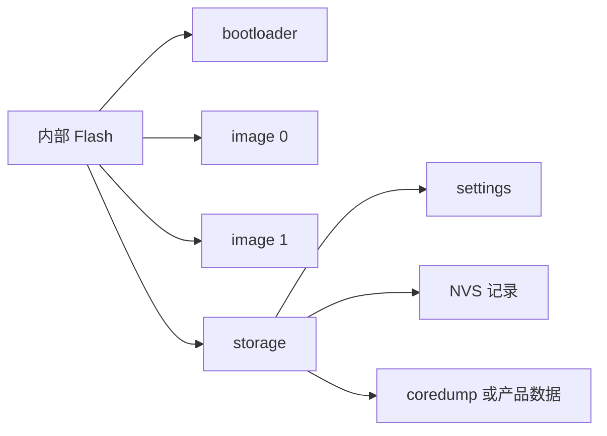
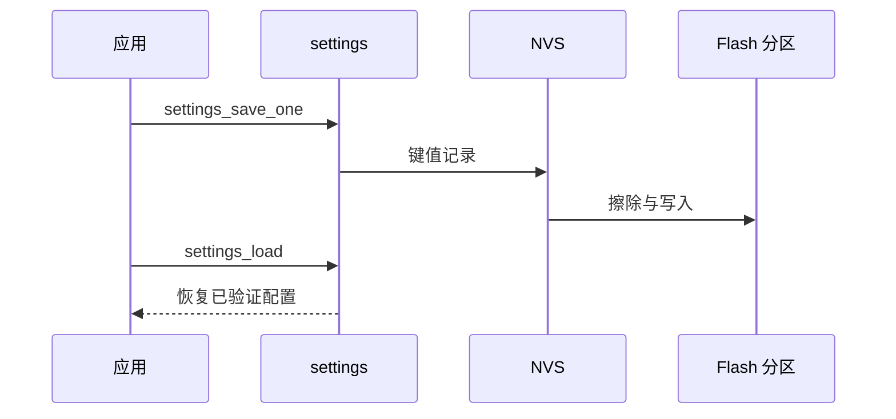

掉电后仍应存在的内容必须先有分区边界，再选择存储接口。**fixed-partitions 描述 Flash 空间归属，settings 提供键值配置接口，NVS 是可穿戴擦除的非易失后端。** 不要把应用配置、MCUboot 镜像槽和 coredump 随意写进同一片地址。

## 一、先画分区，再写 API



【图1：升级空间与持久数据必须在设备树中分开规划】

示例 storage 分区必须避开 bootloader 与镜像槽，具体地址和尺寸取决于 sysbuild 的最终布局：

```dts
&flash0 {
    partitions {
        compatible = "fixed-partitions";

        storage_partition: partition@7a000 {
            label = "storage";
            reg = <0x0007a000 0x00006000>;
        };
    };
};
```

这是布局结构示例，不可直接覆盖启用 MCUboot 的工程。实际地址要从 sysbuild 产物与最终 zephyr.dts 确认，所有 partition 的范围不能重叠。

## 二、settings 保存业务配置

```ini
CONFIG_FLASH=y
CONFIG_FLASH_MAP=y
CONFIG_NVS=y
CONFIG_SETTINGS=y
CONFIG_SETTINGS_NVS=y
```

```c
#include <zephyr/settings/settings.h>
#include <zephyr/kernel.h>

static uint32_t sample_period_ms = 5000;

static void save_sample_period(void)
{
    settings_save_one("env/period_ms", &sample_period_ms,
                      sizeof(sample_period_ms));
}

int main(void)
{
    settings_subsys_init();
    settings_load();

    sample_period_ms = 10000;
    save_sample_period();
    return 0;
}
```

settings 的键名是稳定接口，修改名称会影响旧固件的数据迁移。完整产品还应注册 settings handler，在 settings_load 时验证长度、范围和版本；读取到异常数据时恢复安全默认值而不是直接用于硬件控制。



【图2：业务代码通过 settings 间接使用 NVS 与 Flash】

## 三、磨损、掉电与数据版本

Flash 不能无限擦写。NVS 通过追加记录和扇区轮换降低磨损，但不是无限容量日志。需要定义：

- 哪些值真正需要掉电保存。
- 多久保存一次，不能每个传感器样本都写 Flash。
- 键值版本变化如何兼容旧数据。
- 写入中断电时启动应采用什么默认值。
- 量产恢复出厂设置如何只清业务分区而不破坏 bootloader。

## 四、动手练习

1. 为采样周期增加 settings handler，拒绝 0 和超过一天的值。
2. 在手机写配置后保存到 settings，重启验证是否恢复。
3. 查看最终 zephyr.dts，画出所有 Flash 分区和字节范围。
4. 连续保存同一键，观察 NVS 占用和擦除行为。

## 五、里程碑自检

- [ ] 知道分区先于存储 API
- [ ] 会用 fixed-partitions 描述独立 storage 空间
- [ ] 会调用 settings_subsys_init、settings_load 与 settings_save_one
- [ ] 知道配置键名、范围验证和版本迁移是产品协议
- [ ] 不会把高频采样值直接写入内部 Flash

## 小结

持久存储的核心是边界和频率：Flash 分区保护不同资产，settings 保护业务接口，NVS 处理磨损与掉电。先把数据生命周期写清楚，存储才不会在升级和量产时变成风险点。

> 🏷️ 标签：Zephyr · Flash · fixed-partitions · NVS · settings · 非易失存储
