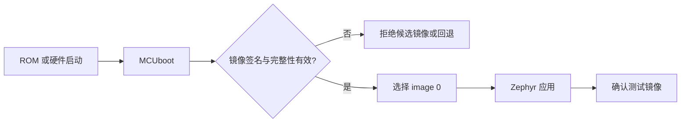
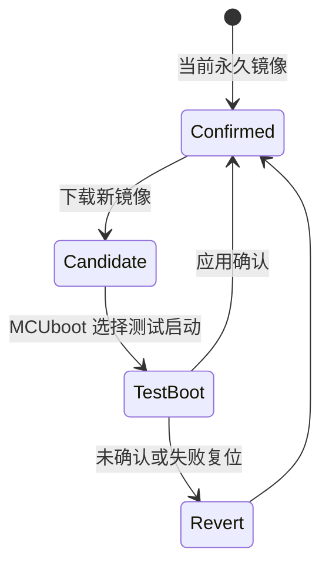
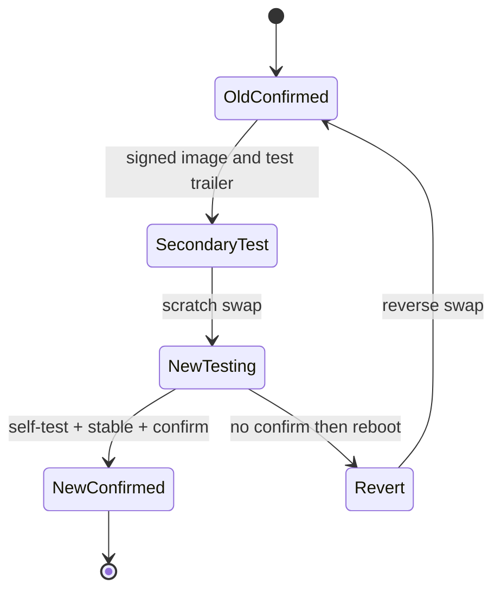

MCUboot 不是一个“升级工具”，而是设备启动时的信任决策器。它验证候选镜像、选择可启动槽位，并在测试镜像没有确认时回退。**安全启动链的根是受保护的公钥与 bootloader，应用镜像本身不能决定自己是否可信。**

Zephyr 4.4.x 推荐通过 sysbuild 构建 MCUboot，官方示例明确使用 SB_CONFIG_BOOTLOADER_MCUBOOT=y。

## 一、启动链与镜像组成



【图1：MCUboot 在应用之前建立信任边界】

一个 MCUboot 镜像通常包含 image header、应用 payload 与 TLV 区。TLV 可携带哈希、签名和安全计数器等元数据。私钥用于离线签名，公钥编入 bootloader；私钥绝不能放进开发板、固件仓库或 CI 日志。

## 二、sysbuild 是多镜像入口

sysbuild 同时配置应用和 MCUboot，避免手工分别构建后 Flash 分区不一致。构建完成后检查 build 目录中各 domain 的产物、最终分区和签名镜像；不要假设单镜像 build 的地址仍然正确。



【图2：测试镜像确认与回滚状态机】

## 三、交换模式不是通用开关

| 模式 | 适用前提 | 主要特点 |
| --- | --- | --- |
| swap | 两个槽位与 scratch 或相关布局 | 可测试、可回滚，Flash 开销大 |
| overwrite only | 接受不能自动回滚 | 空间简单，失败风险高 |
| direct-XIP | SoC 能从目标 Flash 直接执行 | 依赖硬件与布局 |
| RAM-load | 有足够 RAM 且启动从 RAM 执行 | 资源要求高 |

nRF52832 只有 512 KB Flash、64 KB RAM。能否容纳 bootloader、两个应用槽、设置和 coredump，必须以最终分区图和实际镜像大小为准。不要承诺任意 BLE 应用都能在该芯片上实现完整双槽 OTA。

## 四、确认是应用责任

测试镜像启动后，只有在自检通过时才确认。自检至少包括关键配置可读、传感器或无线初始化成功、版本兼容和必要迁移完成。过早确认会把坏镜像永久化；永不确认会使设备每次重启回滚。

镜像签名、确认和防降级配置都属于发布流程。开发阶段可以用测试密钥，但量产密钥必须独立管理、可轮换并有审计记录。

## 五、集成实验：sysbuild、scratch 双槽与密钥入口

前面的概念必须落到完整工程。以下布局在 512 KiB nRF52832 上保留 revert：48 KiB MCUboot、两个 192 KiB 等长槽、16 KiB scratch、64 KiB storage。槽大小包含 header、payload、TLV 和 trailer；应用实际可用空间小于 192 KiB。

```text
mcuboot_app/
|-- CMakeLists.txt
|-- Kconfig
|-- VERSION
|-- prj.conf
|-- prj_fail.conf
|-- sysbuild.conf
|-- sysbuild/
|   +-- mcuboot.conf
|-- boards/
|   +-- nrf52dk_nrf52832.overlay
|-- keys/
|   +-- .gitignore
+-- src/
    +-- main.c
```

### 5.1 应用与 sysbuild 配置

```cmake
# CMakeLists.txt
cmake_minimum_required(VERSION 3.20.0)
find_package(Zephyr REQUIRED HINTS $ENV{ZEPHYR_BASE})
project(mcuboot_app)
target_sources(app PRIVATE src/main.c)
```

```text
# VERSION
VERSION_MAJOR = 1
VERSION_MINOR = 0
PATCHLEVEL = 0
VERSION_TWEAK = 0
EXTRAVERSION =
```

```kconfig
# Kconfig
mainmenu "MCUboot self-test application"

config APP_SELF_TEST_FORCE_FAIL
    bool "Force self-test failure"
    default n
    help
      Fault injection for the revert experiment only.

source "Kconfig.zephyr"
```

```ini
# prj.conf
CONFIG_BOOTLOADER_MCUBOOT=y
CONFIG_MCUBOOT_IMG_MANAGER=y
CONFIG_REBOOT=y
CONFIG_GPIO=y
CONFIG_LOG=y
CONFIG_LOG_DEFAULT_LEVEL=3
CONFIG_MAIN_STACK_SIZE=1536
```

```ini
# prj_fail.conf
CONFIG_APP_SELF_TEST_FORCE_FAIL=y
```

```ini
# sysbuild.conf
SB_CONFIG_BOOTLOADER_MCUBOOT=y
```

```ini
# sysbuild/mcuboot.conf
CONFIG_BOOT_SIGNATURE_TYPE_ECDSA_P256=y
CONFIG_BOOT_SWAP_USING_SCRATCH=y
CONFIG_BOOT_UPGRADE_ONLY=n
CONFIG_BOOT_VALIDATE_SLOT0=y
CONFIG_LOG=y
CONFIG_MCUBOOT_LOG_LEVEL_INF=y
```

`SB_CONFIG_BOOTLOADER_MCUBOOT` 创建 MCUboot domain。`CONFIG_BOOT_SWAP_USING_SCRATCH` 要求 DTS 有 scratch，`CONFIG_BOOT_UPGRADE_ONLY=n` 才保留未确认重启后的 revert。若集成 MCUboot 对交换模式的 Kconfig 命名不同，必须以 Zephyr 4.4.x workspace 的 `boot/zephyr/Kconfig` 和 `menuconfig` 为准，不能静默改成 overwrite-only。

### 5.2 fixed-partitions overlay

```dts
/* boards/nrf52dk_nrf52832.overlay */

/ {
    chosen {
        zephyr,code-partition = &slot0_partition;
    };
};

&flash0 {
    /delete-node/ partitions;

    partitions {
        compatible = "fixed-partitions";
        #address-cells = <1>;
        #size-cells = <1>;

        boot_partition: partition@0 {
            label = "mcuboot";
            reg = <0x00000000 0x0000c000>;
        };

        slot0_partition: partition@c000 {
            label = "image-0";
            reg = <0x0000c000 0x00030000>;
        };

        slot1_partition: partition@3c000 {
            label = "image-1";
            reg = <0x0003c000 0x00030000>;
        };

        scratch_partition: partition@6c000 {
            label = "image-scratch";
            reg = <0x0006c000 0x00004000>;
        };

        storage_partition: partition@70000 {
            label = "storage";
            reg = <0x00070000 0x00010000>;
        };
    };
};
```

地址闭合关系是 `0xc000 + 0x30000 = 0x3c000`、`0x3c000 + 0x30000 = 0x6c000`、`0x6c000 + 0x4000 = 0x70000`、`0x70000 + 0x10000 = 0x80000`，没有空洞或重叠。`/delete-node/` 避免与板级旧 partitions 叠加。

```gitignore
# keys/.gitignore
*.pem
*.key
```

`.gitignore` 只减少误提交，不是密钥保护。生产私钥必须在 HSM/签名服务内，设备只持公钥；开发工程稍后生成一次性 ECDSA-P256 key。


## 六、self-test 与确认代码

```c
#include <errno.h>
#include <stdbool.h>
#include <stdint.h>

#include <zephyr/dfu/mcuboot.h>
#include <zephyr/device.h>
#include <zephyr/drivers/gpio.h>
#include <zephyr/kernel.h>
#include <zephyr/logging/log.h>
#include <zephyr/sys/reboot.h>
#include <zephyr/sys/util.h>

LOG_MODULE_REGISTER(mcuboot_app, LOG_LEVEL_INF);

#define STATUS_LED_NODE DT_ALIAS(led0)
#define STABILITY_WINDOW K_SECONDS(5)
#define APP_STATE_MAGIC 0x41505031U

static const struct gpio_dt_spec status_led =
    GPIO_DT_SPEC_GET(STATUS_LED_NODE, gpios);

struct app_state {
    uint32_t magic;
    uint16_t schema_version;
    uint16_t length;
};

static const struct app_state compiled_state = {
    .magic = APP_STATE_MAGIC,
    .schema_version = 1U,
    .length = sizeof(struct app_state),
};

/**
 * @brief 检查允许本镜像永久运行的最小不变量和关键设备。
 *
 * @return 0 表示全部通过；负 errno 表示不能确认本镜像。
 *
 * @note main 线程调用，测试必须有界且不能修改 MCUboot trailer。
 * 产品还应验证配置迁移、关键传感器、无线栈与任务心跳。
 */
static int run_self_tests(void)
{
    int err;

    if (compiled_state.magic != APP_STATE_MAGIC ||
        compiled_state.schema_version != 1U ||
        compiled_state.length != sizeof(compiled_state)) {
        return -EINVAL;
    }

    if (!gpio_is_ready_dt(&status_led)) {
        return -ENODEV;
    }

    err = gpio_pin_configure_dt(&status_led, GPIO_OUTPUT_INACTIVE);
    if (err != 0) {
        return err;
    }

    err = gpio_pin_set_dt(&status_led, 1);
    if (err != 0) {
        return err;
    }
    k_sleep(K_MSEC(50));
    err = gpio_pin_set_dt(&status_led, 0);
    if (err != 0) {
        return err;
    }

#if defined(CONFIG_APP_SELF_TEST_FORCE_FAIL)
    return -EIO;
#else
    return 0;
#endif
}

/**
 * @brief 不确认当前镜像，保留诊断窗口后冷复位。
 *
 * @param reason 自检或确认 API 返回的负 errno。
 *
 * @note 线程上下文。若当前启动是 test，复位给 MCUboot 执行 revert 的机会。
 */
static void reboot_without_confirmation(int reason)
{
    LOG_ERR("image not confirmed, reason=%d", reason);
    k_sleep(K_SECONDS(3));
    sys_reboot(SYS_REBOOT_COLD);
    CODE_UNREACHABLE;
}

int main(void)
{
    bool already_confirmed;
    int err;

    already_confirmed = boot_is_img_confirmed();
    LOG_INF("booted; confirmed=%d", already_confirmed);

    err = run_self_tests();
    if (err != 0) {
        reboot_without_confirmation(err);
    }

    /*
     * 产品在稳定窗口内应继续检查 watchdog、任务心跳、配置迁移和通信。
     * “main 已运行”本身不是充分自检。
     */
    LOG_INF("self-tests passed; stability window");
    k_sleep(STABILITY_WINDOW);

    if (!already_confirmed) {
        err = boot_write_img_confirmed();
        if (err != 0) {
            LOG_ERR("boot_write_img_confirmed failed: %d", err);
            reboot_without_confirmation(err);
        }
        LOG_INF("test image confirmed");
    } else {
        LOG_INF("image already confirmed");
    }

    while (true) {
        k_sleep(K_SECONDS(30));
        LOG_INF("application healthy");
    }

    return 0;
}
```

`boot_is_img_confirmed()` 无参数并返回 bool，只查询当前 primary 的 image-ok 状态。`boot_write_img_confirmed()` 无参数，成功返回 0、失败返回负 errno；它会写 Flash，只能在线程上下文、完整自检后调用。它确认“当前运行的 primary”，不接收 slot、版本或连接参数，也不能让未签名镜像变可信。

`run_self_tests()` 的错误是确认门。`CONFIG_APP_SELF_TEST_FORCE_FAIL` 只用于 revert 故障注入；失败分支绝不调用 confirm。确认 API 自身失败也走同一不确认复位路径，不能只打印日志后假装升级成功。


## 七、签名产物与 test/revert 验证

### 7.1 开发密钥和首次 sysbuild

在 west workspace 根执行，先核对 `imgtool.py` 实际位置：

```powershell
$imgtool = Join-Path $env:ZEPHYR_BASE "..\bootloader\mcuboot\scripts\imgtool.py"
python $imgtool keygen -k mcuboot_app\keys\dev-ecdsa-p256.pem -t ecdsa-p256
$key = (Resolve-Path mcuboot_app\keys\dev-ecdsa-p256.pem).Path
west build -p always -b nrf52dk/nrf52832 --sysbuild mcuboot_app -- -DSB_CONFIG_BOOT_SIGNATURE_KEY_FILE="$key"
west flash
```

`SB_CONFIG_BOOT_SIGNATURE_KEY_FILE` 指向实验私钥，sysbuild 从中生成 MCUboot 使用的验证公钥。merged hex 不应包含私钥。生产构建不得把 HSM 私钥复制到 workspace，而应让受审计签名服务接收 hash/unsigned artifact 并返回签名结果。

```powershell
Get-Content build\domains.yaml
Get-ChildItem build -Recurse -File | Where-Object Name -Match '(^zephyr\.(elf|hex|bin)$|signed|merged|domains)'
```

常见产物包括 `build/mcuboot/zephyr/zephyr.elf`、应用 domain 的 `zephyr.elf`/`zephyr.bin`/`zephyr.signed.*`、顶层 `merged.hex` 和 `domains.yaml`。准确路径以本次 domains/build 日志为准。两个 domain 的 `zephyr.dts`、`zephyr.map` 与 `.config` 都要归档。

### 7.2 制作未确认 test candidate

修改应用后重新构建。下面把 unsigned application binary 签为 v1.1.0。`--header-size`、`--align`、`--slot-size` 必须匹配 boot domain；`--pad` 生成完整槽和 upgrade trailer，故意不加 `--confirm`。

```powershell
$imgtool = Join-Path $env:ZEPHYR_BASE "..\bootloader\mcuboot\scripts\imgtool.py"
$key = (Resolve-Path mcuboot_app\keys\dev-ecdsa-p256.pem).Path
python $imgtool sign --key "$key" --header-size 0x200 --slot-size 0x30000 --align 4 --version 1.1.0 --pad-header --pad build\mcuboot_app\zephyr\zephyr.bin candidate_test.bin
arm-zephyr-eabi-objcopy -I binary -O ihex --change-addresses 0x3c000 candidate_test.bin candidate_slot1.hex
```

先运行 `python $imgtool verify --help`，再按 Zephyr 4.4.x 集成版本的参数验证 header、TLV、hash 与签名。objcopy 只把 binary 映射到 slot1 `0x3c000`，不会重新签名。

实验板应先擦除 secondary slot `0x3c000..0x6bfff`，避免旧 trailer 干扰。Nordic 工具版本不同，必须先看本机 help；一种常见命令形态是：

```powershell
nrfjprog --erasepage 0x3c000-0x6bfff
nrfjprog --program candidate_slot1.hex --verify --reset
```

若本机不接受 range 语法，不要猜参数；改用该版本支持的逐页擦除或探针 GUI，但目标严格限制在 slot1。第 21 篇再通过 MCUmgr 写 secondary slot。

### 7.3 成功确认

1. 首次烧录 v1.0.0 merged image。
2. 写未确认的 v1.1.0 candidate 到 slot1。
3. 复位后 MCUboot 使用 scratch swap，应用预期打印 `confirmed=0`。
4. 自检与 5 秒稳定窗口通过，确认 API 返回 0。
5. 再次复位仍运行 v1.1.0，不发生 revert。

### 7.4 故障候选和回滚

独立构建目录避免覆盖成功版本证据：

```powershell
$key = (Resolve-Path mcuboot_app\keys\dev-ecdsa-p256.pem).Path
west build -d build-fail -p always -b nrf52dk/nrf52832 --sysbuild mcuboot_app -- -DSB_CONFIG_BOOT_SIGNATURE_KEY_FILE="$key" -Dmcuboot_app_EXTRA_CONF_FILE=prj_fail.conf
```

domain 前缀以 `domains.yaml` 为准；若不是 `mcuboot_app`，替换 CMake 变量前缀。把 fail domain 的 `zephyr.bin` 签为更高版本并写 slot1。预期故障注入返回 `-EIO`，不调用 confirm，3 秒后冷复位；MCUboot reverse swap，旧 confirmed build id 再次出现。必须用版本/build id 日志证明回滚，不能只看 LED。



【图3：通过候选永久化，失败候选复位后回滚】

scratch 算法为掉电恢复而设计，但仍须在目标 Flash 和实际 sector 布局上对 swap 多阶段注入断电，不能从状态图直接宣称已验证。

## 八、接口、故障与密钥边界

| 项目 | 参数/返回 | 错误边界 |
| --- | --- | --- |
| `SB_CONFIG_BOOTLOADER_MCUBOOT` | sysbuild 布尔配置 | 没有 `--sysbuild` 不创建 boot domain |
| `boot_is_img_confirmed()` | 无参数，返回 bool | 只查询 trailer，不表示业务健康 |
| `boot_write_img_confirmed()` | 无参数，0/负 errno | 写失败必须保持未确认 |
| `imgtool --header-size 0x200` | image header 大小 | 与 boot 配置不一致会拒绝 |
| `--slot-size 0x30000` | header/TLV/trailer 在内的槽 | 超限应失败，不能截断 |
| `--pad` | padding 和 upgrade trailer | test 镜像不要加 `--confirm` |
| `--change-addresses 0x3c000` | secondary offset | 地址错会破坏其他资产 |

| 现象 | 原因 | 处理 |
| --- | --- | --- |
| 没有 MCUboot domain | sysbuild.conf 未发现 | 查 `domains.yaml` |
| bootloader 超 48 KiB | 日志/算法太大 | 减配置或重做布局 |
| 应用/签名超槽 | payload+TLV+trailer 过大 | 查 map/imgtool |
| candidate rejected | key/header/align 不一致 | 用同版 imgtool verify |
| 每次回滚 | 自检或确认写失败 | 查 errno 和 trailer |
| 坏镜像永久化 | 过早 confirm | 移到稳定窗口末尾 |
| 从不回滚 | overwrite-only/候选预确认 | 查 MCUboot `.config` |
| 重测异常 | secondary/trailer 未清 | 只擦 slot1 后重写 |

量产还需要 bootloader/公钥写保护、debug protection、签名审计、key id/轮换、security counter 防降级、恢复接口鉴权，以及私钥备份与泄露演练。`.gitignore`、语义版本和“已签名”都不能单独完成这些目标。

## 九、练习、里程碑与官方资料

练习：

1. 加 build id，让启动、确认、回滚日志携带它。
2. 把自检拆成 settings 迁移、传感器、BLE、任务心跳四阶段。
3. 在 scratch swap 不同阶段断电，记录恢复。
4. 启用 security counter，设计允许/拒绝降级矩阵。
5. 写生产签名请求的 revision/hash/version/key-id 审计格式。

里程碑：

- [ ] sysbuild 同时产出 boot 与 app domain
- [ ] 分区逐字节闭合且两个 slot 等长
- [ ] 私钥不进入仓库、设备或普通 CI 日志
- [ ] 能制作未 confirmed candidate 并写 slot1
- [ ] 只有自检和稳定窗口通过才确认
- [ ] 失败候选复位后观察到旧 build id
- [ ] 归档两个 ELF/DTS/map/config、domains 和签名产物

官方资料：

- [Zephyr 4.4 Sysbuild](https://docs.zephyrproject.org/4.4.0/build/sysbuild/index.html)
- [Sysbuild with MCUboot sample](https://docs.zephyrproject.org/4.4.0/samples/sysbuild/with-mcuboot/README.html)
- [Zephyr DFU/MCUboot API](https://docs.zephyrproject.org/4.4.0/services/device_mgmt/dfu.html)
- [MCUboot design](https://docs.mcuboot.com/design.html)
- [MCUboot imgtool](https://docs.mcuboot.com/imgtool.html)

## 小结

MCUboot 的价值在于把“能运行”变成“经验证后才允许运行”。sysbuild 负责一致构建，镜像签名建立信任，确认机制守住回滚边界；三者缺一不可。

> 🏷️ 标签：Zephyr · MCUboot · sysbuild · 安全启动 · 镜像签名 · 回滚 · OTA
