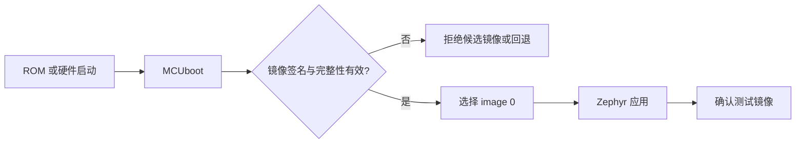
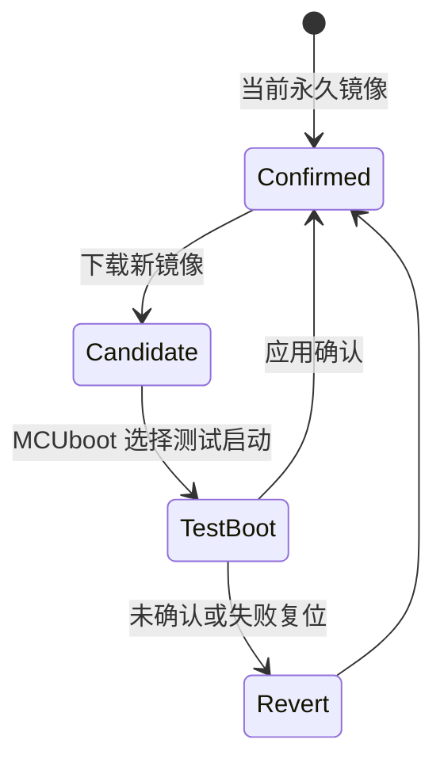

MCUboot 不是一个“升级工具”，而是设备启动时的信任决策器。它验证候选镜像、选择可启动槽位，并在测试镜像没有确认时回退。**安全启动链的根是受保护的公钥与 bootloader，应用镜像本身不能决定自己是否可信。**

Zephyr 4.4.x 推荐通过 sysbuild 构建 MCUboot，官方示例明确使用 SB_CONFIG_BOOTLOADER_MCUBOOT=y。

## 一、启动链与镜像组成



【图1：MCUboot 在应用之前建立信任边界】

一个 MCUboot 镜像通常包含 image header、应用 payload 与 TLV 区。TLV 可携带哈希、签名和安全计数器等元数据。私钥用于离线签名，公钥编入 bootloader；私钥绝不能放进开发板、固件仓库或 CI 日志。

## 二、sysbuild 是多镜像入口

```ini
# sysbuild.conf
SB_CONFIG_BOOTLOADER_MCUBOOT=y
```

```powershell
west build -p always -b nrf52dk/nrf52832 --sysbuild app
west flash
```

sysbuild 同时配置应用和 MCUboot，避免手工分别构建后 Flash 分区不一致。构建完成后检查 build 目录中各 domain 的产物、最终分区和签名镜像；不要假设单镜像 build 的地址仍然正确。



【图2：测试镜像确认与回滚状态机】

## 三、交换模式不是通用开关

| 模式 | 适用前提 | 主要特点 |
| --- | --- | --- |
| swap | 两个槽位与 scratch 或相关布局 | 可测试、可回滚，Flash 开销大 |
| overwrite only | 接受不能自动回滚 | 空间简单，失败风险高 |
| direct-XIP | SoC 能从目标 Flash 直接执行 | 依赖硬件与布局 |
| RAM-load | 有足够 RAM 且启动从 RAM 执行 | 资源要求高 |

nRF52832 只有 512 KB Flash、64 KB RAM。能否容纳 bootloader、两个应用槽、设置和 coredump，必须以最终分区图和实际镜像大小为准。不要承诺任意 BLE 应用都能在该芯片上实现完整双槽 OTA。

## 四、确认是应用责任

测试镜像启动后，只有在自检通过时才确认。自检至少包括关键配置可读、传感器或无线初始化成功、版本兼容和必要迁移完成。过早确认会把坏镜像永久化；永不确认会使设备每次重启回滚。

镜像签名、确认和防降级配置都属于发布流程。开发阶段可以用测试密钥，但量产密钥必须独立管理、可轮换并有审计记录。

## 五、动手练习

1. 用 sysbuild 构建 hello world 加 MCUboot，观察两段启动横幅。
2. 查看最终分区图，计算 bootloader、image 0、image 1 和 storage 是否重叠。
3. 签名一个候选镜像，分别模拟确认与未确认重启。
4. 对比 swap 与 overwrite only 的 Flash 需求和故障恢复能力。

## 六、里程碑自检

- [ ] 能说明 bootloader、公钥、签名和应用的信任关系
- [ ] 知道 image header 与 TLV 承载镜像验证信息
- [ ] 会用 sysbuild.conf 启用 MCUboot
- [ ] 能解释测试启动、确认和回滚
- [ ] 会根据实际 Flash 分区选择而非猜测交换模式

## 小结

MCUboot 的价值在于把“能运行”变成“经验证后才允许运行”。sysbuild 负责一致构建，镜像签名建立信任，确认机制守住回滚边界；三者缺一不可。

> 🏷️ 标签：Zephyr · MCUboot · sysbuild · 安全启动 · 镜像签名 · 回滚 · OTA
