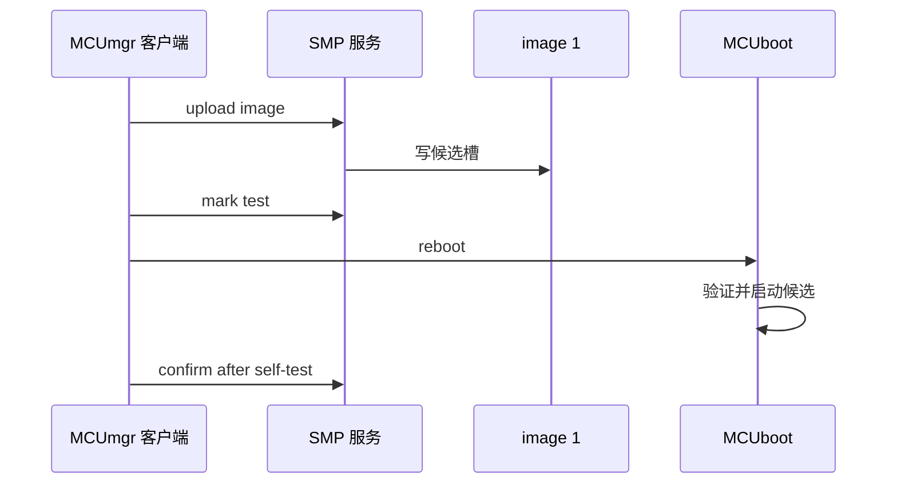

DFU 是一条端到端链路：新固件必须被正确构建和签名，经受控传输写入候选槽，再由 MCUboot 验证、测试启动和确认。MCUmgr 的 SMP 是管理协议，不是 Bluetooth Security Manager Protocol；在 BLE 上它使用专用 GATT 服务和特征。

官方 SMP server 的 BLE 样例构建命令如下：

```powershell
west build -b nrf52dk/nrf52832 --sysbuild samples/subsys/mgmt/mcumgr/smp_svr -- -DEXTRA_CONF_FILE="bt.conf"
```

先完整复现该样例，再迁移自己的服务。它已经把 BLE、MCUmgr 和 MCUboot 的关键集成路径固定下来。

## 一、升级闭环


【图1：无线升级从构建到确认的闭环】

SMP over BLE 使用一个管理服务。请求由 GATT Write Without Response 发送，响应通过 notification 返回；较大镜像会分片。连接稳定性、MTU、传输超时和手机客户端中断都必须纳入验证。

## 二、复现官方样例

```powershell
west build -p always -b nrf52dk/nrf52832 --sysbuild samples/subsys/mgmt/mcumgr/smp_svr -- -DEXTRA_CONF_FILE="bt.conf"
west flash
```

用支持 SMP over BLE 的客户端连接设备，按以下顺序操作：

1. 查询设备信息和 image 列表，确认当前运行槽位。
2. 上传已签名候选镜像。
3. 标记候选镜像为测试启动。
4. 重启设备，观察 MCUboot 与应用启动日志。
5. 自检通过后确认镜像。
6. 再次查询 image 状态，确认候选成为永久镜像。

客户端可使用 Zephyr 文档列出的 MCUmgr 工具或 nRF Connect Device Manager。客户端命令会随版本调整，应以本机帮助和连接 URI 为准。



【图2：上传、测试启动和确认时序】

## 三、防砖策略

| 风险 | 防护 |
| --- | --- |
| 上传中断 | 原镜像保持可启动，候选不确认 |
| 新固件自检失败 | 不确认，重启回滚 |
| 电量不足 | 升级前检查电源，必要时拒绝写入 |
| 私钥泄露 | 离线保管、轮换密钥、废止流程 |
| Flash 不足 | 构建前检查最终分区和镜像大小 |
| 客户端误操作 | 限制管理服务访问并记录升级状态 |

DFU 管理服务是高价值攻击面。量产产品不应在无认证、无物理限制的情况下向任意附近设备开放镜像写入。

## 四、动手练习

1. 复现 BLE SMP server 样例，保存 build 配置和 image 列表。
2. 修改版本字符串，构建并上传新镜像，验证测试启动。
3. 故意不确认测试镜像后重启，观察回滚。
4. 断开手机传输，验证原镜像仍可启动并记录恢复步骤。

## 五、里程碑自检

- [ ] 知道 MCUmgr SMP 与 Bluetooth SMP 不是同一协议
- [ ] 会用 sysbuild 构建官方 BLE SMP server
- [ ] 能完成上传、测试启动、确认和状态查询
- [ ] 能验证未确认候选在重启后回滚
- [ ] 会将认证、供电和恢复通道纳入防砖设计

## 小结

无线升级真正交付的是可恢复性，而不是一次成功传输。只有签名、候选槽、测试启动、确认和回滚全部被验证，DFU 才能成为产品能力。

> 🏷️ 标签：Zephyr · DFU · MCUmgr · SMP · BLE · MCUboot · OTA · 回滚
