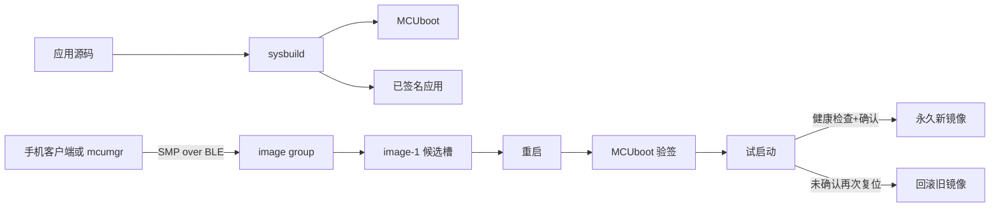
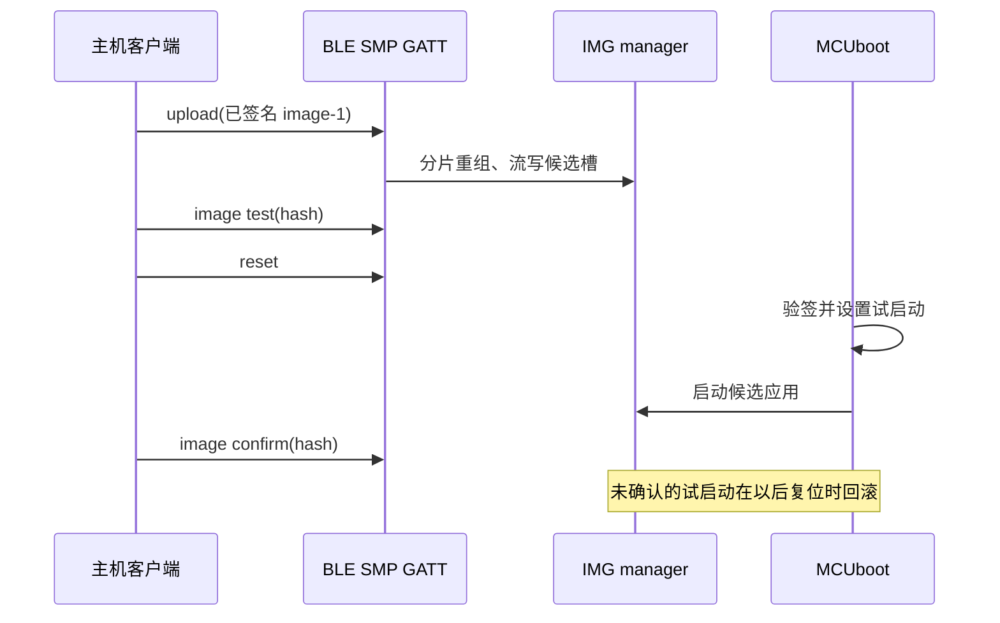

DFU 的交付物不是一次成功传输，而是可恢复的信任链：构建系统生成适合候选槽的已签名镜像，SMP 仅把它写入候选槽，MCUboot 在重启时验签并试启动，应用仅在健康检查通过后确认。任意阶段中断，已确认镜像仍必须可启动。

本文以 Zephyr 4.4.x 和 `nrf52dk/nrf52832` 为目标。先复现官方 [SMP server](https://docs.zephyrproject.org/4.4.0/samples/subsys/mgmt/mcumgr/smp_svr/README.html)，再把相同的边界放入自己的应用。MCUmgr 的 SMP 是 Simple Management Protocol，不能和蓝牙 Security Manager Protocol 混淆；BLE 是 SMP 的一种传输层。

## 一、先区分四个状态机

MCUmgr 是管理命令族：它定义 image、os、fs 等 group 的请求和响应语义。SMP 是这些命令的编码与分帧协议；SMP over BLE 又把帧放入专用 GATT 服务。它们解决“管理请求怎样抵达设备”，并不决定哪一个镜像可启动。镜像管理组件拥有候选槽写入和状态标志；MCUboot 才拥有复位时的验签、交换/试启动和回滚决定权。

因此一次 OTA 同时经历四类生命周期：客户端拥有上传文件与重试策略；transport 拥有 BLE 连接、MTU 和分片重组；image manager 拥有候选槽的流式写入；bootloader 拥有启动选择。应用只拥有“本次试启动是否足以确认”的健康判断。把这些所有权混在一个 `upload succeeded` 布尔值里，会导致断链、断电和回滚时无法解释状态。

传输中断的边界很严格：候选槽有未完整数据时，绝不能执行 test；已经完成 upload 但还未 test 时，当前 confirmed 镜像仍是启动基线；test 后第一次新镜像启动前后，确认位才决定下一次复位的命运。安全也分层：签名验证镜像来源与完整性，BLE 加密保护链路，访问控制决定谁能发管理命令，反回滚策略决定旧版本能否再次成为候选。没有任何单一开关替代这四层。

## 二、升级状态机



`image-0` 是当前槽，`image-1` 是候选槽。地址、大小与擦除块来自分区，不能凭经验写死。每次构建后检查 `build/zephyr/zephyr.dts`、`build/zephyr/include/generated/zephyr/autoconf.h` 和最终 map：MCUboot、应用和候选镜像都必须在分区内。



BLE SMP 的请求与响应受 ATT MTU、连接间隔、客户端超时和重组缓冲区影响。连接丢失时，重新查询 image 状态和客户端断点能力；绝不能假定上一条上传已经完整落盘。

## 三、先复现官方样例

官方 4.4 文档给出的 BLE 基线：

```powershell
west build -p always -b nrf52dk/nrf52832 --sysbuild `
  zephyr/samples/subsys/mgmt/mcumgr/smp_svr -- -DEXTRA_CONF_FILE="bt.conf"
west flash
```

不要省略 `--sysbuild`。它把应用和 MCUboot 作为独立域构建，并让 `west flash` 得到完整的域信息。官方样例明确说明 `img_mgmt` 需要 MCUboot；sysbuild 的多域输出、`domains.yaml` 与调试方式见 [sysbuild 文档](https://docs.zephyrproject.org/4.4.0/build/sysbuild/index.html)。先执行 echo 或 `image list` 验证管理通道，不要第一次连上就上传。

## 四、自己的最小 OTA 应用

```text
ble_smp_ota/
├── CMakeLists.txt
├── prj.conf
├── sysbuild.conf
├── app.overlay
└── src/
    └── main.c
```

`CMakeLists.txt`：

```cmake
cmake_minimum_required(VERSION 3.20.0)
find_package(Zephyr REQUIRED HINTS $ENV{ZEPHYR_BASE})
project(ble_smp_ota)
target_sources(app PRIVATE src/main.c)
```

`sysbuild.conf` 是系统级配置，不能误放进应用配置：

```ini
SB_CONFIG_BOOTLOADER_MCUBOOT=y
```

`prj.conf`：

```ini
CONFIG_BOOTLOADER_MCUBOOT=y
CONFIG_MAIN_STACK_SIZE=2048
CONFIG_LOG=y
CONFIG_LOG_DEFAULT_LEVEL=3
CONFIG_BT=y
CONFIG_BT_PERIPHERAL=y
CONFIG_BT_DEVICE_NAME="OTA-Lab"
CONFIG_BT_MAX_CONN=1
CONFIG_BT_SMP=y
CONFIG_MCUMGR=y
CONFIG_MCUMGR_GRP_IMG=y
CONFIG_IMG_MANAGER=y
CONFIG_MCUMGR_TRANSPORT_BT=y
CONFIG_MCUMGR_TRANSPORT_BT_REASSEMBLY=y
CONFIG_STREAM_FLASH=y
CONFIG_FLASH=y
CONFIG_FLASH_MAP=y
```

`app.overlay` 不虚构 BLE 节点，只给板载 LED 一个清晰别名：

```dts
/ {
    aliases {
        status-led = &led0;
    };
};
```

`src/main.c`：`gpio_pin_configure_dt()` 与 `gpio_pin_toggle_dt()` 返回 `0` 或负 errno；在访问前必须调用 `gpio_is_ready_dt()`。`bt_enable(NULL)` 同步启用蓝牙，返回负 errno 时不得继续广播。

```c
#include <errno.h>
#include <zephyr/bluetooth/bluetooth.h>
#include <zephyr/drivers/gpio.h>
#include <zephyr/kernel.h>
#include <zephyr/logging/log.h>

LOG_MODULE_REGISTER(ble_smp_ota, LOG_LEVEL_INF);

static const struct gpio_dt_spec status_led =
    GPIO_DT_SPEC_GET(DT_ALIAS(status_led), gpios);

/**
 * @brief 初始化状态 LED。
 *
 * @return 0 成功；负 errno 表示设备或引脚不可用。
 */
static int status_led_init(void)
{
    if (!gpio_is_ready_dt(&status_led)) {
        return -ENODEV;
    }
    return gpio_pin_configure_dt(&status_led, GPIO_OUTPUT_INACTIVE);
}

/**
 * @brief 启动可连接广告。
 *
 * @return 0 成功；负 errno 表示广告控制器拒绝请求。
 */
static int advertising_start(void)
{
    int err = bt_le_adv_start(BT_LE_ADV_CONN_FAST_1, NULL, 0, NULL, 0);

    return (err == -EALREADY) ? 0 : err;
}

int main(void)
{
    int err = status_led_init();

    if (err != 0) {
        LOG_ERR("LED unavailable: %d", err);
        return 0;
    }
    err = bt_enable(NULL);
    if (err != 0) {
        LOG_ERR("Bluetooth enable failed: %d", err);
        return 0;
    }
    err = advertising_start();
    if (err != 0) {
        LOG_ERR("Advertising failed: %d", err);
        return 0;
    }
    LOG_INF("OTA-Lab ready; MCUmgr registers the SMP service");
    while (true) {
        err = gpio_pin_toggle_dt(&status_led);
        if (err != 0) {
            LOG_ERR("LED toggle failed: %d", err);
        }
        k_sleep(K_SECONDS(1));
    }
}
```

构建、烧录并找出真正的上传对象：

```powershell
west build -p always -b nrf52dk/nrf52832 --sysbuild ble_smp_ota
west flash -d build
Get-ChildItem build -Recurse -Filter zephyr.signed.bin
```

上传的是应用域产生的 `zephyr.signed.bin`（或客户端明确要求的同一已签名格式），不是 `zephyr.elf`、未签名 `zephyr.bin`，也不是 MCUboot 二进制。路径随构建目录布局变化，所以必须搜索实际产物。

## 五、客户端、URI 与验证

Zephyr 没有唯一的 PC BLE SMP 客户端。nRF Connect Device Manager 与 Go `mcumgr` CLI 均可用，但版本不同会使用 `--conntype ble --connstring ...`、`ble://...`、设备地址或 peer name 等不同 URI/连接语法。先运行本机 `mcumgr --help` 和 `mcumgr conn --help`，不要把网上另一版本的 URI 原样放进自动化脚本。

对支持传统连接参数的 CLI，动作顺序是：

```powershell
mcumgr --conntype ble --connstring "peer_name=OTA-Lab" image list
mcumgr --conntype ble --connstring "peer_name=OTA-Lab" image upload <signed-bin>
mcumgr --conntype ble --connstring "peer_name=OTA-Lab" image list
mcumgr --conntype ble --connstring "peer_name=OTA-Lab" image test <image-hash>
mcumgr --conntype ble --connstring "peer_name=OTA-Lab" reset
mcumgr --conntype ble --connstring "peer_name=OTA-Lab" image list
mcumgr --conntype ble --connstring "peer_name=OTA-Lab" image confirm <image-hash>
mcumgr --conntype ble --connstring "peer_name=OTA-Lab" image list
```

| 阶段 | 应核验 | 不能据此推断 |
| --- | --- | --- |
| 初始 | 当前 image-0 是 active/confirmed | image-1 必为空 |
| 上传后 | 候选 hash、大小 | 新镜像已运行 |
| test 后 | 候选的 pending/test 标记 | 一定可以启动 |
| reset 后 | 新版本日志和 active 状态 | 已永久确认 |
| confirm 后 | active 镜像 confirmed | 旧镜像已物理擦除 |

`image upload` 仅写候选槽；`image test` 仅安排下次试启动；`reset` 才由 MCUboot 处理；`image confirm` 只能在健康检查后执行。最终以 image list 的 hash、slot、`active`、`confirmed`、`pending` 字段判定，不以“上传完成”提示判定。

## 六、安全、恢复与取舍

签名回答“谁能产生可启动镜像”，不回答“谁能调用管理服务”。配对/加密、bond 存储、物理按键授权、维护窗口、管理 group 白名单和反回滚都是独立决策。开发板可开放服务；产品必须明确仅暴露必需 group、私钥离线保存、电压不足和业务忙时的拒绝升级规则，以及失联后的维护通道。

确认必须放在传感器、存储、总线和 BLE 等关键健康检查之后。若新镜像只执行到 `main()` 就确认，任何后续故障都会永久化。若未确认就断电或复位，回滚机制才有价值。

`nrf52832` 的 64 KB RAM 由 BLE host、日志、SMP 重组、流写和业务线程共享。通过 map 与 Kconfig 评估栈、队列和重组缓冲区；不要因一次上传成功就提高 MTU、日志等级或并发连接数。

| 症状 | 优先检查 | 恢复动作 |
| --- | --- | --- |
| 找不到设备 | `bt_enable()` 日志、天线、电源、广告名 | 先恢复 echo/image list |
| 连接无 SMP 响应 | transport Kconfig、GATT 缓存、URI | 清客户端缓存后重连 |
| 分片超时 | MTU、连接质量、客户端窗口 | 降低窗口，重新查 image list |
| 上传中断 | 当前镜像 confirmed 状态 | 不 test；重连后重传或恢复 |
| 重启仍为旧版本 | 是否 test、镜像是否 signed | 对照 hash 后重新上传 |
| 新版本只启动一次 | 未 confirm 或自检失败 | 留日志，再复位验证回滚 |

## 七、练习与里程碑

1. 构建官方 BLE `smp_svr`，保存 image list 与签名镜像路径。
2. 构建本文应用，修改日志版本文本，上传后用 hash 证明候选镜像改变。
3. 执行 test 和 reset，故意不 confirm，再 reset 并记录回滚状态。
4. 上传中关闭客户端，不执行 test；证明旧 confirmed 镜像仍能启动。
5. 为项目写下管理 group、配对策略、签名私钥位置和拒绝升级条件。

## 小结

完成条件不是“手机上传成功”，而是能解释每个镜像在哪个槽、谁验证它、何时确认，以及失败后如何回到已知可启动状态。

> 🏷️ 标签：Zephyr · DFU · MCUmgr · SMP · BLE · MCUboot · OTA · 回滚
