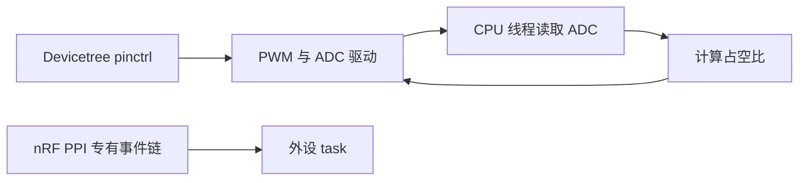
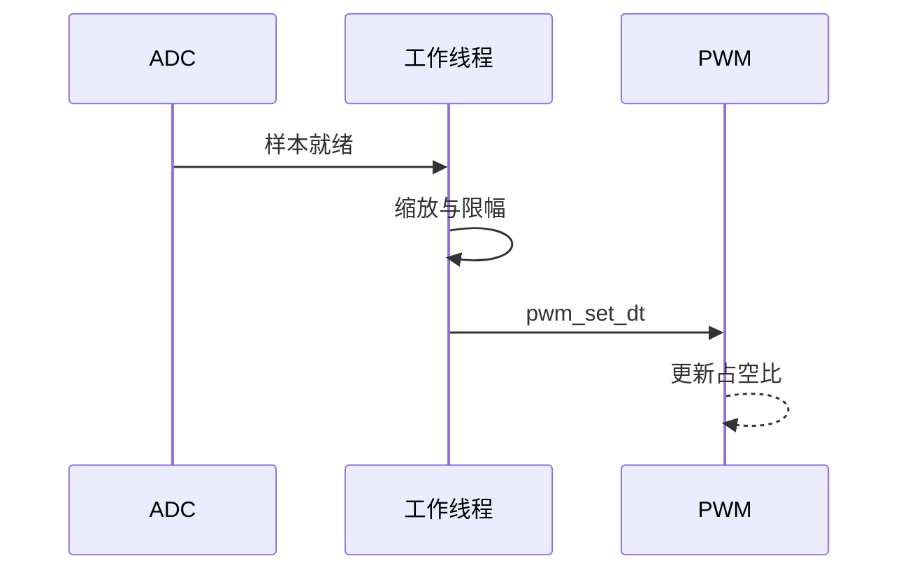

外设进阶的重点不是一次性打开所有功能，而是分清通用 API 与 Nordic 专有硬件能力。**PWM、ADC 和 pinctrl 有 Zephyr 标准抽象；PPI 是 nRF 特有的事件任务互联；DMA 是否可用取决于具体外设与 SoC。**

## 一、从设备树到事件链



【图1：通用外设 API 与 Nordic 专有事件路径】

## 二、ADC 驱动 PWM

```c
#include <zephyr/drivers/adc.h>
#include <zephyr/drivers/pwm.h>
#include <zephyr/kernel.h>

#define PWM_NODE DT_ALIAS(pwm_led0)
static const struct pwm_dt_spec pwm = PWM_DT_SPEC_GET(PWM_NODE);

static void set_brightness(uint16_t raw)
{
    uint32_t pulse;

    pulse = (uint32_t)raw * pwm.period / 4095U;
    pwm_set_dt(&pwm, pwm.period, pulse);
}
```

ADC channel、参考电压、增益与分辨率必须由具体 ADC 节点和 channel 配置决定。上例仅展示把 12 位样本映射到 PWM 周期的思路，不能替代 ADC sequence、采样时间和校准配置。



【图2：ADC 样本到 PWM 占空比的线程侧处理】

## 三、pinctrl、PPI 与 DMA 的边界

pinctrl 让设备树表达一组引脚复用状态，避免驱动和应用各自写 pinmux。PPI 可将 Nordic 外设事件直接连到任务，降低 CPU 唤醒；它需要阅读 nRF52832 的事件和任务表，不能假设所有 Zephyr 平台都有等价能力。DMA 同样是硬件能力，不是打开一个 Kconfig 就自动加速所有 I2C、SPI 或 ADC 事务。

| 现象 | 检查 |
| --- | --- |
| PWM 没有波形 | pinctrl、period、输出引脚和示波器接地 |
| ADC 饱和 | 输入范围、参考电压、增益和分辨率 |
| PPI 不工作 | event/task 地址、通道分配和 SoC 支持 |
| CPU 仍频繁唤醒 | 事件链中仍有线程或日志处理 |

## 四、动手练习

1. 用电位器接 ADC，驱动板载或外接 PWM LED。
2. 改变 ADC 增益与分辨率，记录缩放公式变化。
3. 在 nRF52832 手册中找一个定时器事件和 GPIO task，画出 PPI 路径。
4. 用逻辑分析仪确认 CPU 处理前后的 PWM 更新延迟。

## 五、里程碑自检

- [ ] 会用设备树规格调用 PWM 与 ADC API
- [ ] 知道 pinctrl 负责引脚复用状态
- [ ] 能解释 PPI 是 Nordic 专有能力
- [ ] 不会把 DMA 当作所有外设的通用开关
- [ ] 会用示波器和构建配置验证外设链路

> 🏷️ 标签：Zephyr · PWM · ADC · Pinctrl · PPI · DMA · nRF52832
