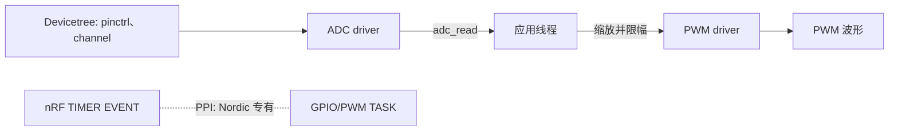
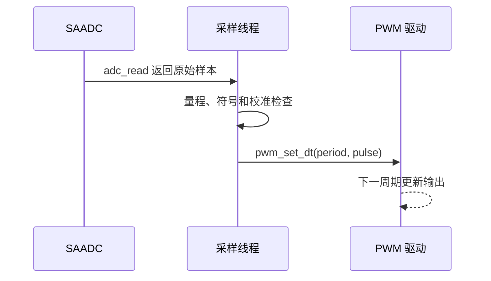
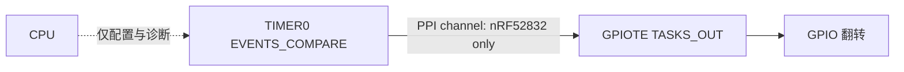

这一课的边界必须明确：PWM、ADC、pinctrl 有 Zephyr 驱动/设备树抽象；nRF52832 的 PPI 是 Nordic 专有“事件到任务”硬件互连；DMA 是否存在、能搬运什么由具体外设决定。不能把 CPU 调用 `adc_read()` 后更新 PWM 写成“硬件事件链”，更不能把 PPI 说成可移植 DMA。

官方 API 参考：[ADC](https://docs.zephyrproject.org/4.4.0/doxygen/html/group__adc__interface.html)、[PWM](https://docs.zephyrproject.org/4.4.0/doxygen/html/group__pwm__interface.html)、[pinctrl](https://docs.zephyrproject.org/4.4.0/hardware/pinctrl/index.html)。本实验以 `nrf52dk/nrf52832` 上 ADC0 的 AIN0（P0.02）和 PWM0 输出 P0.13 为例；接线变化时必须改 overlay，而不是改 C 宏。

## 一、先建立量纲与时间模型

ADC 采样的结果首先是“在某一时刻、以某一输入范围和量化分辨率取得的码值”，不是天然的毫伏数。reference 和 gain 决定一个满量程码对应的输入范围，resolution 决定量化台阶；外部分压、电源误差、采样时间和输入阻抗决定这个模型在硬件上是否仍成立。应用应先保留 raw 值和配置，再决定是否转换为工程单位，避免把 12-bit、内部参考和外部电路的假设硬编码为 `4095 -> 3.3 V`。

PWM 的基本对象不是占空比百分数而是 period 与 pulse：period 定义输出重复时间，pulse 定义有效电平持续时间，极性由设备树属性定义。把 ADC 码映射为 pulse 时必须限幅到 `[0, period]`，并明确采样线程更新的是“下一次外设输出状态”，而不是硬实时同步边沿。pinctrl 在 driver 初始化/低功耗转换时把控制器连接到物理引脚；它不是运行时业务逻辑。

PPI/DPPI 和 DMA 是另一条边界。nRF52832 的 PPI 让一个已知外设 event 触发另一个已知 task，适合减少一次 CPU 唤醒；它不传递任意数据，也不是 Zephyr ADC/PWM API 的可移植承诺。DMA 的数据搬运能力同样依外设和 SoC 而定。需要跨板复用的控制环使用 ADC/PWM API；只有有明确时序预算、寄存器所有权和 SoC 后端时才设计专用事件链。

## 二、数据流与平台边界





`adc_read(const struct device *dev, const struct adc_sequence *sequence)` 在调用线程同步采样，返回 `0` 或负 errno；`sequence.buffer` 在调用结束前必须保持有效，`buffer_size` 必须容纳样本。`pwm_set_dt(const struct pwm_dt_spec *spec, uint32_t period, uint32_t pulse)` 也返回 `0` 或负 errno；`pulse` 不得大于 period。两者是函数，不是宏。`PWM_DT_SPEC_GET()` 和 `ADC_DT_SPEC_GET_BY_IDX()` 才是从设备树生成描述符的宏。

## 三、完整可复现实验

```text
adc_pwm_lab/
├── CMakeLists.txt
├── prj.conf
├── app.overlay
└── src/
    └── main.c
```

`CMakeLists.txt`：

```cmake
cmake_minimum_required(VERSION 3.20.0)
find_package(Zephyr REQUIRED HINTS $ENV{ZEPHYR_BASE})
project(adc_pwm_lab)
target_sources(app PRIVATE src/main.c)
```

`prj.conf`：

```ini
CONFIG_ADC=y
CONFIG_PWM=y
CONFIG_GPIO=y
CONFIG_LOG=y
CONFIG_LOG_DEFAULT_LEVEL=3
CONFIG_MAIN_STACK_SIZE=1536
```

`app.overlay` 中 `zephyr,user` 是应用私有属性容器；它把 ADC 通道配置和 PWM 规范绑定到同一应用。nRF SAADC 的 `zephyr,gain`、`zephyr,reference`、`zephyr,acquisition-time` 的合法值以 4.4 binding 为准。

```dts
#include <zephyr/dt-bindings/adc/adc.h>
#include <zephyr/dt-bindings/adc/nrf-saadc.h>
#include <zephyr/dt-bindings/pinctrl/nrf-pinctrl.h>
#include <zephyr/dt-bindings/pwm/pwm.h>

&pinctrl {
    pwm0_default: pwm0_default {
        group1 {
            psels = <NRF_PSEL(PWM_OUT0, 0, 13)>;
        };
    };
    pwm0_sleep: pwm0_sleep {
        group1 {
            psels = <NRF_PSEL(PWM_OUT0, 0, 13)>;
            low-power-enable;
        };
    };
};

&pwm0 {
    status = "okay";
    pinctrl-0 = <&pwm0_default>;
    pinctrl-1 = <&pwm0_sleep>;
    pinctrl-names = "default", "sleep";
};

&adc {
    status = "okay";
    #address-cells = <1>;
    #size-cells = <0>;
    channel@0 {
        reg = <0>;
        zephyr,gain = "ADC_GAIN_1_6";
        zephyr,reference = "ADC_REF_INTERNAL";
        zephyr,acquisition-time = <ADC_ACQ_TIME(ADC_ACQ_TIME_MICROSECONDS, 10)>;
        zephyr,input-positive = <NRF_SAADC_AIN0>;
        zephyr,resolution = <12>;
    };
};

/ {
    zephyr,user {
        io-channels = <&adc 0>;
        pwms = <&pwm0 0 PWM_MSEC(20) PWM_POLARITY_NORMAL>;
    };
};
```

`src/main.c`：配置通过 `adc_channel_setup_dt()` 安装；`adc_sequence_init_dt()` 初始化 channel、resolution、buffer 相关字段，随后显式设置 buffer。SAADC 可提供校准能力，但一次性单端电位器实验不能凭空宣称某个电压误差；只有驱动返回成功才继续采样。

```c
#include <errno.h>
#include <stdint.h>
#include <zephyr/drivers/adc.h>
#include <zephyr/drivers/pwm.h>
#include <zephyr/kernel.h>
#include <zephyr/logging/log.h>

LOG_MODULE_REGISTER(adc_pwm_lab, LOG_LEVEL_INF);

static const struct adc_dt_spec input = ADC_DT_SPEC_GET_BY_IDX(DT_PATH(zephyr_user), 0);
static const struct pwm_dt_spec output = PWM_DT_SPEC_GET(DT_PATH(zephyr_user));
static int16_t sample;

/**
 * @brief 将非负 ADC 原始样本映射为 PWM 脉宽。
 *
 * @param raw ADC 样本；小于零的值按零处理。
 * @return 不超过 PWM 周期的脉宽，单位与 output.period 相同。
 */
static uint32_t raw_to_pulse(int16_t raw)
{
    uint32_t bounded = (raw < 0) ? 0U : (uint32_t)raw;

    if (bounded > 4095U) {
        bounded = 4095U;
    }
    return (uint32_t)(((uint64_t)bounded * output.period) / 4095U);
}

/**
 * @brief 读取一个 ADC 样本并更新 PWM。
 *
 * @return 0 成功；负 errno 表示 ADC 或 PWM 驱动拒绝操作。
 */
static int sample_and_update(void)
{
    struct adc_sequence sequence = { 0 };
    int err = adc_sequence_init_dt(&input, &sequence);

    if (err != 0) {
        return err;
    }
    sequence.buffer = &sample;
    sequence.buffer_size = sizeof(sample);
    err = adc_read(input.dev, &sequence);
    if (err != 0) {
        return err;
    }
    return pwm_set_dt(&output, output.period, raw_to_pulse(sample));
}

int main(void)
{
    int err;

    if (!adc_is_ready_dt(&input) || !pwm_is_ready_dt(&output)) {
        LOG_ERR("ADC or PWM device is not ready");
        return 0;
    }
    err = adc_channel_setup_dt(&input);
    if (err != 0) {
        LOG_ERR("ADC channel setup failed: %d", err);
        return 0;
    }
    while (true) {
        err = sample_and_update();
        if (err != 0) {
            LOG_ERR("sample/update failed: %d", err);
        } else {
            LOG_INF("raw=%d", sample);
        }
        k_sleep(K_MSEC(100));
    }
}
```

构建、查看生成设备树并烧录：

```powershell
west build -p always -b nrf52dk/nrf52832 adc_pwm_lab
Select-String -Path build/zephyr/zephyr.dts -Pattern "pwm0_default|channel@0|P0"
west flash -d build
```

预期是串口周期输出原始样本，P0.13 用示波器观察到约 20 ms 周期且脉宽随 AIN0 电位器变化。这里没有虚构电压值、采样率或延迟；它们取决于实际电源、量程、探头和构建配置。

## 四、缩放、校准与失败恢复

原始码值不是毫伏。要转电压，必须同时使用有效分辨率、参考、电阻分压和 gain；`adc_raw_to_millivolts_dt()` 只有在设备树信息足以描述转换时才有意义，返回 `0` 或负 errno。对单端输入，负码值通常意味着配置、缓冲区类型或量程理解有误，不能无条件转为无符号满量程。

| 症状 | 排查顺序 | 修复 |
| --- | --- | --- |
| 始终 0/满量程 | AIN 引脚、电压范围、gain/reference | 先用万用表确认输入，再调量程 |
| `adc_read` 返回错误 | `adc_channel_setup_dt`、buffer 大小、通道 status | 保留错误码，修正 DTS 后 pristine 构建 |
| PWM 无波形 | `pwm_is_ready_dt`、pinctrl、P0.13 接线 | 检查 `zephyr.dts` 与探头地线 |
| 脉宽跳变 | 浮空输入、采样噪声、应用节拍 | 加硬件偏置/滤波，明确软件滤波延迟 |
| 休眠后引脚耗电 | sleep state 缺失或外设未 suspend | 在板级功耗流程中应用 sleep pinctrl |

## 五、PPI/DPPI 与 DMA 的准确说法

nRF52832 是 PPI，不是 DPPI：PPI 通道把一个外设 `EVENTS_*` 寄存器地址连接到另一个外设 `TASKS_*` 地址，CPU 可不参与那一次触发。DPPI 是较新 Nordic SoC 的发布/订阅模型，不能把两者配置互换。Zephyr 的通用 ADC/PWM API 不承诺向你暴露任意 PPI 通道，也不承诺跨 SoC 存在相同事件。

下例是**仅供查阅 Nordic nRF52 寄存器和 Zephyr 4.4 SoC 层支持后使用的 SoC 专用设计**：TIMER compare event 通过 PPI 触发 GPIOTE task 翻转一个已配置的输出。它不是本实验的可移植代码，也不是 ADC DMA 示例；应用若直接写寄存器，还必须负责保留/释放通道、IRQ 并发与与驱动的所有权冲突。



正确的工程选择是：需要可移植 PWM/ADC，就停在设备树和驱动 API；需要零 CPU 唤醒的硬实时链路，就把 PPI 设计隔离为 nRF52 后端，附上寄存器手册、通道所有权、功耗/波形测量和回退路径。DMA 同样需要按外设 binding 和驱动文档验证，不能因设置一个 Kconfig 就假定 I2C、ADC、SPI 都自动 DMA。

## 六、练习与里程碑

1. 用万用表和示波器分别确认 AIN0 电压与 P0.13 波形，再记录 `zephyr.dts` 中实际 pinctrl。
2. 将 PWM period 改为 10 ms，解释保持同一占空比时应改哪个量，而不是只改 pulse 常数。
3. 加入一个明确标注延迟的移动平均模块，比较滤波前后的抖动和响应，不捏造数值。
4. 阅读目标 nRF52832 手册，画出 TIMER event 到 GPIOTE task 的 PPI 所有权表；不验证 API 前不要提交寄存器代码。
5. 断开输入或删除 `pinctrl-0`，用本文症状表恢复，并保留负 errno 日志。

## 小结

ADC/PWM 的可移植部分是量纲、采样与时间模型；PPI/DMA 属于平台能力，必须隔离实现并用波形和功耗证据验证。

> 🏷️ 标签：Zephyr · PWM · ADC · Pinctrl · PPI · DMA · nRF52832
